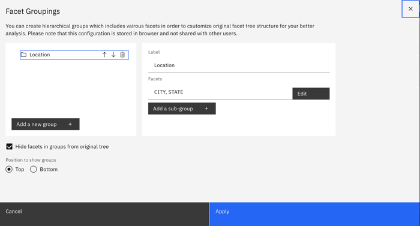
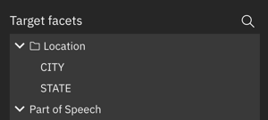

---

copyright:
  years: 2015, 2023
lastupdated: "2023-03-23"

subcollection: discovery-data

---

{{site.data.keyword.attribute-definition-list}}

# Adding facets
{: #cm-add-facets}

Add more facets that you can use to filter your data.
{: shortdesc}

When you apply custom enrichments to your collection, annotations are added to its documents. The annotations feed into new facets that you can use to sort your data.

The following table describes the types of facets that you can create from annotations.

| Information to recognize | Annotator type |
|--------------------------|----------------|
| Commonly understood terms, such as organization or people names. | [Built-in Natural Language Processing models](/docs/discovery-data?topic=discovery-data-cm-edit-collection#cm-enrichments) |
| Phrases that express an opinion and evaluate whether the opinion is positive or negative. | [Phrase sentiment](/docs/discovery-data?topic=discovery-data-cm-phrase-sentiment) |
| Alternative words that share a meaning with terms in a finite list. | [Dictionary](/docs/discovery-data?topic=discovery-data-cm-custom-annotator) |
| Terms that match a syntactical pattern | [Regular expression](/docs/discovery-data?topic=discovery-data-cm-custom-annotator) |
| Custom terms based on the context in which they are used. | [Machine learning model](/docs/discovery-data?topic=discovery-data-cm-custom-annotator) |
| Documents that fit into categories that you define. | [Document classifier](/docs/discovery-data?topic=discovery-data-cm-doc-classifier) |
{: caption="Types of custom facets" caption-side="top"}

## Grouping facets
{: #cm-facets-group}

To organize your facets, you can group them in folders.

Grouping facets does not combine the data from the facets. It merely makes the facets easier to find because they are organized in named folders.

To associate facets such that you can combine data from multiple facets, the facets must have a facet and subfacet relationship. Such hierarchical relationships must be defined at the time that the facet enrichment or annotation is created and applied to the collection.

To group facets, complete the following steps:

1.  From the initial search page, submit a search.
1.  From the *Facet analysis* pane, click the *Edit* icon.

    {: caption="Figure 1. Facet analysis pane edit icon" caption-side="bottom"}

1.  Name the group, and then select the facets that you want to group together.

    {: caption="Figure 2. Facet grouping dialog" caption-side="bottom"}

1.  Click **Apply**.

1.  The facets that you grouped are now available from a folder with the group name. 

    {: caption="Figure 3. Facet folder from the facet list" caption-side="bottom"}
