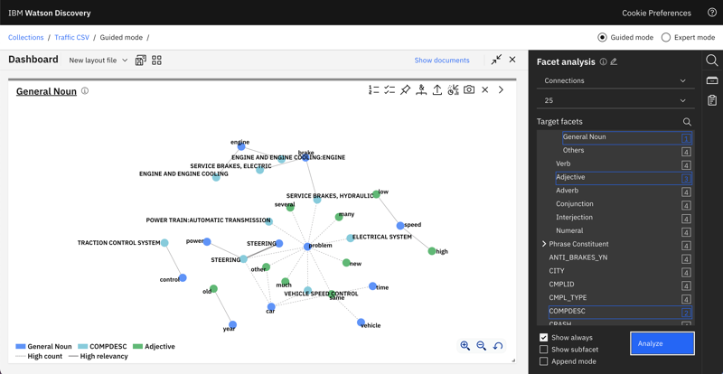

---

copyright:
  years: 2015, 2022
lastupdated: "2022-07-26"

subcollection: discovery-data

---

{{site.data.keyword.attribute-definition-list}}

# Data analysis methods
{: #cm-analyze-data}

Use tools from the Content Mining application to analyze your data.
{: shortdesc}

You can analyze your data in the following ways:

-   [Find trends](#cm-trends)
-   [Find characteristic words](#cm-characteristic-words)
-   [Analyze relationships](#cm-facets-compare)

As you review the results of your analysis, you can flag documents that you want to research further later. For more information, see [Flagging documents](#cm-flags). 

When you find important insights, you can take a snapshot of the view, and then add it to a report to share with others. For more information, see [Creating a report](/docs/discovery-data?topic=discovery-data-cm-report).

## Start your analysis
{: #cm-start}

Use the content mining application to analyze documents in your collection based on the document text and any annotations or enrichments that are stored in the documents.

1.  Enter a search term, click a facet with which to filter the documents, or leave the search field blank to return all of your documents.
1.  Click **Search**.

The guided mode view of the results shows suggested next steps that you can take to analyze your data further. If you don't want to see suggestions, you can switch to **Expert mode**. In Expert mode, the *Documents* view that lists the search results is returned whenever you submit a search.

{: caption="Figure 1. Mode toggle" caption-side="bottom"}

The tasks in this topic describe how to use the application in guided mode.

## Find trends
{: #cm-trends}

Find trends in your data. 

Your documents must contain at least one date field for trend information to be available.
{: important}

1.  From the initial search page, enter a keyword or select a facet with number values to filter the documents.

1.  Click **Find trends and anomaly** from the list of suggested next steps that is displayed in the guided mode view.

    The resulting bar graph shows the number of documents that mention the term or facet value that you specified in the search query over time.

    {: caption="Figure 2. Facet trend graph" caption-side="bottom"}

    The time series chart is rendered as a heat map. Each cell color indicates a level of correlation.

1.  You can click a facet to investigate it more closely. The facet is shown in a bar graph.

    {: caption="Figure 3. Facet trend detail in bar graph" caption-side="bottom"}

    Each individual bar graph highlights trends in your data that deviate from the normal distribution by displaying *increase indicators*. 
    
    Increase indicators measure how much the frequency of a facet value on a specific date or in a particular time interval deviates from the expected average frequency. The average is calculated based on the changes in the past time interval frequencies.

You can click individual items in a visualization or click and drag the cursor to select contiguous items.

The cyclic data is calculated from the current time zone setting of your collection. If you want to change the time zone that is used by the graph, see [Change the time zone](/docs/discovery-data?topic=discovery-data-cm-edit-collection#cm-edit-collection-time-zone).

## Find significant terms
{: #cm-characteristic-words}

Find characteristic words from your data set. The characteristic words view is a word cloud that shows terms that are mentioned frequently in the documents you are analyzing. 

You can click a word from the word cloud to add it to the existing query and filter the current document set to include only documents that also mention the specified word.

1.  From the search results page in guided mode, click **Analyze cause or characteristics**.

    The characteristic words view is displayed.

    {: caption="Figure 4. Characteristic word cloud" caption-side="bottom"}

1.  Click a word in the cloud to limit the document set to include only documents that mention the word.

## Analyze relationships between facets
{: #cm-facets-compare}

To compare two facets, complete the following steps:

1.  From the *Facet analysis* pane, select **Pairs**.
1.  Find the first facet that you want to compare in the list. Click either the X- or Y-axis icon that is associated with the facet to indicate where you want the facet values to be displayed in a two-dimensional graph.
1.  Find the second facet, and then click the remaining axis icon. For example, if you selected the X-axis icon previously, select the Y-axis icon for the second facet.

    Data from the two facets is displayed in a graph.

    {: caption="Figure 5. Facet comparison graph" caption-side="bottom"}

To compare two or more facets, complete the following steps:

1.  From the *Facet analysis* pane, select **Connections**.
1.  Select the facets that you want to compare from the list, and then click **Analyze**.

    Data from the facets is displayed in a network graph.

    {: caption="Figure 6. Facet network graph" caption-side="bottom"}

## Flag documents of interest
{: #cm-flags}

Use document flags to assign a custom flag to a document or a group of documents for classification, export, or further analysis.

Flagging documents is a useful way to highlight documents that you want to examine further later.

Before you can flag documents, you must create flags for your collection. For more information, see [Add document flags](/docs/discovery-data?topic=discovery-data-cm-edit-collection#cm-flags-add).

To apply flags, complete the following steps:

1.  From the analysis view of your collection, create a query that returns a set of documents with specific characteristics.
1.  From the documents view, click the *Document flags* icon.

    {: caption="Figure 7. Document flags" caption-side="bottom"}

1.  Select a flag.
1.  You can choose to apply the flag to all query results or to selected documents, and then click **Apply**.

    You can't set a document flag more than 50 times per collection. Whether you flag one document that you select individually or flag a query, which might return many documents, each action counts as setting a flag one time.
    {: note}

A flagged document set dynamically changes as the collection is updated. Flagged document sets are stored as queries in the index. Each flag has a query that represents the document set that it is associated with. For example, after you create the document flag and you search for the term `ice cream` and apply a red flag to all of the documents that have this word, `ice cream` is stored as the query that represents the flag. Then, if you search for the term `coffee` and apply the red flag to all of the documents that have that word, the internal flag query changes to `(ice cream) OR coffee`. Therefore, if new documents that contain the word `coffee` are ingested, the red flag is applied to those documents automatically.

### Viewing flagged documents
{: #cm-flags-view}

To view the documents to which a flag is applied, complete the following steps:

1.  In the *Facet analysis* panel, scroll down to the *Document flags* facet. 
1.  Select the facet, and then click **Analyze** to open the *Document flags* dashboard. 
1.  Click one of the flags, click **Analyze more**, and then click **Show documents**.

### Removing document flags from a Document Flags query
{: #cm-flags-remove}

To remove a document flag, complete the following steps:

1.  From the *What do you want to analyze?* page, submit an empty query by clicking **Search**. 

    The empty query returns all of the documents in your collection.
1.  Click **Show documents**.
1.  Click the **Document flags** icon on the toolbar, clear the checkbox of the document flag, and then click **Apply**. 

    The document flags are removed from your documents.
