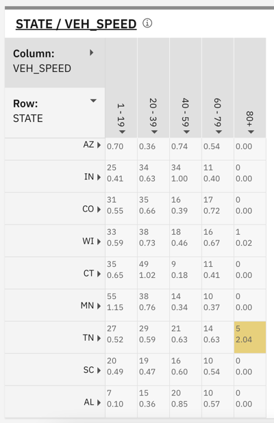

---

copyright:
  years: 2015, 2025
lastupdated: "2023-09-28"

subcollection: discovery-data

---

{{site.data.keyword.attribute-definition-list}}

# Data analysis methods
{: #cm-analyze-data}

Use tools from the Content Mining application to analyze your data.
{: shortdesc}

You can analyze your data in the following ways:

-   [Look for relevant keywords](#cm-relevance)
-   [Find trends](#cm-trends)
-   [Identify anomalies in cyclical patterns](#cm-topic)
-   [Find characteristic words](#cm-characteristic-words)
-   [Analyze relationships](#cm-facets-compare)
-   [Analyze relationships between many facets](#cm-facets-network)

As you review the results of your analysis, you can flag documents that you want to research further later. For more information, see [Flagging documents](#cm-flags). 

When you find important insights, you can take a snapshot of the view, and then add it to a report to share with others. For more information, see [Creating a report](/docs/discovery-data?topic=discovery-data-cm-report).

## Start your analysis
{: #cm-start}

Use the content mining application to analyze documents in your collection based on the document text and any annotations or enrichments that are stored in the documents.

To start your analysis, complete the following steps:

1.  Enter a search term, click a facet with which to filter the documents, or leave the search field blank to return all of your documents.
1.  Click **Search**.

The guided mode view of the results shows suggested next steps that you can take to analyze your data further. If you don't want to see suggestions, you can switch to **Expert mode**. In Expert mode, the *Documents* view that lists the search results is returned whenever you submit a search.

The tasks in this topic describe how to use the application in guided mode.

## Look for relevant keywords
{: #cm-relevance}

To analyze keyword relevance, complete the following steps:

1.  From the initial search page, submit a keyword search to filter the documents.
1.  From the search results page in guided mode, click **Analyze cause or characteristics**.

    After the characteristic words pane, a pane with relevancy information for each facet type is displayed.

    {: caption="Facet relevancy" caption-side="bottom"}

    Each relevancy pane shows a list of the keywords that occur in the documents that match the facet type.
    
The *Count* column shows the number of documents in the current result set that contain the keyword. The *Relevancy* column shows the level of uniqueness of the frequency count compared to other documents that match your query. High relevancy values are shown in shades of color with increasing intensity. The color begins at yellow, then increases to orange, and then to red.

## Find trends
{: #cm-trends}

Use *Trends* analysis to find trends in your data. For example, you might see that a new product release aligns with an uptick in customer interest. Or that a new customer care approach is followed by an increase in customer satisfaction.

Your documents must contain at least one date field for trend information to be available.
{: important}

To find trends, complete the following steps:

1.  From the initial search page, enter a keyword or select a facet with number values to filter the documents.

1.  Click **Find trends and anomaly** from the list of suggested next steps that is displayed in the guided mode view.

    The resulting bar graph shows the number of documents that mention the term or facet value that you specified in the search query over time.

    {: caption="Facet trend graph" caption-side="bottom"}

    The time series chart is rendered as a heat map. Each cell color indicates a level of relevancy.

1.  You can click a facet to investigate it more closely. The facet is shown in a bar graph.

    {: caption="Facet trend detail in bar graph" caption-side="bottom"}

    Each individual bar graph highlights trends in your data that deviate from the normal distribution by displaying *increase indicators*. 
    
    Increase indicators measure how much the frequency of a facet value on a specific date or in a particular time interval deviates from the expected average frequency. The average is calculated based on the changes in the past time interval frequencies.

You can click individual items in a visualization or click and drag the cursor to select contiguous items.

The cyclical data is calculated from the current time zone setting of your collection. If you want to change the time zone that is used by the graph, see [Change the time zone](/docs/discovery-data?topic=discovery-data-cm-edit-collection#cm-edit-collection-time-zone).

## Identify anomalies in cyclical patterns
{: #cm-topic}

Use *Topic* analysis to find anomalies in seasonal, monthly, or even daily patterns that are present in your data.

Your documents must contain at least one date or time field for topic information to be available.
{: important}

Topic analysis focuses on how much the frequency of a keyword deviates from the expected average frequency in a specific time period. The expected average uses all of the averages of the frequency counts for other keywords in the same time period. This method of analysis is useful for identifying patterns that occur cyclically and highlights any unexpected changes that might occur in these cyclical patterns.

To find anomalies, complete the following steps:

1.  From the initial search page, enter a keyword or select a facet with number values to filter the documents.
1.  From the search results page in guided mode, click **Analyze cause or characteristics**.
1.  From the *Facet analysis* pane, select **Topic**.
1.  Adjust the following values to suit your analysis:

    -   Number of results
    -   Date facet
    -   Time scale
    -   Date range

1.  Choose a target facet or subfacet, and then click **Analyze**.

    The resulting time series graph shows changes in the frequency of keyword mentions over time.

    {: caption="Topic analysis time series view" caption-side="bottom"}

    Color coding is used to highlight when the number of mentions deviates from the expected frequency. The higher the deviation, the more intense the color, from yellow to orange to red. The average is calculated based on the frequency of occurrence of other keywords in the same time period.

The cyclical data is calculated from the current time zone setting of your collection. If you want to change the time zone that is used by the graph, see [Change the time zone](/docs/discovery-data?topic=discovery-data-cm-edit-collection#cm-edit-collection-time-zone).

## Find significant terms
{: #cm-characteristic-words}

Find characteristic words from your data set. The characteristic words view is a word cloud that shows terms that are mentioned frequently in the documents you are analyzing. 

You can click a word from the word cloud to add it to the existing query and filter the current document set to include only documents that also mention the specified word.

To find significant terms, complete the following steps:

1.  From the search results page in guided mode, click **Analyze cause or characteristics**.

    The characteristic words view is displayed.

    {: caption="Characteristic word cloud" caption-side="bottom"}

    The different font colors help to distinguish the words from one another; they have no statistical meaning.
    {: note}

1.  Click a word in the cloud to limit the document set to include only documents that mention the word.

## Analyze relationships between two facets
{: #cm-facets-compare}

Use *Pairs* analysis to see how two facets are related to one another.

To compare two facets, complete the following steps:

1.  From the *Facet analysis* pane, select **Pairs**.
1.  Find the first facet that you want to compare in the list. Click either the X- or Y-axis icon that is associated with the facet to indicate where you want the facet values to be displayed in a two-dimensional graph.
1.  Find the second facet, and then click the remaining axis icon. For example, if you selected the X-axis icon previously, select the Y-axis icon for the second facet.

    Data from the two facets is displayed in a graph.

    {: caption="Facet comparison graph" caption-side="bottom"}

The graph shows two numbers. The first number is a frequency count and the second number is a relevancy value. The frequency count measures how many times the two data points are found together in a document. Relevancy measures the level of uniqueness of the frequency count compared to other documents that match your query. If the relevancy shows 2.0, it means that the number of times that the two data points intersect is 2 times larger than expected. To help you identify anomalies that might require more in-depth analysis, high relevancy values are shown in shades of color with increasing intensity, from yellow to orange to red.

## Analyze relationships between many facets
{: #cm-facets-network}

Use *Connections* analysis to see how multiple facets are related to each other.

To compare two or more facets, complete the following steps:

1.  From the *Facet analysis* pane, select **Connections**.
1.  Select the root facet that you want to compare to other facets first. 
1.  Select up to 4 more facets from the list, and then click **Analyze**.

    Pair analysis is done between the first facet and each other facet in turn.

    {: caption="Facet network graph" caption-side="bottom"}

    The resulting network graph shows only highly relevant and high-frequency pairs. Each node represents a facet value. The node color reflects the facet type. A solid-line connection between nodes identifies highly relevant pairs. A dotted-line connection identifies high-frequency pairs.

### Changing number ranges
{: #cm-change-range}

If the scale of a graph is not optimized for your data, you can change it. For example, to plot vehicle speeds, you might want a range that increments by tens or twenties rather than by thousands.

To change the scale of a graph for a facet, complete the following steps:

1.  Click **Collections** link in the page header.
1.  In the tile for your collection, click the *Open and close list of options* icon, and then choose **Edit collection**.
1.  In the *Facet* tab, find the facet for which you want to change the number range.
1.  In the Range field, click **Edit**.
1.  Define each range that you want to use as a JSON object. You can add or remove objects to change the number of data points in the range.

    For example, the JSON objects that identify the ranges for vehicle speeds might look as follows:

    ```json
    [
      {
        "query": "[1, 20)",
        "label": "1 - 19"
      },
      {
        "query": "[20, 40)",
        "label": "20 - 39"
      },
      {
        "query": "[40, 60)",
        "label": "40 - 59"
      },
      {
        "query": "[60, 80)",
        "label": "60 - 79"
      },
      {
        "query": "[80, 100000)",
        "label": "80+"
      }
    ]
    ```
    {: codeblock}

1.  Click **Apply**.
1.  Click **Save**, and then click **Close**.
1.  Click your collection tile to return to the collection and continue your analysis.

The changes to the number ranges for vehicle speeds introduce more opportunities for relationships or anomalies in the data to be highlighted.

{: caption="Results after changed number range" caption-side="bottom"}

## Showing results in a map visualization
{: #cm-map}

Facets that represent geographical locations can be shown in a map visualization. For example, if you have a collection with a US states facet, you might want to display data per state from a visualization that enables users to select each state from a map.

{: caption="Results shown in a map visualization" caption-side="bottom"}

A US Map is available by default. You can add a custom map that is built in GeoJSON format. For more information, see [RFC7946](https://datatracker.ietf.org/doc/html/rfc7946){: external}.

To use a map that you define, complete the following steps to import the map definition:

1.  From the Content Mining application home page, click **Collections** from the breadcrumb in the page header.
1.  Click the *Settings* icon at the start of the page.
1.  Click **Manage customization resources**.
1.  Click **Add resource**.
1.  Name the resource, and then click **Next**.
1.  Add your map file, and then click **Save**.

To make the map that you added available as a visualization option for a facet, you must edit the facet.

1.  Click **Home** from the breadcrumb in the page header.
1.  Right-click the overflow menu for your collection, and then choose **Edit Collection**
1.  Open the *Facet* tab, and then find the facet with which you want to associated the map visualization.
1.  Change the *Visualization type* value to **Map**, and then pick the map that you added from the list in the **Resource** field.
1.  Click **Save**, and then click **Close**.

## Flag documents of interest
{: #cm-flags}

Use document flags to assign a custom flag to a document or a group of documents for classification, export, or further analysis.

Flagging documents is a useful way to highlight documents that you want to examine further later.

Before you can flag documents, you must create flags for your collection. For more information, see [Add document flags](/docs/discovery-data?topic=discovery-data-cm-edit-collection#cm-flags-add).

To apply flags, complete the following steps:

1.  From the analysis view of your collection, create a query that returns a set of documents with specific characteristics.
1.  From the documents view, click the *Document flags* icon.

1.  Select a flag.
1.  You can choose to apply the flag to all query results or to selected documents, and then click **Apply**.

    You can't set a document flag more than 50 times per collection. Whether you flag one document that you select individually or flag a query, which might return many documents, each action counts as setting a flag one time.
    {: note}

A flagged document set dynamically changes as the collection is updated. Flagged document sets are stored as queries in the index. Each flag has a query that represents the document set that it is associated with. For example, after you create the document flag and you search for the term `ice cream` and apply a red flag to all of the documents that have this word, `ice cream` is stored as the query that represents the flag. Then, if you search for the term `coffee` and apply the red flag to all of the documents that have that word, the internal flag query changes to `(ice cream) OR coffee`. Therefore, if new documents that contain the word `coffee` are ingested, the red flag is applied to those documents automatically.

### Viewing flagged documents
{: #cm-flags-view}

To view the documents to which a flag is applied, complete the following steps:

1.  In the *Facet analysis* panel, scroll down to the *Document flags* facet. 
1.  Select the facet, and then click **Analyze** to open the *Document flags* dashboard. 
1.  Click one of the flags, click **Analyze more**, and then click **Show documents**.

### Removing document flags from a Document Flags query
{: #cm-flags-remove}

To remove a document flag, complete the following steps:

1.  From the *What do you want to analyze?* page, submit an empty query by clicking **Search**. 

    The empty query returns all of the documents in your collection.
1.  Click **Show documents**.
1.  Click the **Document flags** icon on the toolbar, clear the checkbox of the document flag, and then click **Apply**. 

    The document flags are removed from your documents.
