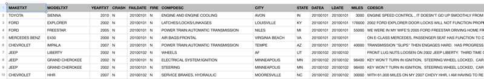

---

copyright:
  years: 2015, 2025
lastupdated: "2023-02-03"

subcollection: discovery-data

---

{{site.data.keyword.attribute-definition-list}}

# Analyzing CSV files
{: #cm-csv-file}

You can add the data that you want to analyze as a comma-separated value (CSV) formatted file.
{: shortdesc}

The content mining project works well with CSV files. When your CSV file is ingested, each row in the spreadsheet is stored as a separate document in the collection index. Each column becomes a root-level field in the document.

Follow these guidelines when you create a CSV file for use in the project:

-   Add each record that you want to analyze as a row in the spreadsheet.
-   Include a column for each significant data point.
-   Specify column headers.

    The root-level field that is added to the document is given the column header name. If no header exists, hardcoded names, such as *column_0* and *column_1*, are applied to the columns. Specify column names to ensure that the resulting document fields have meaningful names.

-   If you want to find trends over time, be sure that each record has some date information that can be used to plot the information on a timeline.

    {{site.data.keyword.discoveryshort}} recognizes the following date formats automatically:

    ```text
    yyyy-MM-dd'T'HH:mm:ssZ
    yyyy-MM-dd'T'HH:mm:ssXXX
    yyyy-MM-dd'T'HH:mm:ss.SSSZ
    yyyy-MM-dd'T'HH:mm:ss.SSSX
    yyyy-MM-dd
    M/d/yy
    yyyyMMdd
    yyyy/MM/dd
    ```
    {: screen}

    If you store dates in other formats, you can add the format to the list of supported formats. 
    
    From the {{site.data.keyword.discoveryshort}} user interface, open the *Manage collection* page. Click your collection tile. From the *Manage fields* page for the collection, add a format to the **Date formats** field. Specify a date format that is supported by the Java [SimpleDateFormat](https://docs.oracle.com/javase/8/docs/api/java/text/SimpleDateFormat.html){: external} class.
    
    For example, if your records store only year values for dates, add `yyyy` to the supported date formats list. You can then set the data type for the field that contains a year value to *Date*, and reprocess your collection. As a result, an occurrence of `2019` in the date field is stored as `2019-01-01T05:00:00Z` in the index.

## Sample CSV file
{: #cm-csv-sample}

The following image shows an excerpt from a CSV file with data that is well suited for analysis with the Content Mining application. The data comes from 2010 traffic records that are published by the National Highway Traffic Safety Administration (NHTSA). Each record includes car make, model, and year information, the date of the traffic incident, and text from the driver's statement, along with other useful data points.

{: caption="Sample CSV file" caption-side="bottom"}

For more information about the sample data, see [https://www.nhtsa.gov/data/traffic-records](https://www.nhtsa.gov/data/traffic-records){: external}.
