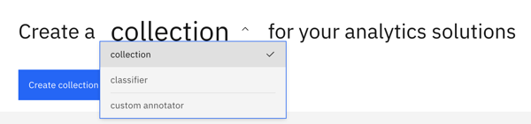
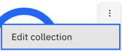
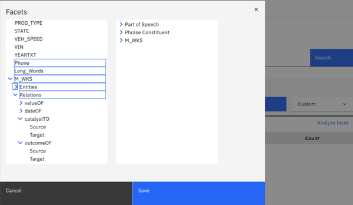

---

copyright:
  years: 2015, 2022
lastupdated: "2022-07-29"

subcollection: discovery-data

---

{{site.data.keyword.attribute-definition-list}}

# Creating custom annotators
{: #cm-custom-annotator}

You can create a dictionary, regular expression, or machine learning annotator to generate new facets that can help you to analyze your data.
{: shortdesc}

Before you begin, have the following data ready.

| Annotator type | Description | Data |
|----------------|-------------|------|
| Dictionary | Assigns facets to terms that match dictionary entries that you define or upload. | You can optionally upload a CSV file of dictionary terms. For more information about the file format requirements, see [Uploading dictionary terms](/docs/discovery-data?topic=discovery-data-domain-dictionary#dictionary-csv) |
| Machine learning | Assigns facets to mentions that are recognized by a machine learning model that you upload. | A compressed file of a machine learning model that is exported from Watson Knowledge Studio is required. |
| Regular expression | Assigns facets to text that matches Java regular expression patterns that you define or upload. | You can optionally upload a JSON file that contains regular expression patterns. |
{: caption="Custom annotator prerequisite data" caption-side="top"}

To create a custom annotator, complete the following steps:

1.  From the analysis view of your collection, click the **Collections** link in the breadcrumb to open the *Create a collection for your analytics solutions* page of the Content Mining application.

1.  To create an annotator, click **collection**, and then select **custom annotator** from the list.

    

1.  Click **Create custom annotator**.
1.  Name your annotator, and then optionally add a description.
1.  Choose the annotator type, and then click **Next**.
1.  Follow the on-screen instructions.

    The **Facet name** value that you specify for the annotator is the facet name that is displayed from the collection search view.

    For the regular expression annotator, you can specify a **Facet value** from the options described in the table.

    | Facet value | Description |
    |-------------|-------------|
    | `$0` | Displays the matched text as-is. | If the matched text is `212-555-1234`, then the facet value is displayed as `212-555-1234`. |
    | `$n` | If your regular expression pattern contains groups, you can specify a group number to return the matched text from the pattern group only. For example, if your regular expression consists of 3 groups that define a US phone number pattern, such as `(\d{3})-(\d{3})-(\d{4})`, and you want to return only the area code portion of the phone number, you can specify `$1`. If the matched text is `212-555-1234`, then the facet value is displayed as `212`. |
    | `{prefix-text}:$0` | Adds hard-coded text in front of the facet name. You might want to use this option if you want to distinguish facets that are generated by this regular expression from facets that are similar but generated in some other way. For example `MyRegex:$0` results in a facet named `MyRegex:212-555-1234`.
    {: caption="Regular expression facet value options" caption-side="top"}

## Applying the annotator
{: #cm-custom-annotator-deploy}

After the annotator is created, you must apply it to your collection. 

1.  From the *Create a custom annotator for your analytics solutions* page of the Content Mining application, click **custom annotator**, and then select **collection** from the list.
1.  In the tile for your collection, click the *options* icon, and choose **Edit collection**.

    {: caption="Figure 1. Collection menu" caption-side="bottom"}

1.  Click the **Enrichment** tab, and then select the annotator that you created. 

    You might need to scroll to find it.
1.  Click **Save**, and then confirm the action.

Give the index time to rebuild.

## Filtering documents with your facet
{: #cm-custom-annotator-use}

1.  Click the collection tile to open your collection in the data analysis page.
1.  Do one of the following things:

    -   Your custom facets are listed in the *Facets* view. Scroll and click **Load more** repeatedly until your facets are displayed.
    -   Submit an empty search to return all documents. In the *Facet analysis* pane, select the facet that you created.
    -   To access your custom facets more quickly, add them to a custom view. Select **Custom** as the view, and then click **Edit**. Select one or more facets to add to the view, and then click **Save**.

        {: caption="Figure 2. Collection menu" caption-side="bottom"}

## Artifact limits
{: #artifact-limits}

The number of enrichments that you can create per service instance depends on your {{site.data.keyword.discoveryshort}} plan type. Totals include enrichments that you create in this Content Mining project and in other projects in the same service instance.

### Dictionary limits
{: #dictionary-limits}

| Plan | Number of dictionaries per service instance | Number of term entries per dictionary | Number of terms for which suggestions can be generated |
|-----------|-------------------:|------------------------:|--------------------------:|
| Cloud Pak for Data | Unlimited | Unlimited | 1,000 |
| Premium | 100 | 10,000 | 1,000 |
| Enterprise | 100 | 10,000 | 1,000 |
{: caption="Dictionary plan limits" caption-side="top"}

### Regular expression limits
{: #regex-limits}

| Plan | Regex enrichments per service instance | Regex patterns per service instance | 
|------|------------------------------------:|---------------------------------------:|
| Cloud Pak for Data | Unlimited | Unlimited |
| Premium | 100 | 50 |
| Enterprise | 100 | 50 |
{: caption="Regular expression plan limits" caption-side="top"}

### Machine learning model limits
{: #ml-model-limits}

| Plan      | ML models per service instance |
|-----------|-------------------:|
| Cloud Pak for Data | Unlimited |
| Premium | 10 |
| Enterprise | 10 |
{: caption="ML model plan limits" caption-side="top"}
