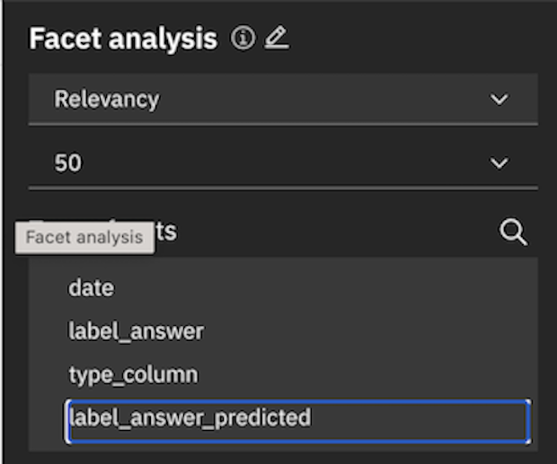

---

copyright:
  years: 2015, 2025
lastupdated: "2024-04-19"

subcollection: discovery-data

---

{{site.data.keyword.attribute-definition-list}}

# Classifying documents
{: #cm-doc-classifier}

A document classifier machine learning model analyzes documents and tags them with the appropriate label from a set of labels that you define.
{: shortdesc}

Classifying documents is useful when you want to sort many documents into groups programmatically. For example, you might have a collection that contains customer comments about products that you sell. If you can automatically sort the feedback into classes, you can isolate urgent issues that customers mention and tackle them first. Based on previous feedback, you might define classes such as the following labels:

-   Not functioning correctly 
-   Features not as advertised 
-   Difficult to use
-   Missing parts
-   Parts shipped don't match parts list in assembly instructions

To create a document classifier, you build a machine learning model that can recognize which class best captures the point of customer feedback that is specified in natural language. You pair them with class labels that represent real scenarios that make sense for your business.

What's the difference between a document classifier and a text classifier?
:    A document classifier can classify documents based on words and phrases extracted from the body text fields with information from their part of speech and the other enrichments that are applied to the body text taken into account. The information from the other non-body fields are also used. A text classifier can classify documents based on words and phrases extracted from the body text with their part of speech information taken into account. For more information about how to create a text classifier, see [Classifier](/docs/discovery-data?topic=discovery-data-domain-classifier).

## Before you begin
{: #cm-doc-classifier-prereqs}

To train the document classifier model, you must provide sample documents that are labeled appropriately. Prepare the following files:

Training data
:    Required. CSV file that is used to train the document classifier machine learning model. The file can contain key data points per column. The data points can vary, but the file must include the following columns:

     -   Natural language text that you want to classify or label.
     -   Label or class name that categorizes the idea that is expressed in the document text. You can apply more than one label to a text sample. Separate multiple label values with a semicolon.

Test data 
:    Optional. CSV file that is used to test the document classifier machine learning model after it is trained. If you don't specify a separate file for testing, a subset of the training data content is used for testing purposes. 

Target data
:    Required. CSV file with the data that you want to classify.

All of the CSV files (training, test, and target) must have the same column names. The data in the columns must have the same data types, such as string, number, and so on.
{: important}

You can use a CSV file that you uploaded at the time that you created the Content Mining project or you can create a new collection.

For more information, see the following topics:

-   [Adding collections](/docs/discovery-data?topic=discovery-data-cm-add-collection)
-   [Analyzing CSV files](/docs/discovery-data?topic=discovery-data-cm-csv-file)

### Document classifier training data sample
{: #create-doc-classifier-sample}

The following table shows an example of the type of content that might be stored in CSV files that are used to train a document classifier.

| Claim_id | Date | Product_line | Product | Client_segments | Client_location | Client age | Feedback | Label | 
|----------|------|--------------|---------|-----------------|-----------------|------------|----------|-------|
| 0 | `2016/1/1` | tea | lemon tea | Not Member | Manhattan | 20 | The straw was peeled off from the juice pack. | package_container |
| 1 | `2016/1/2` | ice cream | vanilla ice cream | Silver Member | Queens | 20 | I got some ice cream for my children, but there was something like a piece of thread inside the cup. | contamination_tampering |
{: caption="Sample data for CSV files" caption-side="top"}

Note that the two required fields are present in the sample. The required fields have the following names:

-   `Feedback`: Natural language text to label.
-   `Label`: Label to apply to the feedback.

## Opening the Content Mining application
{: #cm-doc-classifier-prereq-task}

If you didn't do so, create the project and add a collection to it. If you already created the project and collection, you can skip this procedure and [create the document classifier](#cm-doc-classifier-task).

1.  In {{site.data.keyword.discoveryshort}}, create a Content Mining project.
1.  Choose to upload data to create the collection. Name your collection, and click **Next**.
1.  Upload the CSV file that contains your training data.

    The training data file must contain the following information at a minimum:

    -   A column that contains sample text that you want to classify. For example, the sample text might be a product review.
    -   A column that contains a class or category label that is assigned to the sample text. 
    
1.  After collection processing is complete, click **Launch application** to open the Content Mining application.

    The facet details are displayed for the collection.

## Creating a document classifier
{: #cm-doc-classifier-task}

To create a document classifier, complete the following steps:

1.  From the Content Mining application, click the **Collections** link in the breadcrumb to open the *Create a collection* page.

    The status of index creation is displayed. Wait for the collection to be fully indexed before you continue with this procedure.
1.  To create a classifier, click **collection**, and then choose **classifier** from the list.

    {: caption="Collection menu" caption-side="bottom"}

1.  Click **Create classifier**.
1.  Name your classifier.

    When you deploy the model as an enrichment later, the enrichment is given a name with the format `{classifier name} - {model name}`. For example, if your classifier is named `Product reviews` and the model is named `v0.1`, then the enrichment name is `Product reviews - v0.1`.

    Optionally, add a description and identify the language of your training data by selecting it from the *Language* field.
1.  Click **Next**
1.  On the *Training data* page, select the file that you uploaded previously from the list, and then click **Next**.

    Alternatively, you can upload a CSV file that contains your training data.

    The *Fields* page is displayed. It shows details about the fields that are generated from the file that you added. Typically, each column in a CSV file is converted into a field and is assigned a name that is copied from the column header.

1.  Deselect any metadata fields that you want to exclude from the data set for your document classifier to learn from, and then click **Next**.

    Any fields that you include are used as additional features in the classification. All of the fields are selected by default. You might need to scroll horizontally to review all of the fields.
    
1.  On the *Classifier* page, specify the fields to use for machine learning training and prediction.

    Answer field
    :    Select the field from your training data file with the classification label. From the earlier example, the `Label` field is the best choice.
    
    Predicted field
    :    The name of the facet that is generated for the predicted class values. By default, the facet name has the syntax *`<Answer field value>`*`_predicted`. For example, `Label_predicted`.

    Test dataset
    :    Specifies the data set to use to test the classifier model. By default, the training data CSV file that you uploaded and configured is split into three data sets that are used for training, validation, and test respectively. However, you can optionally specify a separate data set to use for testing the model.

    Train federated model
    :    Creates more than one model, based on values from a specific field in the data set. For example, if the document has a `Product` field, you can configure the classifier to create a separate classifier model for each product name value that is specified in the field. By default, the classifier creates one machine learning classifier model.

    You don't need to specify the field that contains the text to be classified. The system detects this field automatically. You can check which field the analyzable text is extracted from and change it or augment it by changing index type of another field. For more information, see [Identifying the text field](/docs/discovery-data?topic=discovery-data-cm-edit-collection#text-field).
    {: note} 

    Click **Next**.
1.  If you want to apply an enrichment to the text in your training data, select at least one field from the **Target fields** list where you want to apply enrichments. 

    Typically, you want to choose the field that contains the body of text that you want to classify. From the earlier example, the `Feedback` field is the best choice.
    
    Next, select any annotators that you want to apply to enrich the text in the target field or fields, and then click **Next**.

    The *Part of speech* annotator is selected by default.
1.  On the *Confirm* page, review your classifier configuration settings. To make changes, use the **Back** button. Otherwise, click **Save**.

    An *Overview* page is displayed.
1.  Click **New model** to create and train your machine learning model. 
1.  You can optionally change the name of the model and add a description. 

    You can change the default ratio values that are specified for the following data sets:

    -   Training dataset: Updates the weights of the training model.
    -   Validation set: Monitors the accuracy of the training model during training. The accuracy result is used to draw a training loss graph.
    -   Test dataset: Calculates the score of the trained model.

1.  Click **Create**.

    It might take several minutes for model training to complete.

## Deploying the document classifier model
{: #cm-doc-classifier-deploy}

After the model is trained, deploy the model as an enrichment. 

1.  Click the overflow menu icon in the **Actions** column, and then click **Deploy model**. Specify the name and other details, and then click **Deploy**.

1.  Do one of the following things:

    -   To apply the document classifier to a collection in your Content Mining project, see [Enriching your collection](/docs/discovery-data?topic=discovery-data-cm-edit-collection#cm-enrichments).
    -   To apply the document classifier to a collection in a different project, complete the following steps:

        1.  In {{site.data.keyword.discoveryshort}}, create or open the collection that has the documents that you want to classify. 

            The data in the collection where you apply the enrichment must have the same fields as the collection that you used to train the model.
            {: note}

        1.  In the **Enrichments** tab, locate your classifier in the **Name** column. From the **Fields to enrich** field, choose the same text field that was used to train the model. (This field is determined by the system and is indexed as the *Analyzable text content* field. For more information, see [Identifying the text field](/docs/discovery-data?topic=discovery-data-cm-edit-collection#text-field).)
        1.  Click **Apply changes and reprocess**.

## Results of classification
{: #cm-doc-classifier-results}

After the enrichment is applied to a collection, a facet is generated that you can use to find the predicted classes. In this example, the predicted field is named `label_answer_predicted`.

{: caption="A Label_answer_predicted facet is generated" caption-side="bottom"}

Use the generated facet to filter documents by classification and analyze subsets of documents. Doing so helps you to find patterns and discover other insights. You can export these target documents to share with team members or to analyze further. For more information, see [Exporting data](/docs/discovery-data?topic=discovery-data-cm-export).

When the document classifier classifies a document, it stores the classification in the `document_level_enrichment.classes.class_name` field.

For example, the following JSON excerpt shows a document that was classified with the `package_container` class.

{: caption="Document classifier enrichment syntax" caption-side="bottom"}

### Document classifier limits
{: #doc-classifier-limits}

The number of document classifiers and labels that you can create per service instance depends on your {{site.data.keyword.discoveryshort}} plan type.

| Limit   | Enterprise | Premium | Cloud Pak for Data |
|---------|------------|---------|--------------------|
| Number of document classifiers per service instance | 20 | 20 | Unlimited |
| Number of labeled data rows | 20,000 | 20,000 | 20,000 |
| Maximum size in MB of training data after enrichment | 1,024 | 1,024 | 1,024 |
| Number of labels | 1,000 | 1,000 | 1,000 |
| Number of target fields | 50 | 50 | 50 |
{: caption="Document classifier plan limits" caption-side="top"}
