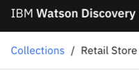

---

copyright:
  years: 2015, 2022
lastupdated: "2022-07-22"

subcollection: discovery-data

---

{{site.data.keyword.attribute-definition-list}}

# Editing your collection
{: #cm-edit-collection}

You can change the characteristics of your collection from the Content Mining application.
{: shortdesc}

You might want to change the following characteristics:

-   [Change the time zone of your collection](#cm-edit-collection-time-zone)
-   [Add document flags that you can use to tag documents of interest in your collection](#cm-flags-add)
-   [Change or augment the field that is designated as the source for the text body of your documents](#text-field)
-   [Group text body fields](#group-multiple-fields)
-   [Add, remove, or change the enrichments that are applied to the collection](#cm-enrichments)

## Editing a collection
{: #cm-edit-collection-task}

1.  From the analysis view of your collection, click the **Collections** breadcrumb link in the page header.

    {: caption="Figure 1. Collections breadcrumb link" caption-side="bottom"} 
1.  In the tile for your collection, click the *Open and close list of options* icon, and then choose **Edit collection**.

    {: caption="Figure 2. Collection menu" caption-side="bottom"} 
1.  Use the appropriate tab to change characteristics of the collection.
1.  When you are done making changes, click **Save**. 

    The following message is displayed: 

    ```text
    You need to clear index to make these changes. 
    After clearing index, fully build the index to 
    analyze using this collection.
    ```
    {: screen}

    You don't need to take any action. The index is rebuilt automatically when you click **OK**.

1.  Click **OK** to verify the change. 
1.  Click **Close** to return to the *Collections* page.

    Wait for the index to be rebuilt before you continue your analysis. From the *Collections* page, you can see the progress of the index rebuild.
    {: tip}

1.  Click your collection tile to return to the data analysis page.

## Change the time zone
{: #cm-edit-collection-time-zone}

To change the time zone that is used by the trend graph, you must edit the default time zone for the collection.

1.  Complete the steps in [Editing a collection](#cm-edit-collection-task) to get the collection into edit mode.
1.  In the *Edit* tab, change the value of the **Time zone** field, and then click **Save**.

## Add document flags
{: #cm-flags-add}

To add document flags, complete the following steps:

1.  Complete the steps in [Editing a collection](#cm-edit-collection-task) to get the collection into edit mode.
1.  Click the **Document flags** tab, and then click **Add flag**.
1.  In the *Document flag* dialog box, name the flag, add a description, choose a flag color, and then click **Add**.
1.  Repeat the previous steps to add more flags.
1.  From the *Document flags* view, select **Enabled** so that the flags appear in your documents, and then click **Save** to make them available in your collection.

For more information about how to flag documents, see [Flag documents of interest](/docs/discovery-data?topic=discovery-data-cm-analyze-data#cm-flags).

## Identifying the text field
{: #text-field}

When you analyze data with the Content Mining application, Discovery determines which field contains the body of the text to be analyzed. You can check which field is designated as the main text body field and change it or augment it.

1.  Complete the steps in [Editing a collection](#cm-edit-collection-task) to get the collection into edit mode.
1.  Click the **Fields** tab. Check the **Index type** column to find the field designated with the **Analyzable text content** index type.

    You can change the field or set more than one text field to be an **Analyzable text content** index type.
1.  Click **Save**.

If you select multiple fields to analyze, you cannot see the facet analysis for only one field. To view the analysis for multiple fields, you must group them.

## Group multiple text fields
{: #group-multiple-fields}

1.  Complete the steps in [Editing a collection](#cm-edit-collection-task) to get the collection into edit mode.
1.  Click the **Contextual view** tab, and then click **Add view**.
1.  Complete the following fields:

    -   **Name**: The name or label of your grouped view.
    -   **Id**: The alphanumeric ID that {{site.data.keyword.discoveryshort}} uses when you submit a text query. For example, `ans1`.
    -   **Fields**: The text fields that have the **Analyzable text content** setting applied. Select one or multiple text fields that you want to group for facet analysis.

1.  Click **Add**.

    Repeat this task if you want to add more text fields that you want to group for facet analysis.
1.  Click **Save**.

Now you can return to the data analysis page for your collection. From the **Facet analysis** panel, you can click **Contextual view selection** to see the text fields that you grouped. You can select one of the text fields to view the facet analysis for that field. 

## Enriching your collection
{: #cm-enrichments}

Discovery provides built-in natural language processing models, such as the *Entities* enrichment that can recognize mentions of commonly known things, such as business or location names and other types of proper nouns. You can apply these built-in NLP enrichments to your collection.

You can also apply a document classifier enrichment that you created in the Content Mining application to your collection.

Alternatively, you can apply enrichments that were built in other projects in the same service instance to the collection in your content mining project. For example, you can apply a dictionary or text classifier that was built in another project in the same service instance to your collection.

To apply enrichments to your collection, complete the following steps:

1.  Complete the steps in [Editing a collection](#cm-edit-collection-task) to get the collection into edit mode.
1.  Click the **Enrichment** tab, and then select the enrichments that you want to apply to your collection. 
1.  Click **Save**.
