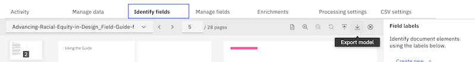

---

copyright:
  years: 2019, 2021
lastupdated: "2021-08-10"

subcollection: discovery-data

---

{:shortdesc: .shortdesc}
{:external: target="_blank" .external}
{:tip: .tip}
{:note: .note}
{:pre: .pre}
{:important: .important}
{:deprecated: .deprecated}
{:codeblock: .codeblock}
{:screen: .screen}
{:download: .download}
{:hide-dashboard: .hide-dashboard}
{:apikey: data-credential-placeholder='apikey'} 
{:url: data-credential-placeholder='url'}
{:curl: .ph data-hd-programlang='curl'}
{:javascript: .ph data-hd-programlang='javascript'}
{:java: .ph data-hd-programlang='java'}
{:python: .ph data-hd-programlang='python'}
{:ruby: .ph data-hd-programlang='ruby'}
{:swift: .ph data-hd-programlang='swift'}
{:go: .ph data-hd-programlang='go'}
{:video: .video}

# Adding custom fields with Smart Document Understanding
{: #configuring-fields}

Use Smart Document Understanding (SDU) to break your documents into smaller, more consumable chunks of information. When you help {{site.data.keyword.discoveryshort}} index the correct set of information in your documents, you improve the answers that your application can find and return.
{: shortdesc}

## Identifying fields
{: #identify-fields}

<!-- c/s help for the **Identify fields** tab. Do not delete.  -->

To identify fields, complete the following steps:

1.  Open the **Improve and customize** page from the navigation panel. On the *Improvement tools* panel, expand *Define structure*, and then choose **New fields**.
1.  If your project has more than one collection, select the collection with documents that you want to annotate.
1.  Choose the type of model you want to use:

    - **Text extraction only**: Any text that is recognized in the source document is indexed in the `text` field. This option is selected by default because it is applied to all collections unless you choose to use a model.
    - **User-trained models**: Opens the Smart Document Understanding tool that you can use pick certain types of text to store in fields other than the `text` field.
    - **Pre-trained-models**: Applies a non-customizable model that extracts text and identifies tables, lists, and sections. This model converts table information to HTML format, so you can apply the [Understanding tables](/docs/discovery-data?topic=discovery-data-understanding_tables) enrichment to the `html` field.
1.  Click **Submit**
1.  Click **Apply changes and reprocess**.

If you selected **User-trained models**, a subset of documents is available for you to annotate. A set of 20 - 50 documents is displayed in a list. The number of documents that are available differs based on several factors, including the overall number of documents in your collection and how many of them are supported file types. Continue to the [Creating a user-trained model](#sdu-task) procedure.

## Creating a user-trained model
{: #sdu-task}

The following video shows you how to select a label, and then apply it to a representation of the text in your document.

{: video controls loop height="500"}

To plan before you begin, see [When to use Smart Document Understanding](#sdu-when).

To annotate documents, complete the following steps:

1.  Review the document preview.

    A view of the original document is displayed along with a representation of the document, where the text is replaced by blocks. Think of this representation of the document as a document template.
    
    The blocks are all the color of the `text` field label because all of the current text is considered to be standard text and will be indexed in the `text` field.
    
    To annotate the document, you label blocks that represent specific types of information, such as titles or page footers, with other field labels. 
    
    For example, when you apply the title field label to a document title that would otherwise be indexed as text, you are defining a more precise representation of the document content.
1.  Review the field labels that you can use to annotate the document. They are displayed in the *Field labels* panel.

    See the [Default field labels table](#sdu-default-fields) for a list of the fields and their descriptions.
1.  To create a custom field label, click **Create new**. 

    - Specify a field label with lowercase letters and no spaces. For example, `complex_task` is a valid field label.
    - If you want to change the color that will be used to represent the field, repeatedly click the color block  until it is displayed in the color that you want to use.
    
      You cannot change the field label color later.
      {: important}
    - Click **Create**.
1.  First, click a field label to activate it.
1.  Next, click the block in the document template that represents the content that you want to label as a specific field type.

    The block changes to the color of the field label. You successfully labeled the field!
1.  Repeat this process to annotate more fields in the document.

    Follow these guidelines:

    - If there's nothing special about a section, leave it labeled as `text`, which is applied by default.
    - A label cannot span multiple pages.
    - Do not treat **bold**, *italic*, or underlined text differently. Label based on the context, not the style.
    - Use consistent labeling on all documents.
    - Work from the first page of a multipage document to the last.
    - To remove a single annotation, choose another label (such as `text`) and apply it to the item to overwrite the previous annotation.
    - To remove annotations that you added to an entire page, click the **Clear changes** icon in the toolbar.
    - To annotate a table, click the text at the start of the table and then drag to select the text in the entire table.
    - When you label one or more tables, the *Table Understanding* enrichment is enabled for the entire collection automatically. For more information, see [Understanding tables](/docs/discovery-data?topic=discovery-data-understanding_tables).
    - Images from the source documents are not rendered in the preview. If Optical Character Recognition (OCR) is enabled, any text from the image or diagram is extracted and rendered in the preview. Only apply the `image` label to the image text if you *don't* want to store the extracted text in the `text` field.

1. When everything that you want to label is labeled, submit the page. Click **Submit page**.

   As you annotate, Watson learns from what you annotate and starts to predict annotations. Continue annotating documents until Watson can correctly and consistently map different types of content to the appropriate fields for you.
   {: note}
1. After you teach Watson to identify fields, click **Apply changes and reprocess**.

Custom fields that you define by using the SDU tool are indexed as root-level fields.

### What to do next
{: #sdu-postreq}

When you build a user-trained model, you change where information is stored in your documents. Next, change how the search results are configured. By default, search results are retrieved from passages or the text field. You might have a better field to use as the source of the result body. For more information, see [Changing the result content](/docs/discovery-data?topic=discovery-data-query-results#query-results-content).

If your project is being used by a virtual assistant, update the search skill configuration to pull the answer body from a different field. For more information, see [Configure the search](/docs/assistant?topic=assistant-skill-search-add#skill-search-add-configure){: external}.

## When to use Smart Document Understanding
{: #sdu-when}

The following video provides a quick overview of Smart Document Understanding.

{: video output="iframe" data-script="none" id="youtubeplayer" frameborder="0" webkitallowfullscreen mozallowfullscreen allowfullscreen}

To view the transcript, open the video on YouTube.

The Smart Document Understanding (SDU) tool works better with some project types.

- The tool is most beneficial when used with *Document Retrieval* projects. Use it to add custom fields to [the set of fields that you can identify by default](#sdu-default-fields).
- *Document Retrieval for Contracts* projects apply a custom SDU model to the documents in your collection automatically. Instead of you annotating contract-related content in your documents, the project applies a pretrained SDU model that already knows how to recognize terms and concepts that are significant to contracts. As a result, you cannot apply a user-trained SDU model to this project type, but you also don't need to.
- The best way to prepare a collection for use in *Conversational Search* projects is to identify discrete question-and-answer pairs. You can use the SDU tool to find and annotate them. 
  
   **{{site.data.keyword.cloud_notm}}**: Try out the FAQ extraction feature, which basically does the work of identifying question-and-answer pairs for you, but is available as a beta and therefore is not appropriate for production use.
- The SDU tool is rarely used with *Content Mining* projects.

You can use the SDU tool to annotate the following file types only:

- Image files (PNG, TIFF, JPG)
- Microsoft PowerPoint
- Microsoft Word
- PDF

For a complete list of file types that {{site.data.keyword.discoveryshort}} supports, see [Supported file types](/docs/discovery-data?topic=discovery-data-collections#supportedfiletypes).

The tool cannot read documents with the following characteristics; remove them from your collection before you begin:

- Documents that appear to have text that overlays other text are considered *double overlaid* and cannot be annotated.
- Documents that contain multiple columns of text on a single page cannot be annotated.

When you build a custom Smart Document Understanding model, the conversion time for your collection can increase due to the resources that are required to apply the AI model to your documents.
{: note}

### Start with representative documents
{: #sdu-prereq}

Documents come in all shapes and sizes. Your collection might have a mix of different document structures. To create the best model for your collection, take this prerequisite step:

1.  Pick a subset of documents from your collection that are representative of the different document structures in use. Create a collection that contains only this subset of documents. A good target size is 40 documents.
1.  Use the SDU tool to annotate this representative set of documents and train Watson to recognize custom content in your data.
1.  Apply the custom SDU model to the full collection. For more information, see [Reusing SDU models](#import).

### Available fields
{: #sdu-default-fields}

The following fields make up the base set of fields that you can apply to documents by using the Smart Document Understanding tool.

| Field | Definition |
|-------|------------|
| answer | In a question-and-answer pair (often in an FAQ), the answer to the question. |
| author | Name of author or authors. |
| footer | Use this tag to denote meta-information about the document (such as the page number or references), that appear at the end of the page. |
| header | Use this tag to denote meta-information about the document that appears at the start of the page. |
| question | In a question-and-answer pair (often in an FAQ), the question. |
| subtitle | The secondary title of the document. |
| table_of_contents | Use this tag on lists in the document table of contents. |
| text | Use this tag for standard copy text, including paragraphs, definitions, or any set of words that is not a title, part of a table, answer, author, subtitle, header, or a footer. |
| title | The main title of the document. |
| table |	Use this tag to annotate tables in your document. |
| image |	Use this tag to prevent text from being extracted from images and diagrams in your document. |
{: caption="Default field labels" caption-side="top"}

### Reusing SDU models
{: #import}

After you define a model with the SDU tool, you can save it and reuse it in other collections by exporting it from one collection and importing it to another.

To reuse a model, complete the following steps:

1.  Export the model that you want to reuse. From the SDU toolbar menu, select **Export model**.

    

1.  Create the collection where you want to reuse the model. Add only one document to the collection at first.
1.  Import the model from the SDU toolbar. The exported model has a file extension of `.sdumodel`.
1.  Add the rest of the documents to the collection. Open the **Activity** tab of the *Manage collections* page, and then click **Upload data** to add more files to the collection.

Use the imported model as-is. Do not make any more annotations. If you make annotations after you import the `.sdumodel` file, the imported model will be overwritten.

## Managing fields
{: #field-settings}

<!-- c/s help for **Manage fields** page. Do not delete. -->

The **Manage fields** tab contains several options:

-  **Identify fields to index**: For more information, see [Preventing content from being returned in results](/docs/discovery-data?topic=discovery-data-hide-data).
-  **Improve query results by splitting your documents**: For more information, see [Split documents to make query results more succinct](/docs/discovery-data?topic=discovery-data-split-documents)
-  **Date format settings**

To access the **Manage fields** page, click the **Manage collections** icon on the navigation pane and open a collection. Click the **Manage fields** tab. For more information on collections, see [Creating collections](/docs/discovery-data?topic=discovery-data-collections).

**Date format settings** - The following options are useful if you want to use time series visualization in the **Content Mining** project type or if you want to correctly parse dates from text in different languages. Use this option to add or delete date formats that are used to convert date strings to date-type data set fields. Only strings that are compatible with the Java `SimpleDateFormat` class are supported. You cannot add any documents that include alternative date formats to the index.
  - **Date formats** - Use this option to parse a string representation into the `Date` data type. For example, `Sun, 06 Nov 1994 08:49:37 GMT`, or `1994-11-06`, is parsed as the same date. This field supports the Java `SimpleDateFormat` class, so the date formats string can be in any format that the `SimpleDateFormat` class supports. If you know that your data does not match any of the predefined date formats, you can add a format that the Java `SimpleDateFormat` class supports, or you can delete any of the predefined formats. {{site.data.keyword.discoveryshort}} checks the date formats in order for each date-type data set field and uses the first format that successfully parses the field. Therefore, be sure to place the date format that you want to use at the beginning of the list. You must run a full crawl or a full import to apply any changes to documents that are currently in the data set.
  - **Select a time zone** - You can use this option to designate a time zone for a document that has a generated time but no time-zone information. You can use this option to store a document creation time into a date-type data set field. For example, if a document is generated on `1 January 2020 1:00 AM Eastern Standard Time (EST)`, the document metadata only stores `2020-01-01 01:00 a.m.`. In this case, {{site.data.keyword.discoveryshort}} cannot parse `2020-01-01 01:00 a.m.` because, without time-zone information that is associated with the document, `2020-01-01 01:00 a.m.` is not specific. Because `1 January 2020 1:00 AM Eastern Standard Time (EST)` and `1 January 2020 1:00 AM Pacific Standard Time (PST)` are different times, you must select **(GMT-05:00) Eastern Standard Time** as the time zone ID so that {{site.data.keyword.discoveryshort}} parses `1 January 2020 1:00 AM` with the EST time zone, as intended.
  - **Select a language** - Use this option to choose a language to parse a string value that represents the date for the date-type data set fields. You can also use this option to manage any cultural- or language-specific patterns of the dates in your documents. For example, using the `EEE, MM dd, yyyy` format, the **English (United States)** locale can parse the string value of `"Wednesday, 07 01, 2020"`, and the **Japanese (Japan)** locale can parse the same string value of `"水曜日, 07 01, 2020"`.
