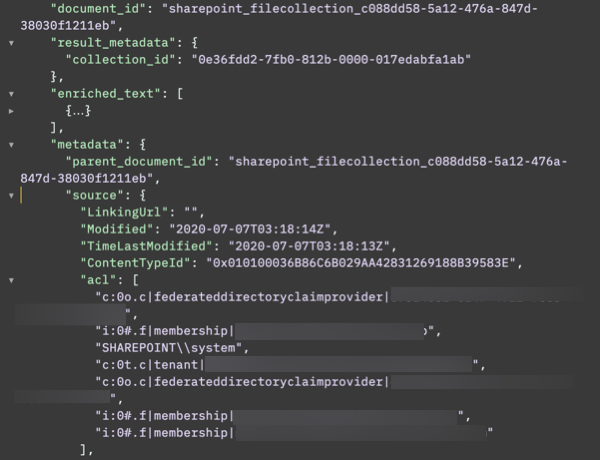

---

copyright:
  years: 2015, 2023
lastupdated: "2023-01-26"

subcollection: discovery-data

---

{{site.data.keyword.attribute-definition-list}}

# Microsoft SharePoint Online
{: #connector-sharepoint-online-cloud}

Crawl documents that are stored in a Microsoft SharePoint Online data source.
{: shortdesc}

[IBM Cloud]{: tag-ibm-cloud} **{{site.data.keyword.cloud_notm}} only**

This information applies only to managed deployments. For more information about connecting to SharePoint Online from an installed deployment, see [SharePoint Online](/docs/discovery-data?topic=discovery-data-connector-sharepoint-online-cp4d).
{: note}

## What documents are crawled
{: #connector-sharepoint-online-cloud-objects}

During the initial crawl of the content, documents from all of the objects that can be accessed from the site collection path that you specify are crawled and added to your collection. You cannot limit the crawl to one library within a site collection, for example. All objects in the specified Site collection path are crawled. Custom metadata that is associated with the SharePoint content is crawled also. You can crawl one site collection path per collection. You cannot crawl *Personal SiteCollections*.

During subsequent scheduled recrawls, only new and modified documents are crawled and any changes are reflected in your collection. Documents that are deleted from the external data source are not deleted from the collection.

All {{site.data.keyword.discoveryshort}} data source connectors are read-only. Regardless of the permissions that are granted to the crawl account, {{site.data.keyword.discoveryshort}} never writes, updates, or deletes any content in the original data source.

{{site.data.keyword.discoveryshort}} can crawl the following objects:

-   SiteCollections
-   Sites
-   SubSites
-   Lists
-   List Items
-   Document Libraries
-   List Item Attachments

## Data source requirements
{: #connector-sharepoint-online-cloud-reqs}

In addition to the [data source requirements](/docs/discovery-data?topic=discovery-data-sources#public-requirements) for all managed deployments, your SharePoint Online data source must meet the following requirements:

-   The Site Collection that you connect to must be one that was created with an Enterprise plan. It cannot be a collection that was created with a frontline worker plan.
-   You must have an Azure Active Directory user ID with permission to read all of the objects that you want to crawl. For example, `<admin_user>@.onmicrosoft.com`. The user ID does not need `SiteCollection Administrator` permission.

You can choose how to authenticate with the external Microsoft SharePoint account from the following options:

Open Authentication (OAuth v2)
:   Authenticates with the external data source by using a token so that your user credentials do not need to be shared. With this authentication method, you can log in to your Microsoft account directly to generate a token that is used by {{site.data.keyword.discoveryshort}} to connect to your data.

    The *Sign in with Microsoft* option that uses Open Authentication v2 to authenticate with the external data source is a beta feature.
    {: beta}

    Before anyone can create connectors that use this authentication method, a user with the *Global Administrator* role must complete a one-time [prerequisite steps](#connector-sharepoint-online-cloud-oauth-prereq) to authorize the connection for all projects in the {{site.data.keyword.discoveryshort}} service instance.

Security Assertion Markup Language (SAML)
:   An older mechanism for authentication and authorization that requires user credentials to be shared with the {{site.data.keyword.discoveryshort}} service.

    If you choose to use this authentication method, your Microsoft SharePoint account must meet the following requirements:

    -   Unless you created your SharePoint Online account before January 2020, two-factor authentication is enabled for the account by default. You must disable two-factor authentication.

        To view and change your multifactor authentication status, see [View the status for a user](https://docs.microsoft.com/en-us/azure/active-directory/authentication/howto-mfa-userstates#view-the-status-for-a-user){: external} or [Change the status for a user](https://docs.microsoft.com/en-us/azure/active-directory/authentication/howto-mfa-userstates#change-the-status-for-a-user){: external}.
    -   The crawl user account must have legacy authentication and `Contribute` level permissions enabled.

        To enable legacy authentication, go to the [Azure portal](https://portal.azure.com/){: external} or contact your SharePoint administrator.
    -   The connector supports the `Password hash synchronization (PHS)` method for enabling hybrid identity only. Use any other type (such as Pass-through authentication or Federation) at your own risk.
    -   You must know the following information:

        Username
        :   The username of the user account to use to connect to the SharePoint Online SiteCollection that you want to crawl.

            For example, `<janedoe>@exampledomain.onmicrosoft.com`.

        Password
        :   The password to connect to the SharePoint Online SiteCollection that you want to crawl.

            This value is never returned and is only used when credentials are created or modified.

## What you need before you begin
{: #connector-sharepoint-online-cloud-prereqs}

You must have the following information ready. If you don't know it, ask your SharePoint administrator to provide the information or consult the [Microsoft SharePoint developer documentation](https://docs.microsoft.com/en-us/sharepoint/dev/){: external}:

Organization URL
:   The root URL of the source that you want to crawl. Specify the domain name of the URL, for example `https://<company>.<domain>.com`.

Site collection path
:   The `site_collection_path` to the section of the site where you want to start the crawl.

    For example, if the content that you want to crawl is available from `https://<company>.<domain>.com/sites/test`, then you can specify `https://<company>.<domain>.com` as the Organization URL and `/sites/test` as the Site collection path.

    -   You cannot specify folder paths as input.
    -   You cannot specify a path to an Active Server Page Extended (ASPX) file, such as URLs to document libraries, lists, and subsites.
    -   If you don't specify a path, the default value of `/` is used, and the root site collection is crawled.

-   **Application ID**: ID of the data source that you want to crawl. This information is required only if you want to store ACL information that is associated with the source documents.

## One-time prerequisite step for OAuth
{: #connector-sharepoint-online-cloud-oauth-prereq}

Before anyone can configure the connector to use OAuth v2 authentication method, a user with the *Global Administrator* role in Microsoft Azure Directory where the data source is located must complete steps to register the Discovery enterprise application in Microsoft Azure. This step must be completed once per {{site.data.keyword.discoveryshort}} service instance.

The administrator does not need to create the application in Azure. When they choose SharePoint Online as the data source, the Discovery service generates the app automatically. As described in the procedure to follow, during the set up of the connector, the administrator must log in to Microsoft with credentials for a user with the *Global Administrator* role in Microsoft Azure Directory and allow the enterprise application to be registered.

The following steps must be completed by a global administrator one time only per service instance:

1.  Review the default user access settings that will be applied to the enterprise application in Microsoft Azure. 

    Enterprise applications can handle user access in many ways. Check the default settings to ensure that they are appropriate for your deployment by completing the following steps:

    1.  Log in to [Microsoft Azure](https://portal.azure.com){: external}. 
    1.  From the *Enterprise applications* page in *Azure Active Directory*, click *Consent and permissions*.

    

    1.  Do one of the following things:

        -   If *Allow user consent for apps* is selected, no more action is needed.
        -   If *Allow user consent for apps from verified publishers, for selected permissions* is selected, then complete the following steps:

            Click *Permissions classifications* link, and then ensure that the following permissions are configured at a minimum:

            -    Office 365 SharePoint Online: MyFiles.Read
            -    Office 365 SharePoint Online: AllSites.Read
            -    Microsoft Graph: offline_access
            -    Microsoft Graph: profile

        The *Do not allow user consent option* is not supported.

        The settings that you specify will be applied to the enterprise application that is created by {{site.data.keyword.discoveryshort}} in subsequent steps.

1.  From the navigation pane of {{site.data.keyword.discoveryshort}}, choose **Manage collections**.
1.  Click **New collection**.
1.  Click **SharePoint Online**, and then click **Next**.
1.  Add a URL to the **Organization URL** field.
1.  Click **Sign in with Microsoft**.

    Pop-ups must be enabled for this site in your web browser.

    The *Sign in with Microsoft* option that uses Open Authentication to authenticate with the external data source is a beta feature.
    {: beta}

    Log in to your Microsoft SharePoint account with your user name and password, and then complete two-factor authentication, if necessary. 
    
    Remember, the credentials you use must have the *Global Administrator* role in Microsoft Azure Directory. If you are not prompted for a user name and password, take note. You might be logged in to a Microsoft Sharepoint account already. If you are logged in to an account that you don't want to use for this connector, stop here. (Any account where you are logged in will be used automatically. And you cannot change the account configuration later.) Open a web browser in incognito mode and start this procedure over from step 1.
    {: important}

    Discovery generates an enterprise application that it will register with the SharePoint organization that you specify. The enterprise application name has the format *IBM App Connect_{unique name}*.

1.  Review the permissions that are associated with the enterprise application that Discovery will register, and then select **Consent on behalf of your organization**.

    

1.  Click **Accept**.
1.  If you want to create a collection, you can name the collection, and then click **Finish**.
    
    Otherwise, you can click **Back** to exit the collection creation process.

Now, anyone from your organization who works in a project that is hosted by the same {{site.data.keyword.discoveryshort}} service instance can create a collection by using the SharePoint Online connector.

### OAuth support revisions
{: #connector-sharepoint-online-cloud-oath-versions}

Support for the OAuth method of authentication was added with a software update in February 2022. If you want to update an existing connector to use OAuth instead of SAML, you must re-create the connector. You cannot change the authentication mechanism for an existing connector.

The OAuth method of authentication was updated in January 2023. The enterprise application that is registered with Microsoft Azure now requires *Read* access only. Previously, the enterprise application required *Write* access. If you want to take advantage of this change, delete your current enterprise application and recreate the connector. For more information about how to delete an enterprise application, see [the Microsoft documentation]( https://learn.microsoft.com/en-us/azure/active-directory/manage-apps/delete-application-portal?pivots=portal){: external}.

## Connecting to the data source
{: #connector-sharepoint-online-cloud-task}

To configure the Microsoft SharePoint Online data source, complete the following steps in {{site.data.keyword.discoveryshort}}:

1.  From the navigation pane, choose **Manage collections**.
1.  Click **New collection**.
1.  Click **SharePoint Online**, and then click **Next**.
1.  Add a URL to the **Organization URL** field.
1.  To enable access to your external data source, choose the method that you want to use to authenticate with the data source from the following options:

    Open Authentication (OAuth v2)
    :   Click **Sign in with Microsoft**.

        Pop-ups must be enabled for this site in your web browser.
        
        The *Sign in with Microsoft* option that uses Open Authentication to authenticate with the external data source is a beta feature.
        {: beta}

        Log in to your Microsoft SharePoint account with your user name and password, and then complete two-factor authentication, if necessary.

    Security Assertion Markup Language (SAML)
    :   Specify a username and password for a user that is authorized to access the site you want to crawl, and then click **Next**.

1.  Specify the path you want to crawl in the **Site collection path** field.
1.  Name the collection.
1.  If the language of the documents on the site is not English, select the appropriate language.

    For a list of supported languages, see [Language support](/docs/discovery-data?topic=discovery-data-language-support).
1.  **Optional**: Change the synchronization schedule.

    For more information, see [Crawl schedule options](/docs/discovery-data?topic=discovery-data-collections#crawlschedule).
1.  **Optional**: If you want to store any access control information that exists in the SharePoint documents that you crawl, in the *Security* section, set the **Include Access Control List** switch to `On`.

    When you enable this option, information about SharePoint access rules that is stored in SharePoint source documents is retained and stored as metadata in the documents that are added to your collection.

    This feature is not the same as enabling document-level security for the collection. The access rules in the document metadata are not used by {{site.data.keyword.discoveryshort}} search. Enabling this feature merely stores the information so that you can leverage the access rules when you build a custom search solution.

    Use of this feature increases the size of the documents that are generated in the collection and increases the crawl time. Only enable the feature if your use case requires that you store the SharePoint document ACL information.
    {: important}

    If you enable this feature, someone with the administrator role in Microsoft SharePoint must take extra steps to ensure that users who crawl the site have the right permissions to access ACL metadata.

    An administrator must complete the following steps:

    1.  Log in to Microsoft SharePoint.
    1.  Open the page for your SharePoint site.
    1.  From the settings menu, choose *Site permissions*.
    1.  Click *Advanced permission settings*.
    1.  Make sure that people who want to collect access control information during a crawl have or are members of a group that has the *Full Control* permission for the site.

        

        When access control list information is not extracted, *Read* permission is sufficient for all users who crawl the content.
        {: note}

1.  If you want to look for and extract question-and-answer pairs, select **Apply FAQ extraction**.

    For more information, see [FAQ extraction](/docs/discovery-data?topic=discovery-data-sources#faq-extraction).
1.  If you want the crawler to extract text from images on the site, expand *More processing settings*, and set **Apply optical character recognition (OCR)** to `On`.

    When OCR is enabled and your documents contain images, processing takes longer. For more information, see [Optical character recognition](/docs/discovery-data?topic=discovery-data-collections#ocr).
    {: note}

1.  Click **Finish**.

The collection is created quickly. It takes more time for the data to be processed as it is added to the collection.

If you want to check the progress, go to the Activity page. From the navigation pane, click **Manage collections**, and then click to open the collection.

You cannot currently change the user account that is associated with the OAuth setup later, nor any of the details of the existing user account that the connector is configured to use. For example, you cannot update the password that was used to set up the connection after a password change in SharePoint.
{: note}

### Sample access control list information
{: #connector-sharepoint-online-cloud-acl-sample}

The following screen capture illustrates the type of ACL information that is stored in the document when you include the access control list.

