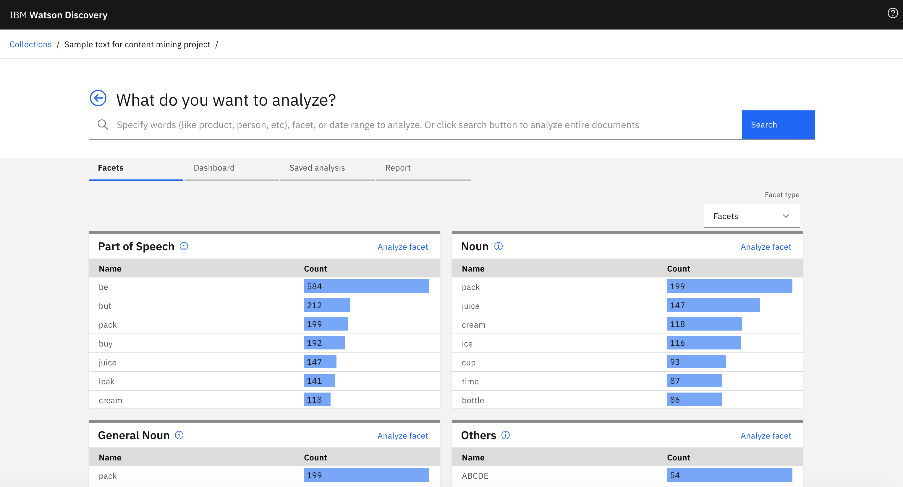
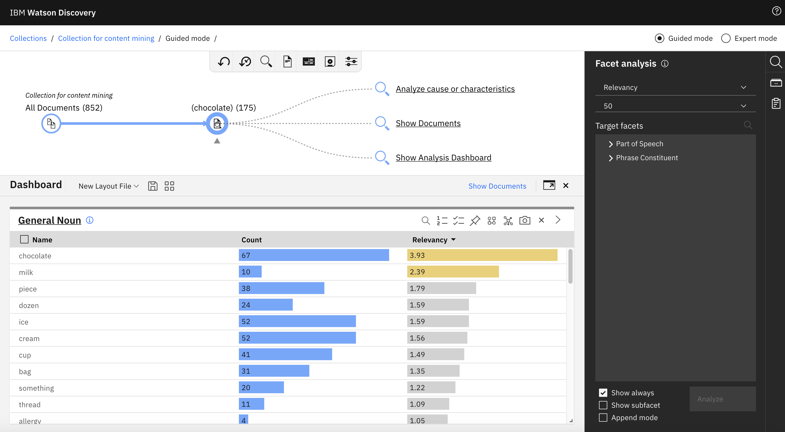
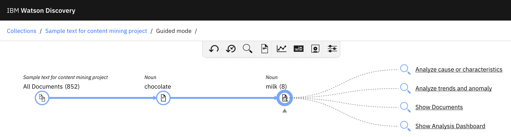
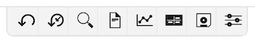
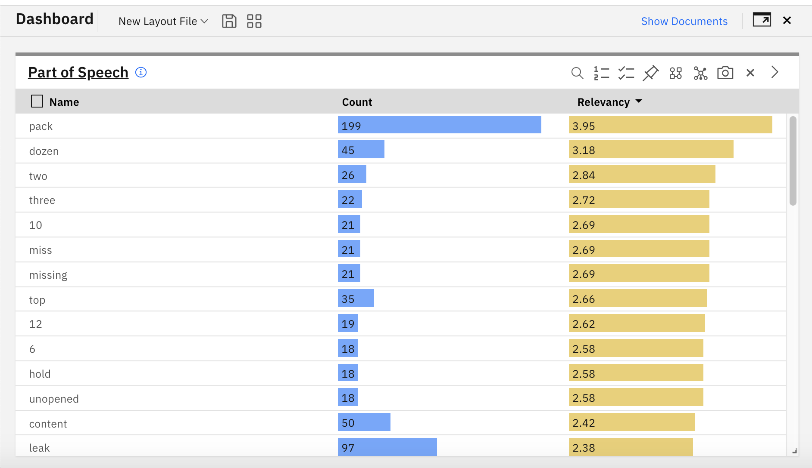
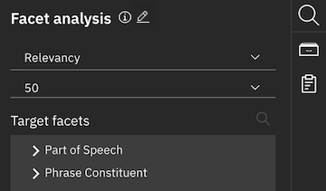
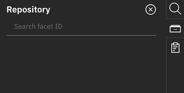
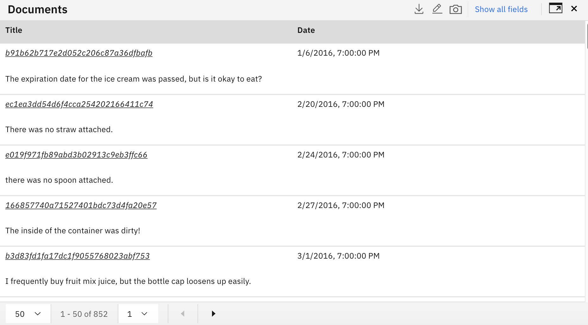
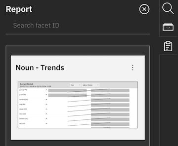
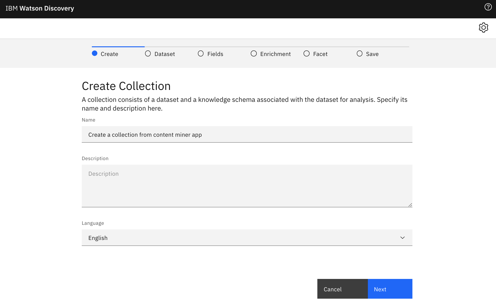

---

copyright:
  years: 2019, 2022
lastupdated: "2022-03-20"

subcollection: discovery-data

---

{{site.data.keyword.attribute-definition-list}}

# Using the Content Mining application   
{: #contentminerapp}

The {{site.data.keyword.discoveryfull}} Content Mining application is an analytical tool that helps you discover hidden insights by analyzing anomalies, trends, and relationships in your documents.
{: shortdesc}

This page describes using the Content Mining application. For information about creating a {{site.data.keyword.discoveryshort}} Content Mining project, which is how the application is configured and launched, see [Creating projects](/docs/discovery-data?topic=discovery-data-projects). Only users of installed deployments ({{site.data.keyword.icp4dfull_notm}}) or Enterprise and Premium plan managed deployments can create this type of project.
{: note}

## Overview video
{: #cmvideo}

{: video output="iframe" data-script="#video-transcript-ui" id="mediacenterplayer" frameborder="0" width="560" height="315" allowfullscreen webkitallowfullscreen mozAllowFullScreen}

### Video transcript
{: #video-transcript-ui}
{: notoc}

Watson Discovery Content Mining Project presented by Stuart Strolin -- (Music intro) The purpose of this video is to familiarize you with the content mining project in Watson Discovery.

Content mining is one of the primary use cases for Watson Discovery and is used for analyzing and exploring both structured and unstructured data to find insights and extract hidden meaning.  It is used by both the citizen analyst and the data scientist.

The content mining project can be used for all types of analysis because the user interface is not specific to a particular industry or set of data.

In this scenario, you are an analyst for a fictitious automobile company.  Operational reports have alerted the company to an unusual accident rate for one of their cars.  Your job is to find out why.

Using the content mining project, you begin your analysis by looking at the unstructured data from the national motor vehicle incident reports.  You are presented with an interface that allows you to select the car model and begin your analysis (on the Collections page).  In this case, you are interested in the Hill Walker.  You could type that information into the search section at the top of the page.  But it's easier just to click on the item.  You can add as many search terms and conditions as you like.  But in reality, you want to let the application guide your analysis.

What you see now is the navigation view (in Guided mode).  It keeps track of your analysis and provides options for next steps.  It also provides a count of the number of documents that match your current state of analysis. In this small collection, the number of documents relating to the Hill Walker is only 51.  In a production dataset, the number would usually be much larger.  Analyzing trends and anomalies is often a good way to start as it allows you to see if anything seems out of the ordinary.

Immediately, you notice that the Hill Walker has problems in December and January.  You decide to investigate further by narrowing this initial exploration to just the month of December.

Notice how the navigation view at the top always keep you informed of where you are in your analysis.  Next, you select 'Analyze cause and characteristics'  because you are interested in why things are happening.

You notice that words like 'snow' and 'brake' are highlighted together (in the Parts of Speech section), so you add these to your analysis.

The Content Miner project has narrowed your investigation to a small number of complaints that can be easily read. (clicks Show Documents)

The common theme here is that there is an unexpected problem with the way the brakes are working in snowy conditions.  You now have the information you need to ask the engineering department to perform a detailed inspection of the braking system and determine why it is not working as expected in snowy conditions.

In this demonstration, you saw how a citizen analyst using Watson Discovery and content mining can easily discover hidden meaning in unstructured text. (list of features, functionality, and use cases)

What will you do with Watson Discovery? (Music outro)

## Application launch view
{: #cmolaunch}

When you launch the application from a {{site.data.keyword.discoveryshort}} Content Mining project, you see something similar to the window in Figure 1. The window shows sample text on the **Facets** tab, which shows the extracted facets that were configured in the {{site.data.keyword.discoveryshort}} Content Mining project.

The link for the Content Mining application is similar to the format, `https://{installation domain}/discovery/{ID}/cm/miner`.
{: note}

{: caption="Figure 1. The Discovery Content Mining application showing the page you see after launching the app" caption-side="bottom"}

### What do you want to analyze?
{: #oviewsearch}

On this first page, you can enter terms that you want to search for. Or, you can select values from the bar charts of each facet. You can select multiple items.

For more information about configuring facets in a Content Mining project, see [Facets](/docs/discovery-data?topic=discovery-data-facets).
{: tip}

You can select the type of facet to display from the **Facet type** menu:

-   **Metadata Facets**: If configured in the Content Mining project, these facets come from the fields that are indexed in the document collection.
-   **Facets**: By default, these facets are parts of speech whose values are extracted from the text field of your documents. Other facets might also be configured.
-   **Custom**: This view allows you to customize facets for analysis.

## Guided analysis view
{: #cmoana}

In the guided analysis view, you can iteratively analyze your collection, digging deeper into the data based on suggested analyses.

In the analysis views, you can select **Guided Mode** or **Expert Mode**. In guided mode, when you select a facet value and click **Analyze More**, analysis results are hidden and mining graph actions are suggested. In expert mode, the mining graph and suggested actions are hidden by default. But in expert mode, when you click **Analyze More**, the current view is still displayed and the content is refreshed based on the new analysis context.

From the application launch page, if you enter a term that you want to search for and analyze, you see something similar to the window in Figure 2, which shows the _mining graph_, _toolbar_, _Dashboard_, and _Facet analysis_ pane. Figure 2 shows that the search term is `chocolate`, which is a value from the `General Noun` facet.

{: caption="Figure 2. Watson Discovery Content Mining application shown in guided mode" caption-side="bottom"}

The guided analysis view contains four main parts, which are described in more detail in the following sections.

-   **Mining graph**: Displays a guided visualization of your analysis
-   **Toolbar**: The toolbar in the window header, which contains buttons that execute global commands
-   **Dashboard**: Used to select and save different layouts
-   **Facet analysis pane**: Used to customize your analysis

### Mining graph
{: #cmomg}

The mining graph provides a visualization of the progress of your analysis. As the analysis proceeds, the graph becomes longer. You can move the graph around in the window by clicking and dragging. An example of the mining graph after further analysis steps is shown in Figure 3.

{: caption="Figure 3. Guided mode text analysis using the mining graph" caption-side="bottom"}

The nodes represent the steps in the analysis. The first node displays the starting point with all documents and the last node shows the current point of the analysis. Those two nodes also show the number of documents, which was reduced considerably through analysis. After the final node, suggested actions for further analysis are displayed.

#### Suggested actions
{: #cmomgsu}

The following actions can be suggested based on your data, therefore only the applicable actions are shown:

-   **Analyze cause or characteristics**: Examines facets and suggests characteristic words and facets.
-   **Analyze trends and anomaly**: You can view these when you select the topic or trends analyses for the current context node.
-   **Facet analysis**: Show the facet analysis view, if hidden.
-   **Show Documents**: Show the documents view for you to see current documents.
-   **Show Timeseries**: Show timeseries view.
-   **Analyze relation between facets**: Enable facet analysis view and set default analysis-type pairs. Use this to run pair analysis with various metadata facets.

#### Context-sensitive menu
{: #cmomgcs}

There is also a content-sensitive menu for each node. Click a node to open this menu. This menu has the following actions:

-   **Set Current Context**: Set this node as the current context node.
-   **Show Analysis Dashboard**: Show the last analysis results that were performed for this node.
-   **Add Query Text**: Add a query for this node.

    -   **New query**: The new query replaces the existing query.
    -   **Add to current query**: The new query is added to the existing query.
-   **Show Documents**: Show the documents view for this node.
-   **Show Timeseries**: Show the timeseries view for this node.
-   **Delete**: Delete this node.

### Toolbar for the guided analysis view
{: #cmotb}

{: caption="Figure 4. The toolbar for the guided analysis view" caption-side="bottom"}

The guided analysis view toolbar contains the following commands:

-   **Reset**: Revert back to the all documents node.
-   **Undo**: Undo the most recent action.
-   **Add Query Text**: Add a query for this node. There are two options.
    -   **New query**: The new query replaces the existing query.
    -   **Add to current query**: The new query is added to the existing query.
-   **Show Documents**: Open documents view for the current node.
-   **Show Timeseries**: Open timeseries view for the current node.
-   **Show Analysis Dashboard**: Open analysis dashboard for the current node.
-   **Save Analysis**: You can save the existing analysis. You can save the mining graph structure and query so the analysis can be resumed quickly at a later time. You can also open a previously saved analysis.
-   **Settings**: Opens the settings dialog. You can set the time zone, and also revert to the default settings.

### Dashboard
{: #cmodb}

{: caption="Figure 5. The Dashboard view showing the Parts of Speech facet" caption-side="bottom"}

To save your analysis work for quick access later, you can save the analysis dashboard. Note the following features of the Dashboard:

-   When you analyze documents, a default layout, `New Layout File` is automatically created. The content of the file is changed when you do another analysis.
-   If **Append mode** is enabled in the **Facet analysis** pane, the results are added to the New Layout File.
-   To save a layout or edit the metadata of a saved layout, select the layout and click the Save icon. The Dashboard Layout window is shown and you can set the following properties:

    -   **Name**: Name of layout file.
    -   **Add to Facet Analysis** option. A new analysis type is added to **Facet analysis** pane.
    -   You can select **Save** or **Save As**.
-   To delete the layout, click the **Delete** icon.
-   If you modified the saved layout, an asterisk (\*) is added to the layout name. To revert, click the **Reset** icon.
-   Click the **Auto Layout** icon to redo the layout by using the system default layout.

#### Analysis dashboard customization
{: #cmodbc}

When you save the dashboard analysis, the following parts of the dashboard are saved, unless marked otherwise:

-   Layout
    -   Rearrange the layout by dragging the black border header area of each pane
    -   Resize each analysis pane by dragging the resize handle
    -   When a layout is not saved, when you add the new analysis results in the current layout or remove existing results, the system automatically resizes the layout of the dashboard
-   Each analysis result

    -   You can customize the analysis from the toolbar or result visualization
    -   You can rename facets to save in your analysis dashboard
    -   The Toolbar is expanded when a single analysis result is in the dashboard. If you have multiple result panes, the toolbar is collapsed by default. The toolbar contains the following items:

        -   **Search**: You can filter current values by text (not saved)
        -   **Number of Results**: You can change the number of results of current analysis from here (saved)
        -   **Selection Mode**: By default, you can select multiple values in each analysis result. But if you specify "single" mode, you can select only one value at a time. (saved)
        -   **Filter Others**: If you enable this option, when you select some values in this analysis result, its query is applied to the other analysis results in the same layout to filter. For example, if you have a `Manufacturer` facet result and a `Products` facet result in the same layout, and if you enable Filter Others on the `Manufacturer` facet and select a value from it, then only the `Products` facet of the selected `Manufacturer` facet is displayed. This is a powerful enhancement for analysis. (saved)

            When you enable a filter, and select items from the filter enabled pane, then other panes are updated. The data of each pane is updated but its item selections remain. This behavior may be confusing because each pane shows the top `N` items in the pane (default is 50), but because a selected item is not included in the top `N` items, it might not always be shown in the pane.
        -   **Boolean Operator**: Select AND or OR operator to create query from multiple values (not saved)
        -   **Export**: Export your collection to a database. Specify the file name, format (.csv or .json), encoding, date and time format, and number of results. If you choose to export to .csv, you can import those insights into a Business Intelligence (BI) tool. You cannot export secured collections. For more information, see [Document-level security](/docs/discovery-data?topic=discovery-data-collection-types#configuredls). (not saved)
        -   **Visualization**: You can select visualization type (saved)
        -   **Maximize/Minimize**: Maximize, Minimize current analysis result (not saved)
        -   **Snapshot**: Saves an image of the dashboard to the Report pane, from which you can create a report (not saved)
        -   **Close**: Remove analysis result from current dashboard (not saved)
        -   **Show Toolbar** or **Hide Toolbar** (saved)

When you save a dashboard analysis, you can access it quickly from the **Dashboard** tab on the launch page. From there, select the saved dashboard that you want to see and click **Analyze More**, which opens the dashboard for deeper analysis.
{: tip}

### Facet analysis pane
{: #cmofap}

{: caption="Figure 6. The Facet Analysis pane showing the default facets" caption-side="bottom"}

The **Facet analysis** pane is the default view when you enter the analysis view. To begin facet analysis, select the analysis type and options, and then select a facet from the analysis tree. The options in this pane are described in the following list:

-   **Analysis type**: Select the type of analysis you want to perform. Options: **Relevancy**, **Topic**, **Trends**, **Pairs**, **Sentiment**, **Connections**, **Factor**, or **Dynamic cluster**.
-   **Contextual view selection**: Select a contextual view to analyze that you defined. This option only appears when you create a contextual view in the **Contextual view** tab.
-   **Number of facets**: Specify the number of facets to analyze. The default value and available options vary based on the analysis type.
-   **Date facet**: Select the date facet to analyze. This options is enabled only for **Trends** and **Topics** analysis types.
-   **Time scale**: Select the time scale to analyze. This options is enabled only for **Trends** and **Topics** analysis types.
-   **Time period**: Select the time period to analyze. This options is enabled only for **Trends** and **Topics** analysis types.
-   **Target facets**: Select a facet from this tree. For a **Pairs** analysis, select row and column facets. For a **Connections** analysis, select between two and five facets, and then click **Analyze**.

    -   **Filter**: Click the magnifying glass icon that's in the **Target facets** heading and enter a label filter for the category tree and the subfacet category tree.
-   **Show always**: If selected, the facet analysis pane is always visible.
-   **Show subfacet**: If selected, the category tree for subfacets is displayed.
-   **Append mode**: If selected, a newly submitted analysis is added to the list of analysis types. The analysis dashboard shows multiple analysis results simultaneously.
-   **Analyze**: Click to begin an analysis.

If you would like to organize your facets into folders so they are easier to find in the analysis tree, click the Edit icon to open the **Facet groupings** dialog. From there you can organize your existing facets in the groups and nested sub-groups you create. By default, a facet that is added to a group will not display in the tree. If you would like it to display in both the group and the tree, clear the **Hide facets in original tree** checkbox. These groups are not used to analyze data, they are for organization only.

When you select **Relevancy**, **Pairs**, or **Connections** analysis, the **Part of Speech** and **Phrase Constituent** target facets are displayed. You can expand these target facets to view the subfacets. These facets and subfacets are generated from the Content Mining **Parts of Speech** annotator, which generates the facets as a result of internal natural language processing, part of speech tagging, and phrase chunking.

Available target facets:

-   **Part of Speech**

    -   **Noun**
    -   **Verb**
    -   **Adjective**
    -   **Adverb**
    -   **Conjunction**
    -   **Interjection**
    -   **Numeral**

-   **Phrase Constituent**: A word or a group of words that function as a single unit in a sentence.

    -   **Noun Phrase**: A word or a group of words in a sentence that functions as a subject or object, for example `a query`, `the results`, and `IBM Watson`.

        -   **Noun Sequence**: A noun comprised of two or more nouns, or `noun + noun`. For example, some noun sequence examples include `web server`, `disk drive`, and `data set`.
        -   **Modified Noun**: Nouns that have preceding words that describe the noun, such as adjectives, quantities, or locations. A noun can also have a determiner that modifies the noun, such as `a`, `an`, or `the`. For example, some modified noun examples include `the white horse`, `three enrichments`, and `the closest town`.
        -   **Prep Noun**: A noun that is part of a prepositional phrase that expresses spatial or temporal relations or to mark various semantic roles. Some examples include `after processing`, `during a crawl`, and `under the bridge`.
    -   **Predicate Phrase**: The part of the sentence that has the predicate, or verb, as its head. For example, in the sentence `Content Mining helps you uncover hidden insights.`, the `helps you uncover hidden insights.` segment is the predicate phrase.

        -   **Predicate with Adverb**: A predicate phrase that includes one or more adverbs, for example `Content Mining helps you analytically uncover hidden insights.`.
        -   **Noun - Predicate**: A phrase that adds more information about the subject. A predicate noun functions as a link between the subject and verb. For example, the segment `our solar system's largest planet` is the predicate noun in the sentence `Jupiter, our solar system's largest planet, is primarily composed of gases.`.
        -   **Verb - Noun**: A phrase that has a `verb + noun` sequence. A couple of examples include `lose power` and `extend the warranty`.
    -    **Conjunction Phrase**: A phrase that connects two independent clauses. Some conjunction phrase examples include `for`, `and`, `nor`, `but`, `or`, `yet`, and `so`. For example, the word `so` in the following sentence is the conjunction phrase: `There weren't enough beds, so I had to sleep on the floor.`.

         -   **Resultative Conjunction**: A conjunction that demonstrates cause and effect. Some example resultative conjunctions include `so`, `therefore`, and `thus`. For example, the word `therefore` in the following sentence is the resultative conjunction: `We had a surplus of fabric; therefore, we sewed extra clothes.`.
         -   **Contradictory Conjunction**: A conjunction that connects independent clauses that oppose one another, such as `however`, `but`, and `although`. For example, the word `however` in the following sentence is the contradictory conjunction: `The Freemont track team is the fastest in the county in short sprint races; however, they are not as successful in endurance races.`.

#### Enabling sentiment analysis
{: #sentiment-analysis}

The **Sentiment** enrichment extracts phrases and expressions from your documents, which convey positive, neutral, or negative sentiment. The Content Mining application then marks these extractions as annotations. You can enable this analysis type in the **Facet analysis** pane. The **Sentiment** enrichment is available when you create a **Content Mining** project in {{site.data.keyword.discoveryshort}}.
{: shortdesc}

Complete the following steps to enable sentiment analysis in your Content Mining application:

1.  Make sure that your Content Mining application is open by clicking **Launch application** in your {{site.data.keyword.discoveryshort}} collection.
1.  Click the **Collections** breadcrumb link on the header of the page.
1.  Select the expandable menu icon on an existing collection, and click **Edit collection**. Or you might want to create a collection and then enable sentiment analysis. For the steps on how to create a collection in the Content Mining application, see [Creating a collection in the Content Mining application](#cmccoll). If you create a new collection and you want to enable sentiment analysis, on the **Enrichment** tab, make sure that you the select **Sentiment of phrases** annotator and click **Save**.
1.  Click the **Enrichment** tab, select the **Sentiment of phrases** annotator, and click **Save**. The collection reindexes.
1.  After reindexing is complete, click **Close** to return to the **Create a collection** page, and click your collection tile.
1.  Select a facet or multiple facets to analyze, or enter a term to search for in your document in **What do you want to analyze?**, and click **Search**. You can now see the mining graph and the **Facet analysis** pane, where you can select the **Sentiment** analysis. By default, **Relevancy** analysis is selected.
1.  In the first drop-down menu in the **Facet analysis** pane, select **Sentiment**, or in the mining graph, click **Analyze sentiment and reputation**, if available. In **Target facets** in the **Facet analysis** pane, if you expand the **Sentiment Analysis** option, the following facets are available to analyze your documents:

    -   **Sentiment Phrase**

        -   **Positive Phrase**
        -   **Negative Phrase**

    -   **Sentiment Expression**

        -   **Positive Expression**
        -   **Negative Expression**

    -   **Sentiment Target** - This facet is only available in English and Japanese.

        -   **Positive Target**
        -   **Negative Target**

1.   Make sure that **Sentiment** is selected in the **Facet analysis** pane, and select one of the previously listed facets to analyze. When you click a particular facet, such as **Positive Expression**, you can see a list of the positive expressions that the Content Mining application identified in your documents; the expression sentiment as positive, neutral, or negative and the sentiment percentage; and a side-by-side comparison of positive and negative expressions, along with the number of instances of the expression and the expression relevancy.
1.   Click one or more options in the facet list, or select one or both facet lists, and then click **Analyze more**. From this point, you can choose to analyze the positive or negative phrase, expression, or target by cause and characteristics or by viewing the phrase, expression, or target in the **Documents** or **Trends** view.

In [Language support](/docs/discovery-data?topic=discovery-data-language-support), the languages that have `Phrase sentiment` listed also support sentiment analysis in Content Mining.
{: note}

### Repository pane
{: #cmorp}

{: caption="Figure 7. The Repository pane showing the default view" caption-side="bottom"}

The **Repository** pane contains exported documents. You can download exported documents to your local file system from this pane. Click **Facet analysis** to return to the **Facet analysis** pane.

### Documents view
{: #docview}

{: caption="Figure 8. The Documents view showing sample documents" caption-side="bottom"}

The **Documents** view is displayed when you show documents in the guided analysis view. The **Documents** view lists the documents in the current node of the mining graph.

#### Toolbar for the Documents view
{: #dtool}

The toolbar that is available from the Documents view contains the following commands:

-   **Export**: You can download and export searched documents in a specified file format. You cannot export secured collections. For more information, see [About document-level security](/docs/discovery-data?topic=discovery-data-collection-types#configuredls).
-   **Customize**: You can customize how documents are displayed. You can choose header fields to always show with the documents. You can also specify a field that contains a link to a thumbnail image to display next to the document summary.

    You can specify a URL. When you click the title, this link is opened in a new window instead of showing the preview. Only valid URLs work as links.

-   **Snapshot** Saves an image of the dashboard to the Report pane, from which you can create a report. For more information, see [Report pane](#cmorepv).
-   **Show all fields** and **Hide all fields**: You can toggle between these two buttons to show all fields or just the title and date fields.

#### Documents pane
{: #ddocs}

In the **Documents** view, the pane lists all documents in summary form. Click a document title to view the entire document along with all fields. The following actions are available:

-   **Select All**: Select all currently displayed annotations.
-   **Clear**: Clear all currently displayed annotations.
-   **Back**: Display the previous document.
-   **Next**: Display the next document.
-   **Close**: Close the document window.

### Report pane
{: #cmorepv}

{: caption="Figure 9. The Report pane showing a snapshot of a Noun Trends analysis" caption-side="bottom"}

When you find good insights while analyzing, you can save and share that insight by creating a report, which consists of snapshots and notes about the analysis. Snapshots are shown in the **Report** pane.

#### Taking a snapshot
{: #cmosnap}

1.  Click the camera icon from the Dashboard toolbar.

    You can also take a snapshot of the document preview. When you select one or more documents, only the selected documents are stored and displayed in the report. When no selection is made, all documents in the current "page" are stored and displayed in the report.
    {: note}

2.  Thumbnails of the snapshot are displayed in the Report pane, which is a temporary store for snapshots. This store will be cleared when the browser is refreshed, or another collection is opened.
3.  From the Menu icon of the snapshot's thumbnail, you can enter comments, or delete the snapshot. You can also edit comments later.
4.  Choose thumbnails that you want to add to a new report, and then click the **Create** button.

#### Creating a report
{: #cmorepcr}

1.  From the Report pane, click **Create**. On the **Basic** tab, you can set the following properties:

    -   **Report Template**: The template for the layout and style of a report.
    -   **Title**: Title of the report. The default value is `Report`.
    -   **Date**: Date for the report. The default value is the date when you create the report.
    -   **Summary**: Summary text for the report. The default is empty.

1.  Optional. On the **Comments** tab, edit the title of the analysis result, and enter a comment. Then, confirm the preview on the **Preview** tab.
1.  When you're done editing, click the **Save** button.

#### Report list
{: #cmorepli}

Created reports are listed on the **Report** tab on the application launch page. From the **Actions** menu, you can edit or delete the report, or copy the link to share with others.

### Dashboard toolbar
{: #cmodashtb}

The dashboard toolbar is shown at the start of the dashboard. It's the same for all the dashboard views.

-   **Show Documents**: Show the documents view for this node.
-   **Analyze More**: This button is enabled once you have selected data in the chart. The analysis is performed on the data you have selected.
-   **Boolean Operators**: By default, when you click **Analyze More**, the generated query is added to the current operator with a boolean AND. You can use this button to replace the AND with AND NOT or OR.
-   **Maximize** and **Minimize**: Toggle between minimizing and maximizing the dashboard.
-   **Close**: Close the dashboard.

### Dashboard views
{: #cmodashv}

A dashboard is displayed when you choose analyses in the guided analysis view. There are a number of different dashboards which are described in the following sections.

-   **Characteristic words dashboard**: The characteristic words dashboard is displayed when you choose **Analyze cause or characteristics** in the guided analysis view.
-   **Time series dashboard**: The time series dashboard is displayed when you choose **Analyze trends and anomaly** in the guided analysis view. This view shows multiple time series charts for multiple facet values at a glance.
-   **Pairs analysis dashboard**: The pairs analysis dashboard is displayed when you choose a **Pairs** analysis in **Facet analysis**.

#### Characteristic words dashboard
{: #cmodacwd}

The characteristic words dashboard is displayed when you choose **Analyze cause or characteristics** in the guided analysis view.

The dashboard displays characteristic words suggested by the analysis along with one or more facets that can be analyzed further. You can resize facets by dragging the resize handler of each facet. You can also move facets around by dragging them by their border.

##### Facet toolbar
{: #cmoftb}

The facet toolbar is displayed when you click **Show Toolbar**.

-   **Search**: You can search for words.
-   **Boolean Operators**: If you select two values for analysis, you can specify whether the values are joined by Boolean AND or OR.
-   **Export**: Export your collection to a database. Specify the file name, format (.csv or .json), encoding, date and time format, and number of results. If you choose to export to .csv, you can import those insights into a Business Intelligence (BI) tool. You cannot export secured collections. For more information, see [Document-level security](/docs/discovery-data?topic=discovery-data-collection-types#configuredls).
-   **Visualization**: The default visualization is specified on the facet option page of the collection wizard. This list contains the visualization options:

    -   **Facet Table**: Shows facet value, relevancy and count. Click each item to analyze more. To clear selection, click that item again. You can sort by name, count, and relevancy by clicking on each column header.
    -   **Word Cloud**: Color and size represents level of relevancy. Click each item to analyze more. To clear selection, click white space.
-   **Close**: Close this facet.
-   **Hide Toolbar**: Hide the toolbar.

When one or more values in the dashboard are selected, the following toolbar items are shown.

-   **Analyze More**: The analysis is performed on the data you have selected.
-   **Cancel**: The selection of values is cancelled.

#### Time series dashboard
{: #cmotsdb}

The time series dashboard is displayed when you choose **Analyze trends and anomaly** in the guided analysis view. This view shows multiple time series charts for multiple facet values at a glance. You can choose to analyze facets by **Month**, **Day**, **Year**, or **Hour**, or you can choose from the following cyclic time scale options:

-   **Days of the month**: Displays facet analysis for all of the days in the current month.
-   **Months of the year**: Displays facet analysis for all of the months of the year.
-   **Days of the week**: Displays facet analysis for each day of the week.

The cyclic data is calculated from the current time zone setting of your collection. You can change the time zone by clicking the expandable menu icon on your collection and then **Edit collection > Time zone**. If you change your time zone, the index rebuilds automatically.

By default, the time series chart is rendered as a heat map. Each cell color indicates a level of relevancy. In addition, a line chart is overlayed on the chart. You can change from a heat map to a bar graph by clicking next to a facet label. To select items for further analysis click or shift-click individual items. You can also drag the mouse cursor to select contiguous items.

Trends analysis does not support the cyclic time scale options, and the cyclic time scale options are only available for collections created in {{site.data.keyword.discovery-data_short}} version 2.1.3 and later.
{: note}

##### Facet toolbar
{: #cmotsftb}

The facet toolbar is displayed when you click **Show Toolbar**.

-   **Search**: You can search for words.
-   **Export**: Export your collection to a database. Specify the file name, format (.csv or .json), encoding, date and time format, and number of results. If you choose to export to .csv, you can import those insights into a Business Intelligence (BI) tool. You cannot export secured collections. For more information, see [Document-level security](/docs/discovery-data?topic=discovery-data-collection-types#configuredls).
-   **Visualization**: The only option is **Timeseries**.
-   **Close**: Close this facet.
-   **Hide Toolbar**: Hide the toolbar.

##### Second facet toolbar
{: #cmotssftb}

This toolbar controls the content of the individual time series.

-   **Show Timeseries**: Show or hide mini-time series to show the current date range of analysis results. You can move and change the size of the blue area to specify an analysis target.
-   **Zoom in**: Zoom into the chart.
-   **Zoom out**: Zoom out from the chart.
-   **Clear Selection**: Clear all selections in the time series.
-   **Time Scale**: Determines the time scale of the time series chart.
-   **Sort by**: Determines the sort key for the time series chart.

#### Pairs analysis dashboard
{: #cmopadb}

The pairs analysis dashboard is displayed when you choose a **Pairs** analysis in **Facet analysis**.

By default, a two-dimensional map table is shown. Click each item to analyze further. Click the toggle arrow button of each cell header to sort a row or column in relevancy order. Click a column or row name to sort by label.

##### Facet toolbar
{: #cmopadbtb}

The facet toolbar is displayed when you click **Show Toolbar**.

-   **Export**: Export your collection to a database. Specify the file name, format (.csv or .json), encoding, date and time format, and number of results. If you choose to export to .csv, you can import those insights into a Business Intelligence (BI) tool. You cannot export secured collections. For more information, see [Document-level security](/docs/discovery-data?topic=discovery-data-collection-types#configuredls).
-   **Visualization**: You can change the visualization to a **Pair Table** visualization. You can change back to a two-dimensional map by choosing **2D Map**. A pair table is shown. Click each item to analyze further. To clear the selection, click that item again.
-   **Close**: Close this facet.
-   **Hide Toolbar**: Hide the toolbar.

## Creating a collection in the Content Mining application
{: #cmccoll}

{: caption="Figure 10. The Create a Collection page in the Content Mining application" caption-side="bottom"}

In the Content Mining application, you see the collection that was configured for the project, but you can also add collections of documents that can be used to configure other Content Mining projects.

1.  Click the **Collections** breadcrumb link from the start of the page.
1.  Click **Create Collection**.
1.  Enter names, select files, and review the default information, changing any of the selections, if necessary.
1.  Click Save.

    After the saving process is complete, the new collection is available on the Create a Collection page.

This feature is specific to the Content Mining application. Each **Content Mining** [project](/docs/discovery-data?topic=discovery-data-projects#project-type) can contain only one collection.
{: note}

## Editing a collection in the Content Mining application
{: #cmeditcoll}

You can edit a collection in the Content Mining application by clicking the expandable menu icon on your collection on the **Create a collection** page.
{: shortdesc}

When you edit a collection, the following tabs are available:

-   [Edit tab](#cm-edit)
-   [Fields tab](#cm-fields)
-   [Enrichment tab](#cm-enrich)
-   [Facet tab](#cm-facet)
-   [Document flags tab](#doc-flags)
-   [Contextual view tab](#contextual-view)

### Edit tab
{: #cm-edit}

Name your Content Mining application, add a description, select your time zone; and if applicable, select the language that your documents are written in.

### Fields tab
{: #cm-fields}

You can specify how each field from the data set is processed and indexed in the collection.
{: shortdesc}

In **Field indexing option**, you can select how the available fields are indexed from the following options in **Index type**:

-   **String**
-   **Analyzable text content**
-   **Date**
-   **None**

If you select **String**, you can enable options to make the field **Free text searchable** or a **Metadata facet**. If you select **Analyzable text content**, which includes all words (in the body, captions and titles of documents and images) that can be assessed, use [Contextual View](#contextual-view) to apply to multiple fields; **Free text searchable** and **Metadata facet** are unavailable for this index type. If you select **Date** type, **Metadata facet** is available but not **Free text searchable**. If you select **None** as the index type, nothing more is necessary.

In **Display fields**, you can set the following display fields that typical applications use:

-   **Body field** - Text content field that provides the body content of documents. Editable only when creating a new collection.
-   **Title field** - Text content field that provides the title of documents.
-   **Date field** - Date field that applications can use as a default in various situations.

### Enrichment tab
{: #cm-enrich}

You can select existing annotators to enrich your collection, such as **Part of speech**, **Sentiment of phrases**, and **Entities**. You can even apply a classifier if you want to enrich your collection based on document information or metadata. For information about creating and applying a document classifier to a Content Mining or {{site.data.keyword.discoveryshort}} collection, see [Creating and applying a document classifier](#create-doc-classifier).

### Facet tab
{: #cm-facet}

Apply detailed labels to your facet IDs to improve your analysis. You can choose from the following visualization options for your facet labels: **Auto**, **Facet table**, **Word cloud**, and **Map**. You can use the **Value Filter** to specify a list of regular expressions to make values invisible during analysis.

#### Regular expression pattern limits
{: #regex-pattern-limits}

The number of regular expression patterns that you can define per service instance depends on your {{site.data.keyword.discoveryshort}} plan type.

| Plan | Regular expression patterns per service instance |
|--------------|--------------------------------:|
| Cloud Pak for Data |                 Unlimited |
| Premium      |                              50 |
| Enterprise |                                50 |
{: caption="Regular expression pattern plan details" caption-side="top"}

### Document flags tab
{: #doc-flags}

By using document flags, you can assign a custom flag to a document or a group of documents for classification, export, or further analysis.
{: shortdesc}

Document flagging is convenient after you perform multiple searches to find the set of documents that you want to further examine, export, or classify. The administrator creates the document flags that users can select in the Content Mining application. After you flag documents, users can filter the documents by viewing the flag count on the document result set for further analysis. When you click **Add flag**, the **Document flags** dialog box opens, where you can name the flag, add a description, and choose a flag color. Select **Enabled** so that the flags appear in your documents, and click **Save** to make them available in your collection.

Note the following points when you use document flags:

-   A flagged document set dynamically changes before and after incremental ingestion. Flagged document sets are stored as queries in the index. Each flag has a query that represents the document set that it is associated with. For example, after you create the document flag and you search for the term `ice cream` and apply a red flag to all of the documents that have this word, `ice cream` is stored as the query that represents the flag. Then, if you search for the term `coffee` and apply the red flag to all of the documents that have that word, the internal flag query is `(ice cream) OR coffee`. Therefore, if new documents that contain the word `coffee` are ingested, those documents have the red flag displayed.
-   Requests to update a document flag fail if a nested query that represents a document flag exceeds a certain depth.

After you create a query and apply a document flag to a query result, you can click the **Document flags** facet in the **Facet analysis** pane to create a **Document flags** query. Next, you can select a document flag on the **Document flags** dashboard and click **Analyze more** and then **Show documents** to analyze the documents that have a specific document flag applied to them. However, when you reach this point, you cannot remove a document flag from a **Document flags** query by clearing the checkbox for a document flag in the **Manage flags** dialog box. If you clear the checkbox and click **Apply**, you receive an error message. To work around this issue, see [Removing document flags from a Document Flags query](#remove-doc-flags).

If you want to remove a document flag from a document and you do not want to complete the workaround, do not create a **Document flags** query.
{: important}

#### Removing document flags from a Document Flags query
{: #remove-doc-flags}

1.  Navigate to the **What do you want to analyze?** page by clicking the link after **Collections** in the breadcrumb link on the header of the page, and enter an empty query by clicking **Search** without entering anything in **What do you want to analyze?**. By entering an empty query, you access all of your documents in your collection.
1.  If you are in **Guided mode**, click **Show documents**. If you are in **Expert mode**, your documents display automatically.
1.  Click the **Document flags** icon on the toolbar, clear the checkbox of the document flag, and click **Apply**. The document flags are removed from your documents.

For more information about document flags, see [Document flags](#doc-flags).

If you want to apply or remove document flags to or from certain documents, select the documents one by one, click the **Document flag** icon, and select or clear the document flag checkbox.
{: tip}

### Contextual view tab
{: #contextual-view}

By clicking **Edit collection**, you can use the **Contextual view** tab to simultaneously analyze multiple text fields in your documents.
{: shortdesc}

By default, a Content Mining collection is configured to analyze the content of one text field, but if you have data that includes two or more fields that you want to analyze, such as **question** and **answer** data, contextual view is a useful tool. For information about enabling multiple fields for analysis and for grouping the fields, see [Enabling multiple text fields](#enable-multiple-fields) and [Grouping multiple text fields](#group-multiple-fields).

#### Enabling multiple text fields
{: #enable-multiple-fields}

1.  In your Content Mining application on the **Create a collection** page, click **Edit collection** on the expandable menu icon.
1.  Click the **Fields** tab, and in the **Index type** column, select **Analyzable text content** for the fields that you want to analyze.
1.  Click **Save > OK** to clear and rebuild the index.

    The collection updates are now applied. If the index does not rebuild immediately, you might need to click **Refresh** for the rebuild to complete. When you navigate to documents view, you can see the documents and the facets that are generated for the fields that you selected. Although the content is separated by field type, it is not labeled by field type. You can label the fields in documents view by clicking **Customize** on the toolbar and selecting **Show document content with name** in **Display mode for document contents**.

    However, if you selected multiple fields to analyze, you cannot see the facet analysis for only one field at this point. To view the analysis for multiple fields, you must group them.

#### Grouping multiple text fields
{: #group-multiple-fields}

1.  On your Content Mining application on the **Create a collection** page, click **Edit collection**.
1.  Click **Contextual view > Add view**.
1.  Complete the following fields:

    -   **Name**: The name or label of your grouped view.
    -   **Id**: The alphanumeric ID that {{site.data.keyword.discoveryshort}} uses when you submit a text query. Use the following format when you complete this field, replacing the `<>` and the content within with your view name and the word that you want to search for: `<View_ID>:<term>`. For example, if you specify an ID for a grouped view called `answer`, its ID being `ans1`, and if you want to search a document that has an answer field that includes the word `test`, you can enter the following text query: `ans1:test`.
    -   **Fields**: The text fields that have the **Analyzable text content** setting applied. Select one or multiple text fields that you want to group for facet analysis.

1.  Click **Add**.

    Repeat this task if you want to add more text fields that you want to group for facet analysis.
1.  Click **Save > OK** to clear and rebuild the index.

    You can navigate to the **Facet analysis** pane, where you can see a new drop-down menu, **Contextual view selection**, between **Analysis type** and **Number of facets**. This new menu contains the text fields that you selected for grouping. You can select one of the text fields to view the facet analysis for that field. If you select **Pairs** analysis, you can select two grouped views.

## Creating and applying a document classifier
{: #create-doc-classifier}

To create a document classifier, you must create a Content Mining project, and then launch the Content Mining application to create the document classifier. After you create the document classifier, you can apply it as an enrichment to the collection in your Content Mining project. The document classifier is available as an enrichment that you can apply to other collections in other projects in the same service instance.
{: shortdesc}

To apply a document classifier to a {{site.data.keyword.discoveryshort}} collection, you must have a .csv training file and a .csv target file. The purpose of the .csv training file is to train the classifier. The data in the .csv training file must have the same column names and data types (such as string, number, and so on) as the .csv target file. The .csv target file contains the actual data that you want to apply your classifier to. For sample .csv training and .csv target data, see Table 1.
{: important}

For more information about creating a text classifier, see [Classifier](/docs/discovery-data?topic=discovery-data-domain#classifier).

To create a document classifier, complete the following steps:

1.  In {{site.data.keyword.discoveryshort}}, create a Content Mining project.
1.  Choose to upload data to create the collection. Name your collection, and click **Next**.
1.  Upload the CSV file that contains your training data.

    The training data file must contain the following information at a minimum:

    -   A column that contains sample text that you want to classify. For example, the sample text might be a product review.
    -   A column that contains a class or category label that is assigned to the sample text. For example, the label options might be `promoter`, `detractor`, and `indifferent`. You can apply more than one label to a text sample. Separate multiple label values with a semicolon.

    A row that has text such as `I love my XYZ blender. I use it to prepare every meal!` in the *Product_review* column will have a value such as `promoter` in the *User_sentiment* column.
1.  After collection processing is complete, click **Launch application** to open the Content Mining application.

    The facet details are displayed for the collection.
1.  Click the **Collections** link in the breadcrumb to open the *Create a collection* page.
1.  To create a classifier, click **collection**.

    

    Select **classifier** from the list.
1.  Click **Create classifier**.
1.  Name your classifier, and then click **Next**.

    When you deploy the model as an enrichment later, the enrichment is given a name with the format `{classifier name} - {model name}`. For example, if your classifier is named `Product reviews` and the model is named `v0.1`, then the enrichment name will be `Product reviews - v0.1`.

    Optionally, add a description and identify the language of your training data by selecting it from the *Language* field.
1.  On the *Training data* page, select the file that you uploaded previously from the list, and then click **Next**. 

    Alternatively, you can upload a CSV file that contains your training data. However, if you upload a file now, it is saved as a new collection and a separate untitled Content Mining project is generated to contain the collection.

    The *Fields* page is displayed. It shows details about the fields that are generated from the file that you added. Typically, each column in a CSV file is converted into a field and is assigned a name that is copied from the column header.

1.  Deselect any fields that you want to exclude from the data set for your document classifier to learn from, and then click **Next**.

    All of the fields are selected by default. You might need to scroll horizontally to review all of the fields.
1.  On the *Classifier* page, specify the fields to use for machine learning training and prediction.

    -   **Answer field**: Select the field from your training data file with the text that you want to classify. From the earlier example, the `Product_review` field is the best choice.
    -   **Predicted field**: Specify a name to apply to the field that the classifier will generate to store the predicted class label. By detault, the field name has the syntax *`<Answer field value>`*`_predicted`. For example, `Product_review_predicted`.
    -   **Test dataset**: Specifies the data set to use to test the classifier model. By default, the training data CSV file that you uploaded and configured is split into 3 data sets that are used for training, validation and test respectively. However, you can optionally specify a separate data set to use for testing the model.
    -   **Train federated model**: Creates more than one model, based on values from a specific field in the data set. For example, if the document has a `product_name` field, you can configure the classifier to create a separate classifier model for each product name value that is specified in the field. By default, the classifier creates one machine learning classifier model.

    Click **Next**.
1.  If you want to apply an enrichment to the text in your training data, select at least one field from the **Target fields** list where you want to apply enrichments. 

    Typically, you want to choose a field that contains a body of text. 
    
    Next, select any annotators that you want to apply to enrich the text in the target field or fields, and then click **Next**.

    The *Part of speech* annotator is selected by default. If you don't want to enrich any fields, deselect all of the annotators.
1.  On the *Confirm* page, review your classifier configuration settings. To make changes, use the **Back** button. Otherwise, click **Save**.

    An *Overview* page is displayed.
1.  Click **New model** to create and train your machine learning model. You can name your model and add a description.

    It might take several minutes for model training to complete.
1.  After model training is completed, deploy the model as an enrichment. Click the overflow menu in the **Actions** column, and then click **Deploy model**.

To apply the document classifier to a collection in your Content Mining project, complete the following steps:

1.  Check whether your classifier is available. Go to the **Create a classifier** page in the Content Mining user application, and look for your classifier in the list.
1.  Select **collection** in the drop-down menu, and then click the expandable menu icon on your collection, and click **Edit collection**.
1.  Click the **Enrichment** tab, and scroll to the end of the page to view your classifier.
1.  Select the checkbox for your classifier, and click **Save**. 

It might take several minutes for collection reindexing to complete.

To apply the document classifier to a collection in a different project, complete the following steps:

1.  In {{site.data.keyword.discoveryshort}}, create or open the collection that has the documents that you want to classify. 

    The data in the collection where you apply the enrichment must have the same fields as the collection that you used to train the model.
    {: note}
1.  In the **Enrichments** tab, locate your classifier in the **Name** column, select the fields that you want to enrich in the **Fields to enrich** drop-down menu, and then click **Apply changes and reprocess**.

### Document classifier sample
{: #create-doc-classifier-sample}

Your classifier processes your document based on structured and textual data. If you upload multiple documents, some documents might not be assigned any classes. To verify that your classifier works, ensure that both your .csv training and .csv target files contain the same column names and the same value types. To see sample column names and their corresponding valid value types in both the .csv training and .csv target files, review Table 1.

| File          | Column names | Value types                              |
| ------------- | ------------ | ---------------------------------------- |
| .csv training | `claim_id`, `date`, `claim_product_line`, `claim_product`, `client_segment`, `client_location`, `client_age`, `body`, `label` | `0`, `2016/1/1`, `Tea`, `lemon tea`, `Not Member`, `Manhattan`, `20`, `The straw was peeled off from the juice pack.`, `package_container` |
| .csv target   | `claim_id`, `date`, `claim_product_line`, `claim_product`, `client_segment`, `client_location`, `client_age`, `body`, `label` | `1`, `2016/1/2`, `Ice cream`, `vanilla ice cream`, `Silver Card Member`, `Queens`, `20`, `I got some ice cream for my children, but there was something like a piece of thread inside the cup.`, `contamination_tampering` |
{: caption="Table 1. Sample data for .csv training and .csv target files" caption-side="top"}

If you cannot find any documents that were classified, search for your document by using the name that you assigned to your machine learning model.
{: tip}

### Document classifier limits
{: #doc-classifier-limits}

The number of document classifiers and labels that you can create per service instance depends on your {{site.data.keyword.discoveryshort}} plan type.

| Limit   | Enterprise | Premium | Cloud Pak for Data |
|---------|--------:|-----------:|-------------------:|
| Number of document classifiers per service instance | 20 | 20 | Unlimited |
| Number of labeled data rows | 20,000 | 20,000 | 20,000 |
| Maximum size in MB of training data after enrichment | 1,024 | 1,024 | 1,024 |
| Number of labels | 1,000 | 1,000 | 1,000 |
| Number of target fields | 50 | 50 | 50 |
{: caption="Document classifier plan limits" caption-side="top"}
