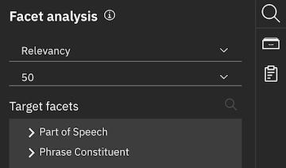

---

copyright:
  years: 2019
lastupdated: "2019-05-29"

subcollection: discovery-data

---

{:shortdesc: .shortdesc}
{:external: target="_blank" .external}
{:tip: .tip}
{:note: .note}
{:pre: .pre}
{:important: .important}
{:deprecated: .deprecated}
{:codeblock: .codeblock}
{:screen: .screen}
{:download: .download}
{:hide-dashboard: .hide-dashboard}
{:apikey: data-credential-placeholder='apikey'}
{:url: data-credential-placeholder='url'}
{:curl: .ph data-hd-programlang='curl'}
{:javascript: .ph data-hd-programlang='javascript'}
{:java: .ph data-hd-programlang='java'}
{:python: .ph data-hd-programlang='python'}
{:ruby: .ph data-hd-programlang='ruby'}
{:swift: .ph data-hd-programlang='swift'}
{:go: .ph data-hd-programlang='go'}

# Mining content
{: #contentminerapp}

The {{site.data.keyword.discovery-data_long}} content mining application is an analytical tool that helps you discover hidden insights by analyzing anomalies, trends, and relationships in your documents.
{: shortdesc}

This page describes using the content mining application. For information about creating a {{site.data.keyword.discovery-data_short}} content mining project, which is how the application is configured and launched, see [Creating projects](/docs/discovery-data?topic=discovery-data-projects).
{: tip}

## Application launch view
{: #cmolaunch}

When you launch the application from a {{site.data.keyword.discovery-data_short}} content mining project, you see something similar to the window in Figure 1. The window shows sample text on the **Facets** tab, which shows the extracted facets that were configured in the {{site.data.keyword.discovery-data_short}} content mining project.

The link for the content mining app is similar to the format, `https://{installation domain}/discovery/{ID}/cm/miner`.
{: note}

{: caption="Figure 1. The Discovery content mining app showing the page you see after launching the app" caption-side="bottom"}

### What do you want to analyze?
{: #oviewsearch}

On this first page, you can enter terms that you want to search for. Or, you can select values from the bar charts of each facet. You can select multiple items.

For more information about configuring facets in a content mining project, see [Facets](/docs/discovery-data?topic=discovery-data-facets).
{: tip}

You can select the type of facet to display from the **Facet type** menu:

- **Metadata Facets**: If configured in the content mining project, these facets come from the fields that are indexed in the document collection.
- **Facets**: By default, these facets are parts of speech whose values are extracted from the text field of your documents. Other facets might also be configured.
- **Custom**: This view allows you to customize facets for analysis.

## Guided analysis view
{: #cmoana}

In the guided analysis view, you can iteratively analyze your collection, digging deeper into the data based on suggested analyses.

In the analysis views, you can select **Guided Mode** or **Expert Mode** from the top right side of the page. In guided mode, when you select a facet value and click **Analyze More**, analysis results are hidden and mining graph actions are suggested. In expert mode, the mining graph and suggested actions are hidden by default. But in expert mode, when you click **Analyze More**, the current view is still displayed and the content is refreshed based on the new analysis context.

From the application launch page, if you enter a term that you want to search for and analyze, you see something similar to the window in Figure 2, which shows the _mining graph_, _toolbar_, _Dashboard_, and _Facet analysis_ pane. Figure 2 shows that the search term is `chocolate`, which is a value from the `General Noun` facet.

{: caption="Figure 2. Watson Discovery content mining app shown in guided mode" caption-side="bottom"}

The guided analysis view contains four main parts, which are described in more detail in the following sections.

- **Mining graph**: Displays a guided visualization of your analysis.
- **Toolbar**: The toolbar at the top of the window, which contains buttons that execute global commands.
- **Dashboard**: Used to select and save different layouts.
- **"Facet analysis" pane**: Used to customize your analysis.

### Mining graph
{: #cmomg}

The mining graph provides a visualization of the progress of your analysis. As the analysis proceeds, the graph becomes longer. You can move the graph around in the window by clicking and dragging. An example of the mining graph after further analysis steps is shown in Figure 3.

{: caption="Figure 3. Guided mode text analysis using the mining graph" caption-side="bottom"}

The nodes represent the steps in the analysis. The left-most node displays the starting point with all documents and the right-most node shows the current point of the analysis. Those two nodes also show the number of documents, which was reduced considerably through analysis. To the right of the final node are suggested actions for further analysis.

#### Suggested actions
{: #cmomgsu}

The following actions can be suggested based on your data, therefore only the applicable actions are shown:

- **Analyze cause or characteristics**: Examines facets and suggests characteristic words and facets.
- **Analyze trends and anomaly**: You can view these when you select the topic or trends analyses for the current context node.
- **Facet analysis**: Show the facet analysis view, if hidden.
- **Show Documents**: Show the documents view for you to see current documents.
- **Show Timeseries**: Show timeseries view.
- **Analyze relation between facets**: Enable facet analysis view and set default analysis-type pairs. Use this to run pair analysis with various metadata facets.

#### Context-sensitive menu
{: #cmomgcs}

There is also a content-sensitive menu for each node. Click a node to open this menu. This menu has the following actions:

- **Set Current Context**: Set this node as the current context node.
- **Show Analysis Dashboard**: Show the last analysis results that were performed for this node.
- **Add Query Text**: Add a query for this node.
  - **New query**: The new query replaces the existing query.
  - **Add to current query**: The new query is added to the existing query.
- **Show Documents**: Show the documents view for this node.
- **Show Timeseries**: Show the timeseries view for this node.
- **Delete**: Delete this node.

### Toolbar for the guided analysis view
{: #cmotb}

{: caption="Figure 4. The toolbar for the guided analysis view" caption-side="bottom"}

The guided analysis view toolbar contains the following commands:

- **Reset**: Revert back to the all documents node.
- **Undo**: Undo the most recent action.
- **Add Query Text**: Add a query for this node. There are two options.
  - **New query**: The new query replaces the existing query.
  - **Add to current query**: The new query is added to the existing query.
- **Show Documents**: Open documents view for the current node.
- **Show Timeseries**: Open timeseries view for the current node.
- **Show Analysis Dashboard**: Open analysis dashboard for the current node.
- **Save Analysis**: You can save the existing analysis. You can save the mining graph structure and query so the analysis can be resumed quickly at a later time. You can also open a previously saved analysis.
- **Settings**: Opens the settings dialog. You can set the time zone, and also revert to the default settings.

### Dashboard
{: #cmodb}

{: caption="Figure 5. The Dashboard view showing the Parts of Speech facet" caption-side="bottom"}

To save your analysis work for quick access later, you can save the analysis dashboard. Note the following features of the Dashboard:

- When you analyze documents, a default layout, `New Layout File` is automatically created. The content of the file is changed when you do another analysis.
- If **Append mode** is enabled in the **Facet analysis** pane, the results are added to the New Layout File.
- To save a layout or edit the metadata of a saved layout, select the layout and click the Save icon. The Dashboard Layout window is shown and you can set the following properties:
  - **Name**: Name of layout file.
  - **Add to Facet Analysis** option. A new analysis type is added to **Facet analysis** pane.
  - You can select **Save** or **Save As**.
- To delete the layout, click the **Delete** icon.
- If you modified the saved layout, an asterisk (\*) is added to the layout name. To revert, click the **Reset** icon.
- Click the **Auto Layout** icon to redo the layout by using the system default layout.

#### Analysis dashboard customization
{: #cmodbc}

When you save the dashboard analysis, the following parts of the dashboard are saved, unless marked otherwise:

- Layout
  - Rearrange the layout by dragging the black border header area of each pane
  - Resize each analysis pane by dragging the resize handle at the bottom right corner of each pane
  - When a layout is not saved, when you add the new analysis results in the current layout or remove existing results, the system automatically resizes the layout of the dashboard
- Each analysis result
  - You can customize the analysis from the toolbar or result visualization
  - You can rename facets to save in your analysis dashboard
  - The Toolbar is expanded when a single analysis result is in the dashboard. If you have multiple result panes, the toolbar is collapsed by default. The toolbar contains the following items:
    - **Search**: You can filter current values by text (not saved)
    - **Number of Results**: You can change the number of results of current analysis from here (saved)
    - **Selection Mode**: By default, you can select multiple values in each analysis result. But if you specify "single" mode, you can select only one value at a time. (saved)
    - **Filter Others**: If you enable this option, when you select some values in this analysis result, its query is applied to the other analysis results in the same layout to filter. For example, if you have a `Manufacturer` facet result and a `Products` facet result in the same layout, and if you enable Filter Others on the `Manufacturer` facet and select a value from it, then only the `Products` facet of the selected `Manufacturer` facet is displayed. This is a powerful enhancement for analysis. (saved)

      When you enable a filter, and select items from the filter enabled pane, then other panes are updated. The data of each pane is updated but its item selections remain. This behavior may be confusing because each pane shows the top `N` items in the pane (default is 50), but because a selected item is not included in the top `N` items, it might not always be shown in the pane.

    - **Boolean Operator**: Select AND or OR operator to create query from multiple values (not saved)
    - **Export**: Export your collection to a database. Specify the file name, format (.csv or .json), encoding, date and time format, and number of results. If you choose to export to .csv, you can import those insights into a Business Intelligence (BI) tool. You cannot export secured collections. For more information, see [Document-level security](/docs/discovery-data?topic=discovery-data-collections#configuredls). (not saved)
    - **Visualization**: You can select visualization type (saved)
    - **Maximize/Minimize**: Maximize, Minimize current analysis result (not saved)
    - **Snapshot**: Saves an image of the dashboard to the Report pane, from which you can create a report (not saved)
    - **Close**: Remove analysis result from current dashboard (not saved)
    - **Show Toolbar** or **Hide Toolbar** (saved)

When you save a dashboard analysis, you can access it quickly from the **Dashboard** tab on the launch page. From there, select the saved dashboard that you want to see and click **Analyze More**, which opens the dashboard for deeper analysis.
{: tip}

### Facet analysis pane
{: #cmofap}

{: caption="Figure 6. The Facet Analysis pane showing the default facets" caption-side="bottom"}

The **Facet analysis** pane is the default view when you enter the analysis view. To begin facet analysis, select the analysis type and options, and then select a facet from the analysis tree. The options in this pane are described in the following list:

- **Analysis type**: Select the type of analysis you want to perform. Options: **Relevancy**, **Topic**, **Trends**, **Pairs**, **Connections**, **Factor** or **Dynamic cluster**.
- **Number of facets**: Specify the number of facets to analyze. The default value and available options vary based on the analysis type.
- **Date facet**: Select the date facet to analyze. This options is enabled only for **Trends** and **Topics** analysis types.
- **Time scale**: Select the time scale to analyze. This options is enabled only for **Trends** and **Topics** analysis types.
- **Time period**: Select the time period to analyze. This options is enabled only for **Trends** and **Topics** analysis types.
- **Target facets**: Select a facet from this tree. For a **Pairs** analysis, select row and column facets. For a **Connections** analysis, select between two and five facets, and then click **Analyze**.
  - **Filter**: Click the magnifying glass icon that's in the **Target facets** heading and enter a label filter for the category tree and the subfacet category tree.
- **Show always**: If selected, the facet analysis pane is always visible.
- **Show subfacet**: If selected, the category tree for subfacets is displayed.
- **Append mode**: If selected, a newly submitted analysis is added to the list of analysis types. The analysis dashboard shows multiple analysis results simultaneously.
- **Analyze**: Click to begin an analysis.

### Repository pane
{: #cmorp}

{: caption="Figure 7. The Repository pane showing the default view" caption-side="bottom"}

The **Repository** pane contains exported documents. You can download exported documents to your local file system from this pane. Click **Facet analysis** to return to the **Facet analysis** pane.

### Documents view
{: docview}

{: caption="Figure 8. The Documents view showing sample documents" caption-side="bottom"}

The **Documents** view is displayed when you show documents in the guided analysis view. The **Documents** view lists the documents in the current node of the mining graph and contains a toolbar at the top of the view.

#### Toolbar for the Documents view
{: dtool}

The toolbar contains the following commands:

- **Export**: You can download and export searched documents in a specified file format. You cannot export secured collections. For more information, see [About document-level security](/docs/discovery-data?topic=discovery-data-collections#configuredls).
- **Customize**: You can customize how documents are displayed. You can choose header fields to always show above documents. You can also specify a field that contains a link to a thumbnail image to display next to the document summary.

  You can specify a URL. When you click the title, this link is opened in a new window instead of showing the preview. Only valid URLs work as links.

- **Snapshot** Saves an image of the dashboard to the Report pane, from which you can create a report. For more information, see [Report pane](/docs/discovery-data?topic=discovery-data-contentminerapp#cmorepv).
- **Show all fields** and **Hide all fields**: You can toggle between these two buttons to show all fields or just the title and date fields.

#### Documents pane
{: ddocs}

In the **Documents** view, the pane lists all documents in summary form. Click a document title to view the entire document along with all fields. The following actions are available:

- **Select All**: Select all currently displayed annotations.
- **Clear**: Clear all currently displayed annotations.
- **Back**: Display the previous document.
- **Next**: Display the next document.
- **Close**: Close the document window.

### Report pane
{: #cmorepv}

{: caption="Figure 9. The Report pane showing a snapshot of a Noun Trends analysis" caption-side="bottom"}

When you find good insights while analyzing, you can save and share that insight by creating a report, which consists of snapshots and notes about the analysis. Snapshots are shown in the **Report** pane.

#### Taking a snapshot
{: #cmosnap}

1. Click the camera icon from the Dashboard toolbar.

    You can also take a snapshot of the document preview. When you select one or more documents, only the selected documents are stored and displayed in the report. When no selection is made, all documents in the current "page" are stored and displayed in the report.
    {: note}

2. Thumbnails of the snapshot are displayed in the Report pane, which is a temporary store for snapshots. This store will be cleared when the browser is refreshed, or another collection is opened.
3. From the Menu icon of the snapshot's thumbnail, you can enter comments, or delete the snapshot. You can also edit comments later.
4. Choose thumbnails that you want to add to a new report, and then click the **Create** button.

#### Creating a report
{: #cmorepcr}

1. From the Report pane, click **Create**. On the **Basic** tab, you can set the following properties:

    - **Report Template**: The template for the layout and style of a report.
    - **Title**: Title of the report. The default value is `Report`.
    - **Date**: Date for the report. The default value is the date when you create the report.
    - **Summary**: Summary text for the report. The default is empty.

1. Optional. On the **Comments** tab, edit the title of the analysis result, and enter a comment. Then, confirm the preview on the **Preview** tab.
1. When you're done editing, click the **Save** button.

#### Report list
{: #cmorepli}

Created reports are listed on the **Report** tab on the application launch page. From the **Actions** menu, you can edit or delete the report, or copy the link to share with others.

### Dashboard toolbar
{: #cmodashtb}

The dashboard toolbar is shown at the top of the dashboard. It's the same for all the dashboard views.

- **Show Documents**: Show the documents view for this node.
- **Analyze More**: This button is enabled once you have selected data in the chart. The analysis is performed on the data you have selected.
- **Boolean Operators**: By default, when you click **Analyze More**, the generated query is added to the current operator with a boolean AND. You can use this button to replace the AND with AND NOT or OR.
- **Maximize** and **Minimize**: Toggle between minimizing and maximizing the dashboard.
- **Close**: Close the dashboard.

### Dashboard views
{: #cmodashv}

A dashboard is displayed when you choose analyses in the guided analysis view. There are a number of different dashboards which are described in the following sections.

- **Characteristic words dashboard**: The characteristic words dashboard is displayed when you choose **Analyze cause or characteristics** in the guided analysis view.
- **Time series dashboard**: The time series dashboard is displayed when you choose **Analyze trends and anomaly** in the guided analysis view. This view shows multiple time series charts for multiple facet values at a glance.
- **Pairs analysis dashboard**: The pairs analysis dashboard is displayed when you choose a **Pairs** analysis in **Facet analysis**.

#### Characteristic words dashboard
{: #cmodacwd}

The characteristic words dashboard is displayed when you choose **Analyze cause or characteristics** in the guided analysis view.

The dashboard displays characteristic words suggested by the analysis along with one or more facets that can be analyzed further. You can resize facets by dragging the resize handler at the bottom right corner of each facet. You can also move facets around by dragging the top border.

##### Facet toolbar
{: #cmoftb}

The facet toolbar is displayed when you click **Show Toolbar**.

- **Search**: You can search for words.
- **Boolean Operators**: If you select two values for analysis, you can specify whether the values are joined by Boolean AND or OR.
- **Export**: Export your collection to a database. Specify the file name, format (.csv or .json), encoding, date and time format, and number of results. If you choose to export to .csv, you can import those insights into a Business Intelligence (BI) tool. You cannot export secured collections. For more information, see [Document-level security](/docs/discovery-data?topic=discovery-data-collections#configuredls).
- **Visualization**: The default visualization is specified on the facet option page of the collection wizard. This list contains the visualization options:
    - **Facet Table**: Shows facet value, relevancy and count. Click each item to analyze more. To clear selection, click that item again. You can sort by name, count, and relevancy by clicking on each column header.
    - **Word Cloud**: Color and size represents level of relevancy. Click each item to analyze more. To clear selection, click white space.
- **Close**: Close this facet.
- **Hide Toolbar**: Hide the toolbar.

When one or more values in the dashboard are selected, the following toolbar items are shown.

- **Analyze More**: The analysis is performed on the data you have selected.
- **Cancel**: The selection of values is cancelled.

#### Time series dashboard
{: #cmotsdb}

The time series dashboard is displayed when you choose **Analyze trends and anomaly** in the guided analysis view. This view shows multiple time series charts for multiple facet values at a glance.

By default, the chart is rendered as a heat map. Each cell color indicates a level of relevancy. In addition, a line chart is overlayed on the chart. You can change from a heat map to a bar graph by clicking next to a facet label. To select items for further analysis click or shift-click individual items. You can also drag the mouse cursor to select contiguous items.

##### Facet toolbar
{: #cmotsftb}

The facet toolbar is displayed when you click **Show Toolbar**.

- **Search**: You can search for words.
- **Export**: Export your collection to a database. Specify the file name, format (.csv or .json), encoding, date and time format, and number of results. If you choose to export to .csv, you can import those insights into a Business Intelligence (BI) tool. You cannot export secured collections. For more information, see [Document-level security](/docs/discovery-data?topic=discovery-data-collections#configuredls).
- **Visualization**: The only option is **Timeseries**.
- **Close**: Close this facet.
- **Hide Toolbar**: Hide the toolbar.

##### Second facet toolbar
{: #cmotssftb}

This toolbar controls the content of the individual time series.

- **Show Timeseries**: Show or hide mini-time series to show the current date range of analysis results. You can move and change the size of the blue area to specify an analysis target.
- **Zoom in**: Zoom into the chart.
- **Zoom out**: Zoom out from the chart.
- **Clear Selection**: Clear all selections in the time series.
- **Time Scale**: Determines the time scale of the time series chart.
- **Sort by**: Determines the sort key for the time series chart.

#### Pairs analysis dashboard
{: #cmopadb}

The pairs analysis dashboard is displayed when you choose a **Pairs** analysis in **Facet analysis**.

By default, a two-dimensional map table is shown. Click each item to analyze further.. Click the toggle arrow button of each cell header to sort a row or column in relevancy order. Click a column or row name to sort by label.

##### Facet toolbar
{: #cmopadbtb}

The facet toolbar is displayed when you click **Show Toolbar**.

- **Export**: Export your collection to a database. Specify the file name, format (.csv or .json), encoding, date and time format, and number of results. If you choose to export to .csv, you can import those insights into a Business Intelligence (BI) tool. You cannot export secured collections. For more information, see [Document-level security](/docs/discovery-data?topic=discovery-data-collections#configuredls).
- **Visualization**: You can change the visualization to a **Pair Table** visualization. You can change back to a two-dimensional map by choosing **2D Map**. A pair table is shown below. Click each item to analyze further. To clear the selection, click that item again.
- **Close**: Close this facet.
- **Hide Toolbar**: Hide the toolbar.

## Creating a collection
{: #cmccoll}

{: caption="Figure 10. The Create a Collection page in the content mining app" caption-side="bottom"}

In the content mining app, you see the collection that was configured for the project, but you can also add collections of documents that can be used to configure other content mining projects.

1. Click the **Collections** breadcrumb link from the top of the page.
1. Click **Create Collection**.
1. Enter names, select files, and review the default information, changing any of the selections, if necessary.
1. Click Save.
    After the saving process is complete, the new collection is available on the Create a Collection page.
