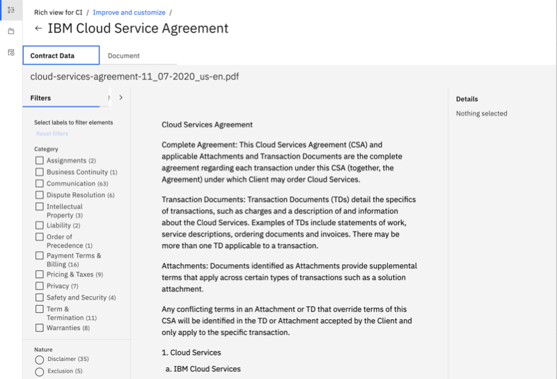

---

copyright:
  years: 2018, 2024
lastupdated: "2023-02-24"

subcollection: discovery-data

---

{{site.data.keyword.attribute-definition-list}}

# Read contracts
{: #contracts-schema}

The *Contracts* enrichment identifies contract-related elements in a document.
{: shortdesc}

To use the Contracts enrichment, create a *Document Retrieval* project type and select the *Apply contracts enrichment* option. When you make this selection, a *Document Retrieval for Contracts* project is created.

Only users of installed deployments ({{site.data.keyword.icp4dfull_notm}}) or Premium or Enterprise plan managed deployments can create a *Document Retrieval for Contract* project type.
{: note}

To see the elements that are identified by the *Contracts* enrichment, complete the following steps:

1.  From the *Improve and Customize* page, submit a search query.

    You can submit any keyword you want or pick one of the suggested keyword search terms.

1.  Click **View passage in document** for one of the search results that are displayed for the document that you want to review.

1.  Do one of the following things:

    [IBM Cloud]{: tag-ibm-cloud}

      1.  Click **Open advanced view** to see the *Contract Data* page.

          {: caption="Contract Data view" caption-side="bottom"}
    
    [IBM Cloud Pak for Data]{: tag-cp4d}

      1.  Click **Contract Data**.

    A list of the elements that the *Contracts* enrichment identified in the document is displayed.

## Contract schema information
{: #contracts-schema-details}

Contract enrichments are applied to the `html` field of documents that are added to the project.

After a document is processed by the Contracts enrichment, the service generates JSON output in the following schema:

```json
{
  "elements": [
    {
      "location": {
        "begin": int,
        "end": int
      },
      "text": string,
      "types": [
        {
          "label": { "nature": string, "party": string },
          "provenance_ids": [string, string, ...]
            ...
          ]
        }
        ...
      ],
      "categories": [
        {
          "label": string,
          "provenance_ids": [string, string, ...]
        }
        ...
      ],
      "attributes": [
        {
          "type": string,
          "text": string,
          "location": { "begin": int, "end": int }
         }
      ]
    }
    ...
  ],
  "effective_dates": [
    {
      "confidence_level": string,
      "text": string,
      "text_normalized": string,
      "provenance_ids": [ string, string, ... ],
      "location": { "begin": int, "end": int }
     },
     ...
  ],
  "contract_amounts": [
    {
      "confidence_level": string,
      "text": string,
      "text_normalized": string,
      "interpretation": {
        "value": string,
        "numeric_value": number,
        "unit": string,
      },
      "provenance_ids": [ string, string, ... ],
      "location": { "begin": int, "end": int }
    },
    ...
  ],
  "termination_dates": [
    {
      "confidence_level": string,
      "text": string,
      "text_normalized": string,
      "provenance_ids": [ string, string, ... ],
      "location": { "begin": int, "end": int }
    },
    ...
  ],
  "contract_types": [
    {
      "confidence_level": string,
      "text": string,
      "provenance_ids": [ string, string, ... ],
      "location": { "begin": int, "end": int }
    },
    ...
  ],
  "contract_terms": [
    {
      "confidence_level": string,
      "text": string,
      "text_normalized": string,
      "interpretation": {
        "value": string,
        "numeric_value": number,
        "unit": string,
      },
      "provenance_ids": [ string, string, ... ],
      "location": { "begin": int, "end": int }
    },
    ...
  ],
  "payment_terms": [
    {
      "confidence_level": string,
      "text": string,
      "text_normalized": string,
      "interpretation": {
        "value": string,
        "numeric_value": number,
        "unit": string,
      },
      "provenance_ids": [ string, string, ... ],
      "location": { "begin": int, "end": int }
    },
    ...
  ],
  "contract_currencies": [
    {
      "confidence_level" : string,
      "text" : string,
      "text_normalized" : string,
      "provenance_ids": [string, string ..],
      "location": { "begin": int, "end": int }
    },
  ...
],
  "tables": [],
  "document_structure": {
    "section_titles": [
      {
        "text": string,
        "location": {
          "begin": int,
          "end": int
        },
        "level": int,
        "element_locations": [
          {
            "begin": int,
            "end": int
          },
          ...
        ]
      },
      ...
    ],
    "leading_sentences": [
      {
        "text": string,
        "location": {
          "begin": int,
          "end": int
        },
        "element_locations": [
          {
            "begin": int,
            "end": int
          },
          ...
        ],
    "paragraphs": [
      {
        "location": {
           "begin": int,
           "end": int
         }
      },
      ...
    ]
      },
      ...
    ]
  },
  "parties": [
    {
      "party": string,
      "role": string,
      "importance": string,
      "addresses": [
        {
          "text": string,
          "location": {
            "begin": int,
            "end": int
          }
        },
        ...
      ],
      "contacts": [
        {
          "name": string,
          "role": string
        },
        ...
      ],
      "mentions": [
        {
          "text": string,
          "location": {
            "begin": int,
            "end": int
          }
        },
        ...
      ]
    },
    ...
  ]
}
```
{: codeblock}

## Schema arrangement
{: #contracts-schema-arrangement}

The `contracts` schema is arranged as follows.

-   `elements`: An array of the document elements detected by the service.

    -   `location`: An object that identifies the location of the element. The object contains two index numbers, `begin` and `end`. The index numbers indicate the beginning and ending positions of the characters that constitute the element in HTML.
    -   `text`: The text of the element.
    -   `types`: An array that describes what the element is and whom it affects.

        -   `label`: An object that defines the type by using a pair of the following elements:

            -   `nature`: The type of action the sentence requires. Current values are `Definition`, `Disclaimer`, `Exclusion`, `Obligation`, and `Right`.
            -   `party`: A string that identifies the party to whom the sentence applies.
        -   `provenance_ids`: An array of one or more hashed values that you can send to IBM to provide feedback or receive support.
    -   `categories`: An array that lists the functional categories into which the element falls; in other words, the subject matter of the element.

        -   `label`: A string that lists the identified category. For a list of categories, see [Categories](#contracts-categories).
        -   `provenance_ids`: An array of one or more hashed values that you can send to IBM to provide feedback or receive support.
    - `attributes`: An array that identifies document attributes. Each object in the array consists of three elements:

        - `type`: The type of attribute. Possible values are `Currency`, `DateTime`, `Duration`, `Location`, `Number`, `Organization`, `Percentage`, and `Person` as described at [Attributes](#contracts-attributes).
        - `text`: The text that is associated with the attribute.
        - `location`: The location of the attribute as defined by its `begin` and `end` indexes.
-   `effective_dates`: An array that identifies the date or dates on which the document becomes effective.

    -   `confidence_level`: The confidence level of the identification of the effective date. Possible values include `High`, `Medium`, and `Low`.
    -   `text`: An effective date, which is listed as a string.
    -   `text_normalized`: The normalized form of the effective date, which is listed as a string. This element is optional; that is, the service output lists it only if normalized text exists.
    -   `location`: The location of the date as defined by its `begin` and `end` indexes.
    -   `provenance_ids`: An array that contains zero or more keys. Each key is a hashed value that you can send to IBM to provide feedback or receive support.
-   `contract_amounts`: An array that monetary amounts that identify the total amount of the contract that needs to be paid from one party to another.

    -   `confidence_level`: The confidence level of the identification of the contract amount. Possible values include `High`, `Medium`, and `Low`.
    -   `text`: A contract amount, which is listed as a string.
    -   `location`: The location of the amount or amounts as defined by its `begin` and `end` indexes.
    -   `provenance_ids`: An array that contains zero or more keys. Each key is a hashed value that you can send to IBM to provide feedback or receive support.
-   `termination_dates`: An array that identifies the date or dates on which the document is to be terminated.

    -   `confidence_level`: The confidence level of the identification of the termination date. Possible values include `High`, `Medium`, and `Low`.
    -   `text`: A termination date, which is listed as a string.
    -   `text_normalized`: The normalized form of the termination date, which is listed as a string. This element is optional; that is, the service output lists it only if normalized text exists.
    -   `location`: The location of the date as defined by its `begin` and `end` indexes.
    -   `provenance_ids`: An array that contains zero or more keys. Each key is a hashed value that you can send to IBM to provide feedback or receive support.
-   `contract_types`: An array that identifies the document's contract type or types.

    -   `confidence_level`: The confidence level of the identification of the contract type. Possible values include `High`, `Medium`, and `Low`.
    -   `text`: A contract type, which is listed as a string.
    -   `provenance_ids`: An array that contains zero or more keys. Each key is a hashed value that you can send to IBM to provide feedback or receive support.
    -   `location`: The location of the contract type as defined by its `begin` and `end` indexes.
-   `contract_terms`: An array that identifies the duration or durations of the contract.

    -   `confidence_level`: The confidence level of the identification of the contract terms. Possible values include `High`, `Medium`, and `Low`.
    -  `text`: A contract term, which is listed as a string.
    -   `provenance_ids`: An array that contains zero or more keys. Each key is a hashed value that you can send to IBM to provide feedback or receive support.
    -   `location`: The location of the contract term as defined by its `begin` and `end` indexes.
-   `payment_terms`: An array that identifies the document's payment duration or durations.

    -   `confidence_level`: The confidence level of the identification of the payment term. Possible values include `High`, `Medium`, and `Low`.
    -   `text`: A payment term, which is listed as a string.
    -   `text_normalized`: The normalized text, if applicable.
    -   `interpretation`: The details of the normalized text, if applicable.

        -   `value`: A string that lists the value that was found in the normalized text.
        -   `numeric_value`: An integer or double that expresses the numeric value of the `value` key.
        -   `unit`: A string that lists the unit of the value that was found in the normalized text.

            The value of `unit` is the [ISO-4217 currency code](https://www.iso.org/iso-4217-currency-codes.html){: external} that is identified for the currency amount (for example, `USD` or `EUR`). If the service cannot disambiguate a currency symbol (for example, `$` or `£`), the ambiguous symbol itself is stored as the `unit` value.
    -   `provenance_ids`: An array that contains zero or more keys. Each key is a hashed value that you can send to IBM to provide feedback or receive support.
    -   `location`: The location of the contract term as defined by its `begin` and `end` indexes.
-   `contract_currencies`: An array that identifies the document's contract currency or currencies.

    -   `confidence_level`: The confidence level of the identification of the contract currency. Possible values include `High`, `Medium`, and `Low`.
    -   `text`: A contract currency, which is listed as a string.
    -   `text_normalized`: The normalized text, if applicable. It is listed as a string in [ISO-4217](https://www.iso.org/iso-4217-currency-codes.html){: external} format
    -   `provenance_ids`: An array that contains zero or more keys. Each key is a hashed value that you can send to IBM to provide feedback or receive support.
    -   `location`: The location of the contract currency as defined by its `begin` and `end` indexes.
-   `document_structure`: An object that describes the structure of the input document.

    -   `section_titles`: An array that contains one object per section or subsection that is detected in the input document. Sections and subsections are not nested. Instead, they are flattened out and can be placed back in order by using the `begin` and `end` values of the element and the `level` value of the section.

        -   `text`: A string that lists the section title, if detected.
        -   `location`: The location of the title in the input document as defined by its `begin` and `end` indexes.
        -   `level`: An integer that indicates the level at which the section is located in the input document. For example, represents a root-level section, represents a subsection within the level section.
        -   `element_locations`: An array that specifies the `begin` and `end` values of the sentences in the section.
    -   `leading_sentences`: An array that contains one object per leading sentence of a list or subsection, in parallel with the `section_titles` and `paragraph` arrays. The object details the leading sentences in the matching section or subsection. As in the `section_titles` array, the objects are not nested. Instead, they are flattened out and can be placed back in order by using the `begin` and `end` values of the element or any level markers in the input document.

        -   `text`: A string that lists the leading sentence, if detected.
        -   `location`: The location of the leading sentence in the input document as defined by its `begin` and `end` indexes.
        -   `element_locations`: An array that specifies the `begin` and `end` values of the leading sentences in the section.
    -   `paragraphs`: An array that contains one object per paragraph, in parallel with the `section_titles` and `leading_sentences` arrays. Each object lists the span (beginning and end location) of the corresponding paragraph.

        -   `location`: The location of the paragraph in the input document as defined by its `begin` and `end` indexes.
-   `parties`: An array that defines the parties that are identified by the service.

    -   `party`: A string that provides the normalized form of the party's name.
    -   `role`: A string that identifies the role of the party.
    -   `importance`: A string that identifies the importance of the party. Possible values include `Primary` for a primary party and `Unknown` for a non-primary party.
    -   `addresses`: An array of objects that identify addresses.

        -   `text`: A string that contains the address.
        -   `location`: The location of the address as defined by its `begin` and `end` indexes.
    -   `contacts`: An array that defines the name and role of contacts that are identified in the input document.

        -   `name`: A string that lists the name of an identified contact.
        -   `role`: A string that lists the role of the identified contact.
    -   `mentions`: An array of objects that identify mentions of the party.

        -   `text`: A string that lists the name of the party.
        -   `location`: The location of the mention as defined by its `begin` and `end` indexes.

### `location` object
{: #contracts-location-note}

The `location` object is included with most of element definitions. The object identifies the location of the text string or number that represents the element. The object contains two index numbers, `begin` and `end`. The index numbers indicate the beginning and ending positions of the characters in the mention.

For example, a `text` string with the value `Amount due` might have a corresponding `location` object that looks as follows:

```json
{
  ...
  "location": {
    "begin": 2510,
    "end": 2519
  }
  ...
}
```
{: codeblock}

The `begin` index indicates that the string begins at character position `2510` in the transformed HTML, which is the location of the letter `A` in `Amount`. The `end` index indicates that the string ends at character position `2519`, which is the location of the letter `e` in `due`.

## Document structure
{: #contracts-doc-struct}

The output of the `Contracts` enrichment includes a `document_structure` object that details the structural composition of the input document. The document structure information is represented in the following JSON sample. The object is located immediately after the root-level `tables` array.

```json
"document_structure": {
  "section_titles": [
    {
      "text": string,
      "location": {
        "begin": int,
        "end": int
      },
      "level": int
      "element_locations": [
        {
          "begin": int,
          "end": int
        },
        ...
      ]
    },
    ...
  ],
  "leading_sentences": [
    {
      "text": string,
      "location": {
        "begin": int,
        "end": int
      },
      "element_locations": [
        {
          "begin": int,
          "end": int
        },
        ...
      ]
    },
    ...
  ],
  "paragraphs": [
    {
      "location": {
        "begin": int,
        "end": int
      }
    },
    ...
  ]
}
```
{: codeblock}

### Document structure elements
{: #contracts-doc-struct-elements}

The elements of the `document_structure` object contain the following information:

-   `document_structure`: An object that describes the structure of the input document.

    -   `section_titles`: An array that contains one object per section or subsection that is detected in the input document. Sections and subsections are not nested. Instead, they are flattened out and can be placed back in order by using the `begin` and `end` values of the element and the `level` value of the section.

        -   `text`: A string that lists the section title, if detected.
        -   `location`: The location of the title in the input document as defined by its `begin` and `end` indexes.
        -   `level`: An integer that indicates the level at which the section is located in the input document. For example, `1` represents a root-level section, `2` represents a subsection within the level `1` section, and so on.
        -   `element_locations`: An array that contains objects that specify the `begin` and `end` values of the sentences in the section.
    -   `leading_sentences`: An array that contains one object per leading sentence of a list or subsection, in parallel with the `section_titles` and `paragraph` arrays. The object details the leading sentences in the matching section or subsection. As in the `section_titles` array, the objects are not nested. Instead, they are flattened out and can be placed back in order by using the `begin` and `end` values of the element or any level markers in the input document.

        -   `text`: A string that lists the leading sentence, if detected.
        -   `location`: The location of the leading sentence in the input document as defined by its `begin` and `end` indexes.
        -   `element_locations`: An array that contains objects that specify the `begin` and `end` values of the leading sentences in the section.
    -   `paragraphs`: An array that contains one object per paragraph, in parallel with the `section_titles` and `leading_sentences` arrays. Each object lists the span (beginning and end location) of the corresponding paragraph.

        -   `location`: The location of the paragraph in the input document as defined by its `begin` and `end` indexes.

## Elements
{: #contracts-elements}

The Contract enrichment generates an analysis of each identified element in the contract. The following sections describe each type of element that is generated.

### Types
{: #contracts-types}

The `types` array includes a number of objects, each of which contains `nature` and `party` keys whose values identify a couplet for the element.

The following tables list the possible values of the `nature` and `party` keys.

| `nature`         | Description |
|------------------|-------------|
|`Definition`      |This element adds clarity for a term, relationship, or similar. No action is required to fulfill the element, nor is any party affected.|
|`Disclaimer`      |The `party` in the element is not obligated to fulfill the terms that are specified by the element but is not prohibited from doing so.|
|`Exclusion`       |The `party` in the element will not fulfill the terms that are specified by the element.|
|`Obligation`      |The `party` in the element is required to fulfill the terms specified by the element.|
|`Right`           |The `party` in the element is guaranteed to receive the terms specified by the element.|
{: caption="Supported keys" caption-side="top"}

Each `nature` key is paired with a `party` key, which contains either the name or the role of the party or parties that apply to the nature (examples include, but are not limited to, `Buyer`, `IBM`, or `All Parties`). For the `Definition` nature, the party is always `None`.

### Parties
{: #contracts-parties}

The `parties` array specifies the participants that are listed in the contract. Each `party` object is associated with other objects that provide details about the party, including:

-   `role`: The party's role. Values are listed in the table that follows this list.
-   `importance`: The importance of the party. Possible values are `Primary` for a primary party and `Unknown` for a non-primary party.
-   `addresses`: An array that identifies addresses.

    -   `text`: An address.
    -   `location`: The location of the address as defined by its `begin` and `end` indexes.
-   `contacts`: An array that defines the names and roles of contacts that are identified in the input document.

    -   `name`: The name of a contact.
    -   `role`: The role of the contact.
-   `mentions`: n array of objects that identify mentions of the party.

    -   `text`: A string that lists the name of the party.
    -   `location`: The location of the mention as defined by its `begin` and `end` indexes.

The values of `role` that can be returned for contracts include, but are not limited to:

| `role`           |Description                                                |
|------------------|-----------------------------------------------------------|
|`Buyer`           |The party responsible for paying for the goods or services that are listed in the contract.|
|`End User`        |The party who interacts with the provided goods or services, explicitly distinguished from the `Buyer`.|
|`None`            |No party was identified for the element.|
|`Supplier`        |The party responsible for providing the goods or services that are listed in the contract.|
{: caption="Supported role values" caption-side="top"}

### Categories
{: #contracts-categories}

The `categories` array defines the subject matter of the sentence. Currently, supported categories include:

| `categories`     |Description                                                |
|------------------|-----------------------------------------------------------|
|`Amendments`      |Elements that specify changes to the contract after it was signed, or alterations to a standard contract. Includes discussions of the conditions for changing the terms of a contract.|
|`Asset Use`       |Elements that refer to how one party may or may not use the assets of another party. This category specifically applies to one party having access to or using assets such as licenses, equipment, tools, or personnel of the other party while conducting their duties under the agreement, including permissions and restrictions thereon.  This category does not extend to specifications of a party's obligations or rights regarding any purchased goods, services, licenses, and so on, as those goods are the party's own assets, rather than assets of another party.|
|`Assignments`     |Elements that describe the transfer of rights, obligations, or both to a third party.|
|`Audits`          |Elements referring to either the right of a party to examine or review compliance, or requirements that a party be available for inspection or compliance review. This category includes references to record keeping (primarily as it relates to the right of inspection) and the maintenance and retention of activity records that may be examined.|
|`Business Continuity`|Elements referring to the consequences if the entire business of one of the parties is sold.|
|`Communication`  |Elements referring to requirements to communicate, respond, notify, or provide notice; contact information; or information regarding changes to the contract. Also includes references to details about communication methods, the act or process of exchanging information, and acceptable means of exchanging information between parties (and others who are not necessarily direct parties to the contract).|
|`Confidentiality` |Elements describing how parties can or cannot use information that is learned in the course of completing the contract and going forward. Also includes discussion of information that must be kept confidential, such as maintaining trade secrets or nondisclosure of business information.|
|`Deliverables`    |Elements specifying the items, such as goods or services, that one party provides to another under the terms of the contract, usually in exchange for payment. Includes discussion of preparation of deliverables.|
|`Delivery`        |Elements that specify the means or modes of transferring deliverables (things, as opposed to personal services) from one party to another. Includes discussions of characteristics of delivery, such as scheduling or location.|
|`Dispute Resolution`|Elements discussing provisions for settling any dispute (for example, regarding labor, invoices, or billing) arising between contracting parties. Provision examples may include settlement by a defined procedure such as an arbitration panel, a process for obtaining an injunction, waiving a right to trial, or prohibiting the pursuit of a class action. Also includes references to the contract's governing law or choice of law, such as a particular country or jurisdiction. |
|`Force Majeure`   |Elements that refer to unexpected or disruptive events outside a party's control that would relieve the party from performing their contractual obligation.|
|`Indemnification` |Elements that specify the remediation of certain liabilities, when one party of the contract becomes responsible for compensating another party as a result of incurred loss or damages during the term of, or arising from the circumstances of the contract. Also includes references to any legal exemptions from loss or damages.|
|`Insurance`       |Elements referring to insurance coverage or terms of coverage that is provided by one party to another party (including to third parties such as subcontractors or others). Includes various types of insurance including, but not limited to, medical insurance.|
|`Intellectual Property`|Elements that discuss the assignment of rights (such as copyrights, patents, and trade secrets) to parties to the contract. Includes references to patents, rights to apply for patents, trademarks, trade names, service marks, domain names, copyrights, and all applications and registration of such schematics, industrial models, inventions, authorship, know-how, trade secrets, computer software programs, and other intangible proprietary information. Also includes discussion of the consequences of violation of intellectual property rights.|
|`Liability`       |Elements that describe the method for determining when and how fault attaches to any party. Examples may include, but are not limited to, statements regarding limitations of liability, third-party claims, and repairs, replacements, or reimbursements as required of the party at fault.|
|`Payment Terms & Billing`|Elements that detail how and when a party is to pay or get paid, and the items or fees the parties will be paying or billed for. Includes references to modes of payment or payment mechanisms.|
|`Pricing & Taxes` |Elements that refer to specific amounts or figures that are associated with individual deliverables that are exchanged (for example, how much something costs) as part of satisfying the terms of the contract. Includes references to specific figures or methods for calculating prices or tax amounts.|
|`Privacy`         |Elements that are particularly concerned with the treatment of sensitive personal information, usually regarding its protection (for example, to satisfy regulations such as GDPR).|
|`Responsibilities`|Elements that discuss tasks ancillary to the contract that are in only one party's control and are focused on discussion of employee oversight.|
|`Safety and Security`|Elements referring to physical safety or cybersecurity protection for people, data, or systems. Examples include discussions of background checks, safety precautions, workplace security, secure access protocols, and product defects that might pose a danger.|
|`Scope of Work`   |Elements that define what is in the contract versus is not in the contract; consequently, what is promised to be done. Examples include statements that define an order, or describe the goals or aims outlined in the contract.|
|`Subcontracts`    |Elements referring to the hiring of third parties to perform certain duties under the contract, and the permissions, rights, restrictions, and consequences thereto and arising therefrom.|
|`Term & Termination`|Elements referring to duration of the contract, the schedule and terms of contract termination, and any consequences of termination, including any obligations that apply at or after termination.|
|`Warranties`      |Elements that refer to ongoing promises and obligations that are made in the contract that are currently true and will continue to be true in the future. Also, elements that discuss the consequences of such promises or obligations that are broken, and the rights to remedy the situation (for example, but not limited to, seeking damages). This category does not apply to elements that are concerned with representation statements (statements of fact about the past or the present), or to elements that lay out assumptions about things that occurred in the past.|
{: caption="Supported categories" caption-side="top"}

### Attributes
{: #contracts-attributes}

The `attributes` array specifies any attributes that are identified in the sentence. Each object in the array includes three keys: `type` (the type of attribute from the following table), `text` (the applicable text), and `location` (the `begin` and `end` indexes of the attribute in the input document). Currently, supported attributes include:

| `attributes`     |Description                                                |
|------------------|-----------------------------------------------------------|
|`Currency`        |Monetary value and units.                                  |
|`DateTime`        |A date, time, date range, or time range.                   |
|`DefinedTerm`     |A term that is defined in the input document.              |
|`Duration`        |A time duration.                                           |
|`Location`        |A geographical location or region.                         |
|`Number`          |A digital or textual number that describes a quantity of countable things and is not classified as one of the other numerical `attribute` types.|
|`Organization`    |An organization.                                           |
|`Percentage`      |A percentage.                                              |
|`Person`          |A person.                                                  |
{: caption="Supported attributes" caption-side="top"}

### Effective dates
{: #contracts-effective-dates}

The `effective_dates` array identifies the date or dates on which the document becomes effective.

| `effective_dates`|Description                                                |
|------------------|-----------------------------------------------------------|
|`confidence_level`|The confidence level of the identification of the effective date. Possible values include `High`, `Medium`, and `Low`.|
|`text`            |An effective date, listed as a string.                     |
|`text_normalized` |The normalized text of the `text` if available, listed as a string. |
|`location`        |The location of the date as defined by its `begin` and `end` indexes.|
|`provenance_ids`  |An array of hashed values that you can send to IBM to provide feedback or receive support. |
{: caption="Effective date values" caption-side="top"}

### Contract amounts
{: #contracts-amounts}

The `contract_amounts` array identifies the monetary amounts specified in the document.

| `contract_amounts`|Description                                               |
|------------------|-----------------------------------------------------------|
|`confidence_level`|The confidence level of the identification of the contract amount. Possible values include `High`, `Medium`, and `Low`.|
|`text`            |A contract amount, listed as a string.                  |
|`normalized_text` |The normalized text, if applicable.                     |
|`interpretation`  |The details of the normalized text, if applicable.      |
|`value`           |A string that lists the value that was found in the normalized text. |
|`numeric_value`   |An integer or float expressing the numeric value of the `value` key.|
|`unit`            |A string that lists the unit of the value that was found in the normalized text.|
|`location`        |The location of the contract amount as defined by its `begin` and `end` indexes.|
|`provenance_ids`  |An array of hashed values that you can send to IBM to provide feedback or receive support. |
{: caption="Amount values" caption-side="top"}

### Termination dates
{: #contracts-termination-dates}

The `termination_dates` array identifies the document's termination dates.

| `termination_dates`|Description                                              |
|------------------|-----------------------------------------------------------|
|`confidence_level`|The confidence level of the identification of the termination date. Possible values include `High`, `Medium`, and `Low`.|
|`text`            |The termination date, listed as a string.                  |
|`text_normalized` |The normalized text of the `text` if available, listed as a string.|
|`location`        |The location of the termination date as defined by its `begin` and `end` indexes.|
|`provenance_ids`  |An array of hashed values that you can send to IBM to provide feedback or receive support. |
{: caption="Termination datae values" caption-side="top"}

### Contract types
{: #contracts-contract-types}

The `contract_types` array identifies the document's contract type or types as declared in the document.

| `contract_types`|Description                                               |
|------------------|---------------------------------------------------------|
|`confidence_level`|The confidence level of the identification of the contract type. Possible values include `High`, `Medium`, and `Low`.|
|`text`            |The contract type, listed as a string.                  |
|`location`        |The location of the contract type as defined by its `begin` and `end` indexes.|
|`provenance_ids`  |An array of hashed values that you can send to IBM to provide feedback or receive support. |
{: caption="Contract type values" caption-side="top"}

### Contract terms
{: #contracts-contract-terms}

The `contract_terms` array identifies the duration or durations of the contract as declared in the document.

| `contract_terms`|Description                                               |
|------------------|-----------------------------------------------------------|
|`confidence_level`|The confidence level of the identification of the contract term. Possible values include `High`, `Medium`, and `Low`.|
|`text`            |The contract term, listed as a string.                  |
|`normalized_text` |The normalized text, if applicable.                     |
|`interpretation`  |The details of the normalized text, if applicable.      |
|`value`           |A string that lists the value that was found in the normalized text. |
|`numeric_value`   |An integer or float expressing the numeric value of the `value` key.|
|`unit`            |A string that lists the unit of the value that was found in the normalized text.|
|`location`        |The location of the contract term as defined by its `begin` and `end` indexes.|
|`provenance_ids`  |An array of hashed values that you can send to IBM to provide feedback or receive support. |
{: caption="Contract term values" caption-side="top"}

### Payment terms
{: #contracts-payment-terms}

The `payment_terms` array identifies the payment duration or durations as declared in the document.

| `payment_terms`|Description                                               |
|-----------------|-----------------------------------------------------------|
|`confidence_level`|The confidence level of the identification of the payment term. Possible values include `High`, `Medium`, and `Low`.|
|`text`            |The payment term, listed as a string.                  |
|`normalized_text` |The normalized text, if applicable.                     |
|`interpretation`  |The details of the normalized text, if applicable.      |
|`value`           |A string that lists the value that was found in the normalized text. |
|`numeric_value`   |An integer or float expressing the numeric value of the `value` key.|
|`unit`            |A string that lists the unit of the value that was found in the normalized text.|
|`location`        |The location of the payment term as defined by its `begin` and `end` indexes.|
|`provenance_ids`  |An array of hashed values that you can send to IBM to provide feedback or receive support. |
{: caption="Payment term values" caption-side="top"}

### Contract currencies
{: #contracts-currencies}

The `contract_currencies` array identifies the contract currency or currencies as declared in the document.

| `contract_currencies`|Description                                              |
|-----------------|-----------------------------------------------------------|
|`confidence_level`|The confidence level of the identification of the contract currency. Possible values include `High`, `Medium`, and `Low`.|
|`text`            |The contract currency, listed as a string.      |
|`text_normalized` |The normalized text of the `text` if applicable, listed as a string in [ISO-4217](https://www.iso.org/iso-4217-currency-codes.html){: external} format.|
|`location`        |The location of the contract currency as defined by its `begin` and `end` indexes.|
|`provenance_ids`  |An array of hashed values that you can send to IBM to provide feedback or receive support. |
{: caption="Contract currency values" caption-side="top"}

### Provenance
{: #contracts-provenance}

Each object in the `types` and `categories` arrays includes a `provenance_ids` array. The `provenance_ids` array has one or more keys. Each key is a hashed value that you can send to IBM to provide feedback or receive support.
