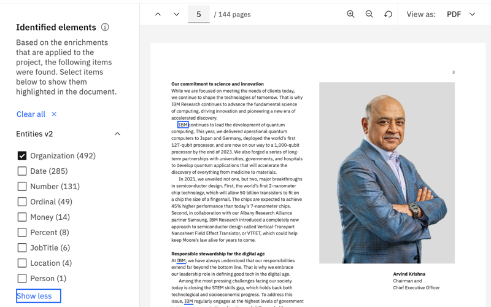

---

copyright:
  years: 2019, 2023
lastupdated: "2022-10-11"

keywords: ui components, launch application, deploy, publish

subcollection: discovery-data

---

{{site.data.keyword.attribute-definition-list}}

# Deploying a project
{: #deploy}

<!-- c/s help for the *Integrate and deploy* page. Do not delete. -->

Deploy your project to start gaining new insights from your data.
{: shortdesc}

The method that you use to deploy your project differs by project type.

- [Document Retrieval projects](#dr-deploy)
- [Document Retrieval for Contracts projects](#dr-contracts-deploy)
- [Conversational Search projects](#cs-deploy)
- [Content Mining projects](#cm-deploy)

## Deploying a Document Retrieval project
{: #dr-deploy}

Work with a developer to build a custom search application or use the pre-built UI components that are provided by IBM.

For more information about building your own, see the [Building custom applications with the API](/docs/discovery-data?topic=discovery-data-api-use).

For Document Retrieval and Custom (the type assigned to projects when you do not apply a specific project type) projects, a set of user interface components are available for your use. The following table describes them.

| UI component | Illustration | Storybook link |
|--------------|--------------|----------------|
| **Search bar**  \n A search box that uses a natural language understanding query to fetch the most relevant results.  |  | [Try it](https://watson-developer-cloud.github.io/discovery-components/storybook/?path=/story/searchinput--default){: external} |
| **Search results**  \n A set of results that rank the most relevant passages and tables to a query. |  | [Try it](https://watson-developer-cloud.github.io/discovery-components/storybook/?path=/story/searchresults--default){: external} |
| **Facets**  \n Refine your results with facets that help users filter the search results by specific categories and domains. |  | [Try it](https://watson-developer-cloud.github.io/discovery-components/storybook/?path=/story/searchfacets--default){: external} |
| **Rich document preview**  \n Displays your results in a document preview. This view highlights result passages within the text of the original document. It also shows any enrichment mentions that are detected in the document. The rich preview is available with source documents where an SDU model is applied, such as PDF, Microsoft PowerPoint, and Microsoft Word files. |  | [Try it](https://watson-developer-cloud.github.io/discovery-components/storybook/?path=/story/documentpreview--default){: external} |
{: caption="Available UI components" caption-side="top"}

To deploy your project, complete the following steps:

1.  To use the API, you need to know the project ID for your project. Go to the **Integrate and Deploy** > **API Information** page.
1.  From the **Integrate and Deploy** > **UI Components** page, find links to resources that a developer can use to get started.

    - [GitHub](https://github.com/watson-developer-cloud/discovery-components#using-discovery-components){: external}
    - [Storybook](https://watson-developer-cloud.github.io/discovery-components/storybook/){: external}

### Getting started with the GitHub sample app
{: #dr-deploy-ui-comps-gs}

From resources available in GitHub, you can run a script to start a sample app with prebuilt UI components. In fact, the sample app looks a lot like the *Improve and customize* page of the product because the product itself uses these UI components.

The script requires some prerequisite software to function. After you start the script, it checks whether you have the necessary software installed on your system. If not, it lets you know what software you need to install. Install the following packages if they are not installed already:

-   [Node.js](https://nodejs.org/en/){: external}
-   [Yarn](https://yarnpkg.com/getting-started/install){: external}

The script needs information about your service instance and project to use the data and search settings that you configured for your project and apply them to the sample app. You must collect the following information so that you can share it with the script when it asks you for the information later:

Service credentials
:   The following information is used by the sample app script to construct an endpoint where it can send API requests and to authenticate with your service instance:

    -   URL
    -   API key

    To get this information, complete the appropriate steps for the type of deployment you are using:

    -   [IBM Cloud]{: tag-ibm-cloud} From the [IBM Cloud Resource list](https://cloud.ibm.com/resources){: external}, expand the *AI/Machine Learning* section, and then find the service instance that you created earlier. Click the instance to open its overview page. From the *Credentials* section, copy the URL and API key values and store them somewhere where you can access them later, such as a local text file.

    -   [IBM Cloud Pak for Data]{: tag-cp4d} From the IBM Cloud Pak for Data web client main menu, expand *Services*, and then click *Instances*. Find your instance, and then click it to open its summary page. Scroll to the *Access information* section of the page, and then copy the *URL* and bearer token. Store the values somewhere where you can access them later, such as a local text file. (The bearer token serves as the apikey for installed deployments.)

Project ID
:   The unique identifier for the project you created in this tutorial. 

    You can copy the project ID from the *API Information* tab of the *Integrate and deploy* page.

To run the script that starts the sample app, complete the following steps:

1.  Do one of the following things:

    -   If you downloaded the repo, extract the files from the archive to a workding directory on your system. Open a command terminal window, and then change to the directory where you downloaded the repository files.

    -   If you cloned the repo, open a terminal window from the directory to which you cloned the repository.

1.  Enter the following command to start the script:

    ```bash
    ./runExampleApp.sh
    ```
    {: codeblock}

    Give the script time to set up the necessary resources to run the application.

    If any required prerequisite software packages are missing, the script lets you know what packages you need to install before you can use the script successfully.

1.  When prompted to specify the `authType`, enter the type of authentication you use. The type differs based on how your service instance is deployed:

    -   [IBM Cloud]{: tag-ibm-cloud} Enter `iam`
    -   [IBM Cloud Pak for Data]{: tag-cp4d} Enter `CP4D`.

        The `iam` value indicates that you are using Identity and Access Management, which is a service that is used by IBM Cloud to authenticate its managed services. For installed instances that are deployed on IBM Cloud Pak for Data, `CP4D` is specified instead.

    For the next three prompts, enter the information that you copied and saved earlier.

    -  url
    -  apikey
    -  project_id

When the script is done, it asks if you want to start the sample app now. Enter `y` for yes. A new web browser window or tab is displayed and the sample app is rendered in the page. The URL for the sample app is `http://localhost:3000/`, which means that the app is running locally and cannot be accessed by anyone who is using a different computer.


The sample app gives you a preview of your search project. Use it to test your search project and make any necessary adjustments.

When you're done testing with the sample app, you can stop it by returning to the terminal window where you ran the initial script, and pressing `Ctrl + C`.

## Deploying a Document Retrieval for Contracts project
{: #dr-contracts-deploy}

The original documents are displayed in a browser, regardless of the source format. In addition, key elements of the documents are recognized and you can navigate to them quickly. For example, if you are searching for the `payment terms` clauses in a contract, the preview detects those clauses and highlights the passages. For more information, see [Understanding contracts](/docs/discovery-data?topic=discovery-data-contracts-schema).

## Deploying a Conversational Search project
{: #cs-deploy}

To deploy your project, connect this project to an assistant that is built with {{site.data.keyword.conversationshort}}. The general steps to follow include:

1.  Create an assistant.

    You can use a {{site.data.keyword.conversationshort}} Trial plan for testing purposes.
1.  Add a search skill to your assistant, and then connect it to this project.
1.  Deploy your assistant.

    For more information about building a {{site.data.keyword.conversationshort}} search skill, see the appropriate documentation for your deployment:

    -   [IBM Cloud]{: tag-ibm-cloud} From the new experience, see [Adding a search integration](/docs/watson-assistant?topic=watson-assistant-search-add){: external}.
    -   [IBM Cloud]{: tag-ibm-cloud} From the classic experience, see [Embedding existing help content](/docs/assistant?topic=assistant-skill-search-add){: external}.
    -   [IBM Cloud Pak for Data]{: tag-cp4d} [Creating a search skill](/docs/assistant-data?topic=assistant-data-skill-search-add){: external}.
    

## Deploying a Content Mining project
{: #cm-deploy}

For content mining use cases, deploying the project is just the beginning. Use the deployed application to analyze your documents and find patterns and anomalies in your data. {{site.data.keyword.discoveryshort}} provides a full-featured application for you to use for this purpose. The Content Mining application is a web application that is hosted on an IBM site.

To deploy your project, complete the following steps:

1.  Go to the **Integrate and Deploy** > **Launch application** page.
1.  Click **Launch**.

For more information about how to use the application, see [Analyzing your data with the Content Mining application](/docs/discovery-data?topic=discovery-data-contentminerapp).
