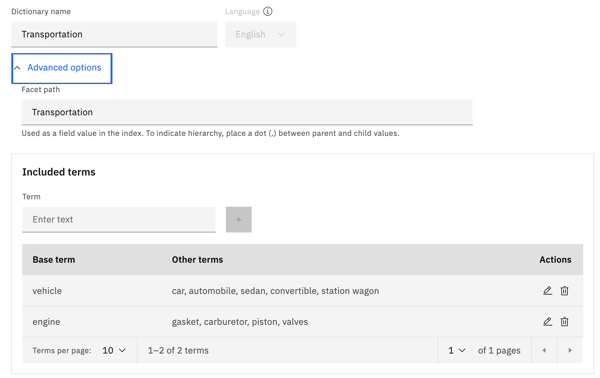
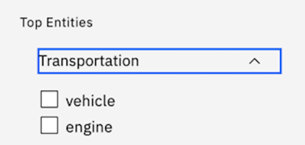

---

copyright:
  years: 2019, 2023
lastupdated: "2023-03-02"

keywords: dictionary,synonyms

subcollection: discovery-data

---

{{site.data.keyword.attribute-definition-list}}

# Define a finite set of terms with a dictionary
{: #domain-dictionary}

Recognize terms and synonyms for terms that are significant to you, such as the names of products that you sell.
{: shortdesc}

Help {{site.data.keyword.discoveryshort}} find terms that have meaning to your use case by adding a dictionary. You can define multiple synonyms for a term or a set of words in the same category.

You can create a dictionary by adding the terms one by one or by uploading a CSV file that lists the terms.

To add dictionary terms one by one, complete the following steps:

1.  From the *Teach domain concepts* section of the *Improvement tools* panel, choose **Dictionaries**.
1.  Click **New**.
1.  Name your dictionary.

    For example, `Transportation`.
1.  Choose the language. A dictionary can contain terms in only one language.
1.  **Optional**: Expand *Advanced options*, and edit the facet name for the dictionary. 

    Facets are used to categorize documents. A user can choose a facet type to narrow their search results. The dictionary name in lowercase is used as the facet name by default. You might want to change the facet to be uppercase.

1.  Enter a term, and then select the **+** button to add it.

    For example `vehicle` and `engine`.

    In English dictionaries, specify the dictionary terms in lowercase. Only use uppercase if you want {{site.data.keyword.discoveryshort}} to ignore lowercase mentions of the term when they occur in text. When terms are analyzed to determine whether they are occurrences of the dictionary enrichment, the surface form of the term with uppercase match is used. For example, a `vehicle` entry in the dictionary results in annotations for `vehicle`, `Vehicle`, or `VEHICLE` mentions when they occur in text. For a `Sat` entry in the dictionary, annotations are added for `Sat` or `SAT`, but not for `sat`.
    
    Dictionary matching is case-sensitive for Arabic, Chinese, Korean, Japanese, and Hebrew.

1.  To add synonyms for the term, click the *Edit* icon, and then enter synonyms in the **Other terms** field. Separate multiple synonyms with a comma. Click **Save term**.

    The dictionary can contain terms and their synonyms or a category and terms that belong to the category.
    
    For the term `vehicle`, you can specify synonyms such as `car`, `automobile`, `sedan`, `convertible`, `station wagon`, and so on. For `engine`, you can specify `gasket`, `carburetor`, `piston`, and `valves`.

    Be careful not to add too many synonyms. Test the impact of any synonyms that you add. When you test, use data that is different from the data you use to derive the synonyms.
    {: tip}

1.  Continue adding terms.

    Similar terms from your collection are suggested as new entries.

    Suggested terms are taken from the field to which the *Part of Speech* enrichment is applied. Suggestions are not displayed if the *Part of Speech* enrichment is not enabled.
    {: note}

1.  Click **Save dictionary**.
1.  Choose the collections and fields where you want to apply the dictionary, and then click **Apply**.

## Example
{: #dictionary-example}

A transportation dictionary is added to a project.

{: caption="Figure 1. Transportation dictionary" caption-side="bottom"}

The resulting facet that is created for the dictionary is displayed in the search page.

{: caption="Figure 2. Transportation facet" caption-side="bottom"}

The document where the enrichment is applied contains the following sentence:

```text
Some car fluids can be acidic, such as battery fluid.
```
{: screen}

The following JSON snippet illustrates how a Transportation dictionary enrichment mention is stored when the term `car`, which is a synonym for the `vehicle` dictionary entry, is found in the document. In this collection, the dictionary enrichment is applied to the `text` field, so the mention is listed in the `entities` array that is in the `enriched_text` array.

```json
{
  "enriched_text": [
    {
      "entities": [
        {
          "model_name": "Dictionary:.Transportation",
          "mentions": [
            {
              "confidence": 1,
              "location": {
                "end": 91122,
                "begin": 91119
              },
              "text": "car"
            }
          ],
          "text": "vehicle",
          "type": "Transportation"
        }
      ]
    }
  ]
}
```
{: codeblock}

## Uploading dictionary terms
{: #dictionary-csv}

To add dictionary from a CSV file, complete the following steps:

1.  Create a CSV file that contains the dictionary terms that you want to add.

    Use UTF-8 encoding. Specify one entry per line.

    - To define a set of synonymous terms, use the following syntax:

      ```text
      <term>,<synonym>,<synonym>,<synonym>,...
      ```

      For example:

      ```text
      vehicle,car,automobile,sedan,convertible,station wagon
      ```

      The entry in this example creates a `vehicle` dictionary entry. When the dictionary enrichment is applied to a document, any mentions of `vehicle`, `car`, `automobile`, `sedan`, `convertible`, or `station wagon` are tagged as instances of the `vehicle` dictionary entry.

    - To define a set of terms in the same category, use the following syntax:

      ```text
      <category>,<related-term>,<related-term>,...
      ```

      For example:

      ```text
      engine,gasket,carburetor,piston,valves
      ```

      The entry in this example creates an `engine` dictionary entry. When the dictionary enrichment is applied to a document, any mentions of `engine`,`gasket`,`carburetor`,`piston`, or `valves` are tagged as instances of the `engine` dictionary entry.

1.  From the *Teach domain concepts* section of the *Improvement tools* panel, choose **Dictionaries**.
1.  Click **Upload**.
1.  Name your dictionary and choose the language that was used in the CSV file.
1.  **Optional**: Expand *Advanced options*, and specify edit the facet name for the dictionary. Facets are used to categorize documents. A user can choose a facet type to narrow their search. The dictionary name in lowercase is used as the facet name by default. You might want to change the facet to be uppercase.
1.  Click **Upload** to browse for the CSV file that you created earlier.
1.  Click **Create**.
1.  Choose the collections and fields where you want to apply the dictionary, and then click **Apply**.

If you add a dictionary by using the Enrichment API, after you apply the API-generated dictionary enrichment to a field, the dictionary is displayed in the Dictionaries page. However, you cannot edit the API-generated dictionary from the dictionary tool in the product user interface.
{: note}

To delete a dictionary, you must use the [Delete an enrichment](https://cloud.ibm.com/apidocs/discovery-data#deleteenrichment){: external} method of the {{site.data.keyword.discoveryshort}} v2 API.

There is a limitation in how words with Hankaku (half-width) characters in Japanese are handled by the dictionary enrichment. When you create a dictionary enrichment in the Japanese language, you can use the Katakana or alphanumeric characters in the dictionary entry. However, when a Katakana word is used in the dictionary entry, the synonyms are handled with Zenkaku characters, except for the same Katakana word, which is represented by Hankaku characters. The Hankaku word is treated as a separate term from the Zentaku words. It is displayed as a separate facet, for example. Similarly, when an alphanumeric word is used in the dictionary entry, the synonyms are handled with Hankaku characters, except for the same alphanumeric word, which is represented by Zenkaku characters. The Zenkaku word is treated as a separate term from the Hankaku words.
{: note}

Dictionary enrichments that you add to one project can be applied to collections in other projects in the same service instance. In fact, you can apply them to collections in a Content Mining project from the deployed Content Mining application.

## Dictionary limits
{: #dictionary-limits}

The number of dictionaries and term entries you can create per service instance depends on your {{site.data.keyword.discoveryshort}} plan type.

| Plan      | Number of dictionaries per service instance | Number of term entries per dictionary | Number of terms for which suggestions can be generated |
|-----------|-------------------|------------------------|--------------------------|
| Cloud Pak for Data | Unlimited | Unlimited | 1,000 |
| Premium | 100 | 10,000 | 1,000 |
| Enterprise | 100 | 10,000 | 1,000 |
| Plus (includes Trial) | 20 | 1,000 | 50 |
{: caption="Dictionary plan limits" caption-side="top"}
