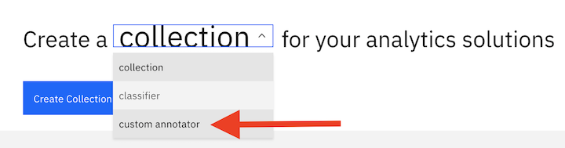

---

copyright:
  years: 2020
lastupdated: "2020-01-21"

subcollection: discovery-data

---

{:shortdesc: .shortdesc}
{:external: target="_blank" .external}
{:tip: .tip}
{:note: .note}
{:pre: .pre}
{:important: .important}
{:deprecated: .deprecated}
{:codeblock: .codeblock}
{:screen: .screen}
{:download: .download}
{:hide-dashboard: .hide-dashboard}
{:apikey: data-credential-placeholder='apikey'}
{:url: data-credential-placeholder='url'}
{:curl: .ph data-hd-programlang='curl'}
{:javascript: .ph data-hd-programlang='javascript'}
{:java: .ph data-hd-programlang='java'}
{:python: .ph data-hd-programlang='python'}
{:ruby: .ph data-hd-programlang='ruby'}
{:swift: .ph data-hd-programlang='swift'}
{:go: .ph data-hd-programlang='go'}

# Migrating enrichments from Watson Explorer
{: #enrichmig}

If you have resources from IBM Watson Explorer, some of them can be migrated to {{site.data.keyword.discovery-data_long}}.
{: shortdesc}

## Types of resources that can be migrated
{: #enrichty}

The following types of resources can be migrated from Watson Explorer to {{site.data.keyword.discovery-data_short}}:

- From Watson Explorer Analytical Components: [User dictionaries](https://www.ibm.com/support/knowledgecenter/en/SS8NLW_12.0.0/com.ibm.discovery.es.ad.doc/iiysatauserdict.html){: external}
- From Watson Explorer oneWEX: [Dictionaries](https://www.ibm.com/support/knowledgecenter/en/SS8NLW_12.0.0/com.ibm.watson.wex.ee.doc/c_ce_adm_dict_ann.html){: external} and [character patterns](https://www.ibm.com/support/knowledgecenter/en/SS8NLW_12.0.0/com.ibm.watson.wex.ee.doc/c_ce_adm_char_ann.html){: external}

## Importing dictionaries from Watson Explorer Analytical Components
{: #enrichdictca}

If you have [user dictionaries](https://www.ibm.com/support/knowledgecenter/en/SS8NLW_12.0.0/com.ibm.discovery.es.ad.doc/iiysatauserdict.html){: external} from IBM Watson Explorer Analytical Components, you can import them by using the {{site.data.keyword.discovery-data_short}} [content mining application](/docs/discovery-data?topic=discovery-data-contentminerapp).

The default file location and name for dictionaries that are saved in Watson Explorer Analytical Components is `${master_server_node}/{master_configuration}/{collection_ID}/{dictionary_name}.fdic.xml`.
{: tip}

1. Download your user dictionaries from Watson Explorer Analytical Components.
1. Log in to the content mining application. The link for the content mining app is similar to the format, `https://{installation domain}/discovery/{ID}/cm/miner`.
1. If the app opens within a collection, click the **Collections** link from the top of the page, which takes you to the main page of the content mining app.
1. From the main page of the content mining app, select **custom annotator** from the menu, and then select the **Create Custom Annotator** button.
  {: caption="Figure 1. The content mining app main page showing the items in the creation menu" caption-side="bottom"}
1. Enter a name and description for the enrichment.
1. From the **Annotator Type** menu, select **Dictionary**, and click **Next**.
1. Click the **Import** button and select the `{name}.fdic.xml` dictionary file that you want to import.
1. Click **Save**.
1. Log in to {{site.data.keyword.discovery-data_short}} and open the project that contains the collection you want to enrich with this dictionary.
1. From the **Manage collections** tab, open the collection you want to enrich.
1. From the **Enrichments** tab, select the dictionary that you imported, and specify the field or fields that you want to enrich.
1. Click **Apply changes and reprocess**.

## Uploading dictionaries from Watson Explorer oneWEX
{: #enrichdictow}

If you have [dictionaries](https://www.ibm.com/support/knowledgecenter/en/SS8NLW_12.0.0/com.ibm.watson.wex.ee.doc/c_ce_adm_dict_ann.html){: external} from IBM Watson Explorer oneWEX, you can upload them to {{site.data.keyword.discovery-data_short}}.

1. From Watson Explorer oneWEX, Version 12.0.0 or later modifications or fix packs, download the dictionary CSV file.
   1. Log in to the oneWEX administrator console.
   1. Open the **Resource** tab.
   1. Select dictionary enrichments, open the dictionary tab, and click the download icon. The dictionary is downloaded as a CSV file.
1. Log in to {{site.data.keyword.discovery-data_short}} and open the project that contains the collection you want to enrich with this dictionary.
1. From right side navigation, click **Teach domain concepts** > **Dictionaries**.
1. Click **Upload** and enter the required information.
1. Click **Upload** and select the CSV file of the dictionary that was downloaded from oneWEX.
1. Click **Create**, and then select the collection and fields you want to apply the dictionary enrichment to.
1. Click **Apply**. {{site.data.keyword.discovery-data_short}} applies the changes and reprocesses the collection.

## Importing character patterns from Watson Explorer oneWEX
{: #enrichcpow}

If you have [character patterns](https://www.ibm.com/support/knowledgecenter/en/SS8NLW_12.0.0/com.ibm.watson.wex.ee.doc/c_ce_adm_char_ann.html){: external} from IBM Watson Explorer oneWEX, you can import them by using the {{site.data.keyword.discovery-data_short}} [content mining application](/docs/discovery-data?topic=discovery-data-contentminerapp).

1. Log in to the content mining application and open the project that contains the collection you want to enrich with this character pattern. The link for the content mining app is similar to the format, `https://{installation domain}/discovery/{ID}/cm/miner`.
1. If the app opens within a collection, click the **Collections** link from the top of the page, which takes you to the main page of the content mining app.
1. From the main page of the content mining app, select **custom annotator** from the menu, and then select the **Create Custom Annotator** button.
  {: caption="Figure 2. The content mining app main page showing the items in the creation menu" caption-side="bottom"}
1. Enter a name and description for the enrichment.
1. From the **Annotator Type** menu, select **Character Pattern**, and click **Next**.
1. Click the **Import** button.
1. Select the JSON file that you want to import and click **Save**.
1. Log in to {{site.data.keyword.discovery-data_short}} and open the project that contains the collection you want to enrich with this character pattern.
1. From the **Manage collections** tab, open the collection you want to enrich.
1. From the **Enrichments** tab, select the character pattern that you imported, and specify the field or fields that you want to enrich.
1. Click **Apply changes and reprocess**.
