---

copyright:
  years: 2019, 2023
lastupdated: "2023-03-31"

subcollection: discovery-data

---

{{site.data.keyword.attribute-definition-list}}

# Define custom entities
{: #entity-extractor}

Teach {{site.data.keyword.discoveryshort}} about terms that are significant to your business by creating an entity extractor.
{: shortdesc}

An *entity extractor* is a machine learning model that recognizes and tags terms that you indicate are significant to your business need or use case. When you create an entity extractor, you get to decide the content and scope of information to find and extract. Your extractor can extract any of the following things:

-  Terms that represent objects, such as vegetable names from cooking recipes or the make and model of cars from accident reports
-  Attributes of objects, such as color and quantity
-  Short phrases, such as `107 deaths in France`, `revenue of $343M`

An *entity type* is a type of thing. To create an entity extractor, you define a set of *entity types* that you care about. You then annotate a collection of your own documents by finding terms or phrases that represent the type of information you want to extract and labeling them as entity examples. 

After you define entity types and label entity examples, you can generate a machine learning model. The model learns about the information you care about based on how the terms or phrases that you label as examples are referenced in sentences. The model learns from the context and language with which the entity examples are referenced in the training data.

After the machine learning model is trained well enough to recognize your entity types, you can publish the model as an enrichment and apply the enrichment to new documents. The custom entity extractor enrichment recognizes and tags new mentions of the same and similar terms as occurrences of the entity types that you care about.

For more information about how to use the entity extractor to add domain customization to your AI applications, see the [Entity Extractor Feature in Watson Discovery v2](https://community.ibm.com/community/user/watsonai/blogs/ananya-poddar/2022/06/09/entity-extraction-in-watson-discovery-v2){: external} blog post.

{{site.data.keyword.discoveryshort}} also has a built-in *Entities* enrichment that can be applied directly to your collection. It doesn't require any training to recognize commonly-known proper nouns. For more information about the Watson NLP Entities enrichment, see [Entities](/docs/discovery-data?topic=discovery-data-nlu).

You already built an entity type system in {{site.data.keyword.knowledgestudioshort}}? You can use the corpus that is associated with your machine learning model as a starting point for your entity extractor training data. For more information, see [Importing a corpus](#entity-extractor-import-wks).

For information about the languages with which the entity extractor can be used, see [Language support](/docs/discovery-data?topic=discovery-data-language-support).

## Entity extractor overview video
{: #entity-extractor-video}

This video provides an overview of how to define custom entity types and then use them to extract terms of interest from your data.

{: video output="iframe"  data-script="none" id="youtubeplayer" frameborder="0" webkitallowfullscreen mozallowfullscreen allowfullscreen}

To read a transcript of the video, [open the video on YouTube.com](https://www.youtube.com/watch?v=nqO_2mL0U7A0), click the *More actions* icon, and then choose *Open transcript*.

## Example
{: #entity-extractor-example}

If you are familiar with the built-in Entities enrichment, you know that the enrichment can recognize terms that match generalized categories, such as `Person` and `Location`. With the entity extractor, you control what constitutes terms or phrases that are meaningful.

The following image shows the terms that an enrichment that recognizes `family members` entity type mentions might extract from text. The example illustrates how family member mentions and other entity mentions (that are recognized by the built-in Entities enrichment) both might be predicted.

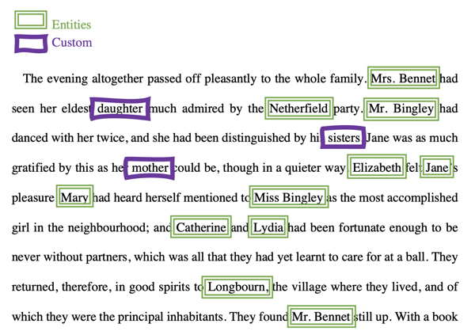{: caption="Figure 1. Labeled entity examples" caption-side="bottom"}

This excerpt comes from Chapter 3 of *Pride and Prejudice* by Jane Austen.

## Before you begin
{: #entity-extractor-prereq}

Find or create a collection with documents that have various examples of the entity types that you want Discovery to learn about. To teach the extractor, you must label examples of entity types. You can only label examples if your collection contains valid examples. Try to find documents that have many and varying terms that function as examples of every entity type that you want to define.

## Adding an entity extractor
{: #entity-extractor-add}

To add an entity extractor, complete the following steps:

1.  Open the project where you want to create the entity extractor.

    The project must have at least one collection with documents that are representative of your domain data.
1.  From the *Improvement tools* panel of the *Improve and customize* page, expand **Teach domain concepts**, and then click **Extract entities**.
1.  Click **New**.

    If you want to create an entity extractor that is based on the entity type system from a {{site.data.keyword.knowledgestudiofull}} corpus, click the arrow, and then choose **Import a {{site.data.keyword.knowledgestudioshort}} corpus**. For next steps, see [Importing a {{site.data.keyword.knowledgestudioshort}} corpus](#entity-extractor-import-wks).

1.  Add an extractor name and optionally a description.

    This name is used as the model name and as the name of the enrichment that is created when you publish the model. The name is displayed as the enrichment name in the Enrichments page where you and others can apply it to collections. It also is displayed as the model name in the JSON representation of documents where custom entities are found. The name is stored with the capitalization and spacing that you specify.
1.  Choose a collection with documents that are representative of your domain data.
1.  Choose fields from the document to show in the document view where you will label documents from the collection.

    -   **Document title** is shown in the page header as the document name. Choose a field that has a unique value per document, such as the file name, which is stored in the `extracted_metadata.filename` field.
    -   **Document body** is where you label entity examples. Choose a field that contains the bulk of the document content, such as the `text` field.

    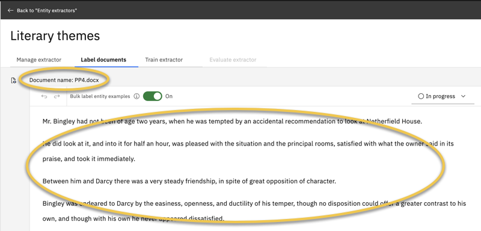{: caption="Figure 2. Label documents page" caption-side="bottom"}
1.  Click **Create**.

A document from the collection that you selected is displayed in the *Label documents* view. You will label occurrences of the entity types that you want Discovery to recognize from this and other documents in the collection.

If there is no text in the body of the page, start over now by creating a new entity extractor. This time, when you select a value for the *Document body* field, be sure to choose a field from your processed documents that contains text.
{: tip}

## Defining entity types
{: #entity-extractor-add-entities}

Define entity types by completing the following steps:

1.  Click **Add an entity type**.

1.  Add the entity type name and an optional description.

    Use a naming convention that works for your data. The built-in Entities enrichment uses initial capitals and no spaces, for example `EmailAddress`. To distinguish your entities from entities that are extracted by other enrichments, you might want to use a different convention.
1.  Optional: Pick the color to use for highlighting text in the document that you want to label as an example of this entity type. 

    You can click a color from the *Label color* palette, click the *Renew color* icon to tab from one color to the next, or use a custom color by specifying its hexadecimal color code (#fff0f7).
1.  Click **Create**.
1.  Repeat this process to add all of the entity types that you want the extractor to recognize.
    
    If you aren't sure what to add for entity types, it might help to review the documents in the collection first. By reviewing the content, you can get a feel for which terms have significant meaning and look for logical ways to group such terms.

## Label significant terms
{: #entity-extractor-label}

From the *Label documents* view, find terms of significance in the documents from your collection and label them to indicate their entity types. 

Before you begin labeling documents, decide whether you want to keep bulk labeling enabled. The bulk label feature is a great way to speed up the process of labeling your documents. When enabled, every term that you label is labeled automatically everywhere it occurs in the document. Otherwise, you must label each occurrence of the term one at a time.

If you decide that you don't want to bulk label examples, set the **Bulk label entity examples** switch to **Off**. For more information, see [Labeling examples in bulk](#entity-extractor-bulk-label).

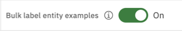{: caption="Figure 3. Bulk labeling switcher" caption-side="bottom"}

### Labeling tips
{: #entity-extractor-label-tips}

Review these tips before you begin:

- The document collection that you label must contain a representative set of documents. The documents must have many and varied examples of the entity types that you want the entity extractor to recognize. If the collection you selected when you started to create the entity extractor does not meet the requirement, stop now and start over with a different document collection.
- Define entity types that are clearly distinct from one another.
- Aim to label at least 40 examples of each entity type.
- Label every valid example of an entity type. Do not skip any occurrences. To speed up the process, use the bulk label feature.

### Labeling entity examples
{: #entity-extractor-label-task}

Label terms in the document that represent examples of the entity types you defined. When you are done with one document, switch the document status from *In progress* to *Complete*, and then move on to the next document.

Only the first 40,000 characters from each document are available for labeling. 40,000 characters is approximately 20 pages.

To label entity examples, complete the following steps:

1.  Review the text of the document. Look for entity examples to label.

    The following table shows some examples.

    | Entity type | Examples to label in the document |
    |-------------|-----------------------------------|
    | color | white, green, purple |
    | car | convertible, SUV, sedan |
    | auto_model | Explorer, Civic, Sorrento |
    | auto_manufacturer | Ford, Honda, Kia |
    | clothing | shirt, blouse, skort |
    | instruments | bonds, stocks, ETFs, munis |
    {: caption="Entity types and examples" caption-side="top"}

    If an entity type that you want to identify is not created yet, add the entity type. From the *Entity types* panel, click **Create new**. For more information about adding entity types, see [Defining entity types](#entity-extractor-add-entities).
1.  First, click the entity type from the *Entity types* panel.
1.  In the document body, select the word or phrase that represents the entity example.

    The term is selected and a color label is applied to the term. The first two characters of the entity type name are shown in uppercase superscript within the label boundary. Both the 2-character ID and the label color help you to associate the example with the entity type it represents.

    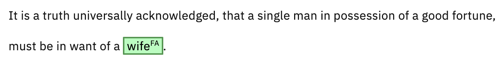{: caption="Figure 4. A label is applied to an entity example" caption-side="bottom"}

    The example text is also added to the *Entity types* panel. If you click the chevron to view details, you can see that the example is listed. The example text is saved in lowercase, regardless of the capitalization that is used in the original text.
    
1.  If bulk labeling is enabled, a notification is displayed to show the number of occurrences of the term that were found and labeled in the current document. 

1.  If you want to label occurrences of the term in all of the documents in the collection, click **Apply to all documents**. 

    When you enable this option, occurrences of the term are labeled in all of the documents in the collection, including documents that you already reviewed and marked complete.

    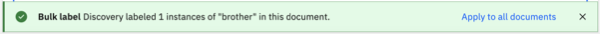{: caption="Figure 5. Bulk labeling configuration" caption-side="bottom"}

    You are asked to confirm the action because it cannot be undone. If you don't want to have to confirm the action every time you choose to apply bulk labeling to all documents, select **Do not ask for confirmation again**. Click **Run**.

    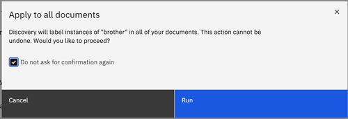{: caption="Figure 6. Bulk labeling configuration confirmation" caption-side="bottom"}

    For more information, see [Labeling examples in bulk](#entity-extractor-bulk-label).
1.  Scroll through the document to label every valid example of every entity type that you want your extractor to recognize.

    The machine learning model learns as much from the terms that you don't label as the terms that you do.
    {: important}
    
    If you miss labeling a valid example, the model learns that when the term is used in that context, it is not a valid mention of the entity type. In some cases, an omission is appropriate. For example, some terms have different meanings in different contexts. You don't want to label the term when it is used in the wrong context. However, if the term is used in the right context and you don't label it, you are teaching the model to ignore it. You decrease the model's effectiveness when your training data is inconsistent.

    After you label many examples, entity example suggestions are displayed. You can accept or reject entity example suggestions.
    
    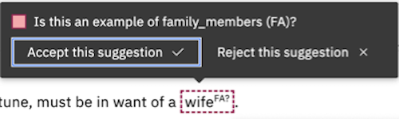{: caption="Figure 7. Decide whether to accept a suggestion" caption-side="bottom"}
    
    Accepting example suggestions is another way to speed up the labeling process. For more information, see [Entity example suggestions](#entity-extractor-suggestions). After you accept a suggestion, you can bulk label the term.

1.  If you make a mistake and label the wrong word or a word was labeled incorrectly by the bulk labeling process, you can delete the label.

    Hover over the labeled word until the **Delete this example** option is displayed, and then click it. You can choose to delete only this mention or all of the mentions in the document. Make a choice, and then click **Delete**.
1.  After you label all of the entity examples in the current document, change the document status from *In progress* to **Complete**.

    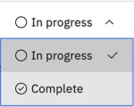{: caption="Figure 8. Document status menu" caption-side="bottom"}

    Another document from the collection is displayed. 
1.  Label examples of your entity types in each document in the collection. 

    At any time during the labeling process, you can click **Save entity extractor** to save your work.
1.  If you don't have enough examples in the current set of documents, you can add more documents.

    From the *Document list* panel, click **Add documents**. The option is available only if there are more documents available in the collection. You can add up to 20 documents. If bulk labeling for all documents is enabled, labels are applied to the newly-added documents automatically.
1.  After you label examples in as many documents in the collection as you want, click **Save entity extractor**, and then open the *Train extractor* page.

### Labeling examples in bulk
{: #entity-extractor-bulk-label}

For most entity examples, enabling the bulk label feature is helpful. You might want to skip it if a term has more than one meaning in different contexts. In that case, evaluate each occurrence individually. Remember, if you enable the bulk label feature, you can check the accuracy of the labels that were added automatically and make corrections when necessary as you review the document.

After you enable the bulk label feature, a notification is displayed that indicates how many occurrences of an entity example were found in the current document. From the current page, the labeling tool cannot access other documents to report how many occurrences exist in other documents from the collection. However, the mention count is shown in the *Entity types* panel. When you first open other documents, you can check the mention counts to see how many mentions were labeled automatically.

Did the bulk label feature miss an occurrence?

Occurrences of the term are not labeled if they occur in the same phrase in which the term is already labeled. For example, the first occurrence of the term `husband` is not labeled when the bulk label feature is switched on for the second occurrence of the term in the following sentence.

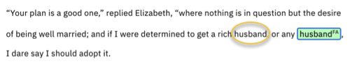{: caption="Figure 9. Treatment of overlapping labels" caption-side="bottom"}

### Entity example suggestions
{: #entity-extractor-suggestions}

After you label enough examples, suggested entity type examples are displayed. The system learns from the types of examples you label, and applies what it learns to identify potential new examples. For example, after you label `red`, `orange`, `yellow`, `green`, and `blue` as examples of the `color` entity type, the *Example suggestions* panel might show `indigo` and `violet` as suggested examples for you to label. Suggestions are not displayed until after you label many examples of an entity type.

The following example shows suggestions that are made for family member mentions.

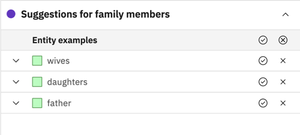{: caption="Figure 10. Entity example suggestions" caption-side="bottom"}

You might notice that a term that you chose to bulk label is not labeled, but is displayed as a suggestion instead. A term is skipped in the following situations:

-   The term might occur in different noun phrases in different sections of the document. For example, the term `father` might occur in the noun phrases `the kindest *father*` and `to her *father*`. When a word is included in a noun phrase with adjectives, the meaning can change. Therefore, such terms sometimes are suggested rather than labeled automatically.
-   A word might be a valid example on its own and as part of a multiple-word mention. For example, a mention of `IBM` might refer to the company *International Business Machines, Corp.* or might be used as part of a product name, such as *IBM Cloud Pak for Data*. However, a word or phrase can be part of only one example. Example labels cannot overlap one another. Therefore, you must choose which example suggestion is the most accurate. In this example, where the term *IBM* is used as part of a product name, it is more accurate to label the full phrase as an example of the `Product` entity type.
-   The service might recognize that a term is a possible example of more than one entity type. For example, the word `top` might mean *the best* or might mean *shirt*.

To investigate a suggestion further, click it to see the word in context within the document. Seeing the term in context helps you to decide whether the occurrence is a valid entity example for you to label.

## Importing a {{site.data.keyword.knowledgestudioshort}} corpus
{: #entity-extractor-import-wks}

For installed deployments, the import capability was added with the 4.6.2 release.
{: note}

You can import a corpus of documents that were annotated in {{site.data.keyword.knowledgestudiofull}} to use as the training data for an entity extractor in {{site.data.keyword.discoveryshort}}.

Entity types that were defined in {{site.data.keyword.knowledgestudioshort}} are shown as new entity types in {{site.data.keyword.discoveryshort}}. You can continue to annotate the imported documents when you customize the entity extractor model.

Entity subtypes and relations from the {{site.data.keyword.knowledgestudioshort}} machine learning model are not represented, neither are any custom dictionaries that are associated with the model.

Before you can import a corpus, you must export the document set from {{site.data.keyword.knowledgestudioshort}} as a .zip file. Follow the appropriate steps for exporting based on your {{site.data.keyword.knowledgestudioshort}} deployment type:

-   [IBM Cloud](/docs/watson-knowledge-studio?topic=watson-knowledge-studio-exportimport#wks_exportimport_expimp_doc)
-   [Cloud Pak for Data](/docs/watson-knowledge-studio-data?topic=watson-knowledge-studio-data-exportimport#wks_exportimport_expimp_doc)

Although you need to download both the document set and type system for annotations to be included in documents that you upload to another {{site.data.keyword.knowledgestudioshort}} workspace, the same is not true in this use case. You import only the document set to {{site.data.keyword.discoveryshort}}. Any annotations in the documents are recreated in {{site.data.keyword.discoveryshort}}. The {{site.data.keyword.knowledgestudioshort}} type system is not needed.

To import a {{site.data.keyword.knowledgestudioshort}} corpus, complete the following steps:

1.  Open the project where you want to import the corpus.
1.  From the *Improvement tools* panel of the *Improve and customize* page, expand **Teach domain concepts**, and then click **Extract entities**.
1.  Click the arrow that is associated with the *New* button. and then click **Import a {{site.data.keyword.knowledgestudioshort}} corpus**.
1.  Add an extractor name and optionally a description.

    This name is used as the model name and as the name of the enrichment that is created when you publish the model. The name is displayed as the enrichment name in the Enrichments page where you and others can apply it to collections. It also is displayed as the model name in the JSON representation of documents where custom entities are found. The name is stored with the capitalization and spacing that you specify.

1.  Click **Upload**, and then browse to find and select the .zip file that you exported from {{site.data.keyword.knowledgestudioshort}}. Click **Create**.

    The annotated documents that you upload are stored with the entity extractor workspace, not as a new collection in the project. You can continue to annotate the documents.

Give {{site.data.keyword.discoveryshort}} some time to import and process the machine learning model corpus. After the entity extractor is created, the extractor is opened to the *Label documents* page.

## Training the extractor
{: #entity-extractor-train}

After you label documents, review the training data that will be used to train the entity extractor model.

To train the extractor, complete the following step:

1.  Decide whether you want to apply an advanced option. Most models do not require changes to these options.

    The following customizations are available from the *Review and finish* page:

    -   Include documents that were not reviewed by a person in the training set.

        Typically, only documents that a person labeled, reviewed, and explicitly marked complete can be candidates for inclusion in the training set. However, if you want to allow documents that were not marked complete to be included in the training set, you can do so.
    -   Change the ratio of documents that are included in the document sets that comprise your training data.

        The documents from your collection are split at random into the following sets:
    
        -   Training set: The documents that you label and that are used to train the entity extractor machine learning model. The goal of the training set is to teach the machine learning model about correct labels.
        -   Test set: The documents that are used to test the trained model. After you run a test, you can review the results, closely analyze areas where the model got something wrong, and find ways to improve the model's performance.
        -   Blind set: Documents that are set aside and used to test the model periodically after several iterations of testing and improvement are completed. The documents in the blind set are intentionally roped off. As you test the model with documents from the test set and analyze the results, you become familiar with the underlying test documents. Because the test documents are used iteratively to improve the model, they can start to influence the model training indirectly. That's why the blind set of documents is so important. The blind set gives you a way to generate an unbiased evaluation of the model periodically.
    
        The default split applies a ratio (70%-23%-7%) that is commonly used for machine learning training.

1.  Click **Train extractor**.

When you train the extractor, {{site.data.keyword.discoveryshort}} uses documents from the training set to build a machine learning model. After the model is generated, it runs a test against the documents from the test set automatically. The results of the test are displayed for you to review.

## Evaluating the extractor
{: #entity-extractor-evaluate-model}

To review metrics from the test run of the entity extractor model that you created, click the **Evalute extractor** tab.

The following table describes the available evaluation metrics.

| Metric | Description |
|--------|-------------|
| Confusion matrix | A table that provides a detailed numeric breakdown of annotated document sets. Use it to compare entity type mentions that are labeled by the machine learning model to entity type mentions that are labeled in the training data. |
| F1 Score | Measures whether the optimal balance between precision and recall is reached. The F1 score can be interpreted as a weighted average of the precision and recall values. An F1 score reaches its best value at 1 and worst value at 0. Overall scores are lower if the model doesn't have enough training data to learn from. |
| Precision | Measures how many of the overall extracted mentions are classified as the correct entity type. A false positive is when an entity label is incorrect, but was predicted to be correct (Predicted = Positive, Actual = Negative). False positives typically mean low precision. |
| Recall | Measures how often entity type mentions that should be extracted are extracted. A false negative is when an entity type label is correct, but was predicted to be incorrect (Predicted = Negative, Actual = Positive). False negatives typically mean low recall. |
{: caption="Metrics details" caption-side="top"}

1.  Review the metrics that are provided about the extractor model test run to determine whether more training is needed.
1.  Explore the test results in more detail by clicking **Review training results in test set**.

    Documents from the test set are displayed with the predicted labels shown in one panel and the ground truth shown in the other. 
    
    -   Predicted labels are the examples that the entity extractor identified and labeled as entity types.
    -   The *ground truth* has examples that a person labeled or that were bulk labeled and reviewed by a person. Labels in the ground truth are considered the correct labels.
    
    The performance of the model is rated based on how closely the predicted labels match the ground truth.

### Improving the extractor
{: #entity-extractor-improve-model}

The following table shows suggested fixes for common problems.

| Problem | Action to remedy the problem |
|---------|------------------------------|
| Low overall scores | You might not have enough documents with labeled examples in your training set. Label more examples in more of your documents. |
| Low recall | Label more documents with new examples of the entity types that the extractor missed. |
| Low precision | Look for entity types that are commonly confused. Find and label more examples of each entity type to help the entity extractor distinguish between the entity types. |
{: caption="Improvement actions" caption-side="top"}

If you added 20 documents and trained the model and want to continue to improve the model, you can add more documents to label. Add the additional documents to the collection that you are using to train the model. After you label the first 20 documents, and the model is up to date with any changes, you can choose to continue labeling documents. The new documents that you added to the collection are loaded. You can label them to augment the training data, and then retrain your model.
{: note}

## Publishing the entity extractor as an enrichment
{: #entity-extractor-publish}

When you think the entity extractor is ready, publish the entity extractor. How do you know when it's ready? If the score doesn't change after several test runs in which you make improvements, the model is ready. You can return to update and retrain the model after you publish it.

1.  From the *Evaluate extractor* page, click **Publish extractor**.
1.  Click **Apply to data**.
1.  Choose a collection, and then select the document field where you want the entity extractor enrichment to be applied.
1.  Click **Apply**.

## Exporting the entity extractor
{: #entity-extractor-export}

For installed deployments, the export capability was added with the 4.6.2 release.
{: note}

An entity extractor model that you create and deploy in one project is available as an enrichment that can be applied to a collection from any project in the same service instance.

If you want to use the entity extractor model in a project from another service instance, you can export the entity extractor. To use it elsewhere, follow the steps to create a machine learning model from [Use imported ML models to find custom terms](/docs/discovery-data?topic=discovery-data-domain-ml). You cannot continue to edit an entity extractor that you import into another project.

The entity extractor that you want to export must be fully trained.

To export an entity extractor, complete the following steps:

1.  Open the project with the entity extractor that you want to export.
1.  From the *Improvement tools* panel of the *Improve and customize* page, expand *Teach domain concepts*, and then click **Extract entities**.
1.  From the *Entity extractors* list, find the entity extractor that you want to export. 
1.  Click the *Actions* icon for your extractor, and then choose **Download model** to save the model to your system.

    The *Download model* option is not available unless the model is trained.
    {: note}

The entity extractor model is saved as a .ent file. You can import it into a project in another service instance as a machine learning model, and then apply it to your collections. For more information about importing the model, see [Use imported ML models to find custom terms](/docs/discovery-data?topic=discovery-data-domain-ml).

## Applying an entity extractor enrichment
{: #entity-extractor-apply}

When you publish the extractor, you specify the field where you want the extractor to be applied. If you decide to apply the enrichment to different or more fields later, you can follow these steps to do so.

1.  From the navigation panel, click **Manage collections**.
1.  Click to open the collection where you want to apply the enrichment.
1.  Click **Enrichments**.
1.  Find the entity extractor name in the list, and then choose a field to apply the enrichment to. 
1.  Click **Apply changes and reprocess**.

For more information about how to remove an entity extractor enrichment from a collection, see [Managing enrichments](/docs/discovery-data?topic=discovery-data-manage-enrichments).

### Entity extractor output
{: #entity-extractor-json}

When the enrichment recognizes one of your custom entities in a document, an entry is added to the `enriched_text.entities` section of the JSON representation of the document. The section contains occurrences of entities that are recognized by your custom model along with those recognized by the built-in Entities enrichment. The built-in enrichment uses the Watson NLP service to identity entites that are part of what it calls the *Natural Language Understanding* type system. For more information about the built-in Entities enrichment, see [Entities](/docs/discovery-data?topic=discovery-data-nlu#nlu-entities).

The following JSON output is produced by a custom model named *literature* that recognizes family member mentions.

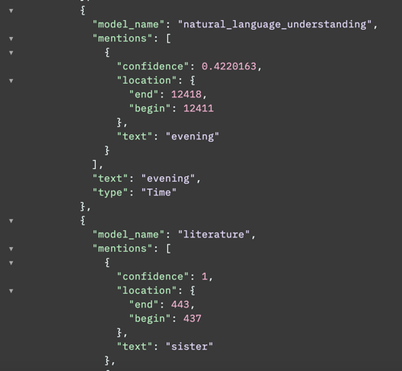{: caption="Figure 11. JSON representation of a custom entity mention" caption-side="bottom"}

### Monitoring performance over time
{: #entity-extractor-history}

You can retrain your entity extractor model at any time. Each time you train the model, review the performance metric scores to determine whether your most recent changes increase or decrease the model's scores.

1.  To compare one test run against another, click **View score history**.

    The history view shows the last 5 training runs.

    To retain the score information for more than the most recent 5 training runs, you can export the metrics in comma-separated value format, and track the scores in a separate application. Click the tabular representation icon , and then click **Download as CSV**.
    {: tip}

If a subsequent training run results in lower scores, don't publish that version of the model.

## Entity extractor limits
{: #entity-extractor-limits}

The number of entity extractors that you can create per service instance depends on your {{site.data.keyword.discoveryshort}} plan type.

| Plan | Entity extractors per service instance | Maximum entity types per extractor | Maximum documents in training data |
|------|--------------------------------|---------------------------|-----------------------------------|
| Cloud Pak for Data | Unlimited | 18 | 1,000 |
| Premium | 10 | 18 | 1,000 |
| Enterprise | 10 | 18 | 1,000 |
| Plus (including Trial) | 3 | 12 | 200 |
{: caption="Entity extractor plan limits" caption-side="top"}
