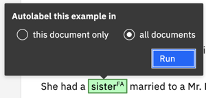
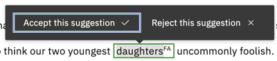

---

copyright:
  years: 2019, 2021
lastupdated: "2021-11-09"

subcollection: discovery-data

---

{{site.data.keyword.attribute-definition-list}}

# Customizing the terms that Discovery can recognize 
{: #entity-extractor}

Teach {{site.data.keyword.discoveryshort}} about terms that are significant to your business by creating an entity extractor.
{: shortdesc}

 **{{site.data.keyword.cloud_notm}} only**

The entity extractor is a beta feature that is available in English-language projects that are managed by Premium plan deployments only.
{: beta}

An *entity extractor* is a machine learning model that recognizes and tags terms that you indicate are significant to your business need or use case. If you are familiar with the built-in Entities enrichment, you know that the enrichment can recognize terms that match generalized categories, such as `Person` and `Location`. With the entity extractor, you control what constitutes terms or phrases that are meaningful.

For example, in your use case, you might need to extract terms that represent objects, such as vegetable names from cooking recipes or the make and model of cars from accident reports. Or maybe you need to extract attributes of objects, such as color and quantity. Your search application might need to extract short phrases (`107 deaths in France`, `revenue of $343M`) or full sentences (`out of warranty clauses; clauses describing payment terms`). When you create an entity extractor, you get to decide the content and scope of information to find and extract from your data.

An *entity* is a type of thing. To create an entity extractor, you define a set of *entities* that you care about. You then annotate a collection of your own documents by finding terms or phrases that represent the type of information you want to extract, and labeling them as entity examples. After you define entities and label entity examples, you can generate a machine learning model. The model learns about the information you care about based on how the terms or phrases that you label as examples are referenced in sentences. The model learns from the context and language with which the entities are referenced in the training data.

After the machine learning model is trained well enough to recognize your entities, you can publish the model as an enrichment and apply the enrichment to new documents. The customized entity enrichment recognizes and tags new mentions of the same and similar terms as occurrences of the entities you care about.

The following image shows the terms that an enrichment that recognizes `family members` entity might extract from text. The example illustrates how family member mentions and the entity mentions (that are recognized by the built-in Entities enrichment) both might be predicted.

This excerpt comes from Chapter 3 of *Pride and Prejudice* by Jane Austen.

## Before you begin
{: #entity-extractor-prereq}

Find or create a collection with documents that have various examples of the entities you want Discovery to learn about. To teach the extractor, you must label examples of entities. You can only label examples if your collection contains valid examples. Try to find documents that have many and varying terms that function as examples of every entity you want to define.

## Adding an entity extractor
{: #entity-extractor-add}

To add an entity extractor, complete the following steps:

1.  Open the project where you want to create the entity extractor.

    The project must have at least one collection with documents that are representative of your domain data.
1.  Click **Improve and customize** from the navigation panel.
1.  From the *Improvement tools* panel, expand **Teach domain concepts**, and then click **Extract entities**.
1.  Click **New**.
1.  Add an extractor name and optionally a description.

    This name is used as the model name and as the name of the enrichment that is created when you publish the model. The name is displayed as the enrichment name in the Enrichments page where you and others can apply it to collections. It also is displayed as the model name in the JSON representation of documents where custom entities are found. The name is stored with the capitalization and spacing that you specify.
1.  Choose a collection with documents that are representative of your domain data.
1.  Choose fields from the document to show in the document view where you label documents in the collection.

    -   **Document title** is shown in the page header to identify the document. Choose a field that has a unique value per document, such as the file name, which is stored in the `extracted_metadata.filename` field.
    -   **Document body** is where you label entity examples. Choose a field that contains the bulk of the document content, such as the `text` field.

    
1.  Click **Next**.

## Creating entities
{: #entity-extractor-add-entities}

Create entities by completing the following steps:

1.  Add the entity name and an optional description.

    Use a naming convention that works for your data. The built-in Entities enrichment uses initial capitals and no spaces, for example `EmailAddress`. To distinguish your entities from entities that are extracted by other enrichments, you might want to use a different convention.
1.  Pick the color to use for highlighting text in the document that you want to label as an example of the entity. 

     -   Click the *Label color* palette icon. 
     -   You can click a color, click the *Renew color* icon to tab from one color to the next, or use a custom color by specifying its hexadecimal color code (#fff0f7).
1.  Click **Add entity**.
1.  Repeat this process to add all of the entities that you want the extractor to recognize.
    
    If you aren't sure what to add for entities, it might help to review the documents in the collection first. By reviewing the content, you can get a feel for which terms have significant meaning and look for logical ways to group such terms. To do so, skip adding entities. You can add them later.

1.  Click **Next**.

### Labeling tips
{: #entity-extractor-label-tips}

Review these tips before you begin:

- Start with a representative set of documents. Use a collection that contains documents with many and varied examples of the entities you want the entity extractor to recognize.
- Define entities that are clearly distinct from one another.
- Aim to label at least 40 examples of each entity.
- Label every valid example of an entity. Do not skip any occurrences of entity examples. To speed up the process, enable the bulk label feature.

## Labeling entity examples
{: #entity-extractor-label}

Label terms in the document that represent examples of the entities you created.

To label entity examples, complete the following steps:

1.  Review the text of the document. Look for entity examples to label.

    For example, for a `color` entity, label color mentions, such as `white` or `green`, as examples of the `color` entity.

    If you didn't create any entities yet, add an entity. From the Entities panel, click **Create new**. For more information about adding entities, see [Creating entities](#entity-extractor-add-entities).
1.  First, click the entity from the Entities panel.
1.  In the document body, select the word or phrase that represents the entity example.

    The term is selected and a color label is applied to the term. The first two characters of the entity name are shown in uppercase superscript within the label boundary. Both the 2-character ID and the label color help you to associate the example with the entity it represents.

    

    The example text is also added to the Entities panel. If you click the chevron to view details, you can see that the example is listed. The example text is saved in lowercase, regardless of the capitalization that is used in the original text.
    
    The message **Bulk label this example?** is displayed. Using the bulk label feature is a great way to speed up the process of labeling your documents. When you turn it on, every occurrence of a term that you label is labeled everywhere it occurs automatically. 
    
1.  To turn on the bulk label feature for this term, click **Bulk label this example?**. Choose whether to label occurrences of the term in this document only or in all of the documents in the collection, and then click **Run**.

    

    For more information, see [Labeling example in bulk](#entity-extractor-bulk-label).
1.  Scroll through the document to label every valid example of every entity that you want your extractor to recognize.

    The model learns as much from the terms that you don't label as the terms that you do.
    {: important}
    
    If you miss labeling a valid example, the model learns that when the term is used in that context, it is not a valid mention of the entity. In some cases, an omission is appropriate. For example, some terms have different meanings in different contexts. And you don't want to label the term when it is used in the wrong context. However, if the term is used in the right context and you don't label it, you are teaching the model to ignore it. You decrease the model's effectiveness when your training data is inconsistent.

    After you label many examples, entity example suggestions are displayed. You can accept or reject entity example suggestions. 
    
    
    
    Accepting example suggestions is another way to speed up the labeling process. For more information, see [Entity example suggestions](#entity-extractor-suggestions). After you accept a suggestion, you can bulk label the term.
1.  If you make a mistake and label the wrong word or a word was labeled incorrectly by the bulk label process, you can delete the label.

    Hover over the labeled word until the **Delete entity** option is displayed, and then click it. You can choose to delete only this mention or all of the mentions in the document. Make a choice, and then click **Delete**.
1.  After you label all of the entity examples in the current document, click **Mark complete**.

    Another document from the collection is displayed. 
1.  Label entity examples in each document in the collection. 

    You can work on the documents consecutively or click the *Previous document* and *Next document* chevrons in the header to move to specific documents.

    At any time during the labeling process, you can click **Save and exit** to take a break.
1.  After you label examples in as many documents in the collection as you want, click **Next**.

### Labeling examples in bulk
{: #entity-extractor-bulk-label}

For most entity examples, enabling the bulk label feature is helpful. You might want to skip it if a term has more than one meaning in different contexts. In that case, you might want to evaluate each occurrence individually. Remember, if you enable the bulk label feature, you can check the accuracy of the labels that were added automatically and make corrections when necessary as you review the document.

When you enable the bulk label feature, you can choose whether to label every occurrence of the example text in the current document or in all of the documents in the collection. 

The tool can remember your answer to this question and use the same option without asking the next time that you label an example. The tool remembers your choice for this labeling session only, meaning if you leave the current page, you are asked to make the choice again.

After you enable the bulk label feature, a notification is displayed that indicates how many occurrences of this entity example were found in the current document. From the current page, the labeling tool cannot access other documents to report how many occurrences exist in other documents from the collection. However, the mention count is shown in the Entities panel. When you first open other documents, you can check the mention counts to see how many mentions were labeled automatically.

Did the bulk label feature miss an occurrence?

Occurrences of the term are not labeled if they occur in the same phrase in which the term is already labeled. For example, the first occurrence of the term `husband` is not labeled when the bulk label feature is switched on for the second occurrence of the term in the following sentence.

### Entity example suggestions
{: #entity-extractor-suggestions}

After you label enough entity examples, suggested entity examples are displayed. The system learns from the types of examples you label, and applies what it learns to identify potential new examples. For example, after you label `red`, `orange`, `yellow`, `green`, and `blue` as examples of the `color` entity, the *Example suggestions* panel might show `indigo` and `violet` as suggested examples for you to label. Suggestions are not displayed until after you label many examples of an entity.

The following example shows suggestions that are made for family member mentions.

When the system is not confident that a mention is a valid example, a conflict icon is displayed with the suggestions. A conflict can occur for various reasons. 

-   A term might be a possible example of more than one entity. For example, the word `top` might mean *the best* or might mean *shirt*.
-   A word might be a valid example on its own and as part of a multiple-word mention. For example, a mention of `IBM` might refer to the company *International Business Machines, Corp.* or might be used as part of a product name, such as *IBM Cloud Pak for Data*. However, a word or phrase can be part of only one example. Example labels cannot overlap one another. Therefore, you must choose which example suggestion is the most accurate. In this example, where the term *IBM* is used as part of a product name, it is more accurate to label the full phrase as an example of the `Product` entity.

The conflict alerts you so that you can review the mention. Click the example recommendation where a conflict is highlighted to open the source document. After you see the mention in context, you can decide whether to accept or reject the suggestion.

You can accept all of the suggestions for all of the entity examples or for a single entity example at a time. If conflicts exist, you can accept all of the suggestions except the suggestions for which conflicts are identified.

## Training the extractor
{: #entity-extractor-train}

After you label documents, review the training data that will be used to train the entity extractor model.

To train the extractor, complete the following step:

1.  Decide whether you want to apply an advanced option. Most models do not require changes to these options.

    The following customizations are available from the *Review and finish* page:

    -   Include documents that were not reviewed by a person in the training set.

        Typically, only documents that a person labeled, reviewed, and explicitly marked complete can be candidates for inclusion in the training set. However, if you want to allow documents that were not marked complete to be included in the training set, you can do so.
    -   Change the ratio of documents that are included in the document sets that comprise your training data.

        The documents from your collection are split at random into the following sets:
    
        -   Training set: The documents that you label and that are used to train the entity extractor machine learning model. The goal of the training set is to teach the machine learning model about correct labels.
        -   Test set: The documents that are used to test the trained model. After you run a test, you can review the results, closely analyze areas where the model got something wrong, and find ways to improve the model's performance.
        -   Blind set: Documents that are set aside and used to test the model periodically after several iterations of testing and improvement are completed. The documents in the blind set are intentionally roped off. As you test the model with documents from the test set and analyze the results, you become familiar with the underlying test documents. Because the test documents are used iteratively to improve the model, they can start to influence the model training indirectly. That's why the blind set of documents is so important. The blind set gives you a way to generate an unbiased evaluation of the model periodically.
    
        The default split applies a ratio (70%-23%-7%) that is commonly used for machine learning training.

1.  Click **Train extractor**.

When you train the extractor, {{site.data.keyword.discoveryshort}} uses documents from the training set to build a machine learning model. After the model is generated, it runs a test against the documents from the test set automatically. The results of the test are displayed for you to review.

## Evaluating the extractor
{: #entity-extractor-evaluate-model}

The following table describes the available evaluation metrics.

| Metric | Description |
|--------|-------------|
| Confusion matrix | A table that provides a detailed numeric breakdown of annotated document sets. Use it to compare entity mentions that are labeled by the machine learning model to entity mentions that are labeled in the training data. |
| F1 Score | Measures whether the optimal balance between precision and recall is reached. The F1 score can be interpreted as a weighted average of the precision and recall values. An F1 score reaches its best value at 1 and worst value at 0. Overall scores are lower if the model doesn't have enough training data to learn from. |
| Precision | Measures how many of the overall extracted mentions are classified as the correct entity. A false positive is when an entity label is incorrect, but was predicted to be correct (Predicted = Positive, Actual = Negative). False positives typically mean low precision. |
| Recall | Measures how often entity mentions that should be extracted are extracted. A false negative is when an entity label is correct, but was predicted to be incorrect (Predicted = Negative, Actual = Positive). False negatives typically mean low recall. |
{: caption="Metrics details" caption-side="top"}

1.  Review the metrics that are provided about the extractor model test run to determine whether more training is needed.
1.  Explore the test results in more detail by clicking **Review training results in test set**.

    Documents from the test set are displayed with the predicted labels shown in one panel and the ground truth shown in the other. 
    
    -   Predicted labels are the entity examples that the entity extractor identified and labeled as entities.
    -   The ground truth has entity examples that a person labeled or that were bulk labeled and reviewed by a person. Labels in the ground truth are considered the correct labels. 
    
    The performance of the model is rated based on how closely the predicted labels match the ground truth.

### Improving the extractor
{: #entity-extractor-improve-model}

The following table shows suggested fixes for common problems.

| Problem | Action to remedy the problem |
|---------|------------------------------|
| Low overall scores | You might not have enough documents with labeled examples in your training set. Label more examples in more of your documents. |
| Low recall | Label more documents with new examples of the entities that the extractor missed. |
| Low precision | Look for entities that are commonly confused. Find and label more examples of each entity to help the entity extractor distinguish between the entities. |
{: caption="Improvement actions" caption-side="top"}

## Publishing the entity extractor as an enrichment
{: #entity-extractor-publish}

When you think the entity extractor is ready, publish the entity extractor. How to know when it's ready? If the score doesn't change after several test runs in which you make improvements, the model is ready. You can return to update and retrain the model after you publish it.

1.  From the *Evaluate extractor* page, click **Publish extractor**.
1.  Click **Apply to data**.
1.  Choose a collection, and then select the document field where you want the entity extractor enrichment to be applied.
1.  Click **Apply**.

## Applying an entity extractor enrichment
{: #entity-extractor-apply}

When you publish the extractor, you specify the field where you want the extractor to be applied. If you decide to apply the enrichment to different or more fields later, you can follow these steps to do so.

1.  From the navigation panel, click **Manage collections**.
1.  Click to open the collection where you want to apply the enrichment.
1.  Click **Enrichments**.
1.  Find the entity extractor name in the list, and then choose a field to apply the enrichment to. 
1.  Click **Apply changes and reprocess**.

### Entity extractor output
{: #entity-extractor-json}

When the enrichment recognizes one of your custom entities in a document, an entry is added to the `enriched_text.entities` section of the JSON representation of the document. The section contains occurrences of entities that are recognized by your custom model along with those recognized by the built-in Entities enrichment that uses the *Natural Language Understanding* machine learning model.

The following JSON output is produced by a custom model named *literature* that recognizes family member mentions.

## Entity extractor limits
{: #entity-extractor-limits}

The number of entity extractor models you can create per service instance depends on your {{site.data.keyword.discoveryshort}} plan type.

| Plan      | Entity extractor models per service instance | Maximum entities per model | Maximum documents in training data |
|-----------|---------------------------------------------:|---------------------------:|-----------------------------------:|
| Premium | 10 | 100 | 1,000 |
{: caption="Entity extractor model plan limits" caption-side="top"}

An entity extractor enrichment can identify up to 50 entities, each with one or many mentions, per collection.
