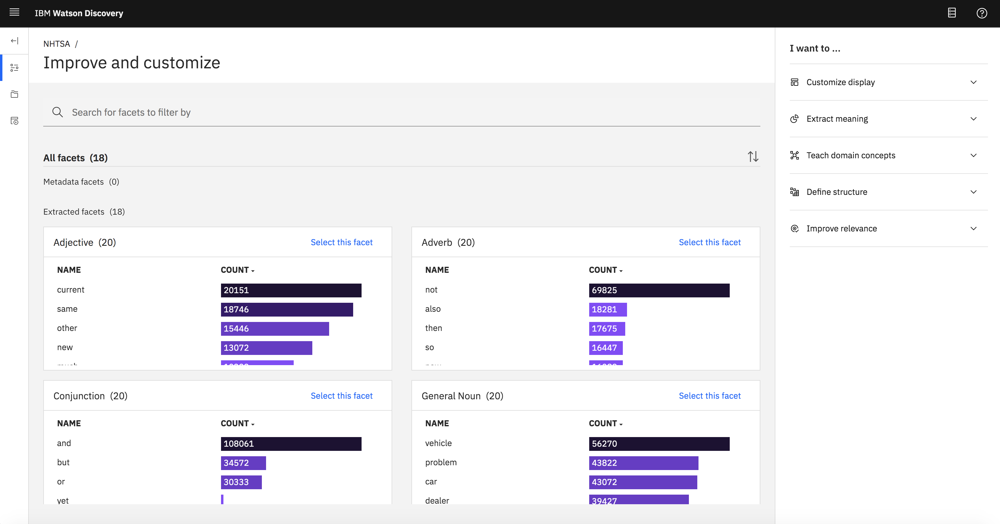
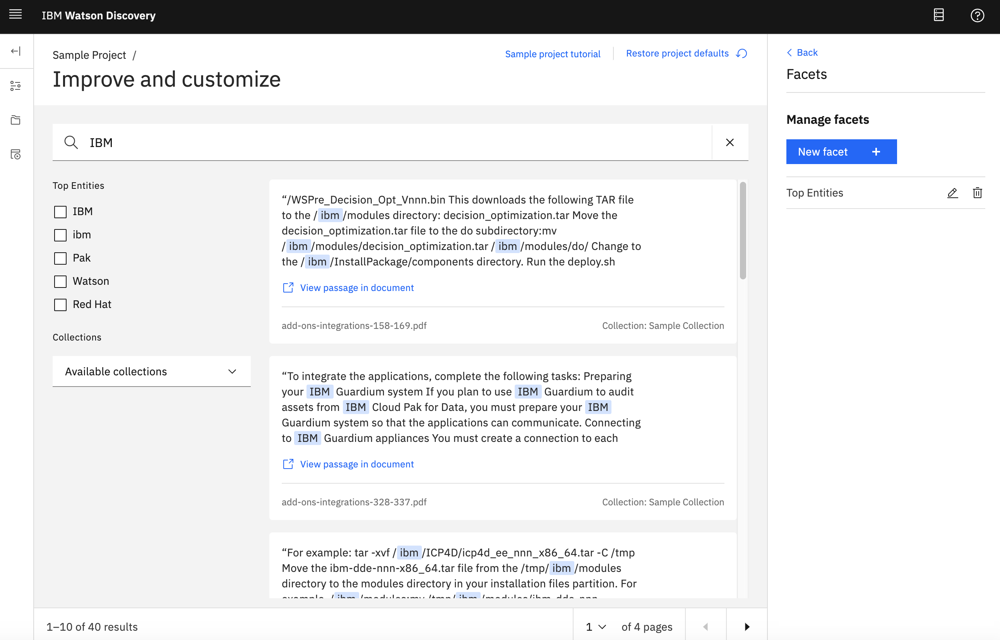

---

copyright:
  years: 2019, 2022
lastupdated: "2021-10-01"

subcollection: discovery-data

---

{{site.data.keyword.attribute-definition-list}}

# Facets
{: #facets}

To help you analyze the results of linguistic processing and text analysis, {{site.data.keyword.discoveryshort}} organizes and classifies documents that share similar patterns or content.
{: shortdesc}

Facets help you to filter documents so that you can perform deep analysis faster. Whether you are trying to find the proverbial needle in the haystack or to discover unexpected trends, starting with facets can speed up the research process.

-   For *Content Mining* projects, facets are extracted from your collection based on parts of speech information (that is captured by the *Parts of Speech* enrichment that is applied to projects of this type by default).

    {: caption="Figure 1. The Improve and Customize page of a Content Mining project showing default extracted facets and no default metadata facets" caption-side="bottom"}

-   For *Document Retrieval* projects, facets are extracted from your collection based on recognized entities (that are captured by the *Entities* enrichment that is applied to projects of this type by default).

    {: caption="Figure 2. The Improve and Customize page of a Document Retrieval project showing the default Top Entities facet" caption-side="bottom"}

For more information about the *Entities* and *Parts of Speech* enrichments, see [Applying prebuilt enrichments](/docs/discovery-data?topic=discovery-data-nlu). For more information about the enrichments that are applied to projects by default, see [Default project settings](/docs/discovery-data?topic=discovery-data-project-defaults).

## Creating facets
{: #facets-create}

You can create facets in the following ways:

-   [From existing fields in a collection](#facetexist)
-   [By adding a dictionary entry](#facetdict)
-    **{{site.data.keyword.cloud_notm}} only**: [By identifying a pattern](#facetpattern)

### Creating a facet from existing fields in a collection
{: #facetexist}

As you apply enrichments to a collection, new fields are added to the index. Information that is recognized by the enrichment is stored in these new fields. You can use the enrichment fields as the source for facets.

For example, if you apply the *Keywords* prebuilt enrichment, you can create a facet based on the keywords that are found in your collection. As it processes your document, the Keywords enrichment recognizes any keyword mentions that occur and stores information about them in a set of fields that begin with the prefix `enriched_{field_name}.keywords`. To create a keyword facet, add a facet that takes its categories from the field where keyword mentions are stored, the `enriched_{field_name}.keywords.mentions.text` field. For more information about the Keywords enrichment, see [Applying prebuilt enrichments](/docs/discovery-data?topic=discovery-data-nlu#nlu-keywords).

Similarly, you can use the fields that are generated by domain-specific enrichments as the source of the facet. In fact, as you create a *Regular expression* enrichment, you can define a facet by which to categorize any recognized expression mentions. For more information, see [Adding domain-specific resources](/docs/discovery-data?topic=discovery-data-domain#regex).

To add a facet from existing fields, complete the following steps:

1.  On the **Improve and customize** page, click **Customize display**, and then click **Facets**.
1.  Click **New facet** > **From existing fields in a collection**.
1.  Choose the field you'd like your facet to use, such as `enriched_text.entities.type`. Add the facet label, filtering options, and the maximum number of facets to show in the query results.
1.  As you test the facet, you can adjust the options.

### Creating a facet by creating a dictionary
{: #facetdict}

Add a facet to group a set of terms that have special meaning to your use case by creating a dictionary.

For example, an owner of a retail clothing store collects customer reviews and wants to be able to find any recurring complaints to identify retail items to discontinue. The owner can create a dictionary to help recognize and tag mentions of specific articles of clothing in the review text. To support the goal of filtering customer feedback by clothing article type, the owner might add entries similar to the entries listed in the following table.

| Dictionary entry | Synonyms | Dictionary name |
|------------------|----------|-----------------|
| shirt | top,button-down,tunic,blouse,t-shirt,long-sleeve,short-sleeve,tank | clothing |
| pants | slacks,jeans,leggings,sweats,capris,culottes,trousers,chinos | clothing |
{: caption="Example dictionary entries" caption-side="top"}

A review that says, `This long-sleeve is so badly proportioned. Who has arms that long!` is returned when you filter the documents by the `clothing` facet.

To create a facet by creating a dictionary, complete the following steps:

1.  On the **Improve and customize** page, click **Customize display**, and then click **Facets**.
1.  Click **New facet** > **By creating a dictionary**.
1.  Enter a name for the facet, and then create a dictionary of the terms that you want to categorize.

    After you save the dictionary, the name that you used for the facet label is shown in the list of facets.

1.  As you test the facet, you can add more terms to the dictionary you created by selecting **Teach domain concepts** > **Dictionaries**.

    The dictionary that you created is shown in the list on the **Dictionaries** page. For more information, see [Adding domain-specific resources](/docs/discovery-data?topic=discovery-data-domain#dictionary).

### Creating a facet by identifying a pattern
{: #facetpattern}

Patterns is a beta feature and supports English language documents only.
{: beta}

 **{{site.data.keyword.cloud_notm}} only**

This facet is available only to managed deployments and in **Document Retrieval** and **Conversational Search** projects.
{: note}

The Patterns feature uses pattern induction to help you teach {{site.data.keyword.discoveryshort}} to recognize patterns in your data. Pattern induction generates extraction patterns from examples that you provide. After you specify a few examples, {{site.data.keyword.discoveryshort}} suggests more rules that you must verify to complete the pattern.

Pattern recognition works best on text with consistent structure in casing, length, text, or numeric values. Examples of patterns you can teach {{site.data.keyword.discoveryshort}} to identify in your documents:

-   All `ISO` standard numbers, for example `ISO 45001`, `ISO 22000`
-   All currency amounts, for example `$50.5 million`, `29 dollars`, `$29.00`
-   All dates, for example `8 September 2019`, `June 12, 2020`

If you need to identify specific terms or text, create a facet as part of a dictionary entry instead. For example, use a dictionary facet for grouping the following types of information:

-   All products in the same family, `Cloud Pak for Data`, `Cloud Pak for Automation`, `Cloud Pak for Security`
-   All terms in the same category, `carburetor`, `piston`, `valves`

For more information, see [Creating a facet by creating a dictionary](#facetdict).

To add a facet by identifying a pattern, complete the following steps:

1.  On the **Improve and customize** page, click **Customize display**, and then click **Facets**.
1.  Click **New facet** > **By identifying a pattern**.
1.  On the **Create facet from a new pattern** page, choose how you want to select documents. You can allow {{site.data.keyword.discoveryshort}} to select 10 random documents for you or you can select up to 20 documents yourself.

    If you select the documents yourself, follow these guidelines:

    -   Choose documents that contain mentions of the pattern in every different format that you want the model to be able to recognize later.
    -   If you want the model to understand ways that a term is used that don't fit the pattern, include a document that uses the term in the wrong way so you can intentionally omit its selection.

        For example, the pattern you want to add might capture mentions of clothing. In documents that mention a `top` to refer to a shirt, you would select `top` as a clothing mention. But, you might also want to include a document that mentions `the top 3 fashion trends` and purposely not select `top` when the term is used in this context. The omission teaches the model that top doesn't fit the pattern when the term is used to mean *the best*.
    -   Include documents that have a maximum of 5,000 characters. Any document that exceeds the limit is truncated to 5,000 characters.

1.  Click **Next**.
1.  Select example words or phrases that fit the pattern that you want to define.

    For example, if you want to define a date pattern, start highlighting date mentions in each document. If you make a mistake, hover over the selection and click the `x` to delete it.

    Be sure to select every mention of the pattern. The model learns from what you omit as much as what you select.

1.  Continue selecting examples. After you identify enough examples, {{site.data.keyword.discoveryshort}} shows a list of suggested examples for you to validate. Choose **Yes** or **No** for each one.

    Click the **Preview document** icon if you want to confirm the example in context.
    {: tip}

1.  Continue highlighting examples and validating suggestions until a message is displayed to indicate that you provided enough examples.
1.  Click the **Review examples** tab to review the lists of examples.
1.  If the examples are correct, click **Save pattern**.

If the system cannot determine a valid pattern, the **Save pattern** button is never enabled. The system cannot determine a valid pattern if you choose contradictory examples to illustrate the pattern. If you cannot save your work, click the **Reset** button to start over. The documents are returned to their original state and any examples that were identified previously are no longer selected.
{: note}

After you save the pattern, the name that you specified for the facet label is shown in the list of facets.

#### When to use a pattern facet instead of a regular expression field
{: #facetpattern-or-regex}

Creating a pattern-based facet is similar to creating a pattern from a field that is derived by applying the *Regular expression* enrichment to a collection.

-   If the information you want to capture follows strict formatting rules, you can use the *Regular expression* enrichment to find it. Apply the enrichment, and then you can use the resulting field as the source for the facet.
-   If the information you want to capture can occur in different formatting styles, the pattern facet is a better choice. For example, dates or currencies can be formatted in various ways. No single regex rule can capture all of the variations. With the pattern facet, you can provide multiple real-world examples that show the different ways in which the information can be specified.
