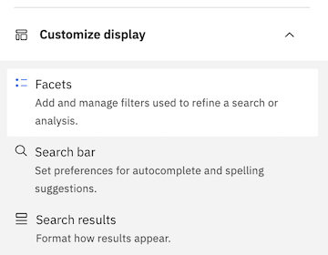

---

copyright:
  years: 2019, 2021
lastupdated: "2021-03-31"

subcollection: discovery-data

---

{:shortdesc: .shortdesc}
{:external: target="_blank" .external}
{:tip: .tip}
{:note: .note}
{:pre: .pre}
{:beta: .beta}
{:important: .important}
{:deprecated: .deprecated}
{:codeblock: .codeblock}
{:screen: .screen}
{:download: .download}
{:hide-dashboard: .hide-dashboard}
{:apikey: data-credential-placeholder='apikey'}
{:url: data-credential-placeholder='url'}
{:curl: .ph data-hd-programlang='curl'}
{:javascript: .ph data-hd-programlang='javascript'}
{:java: .ph data-hd-programlang='java'}
{:python: .ph data-hd-programlang='python'}
{:ruby: .ph data-hd-programlang='ruby'}
{:swift: .ph data-hd-programlang='swift'}
{:go: .ph data-hd-programlang='go'}

# Facets
{: #facets}

To help you analyze the results of linguistic processing and text analysis, {{site.data.keyword.discoveryshort}} organizes and classifies documents that share similar patterns or content.
{: shortdesc}

There are up to three options for creating facets, depending on the **Project type** and version of {{site.data.keyword.discoveryshort}}:

  -  From existing fields in a collection
  -  By creating a dictionary
  -  By identifying a pattern 

## Overview
{: #facetov}

Facets represent the different aspects or dimensions of the documents in your collection. In {{site.data.keyword.discoveryshort}}, you add facets on the **Improve and customize** page in your project. Facets are available in the **Customize display** section, as shown in Figure 1.

{: caption="Figure 1. The Customize Display section showing the Facets option" caption-side="bottom"}

## Facets in Content Mining projects
{: #facetcm}

For Content Mining projects, by default, facets are extracted from your collection for the parts of speech enrichment, as shown in Figure 2. You can add facets for fields from your documents. For default project details, see the Content Mining section of [Default project settings](/docs/discovery-data?topic=discovery-data-project-defaults).

{: caption="Figure 2. The Improve and Customize page of a Content Mining project showing default extracted facets and no default metadata facets" caption-side="bottom"}

## Facets in Document Retrieval projects
{: #facetdr}

For Document Retrieval projects, by default, a facet is created for you titled, `Top Entities`, as shown in Figure 3. That facet comes from the `enriched_text.entities.text` field of the entities enrichment. For default project details, see [Default project settings](/docs/discovery-data?topic=discovery-data-project-defaults).

{: caption="Figure 3. The Improve and Customize page of a Document Retrieval project showing the default Top Entities facet" caption-side="bottom"}

## Creating a facet from existing fields in a collection
{: #facetexist}

To add a facet using existing fields.

1. On the **Improve and customize** page, click **Customize display** and then click **Facets**.
1. Click **New facet** > **From existing fields in a collection**.
1. Choose the field you'd like your facet to use, such as `enriched_text.entities.type`, as well as the facet label, filtering options, and maximum number of facets to display.
1. As you test the facet, you can adjust the options.

## Creating a facet by creating a dictionary
{: #facetdict}

If you want to add a facet that includes terms that do not exist as fields, you can create a dictionary.

1. On the **Improve and customize** page, click **Customize display** and then click **Facets**.
1. Click **New facet** > **By creating a dictionary**.
1. Enter a name for the facet, and then create a dictionary as described in the dictionary enrichments section of [Creating enrichments](/docs/discovery-data?topic=discovery-data-create-enrichments#dictionary-enrichment).

    After you save the dictionary, the name that you used for the facet label is shown in the list of facets.

1. As you test the facet, you can add more terms to the dictionary you created by selecting **Teach domain concepts** > **Dictionaries**. The dictionary you created is shown in the list on the **Dictionaries** page.

## Creating a facet by identifying a pattern
{: #facetpattern}

The Patterns feature is beta functionality and supports English language documents only.
{: beta}

 **{{site.data.keyword.cloud_notm}} only**

This facet is available only to managed deployments and in **Document Retrieval** and **Conversational Search** projects.
{: note}

The Patterns feature uses pattern induction to help you teach {{site.data.keyword.discoveryshort}} to recognize patterns in your data. Pattern induction generates extraction patterns from the examples you specify. After you specify a small number of examples, {{site.data.keyword.discoveryshort}} will suggest additional rules that you verify to complete the pattern. 

Pattern recognition works best on text with consistent structure in casing, length, text, or numeric values. Examples of patterns you can teach {{site.data.keyword.discoveryshort}} to identify in your documents:
  -  All `ISO` standard numbers, for example `ISO 45001`, `ISO 22000`
  -  All currency amounts, for example `$50.5 million`, `$29 million`
  -  All dates, for example `8 September 2019`, `12 June 2020`

If you need to identify specific terms or text, for example:
  -  All products in the same family, `Cloud Pak for Data`, `Cloud Pak for Automation`, `Cloud Pak for Security`
  -  All terms in the same category, `carburetor`, `piston`, `valves`

[Creating a facet by creating a dictionary](/docs/discovery-data?topic=discovery-data-facets#facetdict) would be a better option.

1. On the **Improve and customize** page, click **Customize display** and then click **Facets**.
1. Click **New facet** > **By identifying a pattern**.
1. On the **Create facet from a new pattern** page, select the way you want to choose documents. You can choose the option to have 10 random documents selected for you, or you can select the documents yourself (up to 20 may be chosen). Each document is limited to a maximum size of 5000 characters. Any document that exceeds this limit will be truncated to 5000 characters. Click **Next**.
1. Start selecting example words or phrases that fit the pattern you want to create. For example, if you have a collection of articles that discuss ISO standards, you could start highlighting the numbers of the standards in each document. If you make a mistake, hover over the selection and click the `x` to delete it. 
1. Continue selecting examples. After you have identified enough, {{site.data.keyword.discoveryshort}} will display a list of suggested examples that you can validate by choosing **Yes** or **No** for each one. Click the **Preview document** icon if you want to confirm the example in context. 
1. Continue highlighting examples and validating suggestions until the `You’ve identified enough examples! Review results that were extracted based on your examples.` message displays.
1. Click the **Review examples** tab to review the lists of examples identified by you and {{site.data.keyword.discoveryshort}}.
1. If the examples are correct, click **Save pattern**.

If the system cannot determine a valid pattern the **Save pattern** button will not enable. This can happen if you select contradictory examples. Click the **Reset** button to start over. This will return the documents to their original state and you will lose all examples already identified.
{: note}

After you save the pattern, the name that you specified for the facet label is shown in the list of facets.

