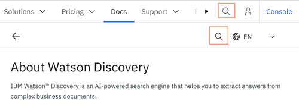

---

copyright:
  years: 2015, 2023
lastupdated: "2023-02-01"

subcollection: discovery-data

content-type: faq

---

{{site.data.keyword.attribute-definition-list}}

# FAQ
{: #faqs}

Find answers to frequently asked questions.
{: shortdesc}

For more information about Discovery-specific concepts, such as *projects* or *enrichments*, see the [glossary](/docs/discovery-data?topic=discovery-data-glossary).

## How do I search the product documentation?
{: #faq-search-doc}
{: faq}

To search the entire {{site.data.keyword.cloud_notm}} Docs site, enter your search term into the search field in the {{site.data.keyword.cloud_notm}} website banner. To search for information about the {{site.data.keyword.discoveryshort}} service only, scroll to the start of the page and enter your search term into the search field in the page header.

## Can I integrate Watson Discovery with Watson Assistant?
{: #faq-integrate}
{: faq}

You can integrate {{site.data.keyword.discoveryshort}} and {{site.data.keyword.conversationshort}} to make information that is stored in external data sources available to a virtual assistant. Create a *Conversational Search* project in {{site.data.keyword.discoveryshort}}, and then add the data sources that you want to make available to it. Next, create a *search integration* in {{site.data.keyword.conversationshort}}, and connect it to your {{site.data.keyword.discoveryshort}} project and collection.

## How does Watson Discovery access my data?
{: #faq-connectors}
{: faq}

{{site.data.keyword.discoveryshort}} has built-in connectors that can crawl various data sources, including websites, {{site.data.keyword.cloud_notm}} Object Storage, Box, Microsoft SharePoint, and Salesforce sites. It even has support for you to build custom connectors. You can schedule crawls so that as the source data changes, the latest version is picked up by your collection automatically. {{site.data.keyword.discoveryshort}} only ever reads from external data sources; it never writes, updates, or deletes any content in the original data source. For more information, see [Creating collections](/docs/discovery-data?topic=discovery-data-collections)

## Can I upload documents?
{: #faq-uploaddocs}
{: faq}

Yes, you can upload documents directly to a collection in your project. An upload is a one-time operation that you can use to get started. An alternative approach is to connect to a data source and crawl the source for information. When you crawl data sources, the data can stay where it is and you can set up a schedule by which to crawl the external source to find new and changed information. When you crawl the data, you know that the information in your collection is always up to date. For more information, see [Creating collections](/docs/discovery-data?topic=discovery-data-collections).

## Must all my documents be English?
{: #faq-languages}
{: faq}

No. {{site.data.keyword.discoveryshort}} support multiple languages. For more information about language support per feature, see [Language support](/docs/discovery-data?topic=discovery-data-language-support).

## What types of files can Discovery ingest?
{: #faq-doctype}
{: faq}

{{site.data.keyword.discoveryshort}} can ingest most standard business file types, including PDF, Microsoft Word documents, spreadsheets, and presentations. For a complete list, see [Supported file types](/docs/discovery-data?topic=discovery-data-collections#supportedfiletypes).

## Can I find related documents after I add them to a collection
{: #faq-keep-doc-relationship}
{: faq}

If you want to retain information about the relationship of two or more documents to one another, you can do so. For example, if 3 documents are uploaded from the same folder and their placement in the folder is significant to their meaning, you might want to retain the parent folder information.

When you upload a document, no such information about its relationships to other documents is stored by default. To add the information, you can use the API to add the documents. When you add documents by using the API, you can specify metadata values. You might want to specify a metadata value, such as `"foldername": "company_a"`, for each document. 

Alternatively, you can copy the document body of each document into a JSON file, where each document is an object in a single array. When the JSON file is ingested, each item in the array is added as a separate document with a seprarate document ID. Each document shares the same parent ID, which identifies the relationship between them.

From an {{site.data.keyword.cloud_notm}}-managed instance, you can quickly find documents that share the same parent ID or other common metadata value from the *Manage data* page. Customize the view to show the field, such as `extracted_metadata.parent_document_id` or `extracted_metadata.foldername`, that the documents share in common.

## Can I customize Discovery to understand my data
{: #faq-customize}
{: faq}

Yes. Use the intuitive tools provided with the product to teach {{site.data.keyword.discoveryshort}} about the unique terminology of your domain. For example, you can teach it to recognize patterns, such as BOM or part numbers that you use, or add dictionaries that recognize your product names and other industry-specific word meanings. For more information, see [Adding domain-specific resources](/docs/discovery-data?topic=discovery-data-domain).

## How does the Smart Document Understanding tool work?
{: #faq-sdu}
{: faq}

You can use the Smart Document Understanding tool to teach {{site.data.keyword.discoveryshort}} about sections in your documents with distinct format and structure that you want {{site.data.keyword.discoveryshort}} to index. You can define a new field, and then annotate documents to train {{site.data.keyword.discoveryshort}} to understand what type of information is typically stored in the field. For more information, see [Using Smart Document Understanding](/docs/discovery-data?topic=discovery-data-configuring-fields).

## What's the best way to add synonyms?
{: #faq-synonyms}
{: faq}

You can use two different methods to define synonyms.

- To define synonyms that are recognized and tagged when a document is ingested and that can be retrieved by search, create a dictionary and add synonyms for the dictionary term entry. A dictionary defines special terms that you want to tag in your documents, such as product names or industry-specific terminology. You can use the dictionary terms later to create facets and to filter documents. For more information, see [Dictionary](/docs/discovery-data?topic=discovery-data-domain-dictionary).
- To define synonyms that are applied to the query text that is submitted by users to expand the meaning of the query, add synonyms by using the Synonyms tool on the *Improve relevance* section of the *Improve and customize* page. For more information, see [Expanding the meaning of queries](/docs/discovery-data?topic=discovery-data-search-settings#query-expansion).

## Can I use {{site.data.keyword.discoveryshort}} to detect sentiment?
{: #faq-sentiment}
{: faq}

You can use {{site.data.keyword.discoveryshort}} to detect both phrase and document sentiment. Document sentiment is a built-in Natural Language Processing enrichment that is available for all project types. Document sentiment evaluates the overall sentiment that is expressed in a document to determine whether it is positive, neutral, or negative. Phrase sentiment does the same. However, phrase sentiment can detect and assess multiple opinions in a single document and, in English and Japanese documents, can find specific phrases. For more information about document sentiment, see [Sentiment](/docs/discovery-data?topic=discovery-data-nlu#nlu-sentiment). For more information about phrase sentiment, see [Detecting phrases that express sentiment](/docs/discovery-data?topic=discovery-data-cm-phrase-sentiment). You cannot detect the sentiment of entities or keywords in v2.

## What is a nested field?
{: #faq-nested-fields}
{: faq}

When you ingest a file or crawl an external data source, the data that you add to {{site.data.keyword.discoveryshort}} is processed and added to the collection as a document. Fields from the original file are converted to document fields and are added to the collection's index. Some content is added to root-level index fields and some information is stored in nested fields. Where data gets stored differs by file type. Most of the fields from structured data sources are stored as root-level fields. For files with unstructured data, much of the body of the file is stored in the `text` field in the index. Other information, such as the file name, is stored in nested fields with names like `extracted_metadata.filename`. You can determine whether a field is a nested field by its name. If the field name includes a period, it is a nested field. For more information about how different file types are handled, see [How your data source is processed](/docs/discovery-data?topic=discovery-data-index-overview).

## Which type of query should I use in my custom app?
{: #faq-query-choose}
{: faq}

When you submit a query, you can choose to submit a natural language query or use the Discovery Query Language to customize the search to target specific fields in the index, for example. For more information about the different types of queries and how to decide which one to use, see [Choosing the right query type](/docs/discovery-data?topic=discovery-data-query-concepts#query-choose).

## What's causing the errors that mention watsonplatform.net
{: #faq-watsonplatform}
{: faq}

Old API endpoint URLs that include `watsonplatform.net` are deprecated and were retired on 26 May 2021. If you see errors that mention `watsonplatform.net`, make sure your {{site.data.keyword.discoveryshort}} service instance is using updated credentials. And, if you have any old credentials with the old endpoint URL listed in your service page, delete them. For more information about the deprecation, see [Updating endpoint URLs from watsonplatform.net](/docs/watson?topic=watson-endpoint-change).

## Why am I getting a 401 error when I try to use my Lite plan
{: #faq-lite-plan-deletion}
{: faq}

If you are seeing `401 invalid credentials` messages for a Lite plan that hasn't been used in a while, don't spend time creating new credentials. The error message is misleading. Any Lite plans with no activity for 120 days are deleted automatically. Unfortunately, the service instance deletion is not being reflected in {{site.data.keyword.cloud_notm}} Resources list.
