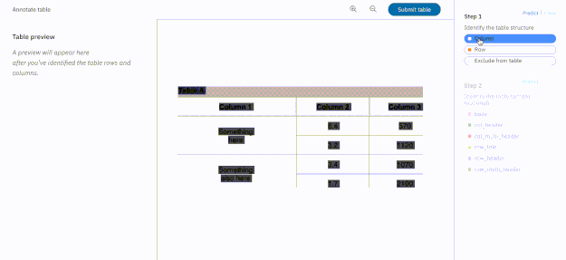

---

copyright:
  years: 2019
lastupdated: "2019-08-19"

subcollection: discovery-data

---

{:shortdesc: .shortdesc}
{:new_window: target="_blank"}
{:tip: .tip}
{:note: .note}
{:pre: .pre}
{:important: .important}
{:deprecated: .deprecated}
{:codeblock: .codeblock}
{:screen: .screen}
{:download: .download}
{:hide-dashboard: .hide-dashboard}
{:apikey: data-credential-placeholder='apikey'} 
{:url: data-credential-placeholder='url'}
{:curl: #curl .ph data-hd-programlang='curl'}
{:javascript: .ph data-hd-programlang='javascript'}
{:java: .ph data-hd-programlang='java'}
{:python: .ph data-hd-programlang='python'}
{:ruby: .ph data-hd-programlang='ruby'}
{:swift: .ph data-hd-programlang='swift'}
{:go: .ph data-hd-programlang='go'}

# Configuring your collection with Smart Document Understanding
{: #configuring-fields}

Smart Document Understanding (SDU) allows you to quickly train {{site.data.keyword.discovery-data_long}} to extract custom fields in your documents, which will improve the answers returned by your application. Custom fields can also be enriched.

With SDU, you annotate fields within your documents to train custom conversion models. As you annotate, Watson is learning and will start predicting annotations. Once an SDU model is created, it can be [exported](/docs/services/discovery-data?topic=discovery-data-import#import) and used on other collections.

PDF, Microsoft Word, Microsoft PowerPoint, Microsoft Excel, and image files (PNG, TIFF, JPG) can be annotated in the SDU editor. For the complete list of file types supported by {{site.data.keyword.discovery-data_short}}, see [Configuring collection types](/docs/services/discovery-data?topic=discovery-data-collection-types#collection-types).

To access the Smart Document Understanding editor, [create a new collection (or open an existing one)](/docs/services/discovery-data?topic=discovery-data-collections#collections), and click **Data settings**  on the upper right.

When you build a custom Smart Document Understanding model, the conversion time for your collection may increase due to the resources required to apply the AI model to your documents. The resource requirements will result in a significant decrease in throughput speed.
{: note}

Navigating the Smart Document Understanding editor:

1. On the **Data settings** screen, there will be three tabs: **Identify fields**, **Manage fields**, and **Enrich fields**.

   - **Identify fields** - the SDU editor
   - **Manage fields** - see [Managing fields](/docs/services/discovery-data?topic=discovery-data-field-settings#field-settings)
   - **Enrich fields** - see [Enriching fields](/docs/services/discovery-data?topic=discovery-data-enrich-fields#enrich-fields). 

1. Open the **Identify fields** tab. A maximum of forty (40) documents from your collection will automatically load in the Smart Document Understanding editor.

The toolbar at the top will allow you to:
- Choose a document to annotate
- Navigate the document displayed
- Adjust the page view (`single page view`, `zoom in`, `zoom out`), `clear changes`, and `export/import models`. Click on `single page view` to toggle the display - you can view your annotations and document separately, or together.

Also see:
- [Getting started with {{site.data.keyword.discovery-data_short}}](/docs/services/discovery-data?topic=discovery-data-getting-started#getting-started)

## Identifying fields
{: #identify-fields}

<!-- Help for the Identify fields SDU screen in WD ICP4D -->

Tables are annotated in a separate step.
{: note}

See [Best practices for annotating documents and tables](/docs/services/discovery-data?topic=discovery-data-bestpractices#bestpractices) before you begin annotating.

1. A default set of fields will appear to the right of your document. The available fields are `answer`, `author`, `footer`, `header`, `question`, `subtitle`, `table_of_contents`, `text`, and `title`. If you would like to create one or more new custom field labels, click **Create new** and follow the steps. 
1. To begin annotating, click on a field label on the right to activate it.
1. Click on the content representing that field in the SDU editor. It will highlight. 
   - Alternately, you can select a field label on the right, and drag it to the content in the SDU editor. 
   - To clear a change, click the **Clear changes** button on the toolbar.
1. Click the **Submit** button.
   **Note:** As you annotate, Watson is learning and will start predicting annotations. Continue annotating until Watson correctly and consistently identifies fields.
1. When you have completed annotating, click the **Apply changes** button.
1. Open the **Overview** screen for your collection and click the **Reprocess collection** button to process the annotations.

Text is extracted from images using Optical Character Recognition (OCR). If you do not want specific images to be OCRed, apply the `image` label to those images.
{: important}

Field | Definition  
------ | ------ 
answer | In a Q/A pair (often in an FAQ), the answer to the question.
author | Name of author (or authors).
footer | Use this tag to denote meta-information about the document (such as the page number or references), that appear at the bottom of the page.
header | Use this tag to denote meta-information about the document that appears at the top of the page.
question | In a Q/A pair (often in an FAQ), the question.
subtitle | The secondary title of the document being annotated. 
table_of_contents | Use this tag on listings in the document table of contents.
text | Use this tag for standard copy text, including paragraphs, definitions, or any set of words that is not a title, part of a table, answer, author, subtitle, header, or a footer. 
title | The main title of the document being annotated.

### How to annotate a table
{: #tables}

Table annotation is in beta release. A statement explaining beta features can be found [here](/docs/services/discovery-data?topic=discovery-data-beta-features#beta-features).
{: important}

See [Best practices for annotating documents and tables](/docs/services/discovery-data?topic=discovery-data-discovery-data-bestpractices#bestpractices) before you begin annotating.

1. Select the `table` field from the right side of the SDU editor, then select the table in the document. 
1. Hover over the table to display the **Annotate table** button. Click the button to open the table editor.
1. First, outline the table:
   - Select the `column` field.
   - Click on a column in the table to activate it.
   - Select the `row` field.
   - Click on a row in the table to activate it.

   The outline of the table will appear in the table preview on the left.

   **Note:** As you annotate tables, Watson is learning and will start predicting annotations.
1. Second, label the content within the table.
1. When you have completed annotating the table, click **Done annotating**.
1. Click the **Apply changes** button. 
1. Open the **Overview** screen for your collection and click the **Reprocess collection** button to process the annotations.

Use this video as a guide {: gif}

Field | Definition  
------ | ------ 
body | Any non-header cell containing information
column header | The heading cell (if present) for each column in the table 
multi-column header | Any heading cell that spans more than one column
row title | The column header for the column of row headings (if present)
row header | The row label (if present) for each row in the table
multi-row header | Any row label that spans more than one row

### Best practices for annotating documents and tables
{: #bestpractices}

If you want to save time reprocessing all the files in a large collection, start with a small collection of documents and build your model, then [export](/docs/services/discovery-data?topic=discovery-data-import#import) it. Create a new collection that contains only 1 document, import the model, then upload the remainder of your documents.
{: #tip}

- Follow all guidelines and use consistent labeling on all documents
- Do not label whitespace
- Use the `image` label on images and diagrams
- Do not treat **bold**, _italic_, or underlined text differently. Label based on the context, not the style. 
- When labeling a document, work from the first page to the last.
- If you incorrectly label an item, choose another label for the item to overwrite the first.
- Pages can be submitted at any time. Ensure that all appropriate labeling is complete before submitting.
- Documents and tables that appear to have text overlaying other text are considered “double overlaid” and cannot be annotated. Report these documents to your administrator.
- Documents and tables that contain multiple columns of text on a single page cannot be annotated. Report these documents to your administrator.
- If you are unsure that the table has been labeled correctly and the preview pane has become unresponsive, the page should be reloaded in your browser and the table re-labeled in order to ensure correctness.

### Importing and exporting SDU models
{: #import}

Once you have defined a model with the SDU editor, you can save it and reuse it on other collections.

You can import or export your completed SDU model using the toolbar at the top of the editor. Click the last icon and choose `Import model` or `Export model`.

Exported models have the file extension of `.sdumodel`. 

An imported model is intended to be used without any further annotations. The model will be completely overwritten if you continue annotating after importing it. 

If you plan to develop a model and import it into a new collection, it is a good best practice to create a new collection that contains only 1 document, import the model, then upload the remainder of your documents.
{: #tip}

## Enriching fields
{: #enrich-fields}

<!-- Help for the Enrich fields SDU screen in WD ICP4D -->

You can enrich fields (including custom fields identified with Smart Document Understanding) in your collection with cognitive metadata. 
Before you can apply enrichments to selected fields, you must create them. See [Creating enrichments](/docs/services/discovery-data?topic=discovery-data-create-enrichments#create-enrichments). 

To access the **Enrich Fields** screen, [create a new collection (or open an existing one)](/docs/services/discovery-data?topic=discovery-data-collections#collections), and click **Data settings**  on the upper right. Click the **Enrich Fields** tab.

To apply an enrichment to a field:

1. Open the **Enrich Fields** screen and select the enrichment.
1. Choose the field or fields you want to enrich from the drop-down.
1. Click the **Apply Changes** button.
1. Open the **Overview** screen for your collection and click the **Reprocess collection** button to apply the enrichment to the collection.

After you apply the enrichment, it will be listed on the **Overview** screen for your collection. 

## Managing fields
{: #field-settings}

<!-- Help for the Manage fields SDU page in WD ICP4D -->

The **Manage fields** tab contains two options:
-  **Identify fields to index**
-  **Improve query results by splitting your documents**

To access the **Manage Fields** screen, [create a new collection (or open an existing one)](/docs/services/discovery-data?topic=discovery-data-collections#collections), and click **Data settings**  on the upper right. Click the **Manage Fields** tab.

**Identify fields to index** - This option allows you to choose which fields should be included in the index for this collection. You can switch off any fields you do not want to index. For example, your PDFs may contain a running header or footer that does not contain useful information, so you can exclude those fields from the index. 

**Improve query results by splitting your documents**. This option allows you to split your documents into segments based on a field name. Once split, each segment is a separate document that will be enriched, indexed, and returned as a separate query result. 

Documents are split based on a single field name, for example: `title`, `author`, `question`. 

Considerations:

-  PDF and Word metadata, as well as any custom metadata, is extracted and included in the index with each segment. Every segment of a document will include identical metadata.
-  If a split document has been updated and needs to be re-uploaded, the document should be replaced using the Update document method. The document should be uploaded using the POST method of the `/environments/{environment_id}/collections/{collection_id}/documents/{parent_document_id}` API, specifying the contents of the `parent_document_id` field of one of the current segments as the {parent_document_id} path variable. All segments will be overwritten, unless the updated version of the document has fewer total sections than the original. Those older segments will remain in the index and may be individually deleted using the API. See the [API Reference](https://{DomainName}/apidocs/discovery-data#delete-a-document){: external} for details. 

