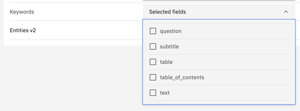
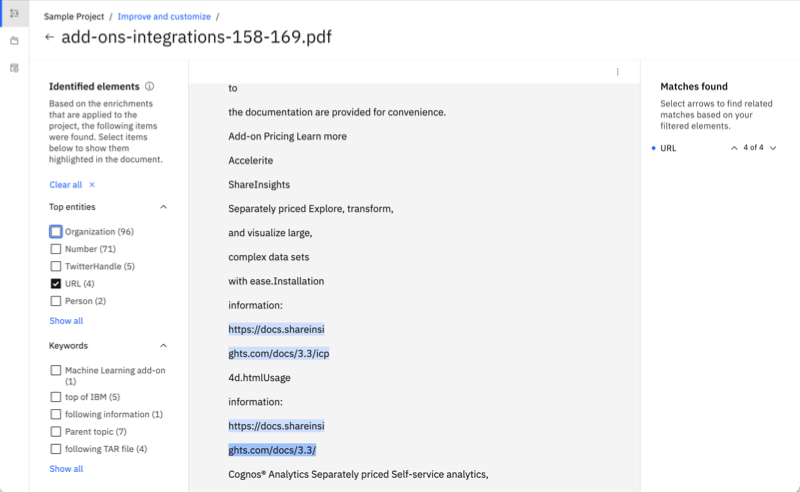
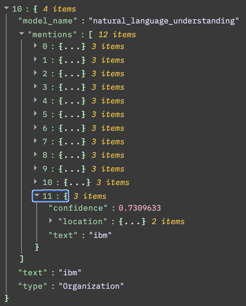

---

copyright:
  years: 2019, 2022
lastupdated: "2022-06-30"

subcollection: discovery-data
content-type: tutorial
account-plan: paid
completion-time: 20m

---

{{site.data.keyword.attribute-definition-list}}

# Getting started with Watson Discovery
{: #getting-started}
{: toc-content-type="tutorial"}
{: toc-completion-time="20m"}

In this tutorial, we introduce {{site.data.keyword.discoveryfull}} and walk you through the {{site.data.keyword.discoveryshort}} sample project. Exploring the sample project is a great way to tour and try out some of the product's features.
{: shortdesc}

This information applies to {{site.data.keyword.discovery-data_short}}, Plus plan instances, and Premium plan instances that were created on {{site.data.keyword.cloud_notm}} after 16 July 2020. For Premium instances that were created before that date and for all Lite and Advanced plans, see [Getting started with Discovery](/docs/discovery?topic=discovery-getting-started){: external}.
{: important}

## Before you begin
{: #before-you-begin-tool}
{: hide-dashboard}

Choose the appropriate step to complete for your deployment:

-    **{{site.data.keyword.icp4dfull_notm}}**: Install {{site.data.keyword.discoveryshort}}. See [Installing Discovery for Cloud Pak for Data](/docs/discovery-data?topic=discovery-data-install).
-    **{{site.data.keyword.cloud_notm}}**: Complete the following steps:

    1.  Sign up for a {{site.data.keyword.cloud_notm}} account or log in.
    1.  You can use a Plus plan for 30 days at no cost. However, to create a Plus plan instance of the service, you must have a paid account.

        For more information about creating a paid account, see [Upgrading your account](/docs/account?topic=account-upgrading-account){: external}.

        If you decide to discontinue use of the Plus plan and don't want to pay for it, delete the service instance before the 30-day trial period ends.
        {: important}

    1.  Go to the [{{site.data.keyword.discoveryshort}} resource](https://cloud.ibm.com/catalog/services/watson-discovery){: external} page in the {{site.data.keyword.cloud_notm}} catalog and create a Plus plan service instance.

## Open Watson Discovery
{: #getting-started-launch-tool}
{: step}

 **{{site.data.keyword.cloud_notm}}**

These instructions apply to all managed deployments, including {{site.data.keyword.icp4dfull_notm}} as a Service instances.

1.  Click the {{site.data.keyword.discoveryshort}} instance that you created to go to the service dashboard.

1.  On the **Manage** page, click **Launch Watson Discovery**.

    If you're prompted to log in, provide your {{site.data.keyword.cloud_notm}} credentials.

 **{{site.data.keyword.icp4dfull_notm}}**

These instructions apply to {{site.data.keyword.discoveryshort}} deployments:

1.  From the {{site.data.keyword.icp4dfull_notm}} web client main menu, expand **Services**, and then click **Instances**.
1.  Find your instance, and then click it to open its summary page.

    You can create a maximum of 10 instances per deployment. After you reach the maximum number, the *New instance* button is not displayed in {{site.data.keyword.icp4dfull_notm}}.
    {: note}

1.  Click **Launch tool**.

## Open the sample project
{: #open-project-tool}
{: step}

A new browser tab or window opens and the *My Projects* page is displayed.


To get familiar with the product, you can watch an under 3-minute overview video by clicking the *Watch a video* link from the product home page.
{: tip}

In this tutorial, you explore the sample project.

The sample project is a built-in project that is provided as a resource for you to initially explore the product. The sample project is a *Document Retrieval* project type. Document Retrieval projects are used to search and find the most relevant answers from your data.

1.  Click **Sample Project**.

    The *Improve and customize* page is displayed.

    If you just installed {{site.data.keyword.discoveryshort}}, the Sample Project needs time to finish processing documents. Wait for processing to finish before you start experimenting. You can check the status of data processing from the *Activity* page, which is described in the next step.
    {: note}

    

## Learn about the sample collection
{: #tour-project-tool}
{: step}

Learn about ways you can manage and enhance a collection by exploring the sample collection that is available with the sample project. The sample collection consists of a set of uploaded IBM Support PDF documents.

1.  Click the **Manage collections** icon on the navigation panel.

    Any collections in your project are displayed here. This project has only one collection.

    

1.  Click **Sample Collection**.

    The *Activity* page is displayed. This page shows the status of the collection. For example, it shows the total number of documents and when it was last updated. If Discovery encounters a problem when a document is uploaded or a data source is crawled, any associated messages are displayed here.

    

    After you create a collection, you can come to this page to find information about the processing status of the data in the collection.

1.  Click the **Enrichments** tab.

    The *Enrichments* page shows you a list of available enrichments. Enrichments make meaningful information easier to find and return in searches. You can apply built-in enrichments to your collection to leverage powerful Natural Language Understanding models that tag terms, such as commonly known keywords.

    

    The following enrichments are applied to the sample collection:

    Entities
    :   Recognizes proper nouns such as people, cities, and organizations that are mentioned in the content.

    Parts of Speech
    :   Identifies the parts of speech (nouns and verbs, for example) in the content.

    These enrichments are applied automatically to collections that are added to projects of the *Document Retrieval* type.

1.  For the *Entities v2* enrichment, click **1x Selected fields**.

    A list of available fields is displayed and the `text` field is selected. This selection means that the *Entities* enrichment was applied to content that was indexed and added to a field named `text` when documents from the collection were processed.

    

1.  For the *Parts of Speech* enrichment, click **1x Selected fields**.

    Again, you can see that the enrichment is applied to the `text` field.

    From this page, you can apply new enrichments to your collection or change the fields where an enrichment is applied.

    A powerful feature of Discovery is that you can add your own custom enrichments, such as dictionaries, patterns, and machine learning models. When you create custom enrichments, they are listed on this page also. You can manage where they are used from here.

    For more information about custom enrichments, see [Adding domain-specific resources](/docs/discovery-data?topic=discovery-data-domain).
    {: tip}

1.  You are going to apply another enrichment to the collection. Find the *Keywords* enrichment in the list, and then click **Select fields**.

    The Keywords enrichment recognizes significant commonly-known terms in your content.

1.  Scroll through the list of fields until you find the `text` field, and select it.

    

1.  Click **Apply changes and reprocess**.

    While your documents are being reprocessed to look for and tag keywords, you can continue to explore the tools available for managing a collection.

1.  Click **Identify fields**.

    Most content from a document is indexed in the `text` field automatically. You might want to index certain types of content in different fields or split up large documents so that the `text` field contains fewer passages per document. To do so, you can teach Discovery to recognize important fields in your documents by applying a *Smart Document Understanding* model to your collection.

    Smart Document Understanding (SDU) is a technology that learns about the content of a document based on the document's structure. You can apply a prebuilt SDU model or create a custom SDU model.

    

    To create a custom SDU model, you select the *User-trained model* option, and then annotate fields in your document. (You will not annotate documents as part of this tutorial.)

    

    For more information about SDU, see [Using Smart Document Understanding](/docs/discovery-data?topic=discovery-data-configuring-fields).
    {: tip}

1.  Click **Manage fields**.

    The *Manage fields* page lists the indexed fields. From here, you can include or remove fields from the index. You can also split large documents into many smaller documents.

    

    For more information about splitting documents, see [Splitting documents to make query results more succinct](/docs/discovery-data?topic=discovery-data-split-documents).
    {: tip}

## Search the sample project
{: #sample-project-try}
{: step}

1.  Click the **Improve and customize** icon from the navigation panel.

    The *Improve and customize* page is where you can try out queries, then add and test customizations to improve the query results for your project. A list of sample queries is displayed to help you get started with submitting test queries.

1.  Click the **Run search** button for`IBM`.

    Query results are displayed.

1.  From one of the query results, click **View passages in document**.

    A preview of the document where the result was found is shown.

1.  Do one of the following things to explore the search result.

     **{{site.data.keyword.cloud_notm}} only**:  
    
      1.  Click **Open advanced view**.

          Useful summary information is displayed, such as the number of occurrences of any enrichments that are detected in the document. 

      1.  Select the `URL` entity to highlight mentions of URLs within the text.

          

      1.  To see how the information from the document is stored in JSON format, click the *Display options* menu from the view header, and select **JSON view**.

          

     **{{site.data.keyword.icp4dfull_notm}} only**:

      1.  Click **JSON**.

          A JSON representation of the document is displayed.

          

          You can explore the JSON representation to see information that Discovery captured from the document. For example, if you expand the `enriched_text` section, and then expand the `entities` section, you can see mentions of entities that were recognized and tagged by the Entities enrichment.

          


## Customize the sample project
{: #customize-project-tool}
{: step}

Now, let's customize the search result view a bit by adding a facet. A facet is a way to organize and classify documents that share similar patterns or content.

1.  From the *Improve and customize* page, submit the following natural language query:

    ```text
    How do I install Discovery?
    ```

1.  Review the query results that are displayed.

    

    Notice that a *Top Entities* section is displayed. You can expand the entities and click one of them to filter the query results to show only those results in which the entity is mentioned. The *Top Entities* section is a built-in facet. It uses information that was added to the documents by the Entities enrichment.

    You will add your own facet that uses the Keywords enrichment that you applied to the collection in a previous step.

1.  On the **Improvement tools** panel, expand **Customize display**, and then click **Facets**.

    

1.  Click **New facet**, and then click the **From existing fields in a collection** button.

    

1.  Choose `enriched_text.keywords.mentions.text`, change the label to `Keywords`, and then click **Apply**.

    

    Remember the JSON representation of the document that you looked at earlier? Now that the Keywords enrichment is applied to the `text` field, and the documents are reprocessed, any keyword mentions found in the `text` field are included in the JSON representation of the document.

    The field you picked to use for the facet (`enriched_text.keywords.mentions.text`) reflects where the keyword text is stored in JSON.

    ```json
    "enriched_{field_name}": [
      "keywords" : [
        "mentions" : [
          "text": "Cloud Pak"
        ]
      ]
    ]
    ```
    {: codeblock}

1.  The new facet is displayed. You can click a keyword to filter the documents to include only those results that mention the keyword.

    

You successfully added a built-in NLU enrichment that recognizes keywords in the sample collection documents. Then, you added a facet that uses the keywords enrichment to let you filter the documents by keyword.

## Share the sample project
{: #gs-deploy}
{: step}

1.  Click **Integrate and deploy** from the navigation panel.

    From here, you can share your project with colleagues and deploy it.

1.  Follow the on-screen instructions to add a user, and then send login credentials and the provided link to your colleague.

    

    After you build your own search application and are ready to deploy it, you can use prebuilt user interface components or build a custom application.

    -   Click **API Information**. From this page, you can get the project ID for your project. You need the project ID to use the Discovery API. You also need the service instance URL and API key. The credential details are available from the Manage page of your service instance in IBM Cloud.

    -   Click **UI Components** to find links to ready-to-use code that you can use to create a full-featured search application faster.

## Add your own content
{: #gs-add-data}
{: step}

Now that you know more about some of the product features, you're ready to evaluate the data you want to search.

It's all about the data. Review the types of content you own that you want your search solution to be able to leverage.

{{site.data.content.data-sources-reuse}}

## Not sure what you can build?
{: #gs-start-here}
{: step}

For more information about the types of search solutions you can build, see [Start getting value from your data](/docs/discovery-data?topic=discovery-data-product-overview).

You can access the product documentation at any time by selecting the **Help** icon  from the page header of the product user interface. The help content is customized to provide information that is related to what you're doing in the product.
{: tip}

No matter what you build, step one is to create a project. Decide which project type best fits your needs. 

If none of the existing types is quite right, you can choose **None of the above** to create a custom project instead.

{{site.data.content.projects-reuse}}

For more information, see [Creating projects](/docs/discovery-data?topic=discovery-data-projects).
