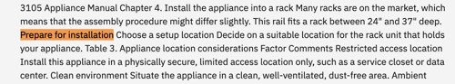
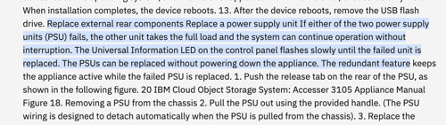
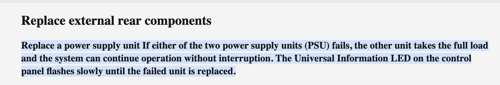

---

copyright:
  years: 2020, 2021
lastupdated: "2021-09-15"

keywords: improving results, troubleshooting search

subcollection: discovery-data

---

{:shortdesc: .shortdesc}
{:external: target="_blank" .external}
{:tip: .tip}
{:note: .note}
{:pre: .pre}
{:important: .important}
{:deprecated: .deprecated}
{:codeblock: .codeblock}
{:screen: .screen}
{:download: .download}
{:hide-dashboard: .hide-dashboard}
{:apikey: data-credential-placeholder='apikey'} 
{:url: data-credential-placeholder='url'}
{:curl: .ph data-hd-programlang='curl'}
{:javascript: .ph data-hd-programlang='javascript'}
{:java: .ph data-hd-programlang='java'}
{:python: .ph data-hd-programlang='python'}
{:ruby: .ph data-hd-programlang='ruby'}
{:swift: .ph data-hd-programlang='swift'}
{:go: .ph data-hd-programlang='go'}

# Improving your query results
{: #improvements}

Learn about actions you can take to improve the quality of your query results.
{: shortdesc}

You can use the tools that are built in to {{site.data.keyword.discoveryshort}} to make improvements.

## Excerpt unavailable
{: #improve-search-result}

If the result shows `Excerpt unavailable` instead of response text, you might need to adjust where the content of the response is taken from. By default, a passage from the document is returned as the response. You can change what is returned.

1.  From the *Improvement tools* panel, expand **Customize display**.
1.  Click **Search results**.
1.  For the source of result content, select **Field**, and then choose the field from which you want to extract the response.

    If you enabled FAQ extraction, use the `text` field as the source. Questions are stored in the *title* field, and answers are stored in the *text* field of the FAQ-pair documents that are generated by the process.
    {: tip}

    
1.  Click **Apply**.

## Results have too much text
{: #improve-too-much-text}

If the source document is large, consider splitting the document into smaller chunks. 

To do so, you can create a Smart Document Understanding user-trained model. Find content in the document that can be used to consistently break your document into subsections. For example, maybe your document has chapters or subtitles. You can label the chapters with a custom label named `chapter`. After you teach the model to recognize the `chapter` content type, apply the model to your entire collection. For more information, see [Adding custom fields with Smart Document Understanding](/docs/discovery-data?topic=discovery-data-configuring-fields). 
  
You can then split the document by the `chapter` field to create many subdocuments segmented by chapter. For more information, see [Split documents to make query results more succinct](/docs/discovery-data?topic=discovery-data-split-documents).

## Results are not well formatted
{: #improve-plain-text}

If the query result shows an excerpt that is hard to read, it might be content that is coming from a table. 

If meaningful information is typically stored in tables in your documents, apply the *table understanding* enrichment to your collection to make the information easier to find and understand in the results. For more information, see [Understanding tables](/docs/discovery-data?topic=discovery-data-understanding_tables).

The following table illustrates how the query result looks before and after table understanding is applied to the collection.

| View passage in document before enrichment | View table in document after enrichment |
|--------------------------------------------|-----------------------------------------|
|  |  |
{: caption="Before and after applying table understanding" caption-side="top"}

If responses are displayed in plain text when you view the passage in the document, you can apply richer formatting to them by applying a Smart Document Understanding user-trained or pretrained model. For more information, see [Adding custom fields with Smart Document Understanding](/docs/discovery-data?topic=discovery-data-configuring-fields)

In the following example, the same search result is returned whether an SDU model is applied or not, but the result text looks different. The table illustrates what the document view of a query result looks like before and after a user-trained SDU model is created.

| Before SDU | After SDU |
|------------|-----------|
|  |  |
{: caption="Before and after training a Smart Document Understanding model" caption-side="top"}

## Information from tables is not found
{: #improve-tables}

The table understanding enrichment must be applied to your collection for information from tables to be searchable. The table understanding enrichment is applied to collections automatically in some situations. If it isn't, you can apply the *table understanding* enrichment yourself.

For more information, see [Understanding tables](/docs/discovery-data?topic=discovery-data-understanding_tables).

## Information from diagrams is not represented
{: #improve-images}

Text from diagrams and other images is not captured unless you enable the optical character recognition (OCR) setting for the collection. You can apply the setting to a collection after its initial creation. For more information, see [Managing data collections](/docs/discovery-data?topic=discovery-data-manage-collections).

## Answers from FAQs are not being returned
{: #improve-faqs}

 **{{site.data.keyword.cloud_notm}} only**: If you applied FAQ extraction to your source documents, but {{site.data.keyword.discoveryshort}} did not generate a new document for every pair, determine which pairs were not recognized. 

First check whether you can make easy formatting changes to help {{site.data.keyword.discoveryshort}} recognize them. For example, is a closing question mark missing from the question?

If there are no easy fixes, consider using the Smart Document Understanding tool to annotate the question-and-answer pairs instead. First, you must remove the FAQ extractions from the collection. Turn off FAQ extraction on the **Processings settings** tab of the **Manage collections** page. After you disable FAQ extraction, reprocess the collection by clicking **Apply changes and reprocess**. Now you can use the Smart Document Understanding tool to annotate the question-and-answer pairs in your document. For more information, see [Adding custom fields with Smart Document Understanding](/docs/discovery-data?topic=discovery-data-configuring-fields)

## Search does not recognize significant terms
{: #improve-nlu}

If the results suggest that keywords, common nouns, or domain-specific terms in the query are not being recognized as significant, enrich your collection.

Use Watson Natural Language Understanding to find and tag terms that are generally understood to have special meaning, such as locations or company names. For more information, see [Applying prebuilt enrichments](/docs/discovery-data?topic=discovery-data-nlu).

Teach {{site.data.keyword.discoveryshort}} about terms and patterns that have special meaning to your use case. For more information, see [Adding domain-specific resources](/docs/discovery-data?topic=discovery-data-domain).

## Default facets aren't useful
{: #improve-facets}

You can add facets that categorize documents based on data from enrichments that you apply to a collection. For example, you might want to show facets based on keywords or dictionary categories. For more information, see [Facets](/docs/discovery-data?topic=discovery-data-facets).

## Explore other search features
{: #improve-other-searches}

When you test your project from the {{site.data.keyword.discoveryshort}} user interface, you submit a natural language query. Search features are available that you can enable to influence how the natural language query search is done. And Discovery Query Language search is another type of search that you can leverage by using the API. If the initial results don't meet your needs, experiment with another search method.

- Discovery Query Language (DQL) search: A search mechanism that accepts more complex queries. You must use the query API to submit DQL queries.

  For example, you can search for specific values in fields that are generated by enrichments that are applied to a collection.
- Natural language query is the type of search that is triggered from the *Improve and customize* page. You can enable the following features to influence how the natural language search is done:

  -  **{{site.data.keyword.cloud_notm}} only** Answer finding: A feature that returns a *short answer* in addition to the passage that is returned from a document. The short answer is the word or phrase from the passage that is most likely to be the most concise answer to the question. You must use the query API to enable answer finding. For more information, see [Answer finding](/docs/discovery-data?topic=discovery-data-query-parameters#answer-finding).
  -  **{{site.data.keyword.cloud_notm}} only** FAQ extraction: A beta feature that detects question-and-answer pairs in your documents and automatically extracts the pairs. Your application can use the extracted pairs to provide more precise query results. You can apply FAQ extraction to a collection from the {{site.data.keyword.discoveryshort}} user interface. For more information, see [FAQ extraction](/docs/discovery-data?topic=discovery-data-sources#faq-extraction).

For more information about the Query API, see [Query API overview](/docs/discovery-data?topic=discovery-data-query-concepts).