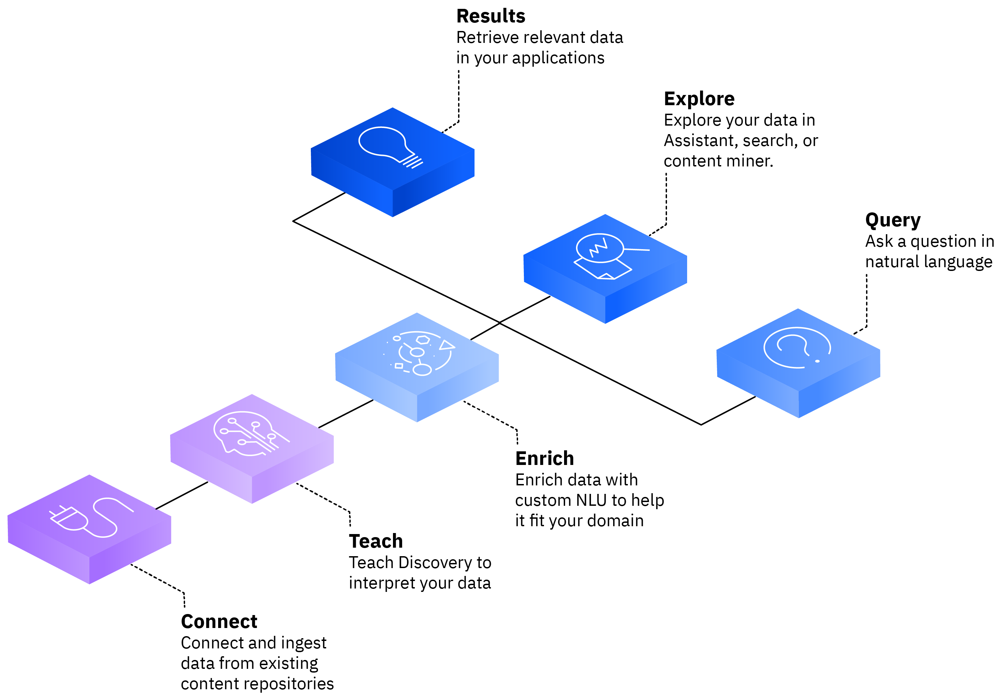

---

copyright:
  years: 2019, 2022
lastupdated: "2021-11-30"

subcollection: discovery-data

---

{{site.data.keyword.attribute-definition-list}}

# About Watson Discovery
{: #about}

{{site.data.keyword.discoveryfull}} is an AI-powered search engine that helps you to extract answers from complex business documents.
{: shortdesc}

Use {{site.data.keyword.discoveryshort}} to visually train AI for deep understanding of your content, including tables and images, to help you find business value that is hidden in your enterprise data. Use natural language or structured queries to find relevant answers, surface insights, and build AI-enhanced business processes anywhere.

Start by connecting your data to Discovery. Next, teach Discovery to understand the language and concepts that are unique to your business and industry. Enrich your data with award-winning Natural Language Understanding (NLU) technologies so you can identify key information and patterns. Finally, build search solutions that find answers to queries, explore your data to uncover patterns and insights, and leverage search results in automated workflows.

## Overview video
{: #about-video}

Watch a video about how {{site.data.keyword.discoveryshort}} uses AI-powered search, retrieval, and content mining. This overview covers the key basics of projects, collections, fields, and enrichments. It explains how to upload your data and query for answers, find insights, and spot trends.

{: video output="iframe" data-script="#video-transcript-ui" id="mediacenterplayer" frameborder="0" width="560" height="315" allowfullscreen webkitallowfullscreen mozAllowFullScreen}

### Video transcript
{: #video-transcript-ui}
{: notoc}

Get started with Watson Discovery presented by David Williams -- (Music intro) Welcome to Watson Discovery with AI.

In this video we'll walk through some key concepts and show you how to get started. 

Watson Discovery is made up of four main concepts, projects, collections, fields, and enrichments.

A project is a space where can import different types of data from a variety of sources, and query for insights or answers.

A collection is a set of documents that you upload or crawl from a connected data source. 

As documents are crawled, unstructured text is organized into fields such as author, file type, text, and more.

And enrichments are AI capabilities that you can apply to fields to identify and extract relevant information from your documents. This helps you find answers or insights from your data.

Let's dive in to the different project types.

A document retrieval project is used to build an AI-powered search function that finds answers in your business data.

A conversational project is used to enhance your chatbot's question and answer ability.

A content mining project helps you spot trends across large volumes of text-heavy business data.

Watson Discovery supports a wide selection of data sources you can crawl, like webpages, Cloud Object Storage, Microsoft SharePoint, and more. You can even upload your own data from any data source. 

After connecting and processing your data, you can apply enrichments to bring your data to life. Some commonly used enrichments are entities, contracts, and table understanding. Entities enrichment can be used to recognize people, organizations, and more. Contracts enrichment can be used to decompose contracts to fields, clauses, and relationships. The table understanding enrichment can be used to identify tables and return them as an answer to a query.

You can also create custom enrichments, such as a dictionary, so Discovery can understand your industry-specific terminology and support intelligent queries.

Now, you know the basics.

To get started, take our step-by-step product tour to get familiar with the user interface and sample project.

## Using Discovery
{: #about-deployment-types}

{{site.data.keyword.discoveryshort}} can be deployed as a managed cloud service or can be installed on premises. This documentation describes how to use the product regardless of how it is deployed. Information that applies exclusively to one deployment type is denoted by the appropriate icon:

-  **{{site.data.keyword.icp4dfull_notm}}** for installed instances, such as {{site.data.keyword.discoveryfull}} Cartridge for {{site.data.keyword.cloud}}.
-  **{{site.data.keyword.cloud_notm}}** for managed instances, such as {{site.data.keyword.discoveryshort}} Plus, Enterprise, and Premium plan instances that are hosted by {{site.data.keyword.cloud_notm}} or instances that are provisioned with [IBM Cloud Pak for Data as a Service](https://dataplatform.cloud.ibm.com/docs/content/wsj/landings/watsondisc.html).

For information about using Discovery from managed Lite and Advanced plan instances, or from Premium plan instances that were created before 16 July 2020, see the [Discovery (v1) documentation](/docs/discovery?topic=discovery-about).

Click the Help  icon from the header of any page in the product user interface to open the {{site.data.keyword.discoveryshort}} documentation.
{: tip}

## Browser support
{: #about-browser}

 **{{site.data.keyword.icp4dfull_notm}}**: The {{site.data.keyword.discovery-data_short}} user interface supports the {{site.data.keyword.icp4dfull_notm}} requirements. For more information, see [Supported web browsers](https://www.ibm.com/docs/cloud-paks/cp-data/3.5.0?topic=planning-system-requirements#rhos-reqs__web){: external}

 **{{site.data.keyword.cloud_notm}}** 

-   Deployments of {{site.data.keyword.discoveryshort}} that are managed by {{site.data.keyword.cloud_notm}} follow the {{site.data.keyword.cloud_notm}} requirements. For more information, see [Prerequisites](https://cloud.ibm.com/docs/overview?topic=overview-prereqs-platform){: external}
-   For more information about browser support for deployments that are provisioned with Cloud Pak for Data as a Service, see [Which web browsers are supported for Cloud Pak for Data as a Service](https://dataplatform.cloud.ibm.com/docs/content/wsj/getting-started/faq.html?audience=wdp#which-browser){: external}. 

## Language support
{: #about-language}

Language support by feature is detailed in the [Supported languages](/docs/discovery-data?topic=discovery-data-language-support) topic.

## Beta features
{: #beta-features}

IBM releases services, features, and language support for your evaluation that are classified as beta. These features might be unstable, might change frequently, and might be discontinued with short notice. Beta features also might not provide the same level of performance or compatibility that generally available features provide and are not intended for use in a production environment.

## Trademarks
{: #about-trademarks}

IBM, the IBM logo, and ibm.com are trademarks or registered trademarks of International Business Machines Corp., registered in many jurisdictions worldwide. Other product and service names might be trademarks of IBM or other companies. A current list of IBM trademarks is available on the web at [Copyright and trademark information](https://www.ibm.com/legal/copytrade){: external}.

Microsoft, Windows, Windows NT, and the Windows logo are trademarks of Microsoft Corporation in the United States, other countries, or both.

Java and all Java-based trademarks and logos are trademarks or registered trademarks of Oracle and/or its affiliates.

