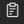

---

copyright:
  years: 2019
lastupdated: "2019-06-20"

subcollection: discovery-data

---

{:shortdesc: .shortdesc}
{:new_window: target="_blank"}
{:tip: .tip}
{:note: .note}
{:pre: .pre}
{:important: .important}
{:deprecated: .deprecated}
{:codeblock: .codeblock}
{:screen: .screen}
{:download: .download}
{:hide-dashboard: .hide-dashboard}
{:apikey: data-credential-placeholder='apikey'} 
{:url: data-credential-placeholder='url'}
{:curl: #curl .ph data-hd-programlang='curl'}
{:javascript: .ph data-hd-programlang='javascript'}
{:java: .ph data-hd-programlang='java'}
{:python: .ph data-hd-programlang='python'}
{:ruby: .ph data-hd-programlang='ruby'}
{:swift: .ph data-hd-programlang='swift'}
{:go: .ph data-hd-programlang='go'}

# Viewing system logs
{: #logs}

{{site.data.keyword.discovery-data_short}} provides the **Logs** screen so you can easily access all of the error and warning messages for the collections in this environment.
{: shortdesc}

<!-- Help for the Logs screen -->

To view the **Logs** screen, click the **Logs**  icon on the left.

You can view the `Type`, `Message`, and `Date` for each item.
