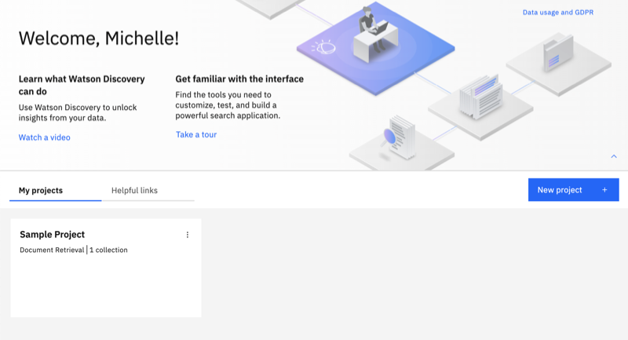

---

copyright:
  years: 2015, 2024
lastupdated: "2023-02-06"

subcollection: discovery-data

content-type: faq

---

{{site.data.keyword.attribute-definition-list}}

# Migration FAQ
{: #-migration-faq}

Find answers to questions that are commonly asked about migrating from Discovery v1 to v2.
{: shortdesc}

Do the two versions have all the same features?
:   There are many feature differences between the two versions. For a full feature comparison, see [Getting the most from Discovery](/docs/discovery-data?topic=discovery-data-version-choose).

How do I know which version I'm using now?
:   When you open the product user interface in v2, the following page is displayed:

{: caption="Figure 1. Home page from the Sample Project" caption-side="bottom"}

How long will the migration take?
:   The time you need to set aside for the migration differs based on the amount of data you want to retain in your existing v1 service instance.

Do I need to update my existing applications for them to work with v2?
:   Yes. You will need to edit any existing applications to account for changes that are introduced with Discovery v2. For more information, see the [API version comparison](/docs/discovery-data?topic=discovery-data-migrate-to-v2-api).

To get started, see [Migrating to Discovery v2](/docs/discovery-data?topic=discovery-data-migrate-to-v2).
