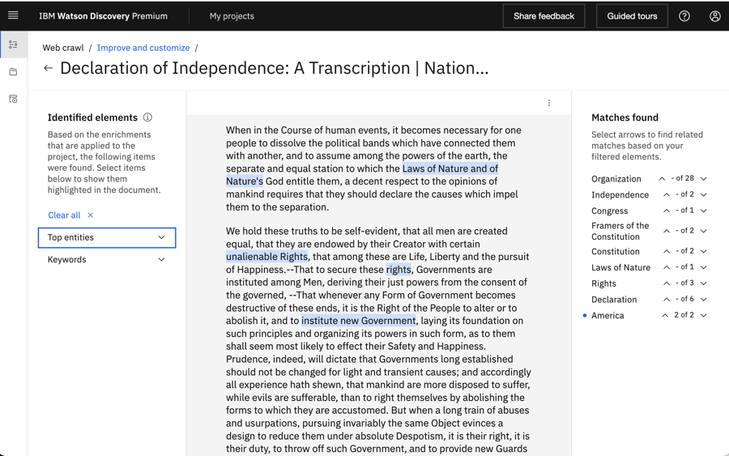
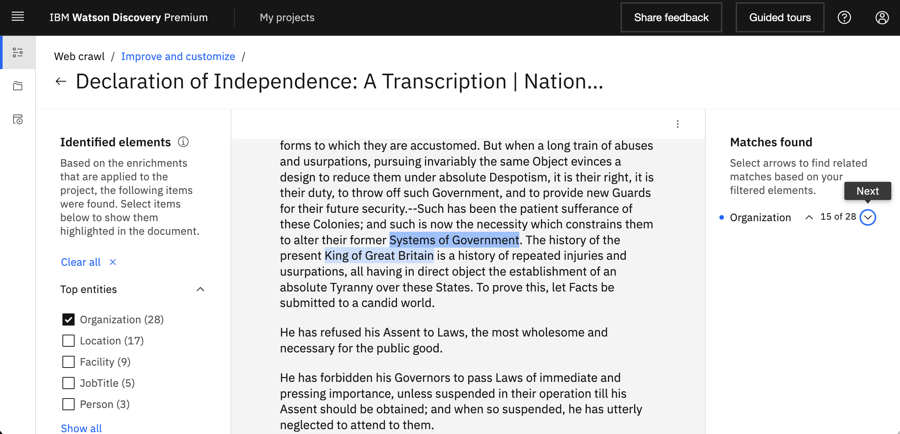
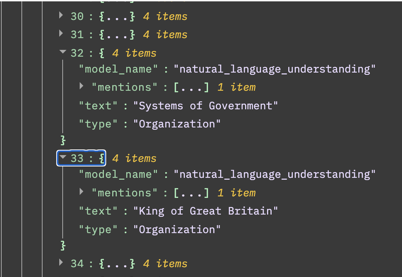
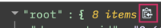
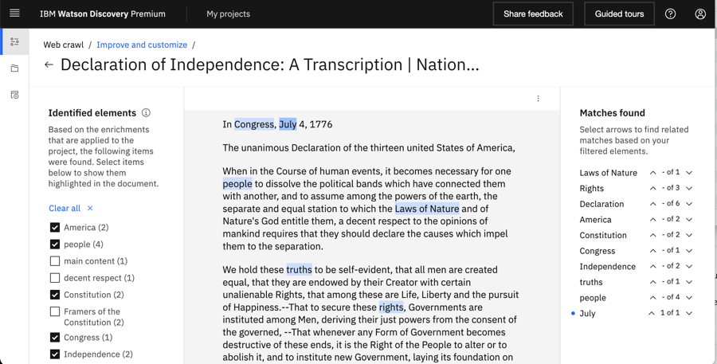
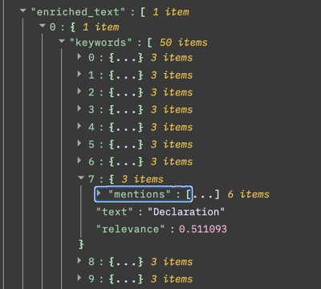

---

copyright:
  years: 2019, 2023
lastupdated: "2023-02-06"

keywords: Watson NLP, entities, keywords, pos, part of speech, sentiment

subcollection: discovery-data

---

{{site.data.keyword.attribute-definition-list}}

# Applying prebuilt Watson NLP enrichments
{: #nlu}

Take advantage of award-winning Watson Natural Language Processing (NLP) capabilities by adding prebuilt enrichments to your documents.
{: shortdesc}

With Watson NLP, you can identify and tag meaningful information in your collections so you can understand what it all means and make more informed decisions. 

The following Watson NLP enrichments are available:

-   [Entities](#nlu-entities): Recognizes proper nouns such as people, cities, and organizations that are mentioned in the content.
-   [Keywords](#nlu-keywords): Recognizes significant terms in your content.
-   [Part of Speech](#nlu-pos): Identifies the parts of speech (nouns and verbs, for example) in the content.
-   [Sentiment](#nlu-sentiment): Understands the overall sentiment of the content.

The following other pretrained enrichments are available with {{site.data.keyword.discoveryshort}}:

-   [Contracts](/docs/discovery-data?topic=discovery-data-contracts-schema)
-   [Document structure](/docs/discovery-data?topic=discovery-data-sdu-pretrained)
-   [Table understanding](/docs/discovery-data?topic=discovery-data-understanding_tables)

## Watson NLP enrichments
{: #nlu-overview}

For example, the following screen capture shows a transcript of the US Declaration of Independence that was added to a {{site.data.keyword.discoveryshort}} collection where the Entities and Keywords enrichments are enabled. The mentions that are recognized by the enrichments are highlighted in the document text.

{: caption="Figure 1. Excerpt of the US Declaration of Independence with highlighted terms" caption-side="bottom"}

Some of the NLP enrichments are applied to projects automatically. You don't need to apply them yourself if you are using one of these project types.

{{site.data.content.enrichment-defaults-reuse}}

For more information about the following prebuilt enrichments, see the following topics:

- [Contracts](/docs/discovery-data?topic=discovery-data-contracts-schema)
- [Table Understanding](/docs/discovery-data?topic=discovery-data-understanding_tables)

For more information about how to create custom enrichments, see [Adding domain-specific resources](/docs/discovery-data?topic=discovery-data-domain).

For more information about how to get the most from enrichments, read the [Enriching your documents can make search more effective](https://community.ibm.com/community/user/watsonai/blogs/bill-murdock1/2022/01/14/enriching-your-documents-can-make-search-more-effe){: external} blog post.

## Add enrichments
{: #nlu-task}

To add an NLP enrichment, complete the following steps:

1.  Open your project and go to the *Manage collections* page.
1.  Click to open the collection that you want to enrich.
1.  Open the **Enrichments** tab.
1.  Scroll to find the NLP enrichment that you want to apply to your documents.

    Both built-in enrichments and custom enrichments are listed. Built-in enrichments have a type value of `System`.
    {: note}

1.  Choose one or more fields to apply the enrichment to.

    You can apply enrichments to the `text` and `html` fields, and to custom fields that were added from uploaded JSON or CSV files or from the Smart Document Understanding (SDU) tool.

1.  Click **Apply changes and reprocess**.

Enrichments that you enable are applied to the documents in random order. For more information about how to remove an enrichment, see [Managing enrichments](/docs/discovery-data?topic=discovery-data-manage-enrichments).

## Entities
{: #nlu-entities}

Identifies entities. *Entities* are terms that typically represent proper nouns such as people, cities, and organizations that are mentioned in the data collection. {{site.data.keyword.discoveryshort}} can recognize entities that are part of an entity type system that is defined by the Watson Natural Language Processing (NLP) service.

If you want to be able to identify uncommon terms that are significant to your business, you can train your own model to recognize custom entities. For more information, see [Entity extractor](/docs/discovery-data?topic=discovery-data-entity-extractor).

The Watson NLP entity extractor service that is used by Discovery is called the *NLU type system*. The name originates from the fact that the type system is used by the Watson Natural Language Understanding (NLU) service in addition to the Watson Discovery service. However, it is the Watson NLP implementation of the type system that is used directly by Discovery, not the Watson NLU implementation. As a result, the two implementations can produce different results. To get a general idea of the types of entities that are recognized by the service, see [Entities v2](/docs/natural-language-understanding?topic=natural-language-understanding-entity-types-version-2){: external}.

The following screen capture shows that the Entities enrichment recognizes the terms *Systems of Government* and *King of Great Britain* (among others) and tags them as entity mentions.

{: caption="Figure 2. The recognized entities, Governments and King of Great Britain, are highlighted" caption-side="bottom"}

From the JSON view of the document, you can see the underlying JSON structure of the entity mentions.

{: caption="Figure 3. JSON representation of recognized entity mentions" caption-side="bottom"}

If you want to search for the Organization entity type, for example, you can copy all of the JSON content into a text editor and search for `Organization`. Click the *Copy* icon from the root of the JSON tree view.

{: caption="Figure 4. Copy icon at the root of the JSON representation of enrichments" caption-side="bottom"}

### Example
{: #nlu-entities-example}

#### Input
{: #nlu-entities-example-input}

```text
"IBM is an American multinational technology company headquartered in Armonk."
```
{: codeblock}

#### Response
{: #nlu-entities-example-response}

In the JSON output:

- `text` = string. The entity text
- `type` = string. The entity type, such as `Organization`, `Location`, `Person`, `Number`.
- `mentions` = array. The entity mentions and locations
- `model_name` = string. For custom models, this field contains the user-provided model name. Otherwise, this field contains the default name of the model, such as `watson_knowledge_studio`, `dictionary`, `character_pattern`, or `natural_language_understanding`

```json
{
  "entities": [
    {
      "model_name": "natural_language_understanding",
      "mentions": [
        {
          "confidence": 0.8317045,
          "location": {
            "end": 3,
            "begin": 0
          },
          "text": "IBM"
        }
      ],
      "text": "IBM",
      "type": "Organization"
    },
    {
      "model_name": "natural_language_understanding",
      "mentions": [
        {
          "confidence": 0.6114863,
          "location": {
            "end": 75,
            "begin": 69
          },
        "text": "Armonk"
        }
      ],
      "text": "Armonk",
      "type": "Location"
    }
  ]
}
```
{: codeblock}

For Premium plan {{site.data.keyword.cloud_notm}} instances that were created before 2 June 2021 and Discovery for {{site.data.keyword.icp4dfull_notm}} 2.x deployments, version 1 of the {{site.data.keyword.nlushort}} Entities type system is used by the Entities enrichment for English and Korean collections. For example, any English or Korean collections that were added to Document Retrieval projects had Entities v1 applied to them automatically. These collections continue to use the Entities v1 legacy enrichment, but it is not listed in the Enrichments page. If you want to switch to using Entities v2, apply the Entities v2 enrichment to the collection. Only one version of the Entities enrichment can be applied to a collection at one time. When you apply the v2 enrichment, the legacy enrichment is disabled automatically. If you want to use the Entities v1 legacy enrichment instead of Entities v2, you can use the API to swap the enrichment that is applied to your collection. For more information, see [Applying enrichments by using the API](/docs/discovery-data?topic=discovery-data-manage-enrichments#enrichments-api).
{: note}

### Entity limits
{: #nlu-entities-limits}

The Entities enrichment can identify up to 50 entities, each with one or many mentions, per document.

## Keywords
{: #nlu-keywords}

Returns important keywords in the content.

For example, the following screen capture shows highlighted terms from the US Declaration of Independence that are recognized by the Keywords enrichment.

{: caption="Figure 5. Terms recognized by the Keywords enrichment" caption-side="bottom"}

From the JSON view of the document, you can see the underlying JSON structure of the `Declaration` keyword mention.

{: caption="Figure 6. JSON representation of Keywords enrichment mentions" caption-side="bottom"}

### Example
{: #nlu-keywords-example}

#### Input
{: #nlu-keywords-example-input}

```text
"Watson Discovery is an award-winning AI search technology."
```
{: codeblock}

#### Response
{: #nlu-keywords-example-response}

In the JSON output:

- `text` = The keyword text
- `mentions` = The entity mentions and locations

```json
{
  "keywords": [
    {
      "mentions": [
        {
          "location": {
            "end": 157,
            "begin": 141
          },
          "text": "Watson Discovery"
        }
      ],
      "text": "Watson Discovery",
      "relevance": 0.503613
    },
    {
      "mentions": [
        {
          "location": {
           "end": 177,
            "begin": 164
          },
          "text": "award-winning"
        }
      ],
      "text": "award-winning",
      "relevance": 0.728722
    },
    {
      "mentions": [
        {
          "location": {
            "end": 198,
            "begin": 181
          },
          "text": "search technology"
        }
      ],
      "text": "search technology",
      "relevance": 0.779356
    }
  ]
}
```
{: codeblock}

### Keywords limits
{: #nlu-keywords-limits}

The Keywords enrichment can identify up to 50 keywords, each with one or many mentions, per document.

## Part of speech
{: #nlu-pos}

Recognizes and tags parts of speech, including nouns, verbs, adjectives, adverbs, conjunctions, interjections, and numerals.

## Sentiment
{: #nlu-sentiment}

Analyzes the sentiment that is expressed in text and returns `positive`, `neutral`, or `negative` sentiment.

To understand the sentiment of an entire document, apply this enrichment to a field that contains as much of the text from the document as possible, such as the `text` field.

To analyze sentiment in text from multiple fields at one time and capture the overall sentiment of the document, use the Content Mining application. For more information, see [Detecting phrases the express sentiment](/docs/discovery-data?topic=discovery-data-cm-phrase-sentiment).

### Example
{: #nlu-sentiment-example}

#### Input
{: #nlu-sentiment-example-input}

```text
"It is powerful and easy to use and integrate with third party applications."
```
{: codeblock}

#### Response
{: #nlu-sentiment-example-response}

In the JSON output:

- `score` = Sentiment score from `-1` (negative) to `1` (positive)
- `label` = `positive`, `negative`, or `neutral`
- `mixed` = Indicates that the document expresses a combination of different sentiments

```json
{
  "sentiment": {
    "score": 0.9255063900060722,
    "mixed": false,
    "label": "positive"
  }
}
 ```
{: codeblock}
