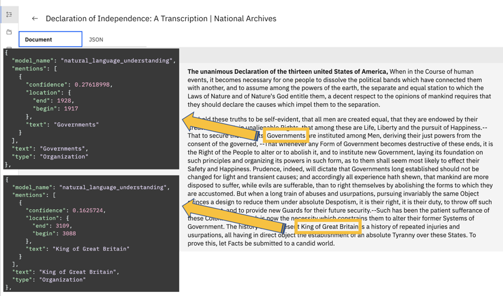

---

copyright:
  years: 2019, 2021
lastupdated: "2021-11-09"

subcollection: discovery-data

---

{{site.data.keyword.attribute-definition-list}}

# Applying prebuilt enrichments
{: #nlu}

Take advantage of award-winning Watson Natural Language Understanding (NLU) capabilities by adding prebuilt enrichments to your documents.
{: shortdesc}

With Watson NLU, you can identify and tag meaningful information in your collections so you can understand what it all means and make more informed decisions. The following enrichments are available:

- [Entities](#nlu-entities): Recognizes proper nouns such as people, cities, and organizations that are mentioned in the content.
- [Keywords](#nlu-keywords): Recognizes significant terms in your content.
- [Parts of Speech](#nlu-pos): Identifies the parts of speech (nouns and verbs, for example) in the content.
- [Sentiment](#nlu-sentiment): Understands the overall sentiment of the content.

For example, the following image shows a transcript of the US Declaration of Independence that was added to a {{site.data.keyword.discoveryshort}} collection. The Entities enrichment recognizes the terms *Governments* and *King of Great Britain* (among others) and tags them as entity mentions.



Some of the NLU enrichments are applied to projects automatically. You don't need to apply them yourself if you are using one of these project types.

| Enrichment that is applied automatically | Project type |
|------------------------------------------|--------------|
| Entities                                 | Document Retrieval, Document Retrieval for Contracts |
| Parts of Speech                          | Content Mining, Document Retrieval, Document Retrieval for Contracts |
{: caption="Default enrichments for project types" caption-side="top"}

The following prebuilt enrichments are applied to some collections automatically also:

- [Contracts](/docs/discovery-data?topic=discovery-data-contracts-schema)
- [Table Understanding](/docs/discovery-data?topic=discovery-data-understanding_tables)

For more information about how to create custom enrichments, see [Adding domain-specific resources](/docs/discovery-data?topic=discovery-data-domain).

## Add enrichments
{: #nlu-task}

To add an NLU enrichment, complete the following steps:

1.  Open your project and go to the *Manage collections* page.
1.  Click to open the collection that you want to enrich.
1.  Open the **Enrichments** tab.
1.  Scroll to find the NLU enrichment that you want to apply to your documents.

    Both built-in enrichments and custom enrichments are listed. Built-in enrichments have a type value of `System`.
    {: note}

1.  Choose one or more fields to apply the enrichment to.

    You can apply enrichments to the `text` and `html` fields, and to custom fields that were added from uploaded JSON or CSV files or from the Smart Document Understanding (SDU) tool.
1.  Click **Apply changes and reprocess**.

For more information about how to remove an enrichment, see [Managing enrichments](/docs/discovery-data?topic=discovery-data-manage-enrichments).

## Entities
{: #nlu-entities}

Identifies entities. *Entities* are terms that typically represent proper nouns such as people, cities, and organizations that are mentioned in the data collection. {{site.data.keyword.discoveryshort}} can recognize entities that are part of an entity type system that is defined by the {{site.data.keyword.nlushort}} service. For more information, see [Entities Version 2](/docs/natural-language-understanding?topic=natural-language-understanding-entity-types-version-2){: external}.

For Premium plan {{site.data.keyword.cloud_notm}} instances that were created before 2 June 2021 and Discovery for {{site.data.keyword.icp4dfull_notm}} 2.x deployments, version 1 of the {{site.data.keyword.nlushort}} Entities type system is used by the Entities enrichment for English and Korean collections. For example, any English or Korean collections that were added to Document Retrieval projects had Entities v1 applied to them automatically. These collections continue to use the Entities v1 legacy enrichment, but it is not listed in the Enrichments page. If you want to switch to using Entities v2, apply the Entities v2 enrichment to the collection. Only one version of the Entities enrichment can be applied to a collection at one time. When you apply the v2 enrichment, the legacy enrichment is disabled automatically.
{: note}

If you want to use the Entities v1 legacy enrichment instead of Entities v2, you can use the API to swap the enrichment that is applied to your collection. For more information, see [Applying enrichments by using the API](/docs/discovery-data?topic=discovery-data-manage-enrichments#enrichments-api).

### Example
{: #nlu-entities-example}

#### Input
{: #nlu-entities-example-input}

```text
"IBM is an American multinational technology company headquartered in Armonk."
```
{: codeblock}

#### Response
{: #nlu-entities-example-response}

In the JSON output:

- `text` = string. The entity text
- `type` = string. The entity type, such as `Organization`, `Location`, `Person`, `Number`.
- `mentions` = array. The entity mentions and locations
- `model_name` = string. For custom models, this field contains the user-provided model name. Otherwise, this field contains the default name of the model, such as `watson_knowledge_studio`, `dictionary`, `character_pattern`, or `natural_language_understanding`

```json
{
  "entities": [
    {
      "model_name": "natural_language_understanding",
      "mentions": [
        {
          "confidence": 0.8317045,
          "location": {
            "end": 3,
            "begin": 0
          },
          "text": "IBM"
        }
      ],
      "text": "IBM",
      "type": "Organization"
    },
    {
      "model_name": "natural_language_understanding",
      "mentions": [
        {
          "confidence": 0.6114863,
          "location": {
            "end": 75,
            "begin": 69
          },
        "text": "Armonk"
        }
      ],
      "text": "Armonk",
      "type": "Location"
    }
  ]
}
```
{: codeblock}

### Entity limits
{: #nlu-entities-limits}

The Natural Language Understanding machine learning model can identify up to 50 entities, each with one or many mentions, per collection.

## Keywords
{: #nlu-keywords}

Returns important keywords in the content.

### Example
{: #nlu-keywords-example}

#### Input
{: #nlu-keywords-example-input}

```text
"Watson Discovery is an award-winning AI search technology."
```
{: codeblock}

#### Response
{: #nlu-keywords-example-response}

In the JSON output:

- `text` = The keyword text
- `mentions` = The entity mentions and locations

```json
{
  "keywords": [
    {
      "mentions": [
        {
          "location": {
            "end": 157,
            "begin": 141
          },
          "text": "Watson Discovery"
        }
      ],
      "text": "Watson Discovery",
      "relevance": 0.503613
    },
    {
      "mentions": [
        {
          "location": {
           "end": 177,
            "begin": 164
          },
          "text": "award-winning"
        }
      ],
      "text": "award-winning",
      "relevance": 0.728722
    },
    {
      "mentions": [
        {
          "location": {
            "end": 198,
            "begin": 181
          },
          "text": "search technology"
        }
      ],
      "text": "search technology",
      "relevance": 0.779356
    }
  ]
}
```
{: codeblock}

### Keywords limits
{: #nlu-keywords-limits}

The Natural Language Understanding machine learning model can identify up to 50 keywords, each with one or many mentions, per collection.

## Parts of speech
{: #nlu-pos}

Recognizes and tags parts of speech, including nouns, verbs, adjectives, adverbs, conjunctions, interjections, and numerals.

## Sentiment
{: #nlu-sentiment}

Analyzes the sentiment that is expressed in text and returns `positive`, `neutral`, or `negative` sentiment.

To understand the sentiment of an entire document, apply this enrichment to a field that contains as much of the text from the document as possible, such as the `text` field.

To analyze sentiment in text from multiple fields at once and capture the overall sentiment of the document, use the Content Mining application. For more information, see [Enabling multiple text fields](/docs/discovery-data?topic=discovery-data-contentminerapp#enable-multiple-fields) and [Enabling sentiment analysis](/docs/discovery-data?topic=discovery-data-contentminerapp#sentiment-analysis).

### Example
{: #nlu-sentiment-example}

#### Input
{: #nlu-sentiment-example-input}

```text
"It is powerful and easy to use and integrate with third party applications."
```
{: codeblock}

#### Response
{: #nlu-sentiment-example-response}

In the JSON output:

- `score` = Sentiment score from `-1` (negative) to `1` (positive)
- `label` = `positive`, `negative`, or `neutral`
- `mixed` = Indicates whether the document has a mix of emotions or not

```json
{
  "sentiment": {
    "score": 0.9255063900060722,
    "mixed": false,
    "label": "positive"
  }
}
 ```
{: codeblock}
