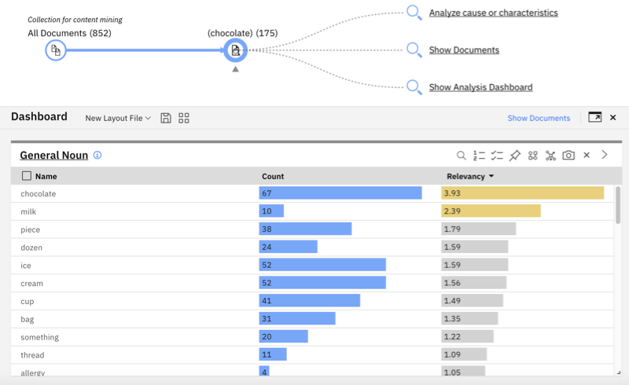

---

copyright:
  years: 2019, 2021
lastupdated: "2021-10-04"

subcollection: discovery-data

---

{{site.data.keyword.attribute-definition-list}}

# Start getting value from your data
{: #product-overview}

Learn what {{site.data.keyword.discoveryfull}} can do to help you find answers, recognize patterns, and gain insights from your data.
{: shortdesc}

Find checklists of the high-level steps to follow to achieve the following goals:

- [Pinpoint answers](#product-overview-answers)
- [Extract meaning](#product-overview-enrich)
- [Enhance your chatbot](#product-overview-chat)
- [Find trends](#product-overview-mining)
- [Analyze contracts](#product-overview-contracts)

## Pinpoint answers
{: #product-overview-answers}

Help customers find answers faster. Analyze content from various connected data sources, pinpoint the most relevant passage or phrase, and return the right information when someone asks for it.

If pinpointing answers is your goal, complete the steps that are listed in the following table.

| Step |  Task | Related information |
|:----:|-------|---------------------|
|  | Create a *Document Retrieval* project. | [Creating projects](/docs/discovery-data?topic=discovery-data-projects) |
|  | Add up to 5 collections that connect to external data sources or contain uploaded files. | [Creating collections](/docs/discovery-data?topic=discovery-data-collections) |
|  | Run test queries to assess the quality of the initial results. | [Previewing the default query results](/docs/discovery-data?topic=discovery-data-query-results) |
|  | Take actions to improve your results. | [Improving your query results](/docs/discovery-data?topic=discovery-data-improvements) |
|  | Deploy your search solution. | [Deploying your project](/docs/discovery-data?topic=discovery-data-deploy) |
{: caption="Checklist for getting answers" caption-side="top"}

## Extract meaning
{: #product-overview-enrich}

Use award-winning natural language processing technology to enrich your data and ensure that the right information is found when someone searches for answers.

If extracting meaning is your goal, complete the steps that are listed in the following table.

| Step | Task | Related information |
|:----:|------|---------------------|
|  | Create any project type. | [Creating projects](/docs/discovery-data?topic=discovery-data-projects) |
|  | Add collections that connect to external data sources or contain uploaded files. | [Creating collections](/docs/discovery-data?topic=discovery-data-collections) |
|  | Chunk large documents into many smaller documents so you can apply more targeted enrichments to the content. | [Using Smart Document Understanding](/docs/discovery-data?topic=discovery-data-configuring-fields) |
|  | Enhance your data by applying built-in NLU enrichments. | [Applying prebuilt enrichments](/docs/discovery-data?topic=discovery-data-nlu) |
|  | Identify and promote terms and patterns from your data with special significance to your use case. | [Adding domain-specific resources](/docs/discovery-data?topic=discovery-data-domain) |
|  | Submit test queries to assess the results. | [Testing your project](/docs/discovery-data?topic=discovery-data-test) |
|  | Create a facet that surfaces the enriched data from your documents. | [Facets](/docs/discovery-data?topic=discovery-data-facets) |
|  | Take actions to improve your results. | [Improving your query results](/docs/discovery-data?topic=discovery-data-improvements) |
|  | Deploy your solution. | [Deploying your project](/docs/discovery-data?topic=discovery-data-deploy) |
{: caption="Checklist for extracting meaning" caption-side="top"}

## Enhance your chatbot
{: #product-overview-chat}

Delight your customers by fortifying your chatbot with an answer to every question. Discovery is designed to work seemlessly with Watson Assistant to search and deliver answers from help content that you already own.

If enhancing your chatbot is your goal, complete the steps that are listed in the following table.

| Step | Task | Related information |
|:----:|------|---------------------|
|  | Create a *Conversational Search* project. | [Creating projects](/docs/discovery-data?topic=discovery-data-projects) |
|  | Add a collection that connects to an external data source or contains uploaded files. | [Creating collections](/docs/discovery-data?topic=discovery-data-collections) If appropriate, enable FAQ extraction to make it easier for the chatbot to find answers to questions. |
|  | Run test queries to assess the quality of the initial results. | [Previewing the default query results](/docs/discovery-data?topic=discovery-data-query-results) |
|  | Take actions to improve your results. | [Improving your query results](/docs/discovery-data?topic=discovery-data-improvements) |
|  | Connect your project to a virtual assistant that is built with Watson Assistant. | [Deploying your project](/docs/discovery-data?topic=discovery-data-deploy) Turn on the *Emphasize the answer* feature to enable answer finding. |
|  | From the Watson Assistant user interface, deploy the assistant. | [Deploying your assistant](/docs/assistant?topic=assistant-deploy-overview){: external} |
{: caption="Checklist for enhancing your chatbot" caption-side="top"}

For help with walking through the steps, complete the [Getting answers from existing help content](/docs/discovery-data?topic=discovery-data-tutorial-convo) tutorial.

## Find trends   
{: #product-overview-mining}

Uncover patterns, trends, and relationships in structured and unstructured data. Use text analytics to gain insights into social media, e-commerce trends, and user behavior. Or start to address problems by finding their root cause.

Only users of installed deployments ({{site.data.keyword.icp4dfull_notm}}) or Premium plan managed deployments can create this type of project.
{: note}

If finding trends in your data is your goal, complete the steps that are listed in the following table.

| Step | Task | Related information |
|:----:|------|---------------------|
|  | Create a *Content Mining* project. | [Creating projects](/docs/discovery-data?topic=discovery-data-projects) |
|  | Add a collection that connects to an external data source or contains uploaded files. | [Creating collections](/docs/discovery-data?topic=discovery-data-collections) |
|  | Run test queries to assess the quality of the initial results. | [Previewing the default query results](/docs/discovery-data?topic=discovery-data-query-results) |
|  | Take actions to improve your results. | [Improving your query results](/docs/discovery-data?topic=discovery-data-improvements) Consider adding facets to categorize documents in meaningful ways. |
|  | Use the built-in Content mining application to analyze your data. | [Using the content mining application](docs/discovery-data?topic=discovery-data-contentminerapp) |
{: caption="Checklist for finding trends" caption-side="top"}

## Analyze contracts   
{: #product-overview-contracts}

Accelerate the pace at which experts can analyze complex documents.

Only users of installed deployments ({{site.data.keyword.icp4dfull_notm}}) or Premium plan managed deployments can create this type of project.
{: note}

If analyzing contracts is your goal, complete the steps that are listed in the following table.

| Step | Task | Related information |
|:----:|------|---------------------|
|  | Create a *Document Retrieval for Contracts* project. | [Creating projects](/docs/discovery-data?topic=discovery-data-projects) |
|  | Add up to 5 collections that connect to external data sources or contain uploaded files. | [Creating collections](/docs/discovery-data?topic=discovery-data-collections) |
|  | Run test queries to assess the quality of the initial results. | [Previewing the default query results](/docs/discovery-data?topic=discovery-data-query-results) |
|  | Take actions to improve your results. | [Improving your query results](/docs/discovery-data?topic=discovery-data-improvements) |
|  | Analyze the data. | [Understanding contracts](/docs/discovery-data?topic=discovery-data-contracts-schema) |
{: caption="Checklist for analyzing contracts" caption-side="top"}
