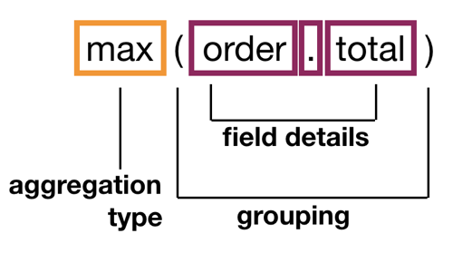

---

copyright:
  years: 2019, 2024
lastupdated: "2023-04-26"

subcollection: discovery-data

---

{{site.data.keyword.attribute-definition-list}}

# Query aggregations
{: #query-aggregations}

Use aggregations to group, analyze, or compare results that are returned by a query request.
{: shortdesc}

An aggregation is defined by an `aggregation` parameter that you can specify in the Query API. The input to the aggregation parameter is the document set that is returned from the `query`, `filter`, or `natural_language_query` parameter that is specified as a separate parameter in the same query request. Otherwise, the aggregation is applied to all of the documents in the project.

You can use an aggregation to do calculatations from values in the result document set. For example, to get information about the highest dollar amount in the `order.total` field of the documents that are returned as query results, use `max(order.total)` as the value of the `aggregation` parameter.

{: caption="Figure 1. Aggregation query structure example" caption-side="bottom"}

The aggregation parameter returns data about the field with the highest value.

```json
"aggregations": [
  {
    "type": "max",
    "field": "order.total",
    "value": 100668.00
  }
]
```
{: codeblock}

## Grouping documents
{: #query-aggregations-group}

In addition to doing calculations, you can use an aggregation to group documents in the result set that match certain values, so you can count them or analyze them further. For example, you can use an aggregation to search a set of traffic incident reports for documents that mention the term `brake`. And from the returned documents, find reports from the US states with the most relevant mentions of the term.

In the following example request, the count parameter that returns only 3 aggregation results is included to make the example easier to follow.

```json
{
    "query":"brake",
    "aggregation": "term(field:STATE,count:3,relevancy:true)"
}
```
{: codeblock}

The output of the aggregation parameter is returned in an `aggregations` object that is displayed before the `results` object, which contains the query results. A maximum of 50,000 values can be returned in the `aggregations` object for a single query.

The resulting `aggregations` object contains summary information about the query results. In this example, for instance, it shows that traffic incident reports from New York, California, and Florida have the most relevant mentions of the term `brake`.

```json
{
  "matching_results": 9064,
  "retrieval_details": {
    "document_retrieval_strategy": "untrained"
  },
  "aggregations": [
    {
      "type": "term",
      "field": "STATE",
      "results": [
        {
          "key": "NY",
          "matching_results": 693,
          "relevancy": 1.1649531567631084,
          "total_matching_documents": 2156,
          "estimated_matching_results": 542
        },
        {
          "key": "CA",
          "matching_results": 1210,
          "relevancy": 1.1170819184294765,
          "total_matching_documents": 4017,
          "estimated_matching_results": 1011
        },
        {
          "key": "FL",
          "matching_results": 511,
          "relevancy": 0.828014956418841,
          "total_matching_documents": 2199,
          "estimated_matching_results": 553
        }
      ]
    }
  ],
  "results": []
```
{: codeblock}

## Combining aggregation types
{: #query-aggregations-combine}

There are different types of aggregations that you can use to analyze or group the query results. And you can combine more than one aggregation in a request to do more targeted analysis.

The following example shows a request that is composed of two term operators. The first term aggregation groups the input documents by US STATE values and selects 3 groups. The second term aggregation applies to each of those 3 groups and groups them further by the value of CITY. Only 2 of those CITY subgroups are returned per STATE group.

The relevancy parameter is being excluded to make the results easier to read.

```json
{
    "query":"brake",
    "aggregation": "term(field:STATE,count:3).term(field:CITY,count:2)"
}
```
{: codeblock}

The response contains city information from each state.

```json
{
  "matching_results": 9064,
  "retrieval_details": {
    "document_retrieval_strategy": "untrained"
  },
  "aggregations": [
    {
      "type": "term",
      "field": "STATE",
      "count": 3,
      "results": [
        {
          "key": "CA",
          "matching_results": 1210,
          "aggregations": [
            {
              "type": "term",
              "field": "CITY",
              "count": 2,
              "results": [
                {
                  "key": "LOS ANGELES",
                  "matching_results": 77
                },
                {
                  "key": "SAN DIEGO",
                  "matching_results": 66
                }
              ]
            }
          ]
        },
        {
          "key": "NY",
          "matching_results": 693,
          "aggregations": [
            {
              "type": "term",
              "field": "CITY",
              "count": 2,
              "results": [
                {
                  "key": "BROOKLYN",
                  "matching_results": 35
                },
                {
                  "key": "NEW YORK",
                  "matching_results": 21
                }
              ]
            }
          ]
        },
        {
          "key": "FL",
          "matching_results": 511,
          "aggregations": [
            {
              "type": "term",
              "field": "CITY",
              "count": 2,
              "results": [
                {
                  "key": "JACKSONVILLE",
                  "matching_results": 33
                },
                {
                  "key": "TAMPA",
                  "matching_results": 29
                }
              ]
            }
          ]
        }
      ]
    }
  ],
  "results": []
```
{: codeblock}

The order in which you specify the aggregations matters. For example, if you reverse the order of the term aggregations from the previous example, you get different results.

```json
{
    "query":"brake",
    "aggregation": "term(field:CITY,count:3).term(field:STATE,count:1)"
}
```
{: codeblock}

The new order produces results that surface Chicago, a city that wasn't included in the previous set of results. When the request starts by grouping by state, Illinois, which has only one city with a high number of traffic incident reports, is not included in the results. New York and Florida, which both have more than one city with many incident reports, produce a higher number of statewide matches and therefore, were returned. When you group by city first, the results change.

```json
{
  "matching_results": 9064,
  "retrieval_details": {
    "document_retrieval_strategy": "untrained"
  },
  "aggregations": [
    {
      "type": "term",
      "field": "CITY",
      "count": 4,
      "results": [
        {
          "key": "LOS ANGELES",
          "matching_results": 77,
          "aggregations": [
            {
              "type": "term",
              "field": "STATE",
              "count": 1,
              "results": [
                {
                  "key": "CA",
                  "matching_results": 77
                }
              ]
            }
          ]
        },
        {
          "key": "SAN DIEGO",
          "matching_results": 66,
          "aggregations": [
            {
              "type": "term",
              "field": "STATE",
              "count": 1,
              "results": [
                {
                  "key": "CA",
                  "matching_results": 66
                }
              ]
            }
          ]
        },
        {
          "key": "CHICAGO",
          "matching_results": 59,
          "aggregations": [
            {
              "type": "term",
              "field": "STATE",
              "count": 1,
              "results": [
                {
                  "key": "IL",
                  "matching_results": 59
                }
              ]
            }
          ]
        }
      ]
    }
    ],
    "results": []
```
{: codeblock}

## Using aggregations to explore enrichments
{: #aggregations-on-enrichments}

The `term()` aggregation is especially useful for analyzing results to find out how many enrichments are recognized in the documents. For example, to count how many times each entity type is recognized in the filtered documents, you can submit the following query parameters:

```json
{
  "filter": "enriched_text.entities:(text::Gilroy,type::Location)",
  "aggregation": "term(enriched_text.entities.type)"
}
```
{: codeblock}

The query first selects the documents that have at least one entity of type `Location` and whose text is `Gilroy`. This action returns 3 documents. From the returned documents, the aggregation then counts the number of documents in which each entity type appears.

```json
{
  "matching_results": 3,
  "retrieval_details": {
    "document_retrieval_strategy": "untrained"
  },
  "aggregations": [
    {
      "type": "term",
      "field": "enriched_text.entities.type",
      "results": [
        {
          "key": "Location",
          "matching_results": 3
        },
        {
          "key": "Person",
          "matching_results": 3
        },
        {
          "key": "Company",
          "matching_results": 2
        },
        {
          "key": "GeographicFeature",
          "matching_results": 2
        },
        {
          "key": "Organization",
          "matching_results": 2
        },
        {
          "key": "Quantity",
          "matching_results": 2
        },
        {
          "key": "Facility",
          "matching_results": 1
        },
        {
          "key": "PrintMedia",
          "matching_results": 1
        }
      ]
    }
  ]
}
```
{: codeblock}

The 3 matching documents all have a `Location` and a `Person` entity type (`"matching_results": 3`). However, only 2 of the matching documents have a `Company` entity type.

By default, the top 10 matches are returned, sorted by relevance. You can change the number of results by adding the `count` parameter to the aggregation.

```json
{
  "filter": "enriched_text.entities:(text::Gilroy,type::Location)",
  "aggregation": "term(enriched_text.entities.type,count:20)"
}
```
{: codeblock}

### Add a filter
{: #aggregation-filter}

Use the `filter()` in the aggregation clause to filter results. For example, you can specify the same filter that was submitted separately in the previous example directly in the `aggregation` clause.

```json
{
  "aggregation": "filter(enriched_text.entities:(text::Gilroy,type::Location)).term(enriched_text.entities.type)"
}
```
{: codeblock}

In this case, the `filter().term()` aggregation finds the same result as the earlier example with the separate  `filter` and `aggregation` clauses. However, results are ranked differently when the  `filter` clause is used. You can leverage this difference by using the `filter()` clause within the  `aggregation` clause to filter results from a sequence of expressions, as shown in the next example.

### Start with nested objects
{: #nested-aggregation}

In the previous examples, the `"matching_counts"` value represents the number of documents that match the filter and aggregation. You might want to count how many *nested* objects are present in the query response. The `nested()` aggregation allows you to change the set of documents that is used as input to other aggregation terms.

For example, in the following query the `nested()` segment selects all `enriched_text.entities` nested objects as the input used by the `filter()` and `term()` segments.

```json
{
  "aggregation": "nested(enriched_text.entities).filter(enriched_text.entities.type::Organization).term(enriched_text.entities.text,count:3)"
}
```
{: codeblock}

The query results in an `aggregations` object that looks as follows:

```json
{
  "aggregations": [
    {
      "type": "nested",
      "path": "enriched_text.entities",
      "matching_results": 1993,
      "aggregations": [
        {
          "type": "filter",
          "match": "enriched_text.entities.type::Organization",
          "matching_results": 645,
          "aggregations": [
            {
              "type": "term",
              "field": "enriched_text.entities.text",
              "count": 3,
              "results": [
                {
                  "key": "IBM",
                  "matching_results": 36
                },
                {
                  "key": "Docker",
                  "matching_results": 12
                },
                {
                  "key": "OpenShift",
                  "matching_results": 12
                }
              ]
            }
          ]
        }
      ]
    }
  ]
}
```
{: codeblock}

The `nested()` segment of the query found 1993 `enriched_text.entities` nested objects. The filter was applied to those objects and found 645 `enriched_text.entities` of type `Organization`.

### Terminal operations
{: #query-aggregation-terminal-ops}

For most aggregation types, when you construct a query with multiple aggregation operations, the first operation is applied to the documents. Then, the output of that operation is used as the input for the next operation. However, a subset of the aggregation types are *terminal operations*. The output of a terminal operation is not used as input for the next aggregation. Instead, the output is returned in a discrete group.

For an example of a request that combines aggregation types and includes an aggregation that performs a terminal operation, see the second [example](#average-example) for the `average` aggregation type.

## Aggregation types
{: #query-aggregation-types}

The following types of aggregations are supported:

-   [average](#average)
-   [filter](#filter)
-   [group_by](#group_by)
-   [histogram](#histogram)
-   [max](#max)
-   [min](#min)
-   [nested](#nested)
-   [pair](#pair)
-   [sum](#sum)
-   [term](#term)
-   [timeslice](#timeslice)
-   [top_hits](#top_hits)
-   [trend](#trend)
-   [topic](#topic)
-   [unique_count](#unique_count)

For Document Retrieval project types, when you don't include an aggregation parameter in a query request, a default aggregation request is applied. For more information, see [Document Retrieval project aggregations](/docs/discovery-data?topic=discovery-data-query-defaults#aggregations-dr).

For more information about how to submit a query, see the {{site.data.keyword.discoveryshort}} [API reference](https://{DomainName}/apidocs/discovery-data#query){: external}.

## average
{: #average}

Returns the mean of values of the specified field across all matching documents.

### Syntax
{: #average-syntax}

```json
average(field)
```
{: codeblock}

### Example
{: #average-example}

| Product | Price |
|---------|-------|
| I Series | 200 |
| J Series | 450 |
| X Series | 325 |
{: caption="Table 1. Sample product prices" caption-side="top"}

When the `average` aggregation type is applied to a set of documents in which the `price` field contains the values that are shown in Table 1, the result is `325`.

```json
average(price)=325
```
{: codeblock}

This aggregation type performs a terminal operation. When combined with other aggregations, the output is not used as input for the next aggregation. The output is returned in a discrete group.

```json
{
    "query":"brake",
    "aggregation": "term(field:STATE,count:3).average(field:VEH_SPEED).term(field:CITY,count:2)"
}
```
{: codeblock}

For each state returned by the first `term` aggregation operation, the response shows the average vehicle speed specified in the incident reports. Notice that the second `term` aggregation uses the output from the first `term` aggregation, not the `average` aggregation, as its input.

```json
{
  "matching_results": 9064,
  "retrieval_details": {
    "document_retrieval_strategy": "untrained"
  },
  "aggregations": [
    {
      "type": "term",
      "field": "STATE",
      "count": 3,
      "results": [
        {
          "key": "CA",
          "matching_results": 1210,
          "aggregations": [
            {
              "type": "average",
              "field": "VEH_SPEED",
              "value": 26.239653512993264
            },
            {
              "type": "term",
              "field": "CITY",
              "count": 2,
              "results": [
                {
                  "key": "LOS ANGELES",
                  "matching_results": 77
                },
                {
                  "key": "SAN DIEGO",
                  "matching_results": 66
                }
              ]
            }
          ]
        }
```
{: codeblock}

## filter
{: #aggfilter}

A modifier that narrows the document set of the aggregation query that it precedes. 

### Syntax
{: #aggfilter-syntax}

```json
filter(field)
```
{: codeblock}

### Example
{: #aggfilter-example}

The following example filters the matching document set to include only documents that mention `IBM`.

```json
filter(enriched_text.entities.text:IBM)
```
{: codeblock}

When combined with other aggregations, filters the matching documents set to include only those documents that meet the condition you specify. 

```json
{
    "query":"brake",
    "aggregation": "filter(VEH_SPEED>50).term(field:STATE,count:3).term(field:CITY,count:2)"
}
```
{: codeblock}

The query response shows cities where incidents happen that involve the brakes and the vehicle speed is over 50.

```json
{
  "matching_results": 9064,
  "retrieval_details": {
    "document_retrieval_strategy": "untrained"
  },
  "aggregations": [
    {
      "type": "filter",
      "match": "VEH_SPEED>50",
      "matching_results": 1075,
      "aggregations": [
        {
          "type": "term",
          "field": "STATE",
          "count": 3,
          "results": [
            {
              "key": "CA",
              "matching_results": 176,
              "aggregations": [
                {
                  "type": "term",
                  "field": "CITY",
                  "count": 2,
                  "results": [
                    {
                      "key": "FONTANA",
                      "matching_results": 6
                    },
                    {
                      "key": "ALTA LOMA",
                      "matching_results": 5
                    }
                  ]
                }
              ]
            }
```
{: codeblock}

## group_by
{: #group_by}

Separates results into groups that you define. 

### Syntax
{: #group_by-syntax}

```json
group_by(condition:[(condition 1),(condition 2)...])
```
{: codeblock}

Each condition must be specified as a valid Discovery Query Language expression surrounded by parentheses. For example, `(age<20)` or `(flavor:chocolate)`. The maximum number of conditions that you can define is 50.

You can optionally include the `relevancy` parameter and set it to `true` to return the relevancy value of the set of documents that meet the specified condition. When `true`, the results are sorted by relevance. When `false`, the results are sorted by the highest number of `matching_results`.

### Example
{: #group_by-example}

The following request looks for documents that mention the term `engine`, and groups them by car manufacturing year. The documents are sorted into 3 groups, one group of traffic incident reports involving cars that were manufactured before 2000, one group for cars manufactured in 2000, and one group for cars manufactured after 2000.

```json
{
    "query":"engine",
    "aggregation": "group_by(condition:[(YEARTXT<2000),(YEARTXT=2000),(YEARTXT>2000)],relevancy:true)"
}
```
{: codeblock}

The results might look like this:

```json
{
  "type": "group_by",
  "results": [
    {
    "key": "YEARTXT<2000",
      "matching_results": 2034,
      "relevancy": 1.0,
      "total_matching_documents": 2034,
      "estimated_matching_results": 2034
    },
    {
      "key": "YEARTXT=2000",
      "matching_results": 1738,
      "relevancy": 1.0,
      "total_matching_documents": 1738,
      "estimated_matching_results": 1738
    },
    {
      "key": "YEARTXT>2000",
      "matching_results": 32708,
      "relevancy": 1.0,
      "total_matching_documents": 32708,
      "estimated_matching_results": 32708
    }
  ]
}
```
{: codeblock}

## histogram
{: #histogram}

Creates numeric interval segments to categorize documents. 

### Syntax
{: #histogram-syntax}

```json
histogram({field},{interval})
```
{: codeblock}

Uses field values from a single numeric field to describe the category. The field that is used to create the histogram must have a number data type, such as `integer`, `float`, `double`, or `date`.

Nonnumber types such as `string` are not supported. For example, `"price": 1.30` is a number value that works, and `"price": "1.30"` is a string, so it doesn’t work.

Use the `interval` argument to define the size of the sections for the results to be split into. Interval values must be whole, nonnegative numbers. Choose a value that makes sense for segmenting the typical values from the field.

Histograms can process decimal values that are specified in a field, but the interval must be a whole number.

You can optionally include a custom name by including a `name` parameter.

### Example
{: #histogram-example}

For example, if your data set includes the price of several items, like: `“price”: 1.30`, `“price”: 1.99`, and `“price”: 2.99`, you might use intervals of `1`, so that you see everything that is grouped in the range `1 - 2`, and `2` and `3`. You do not want to use an interval of `100` because then all of the data ends up in the same segment.

```json
histogram(product_price,interval:1)
```
{: codeblock}

## max
{: #max}

Returns the highest value in the specified field across all matching documents.

### Syntax
{: #max-syntax}

```json
max(field)
```
{: codeblock}

### Example
{: #max-example}

| Product | Price |
|---------|-------|
| I Series | 200 |
| J Series | 450 |
| X Series | 325 |
{: caption="Table 2. Sample product prices" caption-side="top"}

When the `max` aggregation type is applied to a set of documents in which the `price` field contains the values that are shown in Table 2, the result is `450`.

```json
max(price)=450
```
{: codeblock}

This aggregation type performs a terminal operation. When combined with other aggregations, the output is not used as input for the next aggregation. The output is returned in a discrete group.

## min
{: #min}

Returns the lowest value in the specified field across all matching documents.

### Syntax
{: #min-syntax}

```json
min(field)
```
{: codeblock}

### Example
{: #min-example}

| Product | Price |
|---------|-------|
| I Series | 200 |
| J Series | 450 |
| X Series | 325 |
{: caption="Table 3. Sample product prices" caption-side="top"}

When the `min` aggregation type is applied to a set of documents in which the `price` field contains the values that are shown in Table 3, the result is `200`.

```json
min(price)=200
```
{: codeblock}

This aggregation type performs a terminal operation. When combined with other aggregations, the output is not used as input for the next aggregation. The output is returned in a discrete group.

## nested
{: #nested}

Applying `nested` before an aggregation query restricts the aggregation to the area of the results that are specified. 

For example, `nested(enriched_text.entities)` means that only the `enriched_text.entities` components of any result are used to aggregate against.

The following example checks how many mentions are returned per model type.

```json
nested(enriched_text.entities).term(enriched_text.entities.model_name)
```
{: codeblock}

The result shows that there are a total of 50 recognized entities and all of them are of type NLU.

```json
"aggregations": [
  {
    "type": "nested",
    "path": "enriched_text.entities",
    "matching_results": 50,
    "aggregations": [
      {
        "type": "term",
        "field": "enriched_text.entities.model_name",
        "results": [
          {
            "key": "natural_language_understanding",
            "matching_results": 50
          }
        ]
      }
    ]
  }
]
```
{: codeblock}

For another example, see [Starting with nested objects](#nested-aggregation).

## pair
{: #pair}

Analyzes relationships between two fields.

### Syntax
{: #pair-syntax}

```json
pair(first:{aggregation},second:{aggregation})
```
{: codeblock}

The first and second `{aggregation}` values must be one of the following aggregation types:

-  `term`
-  `group_by`
-  `histogram`
-  `timeslice`

The `relevancy` parameter from the `term` or `group_by` aggregation is ignored. The `pair` aggregation type calculates relevancy values by using combinations of document sets from the results of the two aggregations.

Only one pair aggregation can be used per query request, and it cannot be combined with any other aggregations.

### Example
{: #pair-example}

For example, you might specify `term(model_name)` as the first aggregation and `term(component_name)` as the second. Each of the aggregations returns the following values as keys of aggregated document sets:

-  term(model_name): Accord, CR-V
-  term(component_name): engine, brake, radiator

The calculated relevancy values of combinations of each of the document sets might look like this:

-  Accord x engine
-  Accord x brake
-  Accord x radiator
-  CR-V x engine
-  CR-V x brake
-  CR-V x radiator

The response defines a two-dimensional array of aggregation results, which can be represented in a table.

| Car model | Component: engine | Component: brake | Component: radiator |
|-----------|-------------------|------------------|---------------------|
| Accord | Accord x engine | Accord x brake | Accord x radiator |
| CR-V | CR-V x engine | CR-V x brake | CR-V x radiator |
{: row-headers}
{: class="comparison-table"}
{: caption="Table 4. Pair aggregation example" caption-side="top"}
{: summary="This table has row and column headers. The row headers identify car models. The column headers identify car component parts. Each cell calculates a relevancy score by multiplying the car model (row) relevancy value times the car component (header) relevancy value."}

Each array of columns and rows of the table is sorted in the same order of the results of the first and second aggregations. For example, if you specify the `term` aggregation as the first argument, the resulting column arrays are sorted by frequency of terms. If you use the `timeslice` aggregation as the second argument, the row arrays are sorted by date or time.

## sum
{: #sum}

Adds the values of the specified field across all matching documents.

### Syntax
{: #sum-syntax}

```json
sum(field)
```
{: codeblock}

### Example
{: #sum-example}

| Product | Price |
|---------|-------|
| I Series | 200 |
| J Series | 450 |
| X Series | 325 |
{: caption="Table 6. Sample product prices" caption-side="top"}

When the `sum` aggregation type is applied to a set of documents in which the `price` field contains the values that are shown in Table 6, the result is `975`.

```json
sum(price)=975
```
{: codeblock}

This aggregation type performs a terminal operation. When combined with other aggregations, the output is not used as input for the next aggregation. The output is returned in a discrete group.

## term
{: #term}

Indicates the frequency of a term or set of terms in a set of queried documents. 

### Syntax
{: #term-syntax}

```json
term(field:{field_name})
```
{: codeblock}

You can optionally specify the following parameters:

-  `count`: Specifies the maximum number of terms to return.
-  `name`: You can optionally include a custom name. Not returned if relevancy information is included in the request.
-  `relevancy`: Boolean value that indicates whether to include relevancy information in the result. You can use relevancy to get a score that indicates the level of relevancy between the term and keywords in the query. This parameter is `false` by default. If set to true, the following fields are returned also:

    -  `total_matching_documents`: Number of documents in the collection where the term is mentioned in the specified field.
    -  `estimated_matching_results`: Number of documents that are estimated to have the term in the specified field in the set of documents that are returned by the query.

### Example
{: #term-example}

The following example returns the text from the recognized entities in the document, and specifies to return a maximum of 10 terms.

For example:

```json
term(enriched_text.entities.text,count:10)
```
{: codeblock}

When `relevancy` is set to `true`, a relevancy score is shown in the results. Relevancy measures the level of uniqueness of the frequency count compared to other documents that match your query. If the relevancy shows 2.0, it means that the number of times that the two data points intersect is 2 times larger than expected.

For more examples, see [Grouping documents](#query-aggregations-group) and [Combining aggregation types](#query-aggregations-combine).

## timeslice
{: #timeslice}

A specialized histogram that uses dates to create interval segments. 

### Syntax
{: #timeslice-syntax}

The syntax is `timeslice({field},{interval},{time_zone})`.

-  The field that you specify must have a `date` data type. For more information about date field, see [How dates are handled](/docs/discovery-data?topic=discovery-data-index-overview#field-dates).
-  Valid interval values are `1second` or `{n}seconds`, `1minute` or `{n}minutes`, `1hour` or `{n}hours`, `1day` or `{n}days`, `1week` or `{n}weeks`, `1month` or `{n}months`, and `1year` or `{n}years` where {n} is a number.
-  You can optionally include a custom name by including a `name` parameter.

### Example
{: #timeslice-example}

The following example shows the number of matches for each day value.

```json
timeslice(field:DATEA,interval:1day)
```
{: codeblock}

The results look as follows.

```json
"aggregations": [
  {
    "type": "timeslice",
    "field": "DATEA",
    "interval": "1d",
    "results": [
        {
    "key": 1262304000000,
    "key_as_string": "2010-01-01T00:00:00.000Z",
    "matching_results": 5
        },
        {
    "key": 1262390400000,
    "key_as_string": "2010-01-02T00:00:00.000Z",
    "matching_results": 18
        },
        {
    "key": 1262476800000,
    "key_as_string": "2010-01-03T00:00:00.000Z",
    "matching_results": 38
        },
        {
    "key": 1262563200000,
    "key_as_string": "2010-01-04T00:00:00.000Z",
    "matching_results": 66
        }
```
{: codeblock}

## top_hits
{: #top_hits}

Returns the documents ranked by the score of the query or enrichment. Can be used with any query parameter or aggregation. 

### Syntax
{: #top_hits-syntax}

```json
{aggregation}.top_hits({n})
```
{: codeblock}

### Example
{: #top_hits-example}

The following example returns the top hit for the term `halt` per city.

```json
{
  "query":"halt",
  "aggregation": "term(CITY).top_hits(1)"
}
```
{: codeblock}

The response contains the top query results for the term `halt` grouped by cities mentioned in documents where the term is most mentioned. Ten results are returned by default. For each of the 10 cities, the document with the top score is returned as the `hit` object. The content for each `hit` in the `hits` array matches the content in each `result` in the `results` array. Only the order of the results is different.

```json
"aggregations": [
  {
    "type": "term",
    "field": "CITY",
    "results": [
      {
        "key": "LOS ALTOS",
        "matching_results": 3,
        "aggregations": [
          {
            "type": "top_hits",
            "size": 1,
            "hits": {
              "matching_results": 3,
              "hits": [
                {
                  "document_id": "2bed19a9069442fd82542827ebe260d5_7015",
                  ...
                }
              ]
            }
          }
        ]
      },
      {
        "key": "ANDOVER",
        "matching_results": 2,
        "aggregations": [
          {
            "type": "top_hits",
            "size": 1,
            "hits": {
              "matching_results": 2,
              "hits": [
                {
                  "document_id": "2bed19a9069442fd82542827ebe260d5_18329",
                  ...
                }
              ]
            }
          }
        ]
      },
      ...
      {
        "key":"ACTON",
        "maatching_results": 1,
        "aggregations": []
      }
      ...
```
{: codeblock}

This aggregation type performs a terminal operation. When combined with other aggregations, the output is not used as input for the next aggregation. The output is returned in a discrete group.

## trend
{: #trend}

Detects sharp and unexpected changes in the frequency of a keyword value in a specified time period based on the past frequency changes of the keyword value.

### Sytnax
{: #trend-syntax}

```json
trend(facet:{aggregation},time_segments:{aggregation})
```
{: codeblock}

The first (`facet`) aggregation must be one of the following types of aggregations:

-  `term`
-  `group_by`

The `relevancy` parameter from the `term` or `group_by` aggregation is ignored.

The second (`time_segments`) aggregation must be an aggregation of type `timeslice`.

You can alternatively include the following parameters:

-  `show_estimated_matching_results:true`: Indicates whether to include the `estimated_matching_results` information in the result. This field contains the number of documents that are estimated to have the term in the specified field or meet the conditions in the specified aggregation for the specified time interval in the set of documents that are returned by the query.
-  `show_total_matching_documents:true`: Indicates whether to include the `total_matching_documents` information in the result. This field contains the number of documents in the collection where the term is mentioned in the specified field or the condition is met.

Only one trend aggregation can be used per query request, and it cannot be combined with any other aggregations.

### Example
{: #trend-example}

The following example calculates the *trend indicator* or *trend index* by using combinations of results from the following aggregations:

-  term(flavor): vanilla, chocolate, mint
-  timeslice(date, 1month): Jan 2020, Feb 2020, Mar 2020, Apr 2020, May 2020, Jun 2020

```json
trend( facet: aggregation(<parameter>...), time_segments: timeslice(<parameter>...)), 
show_estimated_matching_results: <true_or_false>, show_total_matching_documents: <true_or_false> )
```
{: codeblock}

The resulting matrix can be represented in a table.

| Month in 2020 | Flavor: vanilla | Flavor: chocolate | Flavor: mint |
|---------------|-----------------|-------------------|--------------|
| Jan | vanilla x Jan | chocolate x Jan | mint x Jan |
| Feb | vanilla x Feb | chocolate x Feb | mint x Feb |
| Mar | vanilla x Mar | chocolate x Mar | mint x Mar |
| Apr | vanilla x Apr | chocolate x Apr | mint x Apr |
| May | vanilla x May | chocolate x May | mint x May |
| Jun | vanilla x Jun | chocolate x Jun | mint x Jun |
{: row-headers}
{: class="comparison-table"}
{: caption="Table 5. Trend aggregation example" caption-side="top"}
{: summary="This table has row and column headers. The row headers identify months of the year 2020. The column headers identify ice cream flavors. Each cell calculates a relevancy score by multiplying the month (row) relevancy value times the flavor (header) relevancy value."}

In the following sample response, the key information is the `trend_indicator` value. The trend indicator measures the increase ratio of the frequency of a given facet value for a given time interval compared to the expected average frequency. The excepted average frequency is calculated based on the changes in the past time interval frequencies of the given facet value, using a weighted arithmetic mean.

If the standarized residual value is less than -2, the observed frequency is less than the expected frequency. If it is greater than 2, the observed frequency is greater than the expected frequency. If the standardized residual is greater or less than the expected frequency by 3 or more, then something unusual is happening and suggests that there might be an anomaly that is worth investigating.

For example, the expected number of feedback submissions for the `vanilla` flavor in May is calculated from the number of feedback submissions that were received previously (from Jan to Apr). The result is `5.341`. The actual number of feedback submissions in May is `10`. The results indicate that the vanilla flavor got about twice the number of feedback submissions as expected. The standardized residual value is `2.016`, which is greater than expected, but not unusually so.

```json
{
"aggregations": [
  {
    "type": "trend",
    "facet": "term(flavor),",
    "time_segments": "timeslice(date, 1month)",
    "show_estimated_matching_results": true,
    "show_total_matching_documents": true,
    "results": [
      {
        "aggregations": [
          {
            "type": "term",
            "field": "flavor",
            "results": [
              {
                "key": "vanilla",
                "matching_results": 36,
                "aggregations": [
                  {
                    "type": "timeslice",
                    "field": "date",
                    "results": [
                      {
                        "key": 1577836800000,
                        "key_as_string": "2020-01-01T00:00:00.000Z",
                        "matching_results": 4,
                        "trend_indicator": 0.0,
                        "total_matching_documents": 7,
                        "estimated_matching_results": 0.0
                      },
                      {
                        "key": 1588291200000,
                        "key_as_string": "2020-05-01T00:00:00.000Z",
                        "matching_results": 10,
                        "trend_indicator": 2.016106745,
                        "total_matching_documents": 12,
                        "estimated_matching_results": 5.340760209
                      },
                      {
                        "key": 1590969600000,
                        "key_as_string": "2020-06-01T00:00:00.000Z",
                        "matching_results": 5,
                        "trend_indicator": -0.763212711,
                        "total_matching_documents": 11,
                        "estimated_matching_results": 7.022515985
                      }
                    ]
                  }
                ]
              },
              {
                "key": "chocolate",
                "matching_results": 10,
                "aggregations": [...]
              },
              {
                "key": "mint",
                "matching_results": 25,
                "aggregations": [...]
...
}  
```
{: codeblock}

## topic
{: #topic}

Detects how much the frequency of a keyword value deviates from the expected average for the specified time period. This aggregation type does not use data from previous time periods. It calculates an index by using the averages of frequency counts of other keyword values for the specified time period.

### Syntax
{: #topic-syntax}

```json
topic(facet:{aggregation},time_segments:{aggregation})
```
{: codeblock}

The first (`facet`) aggregation must be one of the following types of aggregations:

-  `term`
-  `group_by`

The `relevancy` parameter from the `term` or `group_by` aggregation is ignored.

The second (`time_segments`) aggregation must be an aggregation of type `timeslice`.

You can alternatively include the following parameters:

-  `show_estimated_matching_results:true`: Indicates whether to include the `estimated_matching_results` information in the result. This field contains the number of documents that are estimated to have the term in the specified field or meet the conditions in the specified aggregation for the specified time interval in the set of documents that are returned by the query.
-  `show_total_matching_documents:true`: Indicates whether to include the `total_matching_documents` information in the result. This field contains the number of documents in the collection where the term is mentioned in the specified field or the condition is met.

Only one topic aggregation can be used per query request, and it cannot be combined with any other aggregations.

### Example
{: #topic-example}

```json
{
    "query: like",
    "aggregation": "topic( facet: term(flavor), time_segments: timeslice(date, 1month), show_estimated_matching_results: true, show_total_matching_documents: true )"
}
```
{: codeblock}

With the same data set and aggregation as is used in the term aggregation example, the results might look as follows.

Notice that the `topic_indicator` values are different from the `trend_indicator` values that are returned by the `trend` aggregation. While both are calculated from the actual and expected frequencies, they differ because their expected frequencies are computed differently. In the `trend` aggregation, the expected frequency of the feedback submissions for vanilla-flavored ice cream in May is computed from the number of feedback submissions that were received for vanilla previously (from Jan to Apr) and the total number of feedback submissions received for all of the flavors in May. However, in the `topic` aggregation, the expected frequency of feedback submissions for vanilla-flavored ice cream in May is calculated from the number of feedback submissions that were received for vanilla and the total number of feedback submissions received for all of the flavors in May. In this example, the expected frequency result is `12.169`, the actual frequency is `10`, and the `topic_indicator` is `-0.621777032`.

```json
{
"aggregations": [
  {
    "type": "topic",
    "facet": "term(flavor)",
    "time_segments": "timeslice(date, 1month)",
    "show_estimated_matching_results": true,
    "show_total_matching_documents": true,
    "results": [
      {
        "aggregations": [
          {
            "type": "term",
            "field": "flavor",
            "results": [
              {
                "key": "vanilla",
                "matching_results": 36,
                "aggregations": [
                  {
                    "type": "timeslice",
                    "field": "date",
                    "results": [
                      {
                        "key": 1577836800000,
                        "key_as_string": "2020-01-01T00:00:00.000Z",
                        "matching_results": 4,
                        "topic_indicator": -0.027972712,
                        "total_matching_documents": 7,
                        "estimated_matching_results": 4.056338028
                      },
                      {
                        "key": 1588291200000,
                        "key_as_string": "2020-05-01T00:00:00.000Z",
                        "matching_results": 10,
                        "topic_indicator": -0.621777032,
                        "total_matching_documents": 12,
                        "estimated_matching_results": 12.16901408
                      },
                      {
                        "key": 1590969600000,
                        "key_as_string": "2020-06-01T00:00:00.000Z",
                        "matching_results": 5,
                        "topic_indicator": -0.787665504,
                        "total_matching_documents": 11,
                        "estimated_matching_results": 7.098591549
                      }
                    ]
                  }
                ]
              },
              {
                "key": "chocolate",
                ...
              },
              {
                "key": "mint",
                ...
              }
}
```
{: codeblock}

## unique_count
{: #unique_count}

Returns a count of the unique instances of the specified field in the collection.

### Syntax
{: #unique_count-syntax}

```json
unique_count(field)
```
{: codeblock}

### Example
{: #unique_count-example}

The following aggregation requests the number of unique enrichment types that are recognized in the query.

```json
unique_count(enriched_text.keyword.type)
```
{: codeblock}

The result indicates that there are 17 matching results. In those 17 documents, 14 entity types are mentioned.

```json
{
  "matching_results": 17,
  "retrieval_details": {
    "document_retrieval_strategy": "untrained"
  },
  "aggregations": [
    {
      "type": "unique_count",
      "field": "enriched_text.entities.type",
      "value": 14.0
    }
  ],
  "results": []
}
```
{: codeblock}

This aggregation type performs a terminal operation. When combined with other aggregations, the output is not used as input for the next aggregation. The output is returned in a discrete group.

In the following example, the aggregation parameter requests for the results to show the first 45 most-frequently mentioned entities. Per entity, it indicates how many documents mention the term and how many times in total that the term occurs.

```json
term(enriched_text.entities.text,count:45).unique_count(enriched_text.entities.type)
```
{: codeblock}

The results include several aggregations such as the following group for the term `PostgreSQL`. The aggregation indicates that the term appears in 4 documents and is mentioned 12 times.

```json
{
  "key": "PostgreSQL",
  "matching_results": 4,
  "aggregations": [
    {
      "type": "unique_count",
      "field": "enriched_text.entities.type",
      "value": 12.0
    }
  ]
}
```
{: codeblock}
