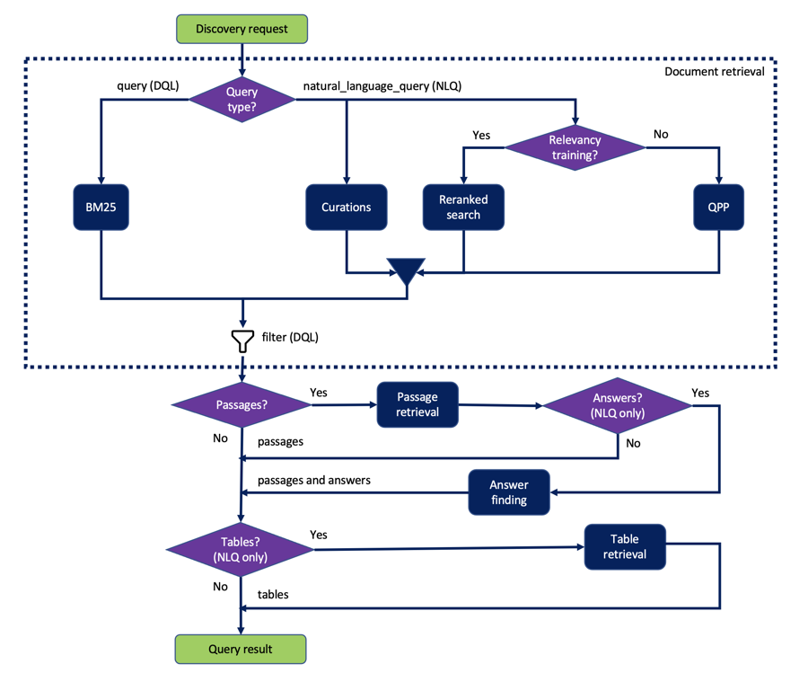

---

copyright:
  years: 2019, 2022
lastupdated: "2022-08-12"

keywords: search goals

subcollection: discovery-data

---

{{site.data.keyword.attribute-definition-list}}

# Query overview
{: #query-concepts}

{{site.data.keyword.discoveryfull}} offers powerful content search capabilities through search queries. After your content is uploaded and customized by {{site.data.keyword.discoveryshort}}, you can build queries, integrate {{site.data.keyword.discoveryshort}} into your own projects, or create a custom application.
{: shortdesc}

## Query types
{: #query-dql-params}

{{site.data.keyword.discoveryshort}} accepts queries that are written in either natural language or that use a syntax called the Discovery Query Language (DQL) that can search for values in specific fields in your documents, for example.

The following parameters of the Query API accept the {{site.data.keyword.discoveryshort}} Query Language syntax:

- `filter`
- `query`
- `aggregation`

These Discovery Query Language parameters are not available from the product user interface.
{: note}

The `natural_language_query` parameter accepts text strings as input, not query language syntax. Queries that are submitted from the product user interface are natural language queries.

A few other supported Query API parameters are specified and given default values based on the project type in use. For more information, see [Default query settings](/docs/discovery-data?topic=discovery-data-query-defaults).

For more information about the {{site.data.keyword.discoveryshort}} Query Language, see [DQL overview](/docs/discovery-data?topic=discovery-data-query-dql-overview) or see the [API reference documentation](https://cloud.ibm.com/apidocs/discovery-data#query){: external}.

## Choosing the right query type
{: #query-choose}

The following table summarizes the capabilities that are supported for each query type. Use it to help you determine which type of query to submit.

| Goal | Natural Language Query (NLQ) | {{site.data.keyword.discoveryshort}} Query Language (DQL) |
|------|-----|-----|
| Return passages from documents |  |  |
| Search specific document fields or enrichments | |  |
| Use operators, such as Boolean clauses in the search | |  |
| Add curations to return hardcoded answers to certain questions |  | |
| Use relevancy training |  |  |
| Enable answer finding to return a succinct answer from a passage |  | |
| Use table retrieval |  | |
{: row-headers}
{: class="comparison-table"}
{: caption="Query types comparison" caption-side="top"}
{: summary="This table has row and column headers. The row headers identify query types. The column headers identify different goals you might have when you submit a query. To understand which query to use to support your goal, go to the row that describes the goal, and find the column that identifies the query type that supports your goal."}

## Query flow
{: #query-flow}

The following diagram shows a conceptual illustration of how a search request is handled by {{site.data.keyword.discoveryshort}}.



The following processes are shown in the flow diagram:

BM25
:    Uses Best Match 25 (a probabilistic information retrieval algorithm) to compute a relevance score for each document returned by search. The diagram shows that BM25 is applied to document results from the query requests, but it is not limited to query requests. It also is used along with other techniques as part of the relevancy training ranker process that is applied to natural language query results.

Curations
:    If the natural language query matches a predefined curation query, then certain documents and possibly a hardcoded snippet are returned. There is no query parameter to enable a curation. For curations to be used, you must define them programmatically ([Create curation method](/apidocs/discovery-data#createcuration){: external}). The output of any curations is merged with the output of the Relevancy training ranker or QPP results.

Relevancy training
:    A model that you can optionally define and apply to a project to score documents for relevance. There is no query parameter to enable relevancy training. For relevancy training to be used, you must successfully train the project either programmatically ([Create training query method](/apidocs/discovery-data#createtrainingquery){: external}) or by using the product user interface.

QPP
:    A Query Performance Prediction algorithm that, given a query and a list of top results, produces a score that determines how relevant a document is. Used only if no Relevancy training ranker is available.

filter
:    The `filter` parameter can be passed along with `query` and `natural_language_query` requests to remove documents that don't meet certain criteria from the result set. The filter is shown as the last step within the document retrieval phase. However, it is used at different times in the flow. Its placement in the diagram is chosen to emphasize the fact that any documents that don't match the filter definition are excluded from the result set. The exclusion applies even to documents that might be specified in a curation.

Passage retrieval
:    Returns passages from documents when the `passages.enabled=true` parameter is included with a natural language query request.

Answer finding
:    When the `passages.find_answers=true` parameter is included with a natural language query request, returns succinct answers from passages along with the passages that are extracted from documents. If answer finding is enabled, then the final confidence score for each search result is a combination of the confidence scores from answer finding, passage retrieval, and QPP or Reranked search, whichever method is used.

Table retrieval
:    Returns information from tables in documents when the `table_results.enabled=true` parameter is included with a natural language query request.

## Query limits
{: #query-limits}

A query is any operation that submits a `POST` request to the `/query` endpoint of the API. Such operations include queries that are submitted by using the API. It does not include queries that are submitted from the search bar on the *Improve and customize* page of the product user interface.

A query is counted only if the request is successful, meaning it returns a response (with message code 200).

The number of search queries that you can submit per month per service instance depends on your {{site.data.keyword.discoveryshort}} plan type.

| Plan | Queries per month per service instance |
|--------------|-------------------------------:|
| Cloud Pak for Data |                Unlimited |
| Premium      |                      Unlimited |
| Enterprise |                        Unlimited |
| Plus (includes Trial)        |        500,000 |
{: caption="Number of queries per month" caption-side="top"}

For Enterprise plans only, your bill labels requests that are generated from both query searches and analyze API calls as "Queries". For more information about Analyze API calls, see [Analyze API limits](/docs/discovery-data?topic=discovery-data-analyzeapi#analyzeapi-limits).
{: note}

The number of queries that can be processed per second per service instance depends on your {{site.data.keyword.discoveryshort}} plan type.

| Plan | Concurrent queries per service instance |
|--------------|--------------------------------:|
| Cloud Pak for Data |                 Unlimited |
| Premium      |                              50 |
| Enterprise |                                 5 |
| Plus (includes Trial) |                      5 |
{: caption="Number of concurrent queries" caption-side="top"}

For information about pricing, see [{{site.data.keyword.discoveryshort}} pricing plans](/docs/discovery-data?topic=discovery-data-pricing-plans).

## Estimating query usage
{: #query-estimate}

How to estimate the number of queries your application will use per month depends on your use case.

- For use cases that focus more on data enrichment and analysis or where the output from the document processing is not heavily searched, you can estimate query numbers based on the total number of documents.
- For use cases where many users interact with the application that uses {{site.data.keyword.discoveryshort}}, you can estimate by calculating the number of searches per user times the number of expected users. For example, 50% of the questions that are submitted by users to a virtual assistant are likely to be answered by {{site.data.keyword.discoveryshort}}. With 100,000 users per month and an average of 3 questions per user, you can expect 15,000 queries per month. (10,000 users/mo * 3 queries/user * 50% to {{site.data.keyword.discoveryshort}} = 15,000)

## Querying with document-level security enabled
{: #querydls}

 **{{site.data.keyword.icp4dfull_notm}} only**

This information applies only to installed deployments.
{: note}

If you enable document-level security for a collection, only documents that the current user has permission to access are returned in search results. For more information, see [Configuring document-level security](/docs/discovery-data?topic=discovery-data-collection-types#configuredls).

To return search results that adhere to the security restrictions, the current user must meet these requirements:

- Have access to your {{site.data.keyword.discoveryshort}} instance.
- Have access to the data source.

If the current user does not meet these requirements, no search results are returned.

The username that is associated with your {{site.data.keyword.discoveryshort}} instance is used to generate an authorization token. The token is used to authenticate {{site.data.keyword.discoveryshort}} queries.

To generate each access token, run the following command:

```bash
curl -u "{username}:{password}" \
"https://{hostname}:{port}/v1/preauth/validateAuth"
```
{: pre}

Replace `{username}` and `{password}` with the user's {{site.data.keyword.discoveryshort}} credentials.

Use the bearer token that is associated with the user when you run the query.

```bash
curl -H "Authorization: Bearer {token}" \
'https://{hostname}/{instance_name}/v2/projects/{project_id}/collections/{Collection_ID}/query\?version\=2019-11-29'
```
{: pre}
