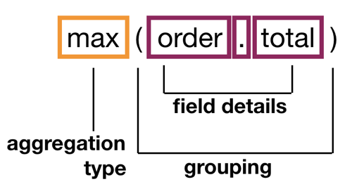

---

copyright:
  years: 2019, 2021
lastupdated: "2021-08-11"

subcollection: discovery-data

---

{:shortdesc: .shortdesc}
{:external: target="_blank" .external}
{:tip: .tip}
{:note: .note}
{:pre: .pre}
{:important: .important}
{:deprecated: .deprecated}
{:codeblock: .codeblock}
{:screen: .screen}
{:download: .download}
{:hide-dashboard: .hide-dashboard}
{:apikey: data-credential-placeholder='apikey'} 
{:url: data-credential-placeholder='url'}
{:curl: .ph data-hd-programlang='curl'}
{:javascript: .ph data-hd-programlang='javascript'}
{:java: .ph data-hd-programlang='java'}
{:python: .ph data-hd-programlang='python'}
{:ruby: .ph data-hd-programlang='ruby'}
{:swift: .ph data-hd-programlang='swift'}
{:go: .ph data-hd-programlang='go'}

# Query API overview
{: #query-concepts}

{{site.data.keyword.discoveryfull}} offers powerful content search capabilities through queries. After your content is uploaded and customized by {{site.data.keyword.discoveryshort}}, you can build queries, integrate {{site.data.keyword.discoveryshort}} into your own projects, or create a custom application.
{: shortdesc}

For more information about the Query API, see the [API reference documentation](https://cloud.ibm.com/apidocs/discovery-data#query){: external}.

On the *Improve and customize* page of the {{site.data.keyword.discoveryshort}} user interface, you can submit natural language queries only. A few other supported Query API parameters are specified and given default values based on the project type in use. For more information, see [Default query settings](/docs/discovery-data?topic=discovery-data-query-defaults).
{: important}

## Discovery Query Language
{: #query-dql-params}

The Discovery Query Language defines syntax you can use to filter, search, and analyze your data. The following parameters of the Query API accept the Discovery Query Language syntax:

- `filter`
- `query`
- `aggregation`

The `natural_language_query` parameter accepts text strings as input, not query language syntax.

## How to write a Discovery Query Language query
{: #structure-basic-query}

The Discovery Query Language leverages the structure of indexed documents. The following JSON snippet shows an indexed document from a collection where the *Entities* enrichment is applied. As a result of the enrichment, the JSON structure captures any mentions of known entities, such as city names, companies, or famous people. 

In this example, the recognized entity is the company name `IBM`.

```json
{
  "document": {
      "document_id": "f7f27ea30eb3e4c0ce21830618d9ee99",
      "enriched_text": [
          {
              "entities": [
                  {
                      "model_name": "natural_language_understanding",
                      "mentions": [],
                      "text":"IBM",
                      "type":"Organization"
                  }
              ]
          }
      ]
  }
}
```
{: codeblock}

To create a query that returns all of the documents in which the entity `IBM` is mentioned, use the following syntax:


This basic query contains a nested path expression before the `:` operator. Each path element is the name of a field in the document separated by a period (`.`). The `:` operator indicates that the text that follows the operator must be included in the result.

The `::` operator indicates that the text must be matched exactly in the result. For more information, see [Query operators](/docs/discovery-data?topic=discovery-data-query-operators). You can see how the two operators are used in the following examples.

- To return matching document in order of relevance, pass the following data object in the POST request:

  ```json
  {
	"query":"enriched_text.entities.text:IBM"
  }
  ```
  {: codeblock}

- To return matching documents in any order, pass the following data object in the POST request as the query body:

  ```json
  {
	"filter":"enriched_text.entities.text::IBM"
  }
  ```
  {: codeblock}

## Using the filter and query parameters together
{: #query-concepts-filter-and-query}

The `filter` parameter returns faster than the `query` parameter and its results are cached. If you submit queries that use the `filter` and `query` parameters separately on a small data set, each request returns similar (if not identical) results.

In large data sets, if you need results to be returned in order of relevance, combine the `filter` and `query` parameters. Using the parameters together improves performance because the `filter` parameter is applied first. It filters the documents and caches the results. The `query` parameter then ranks the cached results.

### Filter example: Get a document by its ID
{: #query-concepts-filter-by-docid}

Query body:

```json
{
    "filter": "document_id::b6d8c6e3-1097-421b-9e39-75717d2554aa"
}
 ```
 {: codeblock}
 
If the document exists, the query returns 1 matching result. If it doesn't, the query returns no matching results.

### Filter example: Find a document ID by its file name
{: #query-concepts-filter-by-filename}

If you don't know the `document_id` of a document, but you know the original `filename` of the document, you can use the `filter` and `return` parameters together to discover the `document_id`.

Query body:

```json
{
    "filter": "extracted_metadata.filename::100674.txt",
    "return": [ "document_id", "extracted_metadata" ]
}
```
{: codeblock}

Response:

```json
{
    "matching_results": 1,
    "results": [
        {
            "document_id": "b6d8c6e3-1097-421b-9e39-75717d2554aa",
            "extracted_metadata": {
                "sha1": "AD447F7592A17CDCBF0A589C4E6EC2087AF7H35F",
                "filename": "100674.txt",
                "file_type": "text"
            }
        }
    ]
}
```
{: codeblock}

### Filter example: Find documents that mention an entity value

The query looks for documents that mention the entity `Gilroy` and finds 4 matching documents.

Query body:

```json
{
    "filter": "enriched_text.entities.text::Gilroy"
}
```
{: codeblock}

Response:

```json
{
    "matching_results": 4
}
```
{: codeblock}

## Filtering nested values
{: #query-concepts-filter-nest}

You can nest one filter inside another to ensure that the documents that are returned match more than one condition.

In the documents used for these examples, the entity `"Gilroy"` appears as both a `"Location"` (a town in California) and as a `"Person"` (a surname) entity type. To find documents where `"Gilroy"` appears as a location, write a query that filters on two nested fields at the same time: the entity text must be `"Gilroy"` and the entity type must be `"Location"`.

One way to write the query is as follows:

```json
{
    "filter": "enriched_text.entities.text::Gilroy,enriched_text.entities.type::Location"
}
```
{: codeblock}

This query matches documents where some path `enriched_text.entities.text` is `Gilroy` and some path `enriched_text.entities.type::Location` is `Location`. However, there is no guarantee that those two paths will be under the same `entities` object. For example, the query matches documents that have `Gilroy` as a `Person` entity type and, at the same time, have some other `Location` entity type object.

To accurately capture the nested semantics of this query, nest the filter values by using the following syntax:

Query body:

```json
{
    "filter": "enriched_text.entities:(text::Gilroy,type::Location)"
}
```
{: codeblock}

This stricter query matches only those documents in which there is an `entities` object with `text` equal to `Gilroy` and `type` equal to `Location`.

As another example, if you want to match documents that contain an `entities` object with `text` equal to `Gilroy` but `type` **not** equal to `Location`, you can use the 
*not equal* operator in the query, for example:

```json
{
    "filter": "enriched_text.entities:(text::Gilroy,type::!Location)"
}  
```
{: codeblock}

## Using aggregations
{: #structure-aggregation}

Use aggregations to collect information from your documents. For example, you can use an aggregation to get the maximum, minimum, or average value for a field from across a set of documents.

To create a query that returns the document with the highest dollar amounts in the `order.total` field, use the following syntax:



The aggregation parameter returns data about the field with the highest value.

```json
"aggregations": [
        {
            "type": "max",
            "field": "order.total",
            "value": 100668.00
        }
]
```
{: codeblock}

For more information about the available aggregation types, see [Query aggregations](/docs/discovery-data?topic=discovery-data-query-aggregations).

### Example: Term aggregation
{: #term-aggregation}

To continue with the sample documents that were used in the earlier examples, you might want to know how many times each entity type is recognized in the filtered documents. To find out, you can use the `term` aggregation type.

```json
{
     "filter": "enriched_text.entities:(text::Gilroy,type::Location)",
     "aggregation": "term(enriched_text.entities.type)"
}
```
{: codeblock}

The response shows that there were 3 matching results, which means that only 3 documents are returned. The `aggregations` object summarizes the entity types that were found in those 3 documents.

```json
{
    "matching_results": 3,
    "retrieval_details": {
        "document_retrieval_strategy": "untrained"
    },
    "aggregations": [
        {
            "type": "term",
            "field": "enriched_text.entities.type",
            "results": [
                {
                    "key": "Location",
                    "matching_results": 3
                },
                {
                    "key": "Person",
                    "matching_results": 3
                },
                {
                    "key": "Company",
                    "matching_results": 2
                },
                {
                    "key": "GeographicFeature",
                    "matching_results": 2
                },
                {
                    "key": "Organization",
                    "matching_results": 2
                },
                {
                    "key": "Quantity",
                    "matching_results": 2
                },
                {
                    "key": "Facility",
                    "matching_results": 1
                },
                {
                    "key": "PrintMedia",
                    "matching_results": 1
                }
            ]
        }
    ]
}
```
{: codeblock}

The `Location` and `Person` entity types each occur 3 times. That result shows that at least one location and one person entity mention were detected in each document.

By default, the top 10 matches are returned, sorted by relevance. You can change the number of results by adding the `count` parameter to the aggregation.

```json
{
     "filter": "enriched_text.entities:(text::Gilroy,type::Location)",
     "aggregation": "term(enriched_text.entities.type,count:20)"
}
```
{: codeblock}

### Examples: Filter aggregation
{: #filter-aggregation}

You can filter documents as part of the aggregation itself rather than specifying it as a separate name and value pair in the JSON block.

```json
{
    "aggregation": "filter(enriched_text.entities:(text::Gilroy,type::Location)).term(enriched_text.entities.type)"
}
```
{: codeblock}

### Example: Nested aggregation
{: #nested-aggregation}

To find out how many mentions of each entity type occur in the filtered documents, use the `nested` aggregation type. 

For example, look at the differences between the following queries:

- `filter(enriched_text.entities.type::Organization)`: Counts the number of *results* that contain one or more entities with the type `Organization`. The matching results are typically equal to or less than the number of documents.
- `nested(enriched_text.entities).filter(enriched_text.entities.type::Organization)`: Counts every occurrence of an entity with the type `Organization` in the results. The matching results are typically much higher than when you use filter alone.

Subsequent operations restrict the result set that you can aggregate. For example:

- `nested(enriched_text.entities).filter(enriched_text.entities.type::Organization).term(enriched_text.entities.text,count:3)`: Aggregates the top three entities of type `Organization`. 

A resulting `aggregations` object might look like this:

```json
{
      "aggregations": [
        {
            "type": "nested",
            "path": "enriched_text.entities",
            "matching_results": 1993,
            "aggregations": [
                {
                    "type": "filter",
                    "match": "enriched_text.entities.type::Organization",
                    "matching_results": 645,
                    "aggregations": [
                        {
                            "type": "term",
                            "field": "enriched_text.entities.text",
                            "count": 3,
                            "results": [
                                {
                                    "key": "IBM",
                                    "matching_results": 36
                                },
                                {
                                    "key": "Docker",
                                    "matching_results": 12
                                },
                                {
                                    "key": "OpenShift",
                                    "matching_results": 12
                                }
                            ]
                        }
                    ]
                }
            ]
        }
    ],
}
```
{: codeblock}

## Query limits
{: #query-limits}

A query is any operation that submits a POST request to the `/query` endpoint of the API. Such operations include queries that are submitted from the search bar on the *Improve and customize* page and by using the API. A query is counted only if the request is successful, meaning it returns a response (with message code 200).

The number of search queries that you can submit per month per service instance depends on your {{site.data.keyword.discoveryshort}} plan type.

| Plan | Queries per month per service instance |
|--------------|--------------------------------:|
| Cloud Pak for Data |                 Unlimited |
| Premium      |                       Unlimited |
| Plus (includes Trial)         |        500,000 |
{: caption="Number of queries per month" caption-side="top"}

The number of queries that can be processed per second per service instance depends on your {{site.data.keyword.discoveryshort}} plan type.

| Plan | Concurrent queries per service instance |
|--------------|--------------------------------:|
| Cloud Pak for Data |                 Unlimited |
| Premium      |                              50 |
| Plus (includes Trial) |                      5 |
{: caption="Number of concurrent queries" caption-side="top"}

For more information about the supported number of queries for Lite and Advanced plan instances, see [Discovery pricing plans](/docs/discovery?topic=discovery-discovery-pricing-plans#advanced){: external} in the earlier version of the product documentation.

## Estimating query usage
{: #query-estimate}

How to estimate the number of queries your application will use per month depends on your use case. 

- For use cases that focus more on data enrichment and analysis or where the output from the document processing is not heavily searched, you can estimate query numbers based on the total number of documents.
- For use cases where many users interact with the application that leverages Discovery, you can estimate by calculating the number of searches per user times the number of expected users. For example, 50% of the questions that are submitted by users to a virtual assistant are likely to be answered by Discovery. With 100,000 users per month and an average of 3 questions per user, you can expect 15,000 queries per month. (10,000 users/mo * 3 queries/user * 50% to Discovery = 15,000)

## Querying with document level security enabled
{: #querydls}

 **{{site.data.keyword.icp4dfull_notm}} only**

This information applies only to installed deployments.
{:note}

If you enable document level security for a collection, only documents that the current user has permission to access are returned in search results. For more information, see [Configuring document level security](/docs/discovery-data?topic=discovery-data-collection-types#configuredls).

To return search results that adhere to the security restrictions, the current user must meet these requirements:

- Have access to your {{site.data.keyword.discoveryshort}} instance.
- Have access to the data source.

If the current user does not meet these requirements, no search results are returned.

The username that is associated with your {{site.data.keyword.discoveryshort}} instance is used to generate an authorization token. The token is used to authenticate {{site.data.keyword.discoveryshort}} queries.

To generate each access token, run the following command:
 
```bash
curl -u "{username}:{password}" "https://{hostname}:{port}/v1/preauth/validateAuth"
```
{: pre}
   
Replace `{username}` and `{password}` with the user's {{site.data.keyword.discoveryshort}} credentials.

Use the bearer token that is associated with the user when you run the query. For example:

```bash
curl -H "Authorization: Bearer {token}" 'https://{hostname}/{instance_name}/v2/projects/{project_id}/collections/{Collection_ID}/query\?version\=2019-11-29'
```
{: pre}

## More resources
{: #query-api-resources}

For more information about the {{site.data.keyword.discoveryshort}} Query Language, see the following topics:

- [Query parameters](/docs/discovery-data?topic=discovery-data-query-parameters)
- [Query operators](/docs/discovery-data?topic=discovery-data-query-operators)
- [Query aggregations](/docs/discovery-data?topic=discovery-data-query-aggregations)
- [Query reference](/docs/discovery-data?topic=discovery-data-query-reference)