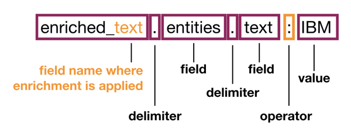

---

copyright:
  years: 2019, 2023
lastupdated: "2022-10-14"

keywords: Discovery Query Language, DQL

subcollection: discovery-data

---

{{site.data.keyword.attribute-definition-list}}

# DQL overview
{: #query-dql-overview}

The {{site.data.keyword.discoveryshort}} Query Language defines syntax you can use to filter, search, and analyze your data. 
{: shortdesc}

## How to write a {{site.data.keyword.discoveryshort}} Query Language query
{: #structure-basic-query}

The {{site.data.keyword.discoveryshort}} Query Language leverages the structure of indexed documents. The following JSON snippet shows an indexed document from a collection where the *Entities* enrichment is applied. As a result of the enrichment, the JSON structure captures any mentions of known entities, such as city names, companies, or famous people.

In this example, the recognized entity is the company name `IBM`.

```json
{
  "document": {
    "document_id": "f7f27ea30eb3e4c0ce21830618d9ee99",
    "enriched_text": [
      {
        "entities": [
          {
            "model_name": "natural_language_understanding",
            "mentions": [],
            "text":"IBM",
            "type":"Organization"
          }
        ]
      }
    ]
  }
}
```
{: codeblock}

To create a query that returns all of the documents in which the entity `IBM` is mentioned, use the following syntax:



This basic query contains a nested path expression before the `:` operator. Each path element is the name of a field in the document separated by a period (`.`). The `:` operator indicates that the text that follows the operator must be included in the result.

The `::` operator indicates that the text must be matched exactly in the result. For more information, see [Query operators](/docs/discovery-data?topic=discovery-data-query-operators). You can see how the two operators are used in the following examples.

-   To return matching documents in order of relevance, pass the following data object in the `POST` request:

    ```json
    {
      "query":"enriched_text.entities.text:IBM"
    }
    ```
    {: codeblock}

-   To return matching documents in any order, pass the following data object in the `POST` request as the query body:

    ```json
    {
      "filter":"enriched_text.entities.text::IBM"
    }
    ```
    {: codeblock}

## Using the filter and query parameters together
{: #query-concepts-filter-and-query}

The `filter` parameter returns faster than the `query` parameter and its results are cached. If you submit queries that use the `filter` and `query` parameters separately on a small data set, each request returns similar (if not identical) results.

In large data sets, if you need results to be returned in order of relevance, combine the `filter` and `query` parameters. Using the parameters together improves performance because the `filter` parameter is applied first. It filters the documents and caches the results. The `query` parameter then ranks the cached results.

### Filter example: Get a document by its ID
{: #query-concepts-filter-by-docid}

Query body:

```json
{
  "filter": "document_id::b6d8c6e3-1097-421b-9e39-75717d2554aa"
}
```
{: codeblock}

If the document exists, the query returns 1 matching result. If it doesn't, the query returns no matching results.

### Filter example: Find a document ID by its file name
{: #query-concepts-filter-by-filename}

If you don't know the `document_id` of a document, but you know the original `filename` of the document, you can use the `filter` and `return` parameters together to discover the `document_id`.

Query body:

```json
{
  "filter": "extracted_metadata.filename::100674.txt",
  "return": [ "document_id", "extracted_metadata" ]
}
```
{: codeblock}

Response:

```json
{
  "matching_results": 1,
  "results": [
    {
      "document_id": "b6d8c6e3-1097-421b-9e39-75717d2554aa",
      "extracted_metadata": {
        "sha1": "AD447F7592A17CDCBF0A589C4E6EC2087AF7H35F",
        "filename": "100674.txt",
        "file_type": "text"
      }
    }
  ]
}
```
{: codeblock}

### Filter example: Find documents that mention an entity value
{: #query-concepts-filter-example}

The query looks for documents that mention the entity `Gilroy` and finds 4 matching documents.

Query body:

```json
{
  "filter": "enriched_text.entities.text::Gilroy"
}
```
{: codeblock}

Response:

```json
{
  "matching_results": 4
}
```
{: codeblock}

## Filtering nested values
{: #query-concepts-filter-nest}

You can nest one filter inside another to ensure that the documents that are returned match more than one condition.

In the documents used for these examples, the entity `"Gilroy"` appears as both a `"Location"` (a town in California) and as a `"Person"` (a surname) entity type. To find documents where `"Gilroy"` appears as a location, write a query that filters on two nested fields at the same time: the entity text must be `"Gilroy"` and the entity type must be `"Location"`.

One way to write the query is as follows:

```json
{
  "filter": "enriched_text.entities.text::Gilroy,enriched_text.entities.type::Location"
}
```
{: codeblock}

This query matches documents where some path `enriched_text.entities.text` is `Gilroy` and some path `enriched_text.entities.type::Location` is `Location`. However, there is no guarantee that those two paths will be under the same `entities` object. For example, the query matches documents that have `Gilroy` as a `Person` entity type and, at the same time, have some other `Location` entity type object.

To accurately capture the nested semantics of this query, nest the filter values by using the following syntax:

Query body:

```json
{
  "filter": "enriched_text.entities:(text::Gilroy,type::Location)"
}
```
{: codeblock}

This stricter query matches only those documents in which there is an `entities` object with `text` equal to `Gilroy` and `type` equal to `Location`.

As another example, if you want to match documents that contain an `entities` object with `text` equal to `Gilroy` but `type` **not** equal to `Location`, you can use the
*not equal* operator in the query, for example:

```json
{
  "filter": "enriched_text.entities:(text::Gilroy,type::!Location)"
}
```
{: codeblock}

You can also use aggregations to do more sophistocated filtering of the results. For more information about the available aggregation types, see [Query aggregations](/docs/discovery-data?topic=discovery-data-query-aggregations).

For more information about the {{site.data.keyword.discoveryshort}} Query Language, see the following topics:

- [Query parameters](/docs/discovery-data?topic=discovery-data-query-parameters)
- [Query operators](/docs/discovery-data?topic=discovery-data-query-operators)
