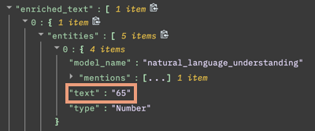

---

copyright:
  years: 2019, 2022
lastupdated: "2022-06-23"

subcollection: discovery-data

---

{{site.data.keyword.attribute-definition-list}}

# Query operators
{: #query-operators}

These operators are used when you write queries with the {{site.data.keyword.discoveryshort}} Query Language. For more information, see the {{site.data.keyword.discoveryshort}} [API reference](https://{DomainName}/apidocs/discovery-data#query){: external}. For an overview of query concepts, see the [Query overview](/docs/discovery-data?topic=discovery-data-query-concepts).
{: shortdesc}

Operators are the separators between different parts of a query. For the complete list of available operators, see the [Query reference](/docs/discovery-data?topic=discovery-data-query-reference#operators).
{: tip}

## `.` (JSON delimiter)
{: #delimiter}

This delimiter separates the levels of hierarchy in the JSON schema

For example, the following query argument identifies the section of the enriched_text object that contains entities and the text recognized as an entity.

```bash
enriched_text.entities.text
```
{: codeblock}

The JSON representation of this section looks as follows:



## `:` (Includes)
{: #includes}

This operator specifies inclusion of the query term.

For example, the following query searches for documents that contain the term `cloud computing` in the `text` field:

```bash
enriched_text.entities.text:"cloud computing"
```
{: codeblock}

## `::` (Exact match)
{: #match}

This operator specifies an exact match for the query term. Exact matches are case-sensitive.

For example, the following query searches for documents that contain entities of type `Organization`:

```bash
enriched_text.entities.type::"Organization"
```
{: codeblock}

The entire content of the field that you specify must match the phrase you specify. For example, the following query finds documents in which only entity mentions of `IBM Cloud` are detected, not `IBM Cloud Pak for Data` or `IBM cloud` or `Cloud`.

```bash
enriched_text.entities.text::"IBM Cloud"
```
{: codeblock}

## `:!` (Does not include)
{: #notinclude}

This operator specifies that the results do not contain a match for the query term.

For example:

```bash
enriched_text.entities.text:!"cloud computing"
```
{: codeblock}

## `::!` (Not an exact match)
{: #notamatch}

This operator specifies that the results do not exactly match the query term.

For example:

```bash
enriched_text.entities.text::!"Cloud computing"
```
{: codeblock}

Exact matches are case-sensitive.

## `\` (Escape character)
{: #escape}

Escape character that preserves the literal value of the character that follows it. 

For example, you can place an escape character before a quotation mark in query text to include the quotation mark in the query string.

```bash
title::"Dorothy said: \"There's no place like home\""
```
{: codeblock}

## `""` (Phrase query)
{: #phrase}

Use phrase queries with full-text, rank-based queries, and not with Boolean filter operations. Do not use wildcards (`*`) in phrase queries. All contents of a phrase query are processed as escaped. So no special characters within a phrase query are parsed, except for double quotation marks (`"`) inside a phrase query, which must be escaped (`\"`).

Single quotation marks (`'`) are not supported.
{: note}

For example:

```bash
enriched_text.entities.text:"IBM watson"
```
{: codeblock}

## `()`,`[]` (Nested grouping)
{: #nestedquery}

Logical groupings can be formed to specify more specific information.

For example:

```bash
enriched_text.entities:(text:IBM,type:Company)
```
{: codeblock}

## `|` (or)
{: #or}

Boolean operator for "or".

In the following example, documents in which `Google` or `IBM` are identified as entities are returned:

```bash
enriched_text.entities.text:Google|enriched_text.entities.text:IBM
```
{: codeblock}

The includes (`:`,`:!`) and match (`::`, `::!`) operators have precedence over the `OR` operator.
{: note}

For example, the following syntax searches for documents in which `Google` is identified as an entity or the string `IBM` is present:

```bash
enriched_text.entities.text:Google|IBM
```
{: codeblock}

It is treated as follows:

```bash
(enriched_text.entities.text:Google) OR IBM
```
{: codeblock}

## `,` (and)
{: #and}

Boolean operator for "and".

In the following example, documents in which `Google` and `IBM` both are identified as entities are returned:

```bash
enriched_text.entities.text:Google,enriched_text.entities.text:IBM
```
{: codeblock}

The includes (`:`,`:!`) and match (`::`, `::!`) operators have precedence over the `AND` operator.
{: note}

For example, the following syntax searches for documents in which `Google` is identified as an entity and the string `IBM` is present:

```bash
enriched_text.entities.text:Google,IBM
```
{: codeblock}

It is treated as follows:

```bash
(enriched_text.entities.text:Google) AND IBM
```
{: codeblock}

## `<=, >=, >, <` (Numerical comparisons)
{: #comparisons}

Creates numerical comparisons of `less than` or `equal to`, `greater than` or `equal to`, `greater than`, and `less than`.

Only use numerical comparison operators when the value is a `number` or `date`.

Any value that is surrounded by quotations is a String. Therefore, `score>=0.5` is a valid query and `score>="0.5"` is not.
{: tip}

For example:

```bash
invoice.total>100.50
```
{: codeblock}

## `^x` (Score multiplier)
{: #multiplier}

Increases the score value of a search term.

For example:

```bash
enriched_text.entities.text:IBM^3
```
{: codeblock}

## `*` (Wildcard)
{: #wildcard}

Matches unknown characters in a search expression. Do not use capital letters with wildcards.

For example:

```bash
enriched_text.entities.text:ib*
```
{: codeblock}

## `~n` (String variation)
{: #variation}

The number of one-character changes that need to be made to one string to make it the same as another string. For example `car~1` matches `car`,`cap`,`cat`,`can`, and so on.

For example:

```bash
enriched_text.entities.text:Watson~3
```
{: codeblock}

## `:*` (Exists)
{: #exists}

Used to return all results where the specified field exists.

For example:

```bash
title:*
```
{: codeblock}

## `:!*` (Does not exist)
{: #dnexist}

Used to return all results that do not include the specified field.

For example:

```bash
title:!*
```
{: codeblock}
