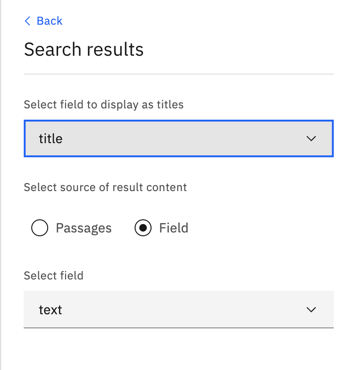

---

copyright:
  years: 2020, 2022
lastupdated: "2022-09-22"

keywords: passages, query results

subcollection: discovery-data

---

{{site.data.keyword.attribute-definition-list}}

# Previewing query results
{: #query-results}

See the types of query results that are returned automatically and learn about how they are derived.
{: shortdesc}

When a document is ingested, the text is extracted and indexed in the`text` field. To return only the subset of information that is relevant to the query, {{site.data.keyword.discoveryshort}} returns *passages* from the `text` field. For more information about passages, see [How passages are derived](/docs/discovery-data?topic=discovery-data-index-overview#query-results-passages).

To preview the default query results, complete the following steps:

1.  From the navigation pane, open the **Improve and customize** page.
1.  Take the appropriate next steps for your project type.

    -  [Document Retrieval](#query-results-dr)
    -  [Conversational Search](#query-results-chat)
    -  [Document Retrieval for Contracts](#query-results-contract)
    -  [Content Mining](#query-results-cm)

## Document Retrieval
{: #query-results-dr}

1.  Do one of the following things:

    -   Click **Run search** for one of the keywords that {{site.data.keyword.discoveryshort}} calculated to have special meaning in your collection.
    -   Submit your own phrase or keyword from the search bar.

    You can see that the query results that are returned consist of passages. 
        
    Entities that are recognized in your documents (based on the Entities enrichment that is applied to the project by default) are displayed as facets by which you can filter the query results.

1.  To explore a query result in more detail, click **View passage in document**.
1.  Click **Open advanced view** to explore the entity mentions that are recognized by Discovery.

    

### Excerpt unavailable
{: #improve-search-result}

If the result shows “Excerpt unavailable”, you might need to adjust where the content of the response is taken from. By default, a passage from the document is returned as the response. You can change what is returned.

1.  From the *Improvement tools* panel, expand **Customize display**.
1.  Click **Search results**.
1.  For the source of result content, select **Field**, and then choose the field from which you want to extract the response.

    

1.  Click **Apply**.

### FAQ results
{: #query-results-faq}

  FAQ extraction is available from {{site.data.keyword.cloud_notm}}-managed instances only.
{: note}

If you enabled FAQ extraction, set the `text` field as the query result source by following the steps in the previous section.

When the collection is processed, each question-and-answer pair that is found in the original document is added as a new, separate document with the question in the `title` field and answer in the `text` field. 

If your source document contains 10 question-and-answer pairs, then 10 documents are generated during processing. If you want to see all of the documents that were generated, check the *Manage data* page.

## Conversational Search
{: #query-results-chat}

A single search field is displayed that mimics the user interface of a virtual assistant.

1.  Submit a phrase or keyword.

The query results are returned as passages by default. You can [configure the search to return a specific field](#improve-search-result) instead.

## Document Retrieval for Contracts
{: #query-results-contract}

Contract-related elements that are recognized in your collection are displayed.

1.  Do one of the following things:

    -   Filter the documents by one of the highlighted elements or by entities that are recognized in your documents (based on the Entities enrichment that is applied to the project by default).
    -   To view the contract elements in more detail, click a document result to open it. Open the *Contract Data* tab.

For more information about the elements, see [Understanding contracts](/docs/discovery-data?topic=discovery-data-contracts-schema).

## Content Mining
{: #query-results-cm}

1.  Choose a facet by which to filter the documents.

    Facets based on the *Part of Speech* enrichment are shown.

- If you want to learn more about what information is indexed per document, see [Interpreting the results](/docs/discovery-data?topic=discovery-data-test#test-json).
- For tips on how you can improve the quality of your results, see [Improving your query results](/docs/discovery-data?topic=discovery-data-improvements).

## What to do next
{: #query-next}

-  For more information about how to enrich your documents so that you can find key information, see [Teaching Discovery about your domain](/docs/discovery-data?topic=discovery-data-domain).
-  To explore ways to improve the query results, see [Improving your query results](/docs/discovery-data?topic=discovery-data-improvements).
