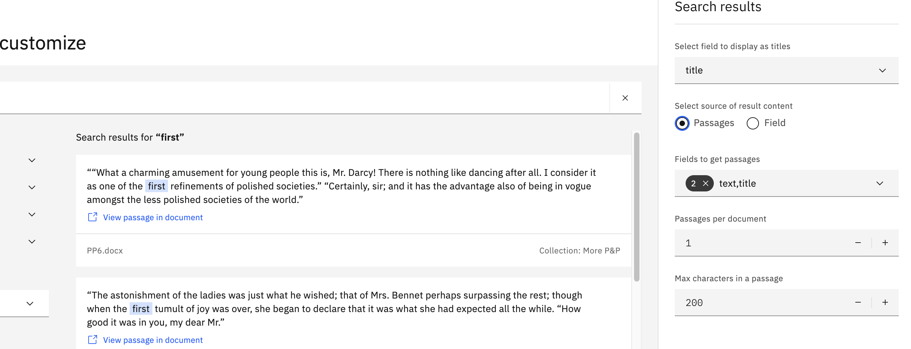

---

copyright:
  years: 2020, 2024
lastupdated: "2023-08-08"

keywords: passages, query results

subcollection: discovery-data

---

{{site.data.keyword.attribute-definition-list}}

# Previewing your query results
{: #query-results}

See the types of query results that are returned automatically and learn about how they are derived.
{: shortdesc}

When a document is ingested, the text is extracted and indexed in the`text` field. To return only the subset of information that is relevant to the query, {{site.data.keyword.discoveryshort}} returns *passages* from the `text` field. For more information about passages, see [How passages are derived](/docs/discovery-data?topic=discovery-data-index-overview#query-results-passages).

When you enter a query from the product user interface, the UI submits the text as a natural language query. For more information about how to query your data programmatically, see [Query API](/docs/discovery-data?topic=discovery-data-query-concepts).

To query your data from the product user interface, complete the following steps:

1.  From the navigation panel, open the *Improve and customize* page.
1.  Take the appropriate next steps for your project type.

    -  [Document Retrieval](#query-results-dr)
    -  [Conversational Search](#query-results-chat)
    -  [Document Retrieval for Contracts](#query-results-contract)
    -  [Content Mining](#query-results-cm)

## Document Retrieval
{: #query-results-dr}

1.  Do one of the following things:

    -   Click **Run search** for one of the keywords that {{site.data.keyword.discoveryshort}} calculated to have special meaning in your collection.
    -   Submit your own phrase or keyword from the search bar.

    You can see that the query results that are returned consist of passages. 
        
    Entities that are recognized in your documents (based on the Entities enrichment that is applied to the project by default) are displayed as facets by which you can filter the query results.

1.  To explore a query result in more detail, click **View passage in document**.
1.  Click **Open advanced view** to explore the entity mentions that are recognized by Discovery.

### Excerpt unavailable
{: #improve-search-result}

Passages displayed in search results are extracted from the content that is indexed in the `title` and `text` fields of the documents. If the content is indexed in other fields, the search displays the `Excerpt unavailable` message.

Content is indexed in other fields in the following scenarios:

-   Your collection contains structured files, such as JSON or CSV files. When you ingest structured files, content is stored in custom fields with names taken from the original object names (JSON) or column headers (CSV).

-   You applied a Smart Document Understanding model that moves content from the `text` field into new fields, such as `section` or `results`, based on the document's structure.

To improve the search results, first choose how you want to extract content from the documents. If your documents have targeted fields with succinct content in them, such as `answer` fields for an FAQ use case, configure the search to return those specific fields. If your documents have custom fields with lots of content in them, such as `chapter` fields, configure the search to find the best passages from the custom fields.

To customize the results, complete the following steps:

1.  From the *Improvement tools* panel, expand **Customize display**.

1.  Click **Search results**.

1.  In the *Select source of result content* option, do one of the following things:

    -   Select **Passages**, and then specify one or more fields from which to extract passages.

    -   Select **Field**, and then choose one or more fields to return.

    {: caption="Figure 1. Search results dialog" caption-side="bottom"}

1.  Click **Apply**.

## Conversational Search
{: #query-results-chat}

A single search field is displayed that mimics the user interface of a virtual assistant.

1.  Submit a phrase or keyword.

The query results are returned as passages by default. You can [configure the search to return a specific field](#improve-search-result) instead.

If you want to investigate the results a bit more, you might want to use a different project type. For more information, see [Improving results for a chatbot](/docs/discovery-data?topic=discovery-data-chat-choose-project).

## Document Retrieval for Contracts
{: #query-results-contract}

Contract-related elements that are recognized in your collection are displayed.

1.  Do one of the following things:

    -   Filter the documents by one of the highlighted elements or by entities that are recognized in your documents (based on the Entities enrichment that is applied to the project by default).
    -   To view the contract elements in more detail, click a document result to open it. Open the *Contract Data* tab.

For more information about the elements, see [Understanding contracts](/docs/discovery-data?topic=discovery-data-contracts-schema).

## Content Mining
{: #query-results-cm}

Facets based on the *Part of Speech* enrichment are shown. 

1.  To analyze your data, open the Content Mining application. Click **Launch application**.

For more information, see [Analyzing your data](/docs/discovery-data?topic=discovery-data-contentminerapp).

## What to do next
{: #query-next}

-  For more information about how to enrich your documents so that you can find key information, see [Choosing enrichments](/docs/discovery-data?topic=discovery-data-domain).
-  To explore ways to improve the query results, see [Improving your query results](/docs/discovery-data?topic=discovery-data-improvements).
