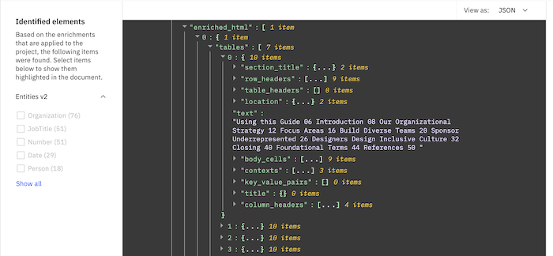

---

copyright:
  years: 2019, 2024
lastupdated: "2023-06-16"

subcollection: discovery-data

---

{{site.data.keyword.attribute-definition-list}}

# Apply a pretrained SDU model
{: #sdu-pretrained}

Apply a prebuilt Smart Document Understanding (SDU) model that can extract text and is trained to identify tables, lists, and sections in documents. 
{: shortdesc}

Use the pretrained model if your documents contain tables with valuable information that you want to capture. The model is also able to preserve the meaning inherent in the nesting structure of tables, lists, and sections. Using the pretrained model speeds up the process of capturing information from the structure of a document.

If you want to customize how the document structure is used to infer meaning from a document or you want to split documents with a field that is generated by an SDU model, create a user-trained model instead. For more information, see [Define a user-trained SDU model](/docs/discovery-data?topic=discovery-data-configuring-fields).

A pretrained model is applied to *Document Retrieval for Contracts* projects automatically. Instead of you annotating contract-related content in your documents, the project applies a model that already knows how to recognize terms and concepts that are significant to contracts.

## Preparing documents
{: #sdu-pretrained-prereqs}

You can apply a pretrained SDU model to the following file types only:

-   Image files (PNG, TIFF, JPG)
-   Microsoft PowerPoint
-   Microsoft Word
-   PDF

For a complete list of file types that {{site.data.keyword.discoveryshort}} supports, see [Supported file types](/docs/discovery-data?topic=discovery-data-collections#supportedfiletypes).

The Smart Document Understanding tool uses optical character recognition (OCR) to extract text from images in the files that it analyzes. Images must meet the minimum quality requirements that are supported by OCR. For more information, see [Optical character recognition](/docs/discovery-data?topic=discovery-data-collections#ocr).

The tool cannot read documents with the following characteristics; remove them from your collection before you begin:

-   Documents that appear to have text that overlays other text are considered *double overlaid* and cannot be annotated.
-   Documents that contain multiple columns of text on a single page cannot be annotated.

When you apply a Smart Document Understanding model, the conversion time for your collection can increase due to the resources that are required to apply the AI model to your documents.
{: note}

## Apply a pretrained model
{: #sdu-pretrained-task}

To apply a pretrained Smart Document Understanding model to your collection, complete the following steps:

1.  Open the **Manage collections** page from the navigation panel.
1.  Select the collection to which you want to apply the model.
1.  Open the *Identify fields* page.
1.  Choose **Pre-trained models**

    The **Text extraction only** option is used by default. With this model, any text that is recognized in the source documents is indexed in the `text` field.
1.  Click **Submit**, and then click **Apply changes and reprocess**.

## Understanding the output
{: #sdu-pretrained-output}

If the SDU model finds and processes a structure, such as a table, in the document, it stores a representation of the structure in a field named `enriched_{field}`, where `{field}` is the field where the structure was stored.

The following excerpt shows the JSON representation of a table from the `enriched_html` field of a document that was processed by the pretrained SDU model.

{: caption="Figure 1. JSON table representation" caption-side="bottom"}

If you want to extract text from the processed structure, you can use the `location` field to find the index values that identify where the text string starts and ends.

For more information about the structure of indexed tables, see [Understanding tables](/docs/discovery-data?topic=discovery-data-understanding_tables).

## Troubleshooting issues
{: #sdu-troubleshoot}

Follow these workarounds if you experience problems when working with the Smart Document Understanding tool.

### Insufficient resources to process document
{: #ts-insufficient-resources}

Error
:   When you apply a pretrained model to your collection, document processing does not complete successfully and an `Insufficient resources to process document` message is displayed.

Cause
:   The error is displayed because out of memory errors occur during the parse, structure identification, or assembly phases of the process that builds the machine learning model. Resources are insufficient when one or more of the documents in your collection are too large or have too many complex tables for the tool to handle.

Solution
:   Review your collection for large documents or documents with many tables and break them up into more smaller documents before you apply the pretrained model to the collection. Exact limits differ based on the complexity of your documents. Generally, split documents that are over 400 pages long and avoid including more than 20 complex tables in a single document.
