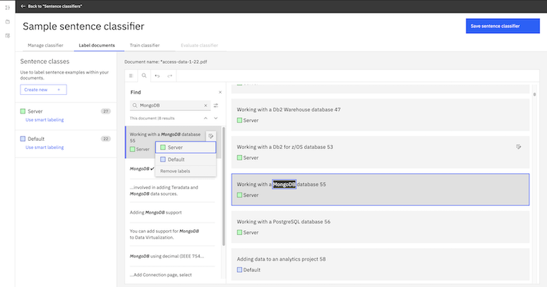
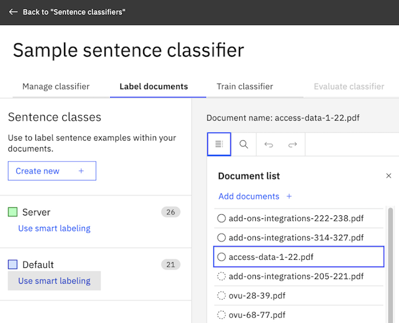

---

copyright:
  years: 2019, 2023
lastupdated: "2023-12-07"

subcollection: discovery-data

---

{{site.data.keyword.attribute-definition-list}}

# Classify sentences
{: #sentence-classifier}

[IBM Cloud]{: tag-ibm-cloud}

Sentence classification is a beta feature that is available in managed deployments only. Also, the feature is available for English-language documents only.
{: beta}

Use sentence classification to classify sentences in your documents that are of significant business interest. 

Sentence classification uses a machine learning model that classifies sentences based on user-defined sentence classes. You can label example sentences in your documents to define the sentence classes. To speed up the labeling process, the system automatically prepares a suggestion model in the background and provides you with more sentence labeling suggestions.

## Before you begin
{: #sentence-classifier-prereq}

Find or create a collection with documents having various sentence examples that you want Discovery to learn about. To teach the sentence classifier, you must label examples of sentence classes. You can only label examples if your collection contains valid examples. Try to find documents that have many and varying sentences that function as examples of every sentence class that you want to define.

## Adding a sentence classifier
{: #sentence-classifier-add}

To add a sentence classifier, complete the following steps:

1.  Open the project where you want to create the sentence classifier.
    
    The project must have at least one collection with documents that are representative of data that you want to classify.
1.  From the *Improvement tools* panel of the *Improve and customize* page, expand **Teach domain concepts**, and then click **Sentence classifiers**.
1.  Click **New**.
1.  Add a sentence classifier name and optionally a description.

    This name is used as the model name and as the name of the enrichment that is created when you publish the model. The name is displayed as the enrichment name in the *Enrichments* page where you and others can apply it to collections. It is also displayed as the model name in the JSON representation of documents where sentence classes are found. The name is stored with the capitalization and spacing that you specify.

1.  Choose a collection with documents that are representative of data that you want to classify.
1.  Choose fields from the document to show in the document view where you will label documents from the collection.

    -   **Document title** is shown in the page header as the document name. Choose a field that has a unique value per document, such as the file name, which is stored in the `extracted_metadata.filename` field.
    -   **Document body** is where you label sentence examples in the content. Choose a field that contains the bulk of the document content, such as the `text` field.

1.  Click **Create**.

A document from the collection that you selected is displayed in the *Label documents* view. You will label occurrences of the sentence classes that you want Discovery to recognize from this and other documents in the collection.

If no text is displayed in the body of the page, start over now by creating a new sentence classifier. This time, when you select a value for the *Document body* field, be sure to choose a field from your processed documents that contains text.
{: tip}

## Defining sentence classes
{: #sentence-classifier-add-sentence-classes}

Define sentence classes by completing the following steps:

1.  Click **Add a sentence class**.
1.  Add the sentence class name and an optional description.
1.  Optional: Pick the color to use for the sentence class in the document. 

    You can click a color from the *Label color* palette, click the *Renew color* icon to tab from one color to the next. To use a custom color, specify its hexadecimal color code (#fff0f7).
1.  Click **Create**.
1.  Repeat this process to add all of the sentence classes that you want the classifier to classify.
    
    If you aren't sure what to add for sentence classes, it might help to review the documents in the collection first. By reviewing the content, you can get a feel for which sentences have significant meaning and look for logical ways to classify such sentences.

## Labeling sentences
{: #sentence-classifier-label}

From the *Label documents* view, find sentences in the documents from your collection and label them to indicate their sentence classes. While you are labeling, the sentence classifier automatically trains a model in the background to present labeling suggestions.

The labeling suggestions speed up the process of labeling your documents. Instead of going through documents and spending time reading text, the labeling suggestions enable you to easily find relevant examples and examine them in context.

You can label sentences in the following ways:

-   Manual labeling. For more information, see [Manual labeling](#sentence-classifier-manual-label).
-   Find-in-document labeling. For more information, see [Find-in-document labeling](#sentence-classifier-find-label).
-   Smart labeling. For more information, see [Smart labeling](#sentence-classifier-smart-label).

Unlike entity extractor, there is no concept of document status such as *Not started*, *In progress*, and *Complete* for sentence classifier. In the case of entity extractor, you mark documents as *Complete* to indicate that they are used for training. In the case of sentence classifier, only labeled sentences are used for training and unlabeled data in each document is ignored.
{: note}

| Feature | What is used for training |
|-------------|-----------------------------------|
| Entity extractor | All the documents that are marked as Complete |
| Sentence classifier | All the labeled sentences (unlabeled sentences are not used) |
{: caption="Data used for training" caption-side="top"}

### Manual labeling
{: #sentence-classifier-manual-label}

To label manually, complete the following steps:

1.  Read the documents shown in the *Label documents* page to locate appropriate sentence examples to label.
1.  Select a sentence example and click the *Edit labels* icon.
1.  Select a sentence class from the list to label the example sentence as a positive label. 
    
    To label the example sentence as a negative label, press Shift when selecting the sentence class in the list.

    If you don't find appropriate sentence examples, select a different document from the *Document list*.

    {: caption="Figure 1. Labeled sentence examples" caption-side="bottom"}

1.  Repeat the steps to label example sentences as positive or negative in other documents of the collection.

While labeling, click **Save sentence classifier** to save your work. If you move to another page from the *Label documents* page, the system automatically saves your work.

Use shortcut keys for quick labeling operations. Press keys 1 to 5 corresponding to a sentence class shown in the list to label the example sentence as a positive label. Similarly, press keys 6 to 0 to add a negative label. You can press the Delete key or Backspace key to remove labels from the selected sentence.
{: tip}

### Find-in-document labeling
{: #sentence-classifier-find-label}

Using the search feature, you can find sentence examples in a document and label them easily. You can also use search to find labeled examples and unlabeled examples and correct any labeling inconsistencies. 

To find examples and label them in a document, complete the following steps:

1.  On the *Label documents* view, click the *Find* icon.
1.  In the **Find** field, specify the text to search in the document.

    The search results from the document are displayed when you enter the text.

    To browse the search results, you can click the *Next result* and *Previous result* icons. To choose a label for an unlabeled example in the result, click the *Edit labels* icon and select a sentence class from the list. You can also remove labels from an already labeled example in the result by clicking the *Edit label* icon and selecting **Remove labels**. {: note}

    {: caption="Figure 2. Search results" caption-side="bottom"}

1.  To filter the search results, click the *Show filter options* icon.

    The following table describes the filter options.

    | Option | Description |
    |--------|-------------|
    | **All** | To find all examples in a document that match the text. |
    | **Labeled text** | To find existing labeled examples in a document that match the text. |
    | **Unlabeled text** | To find unlabeled examples in a document that match the text. |
    | **Match case** | To find examples that match both the text and its case. |
    | **Whole words** | To find examples that match the word boundaries of the text. For example, if you specify *installing* in the text, *uninstalling* is not matched when this option is selected. |
    {: caption="Filter options in find" caption-side="top"}

    1.  Repeat the steps to label example sentences in other documents of the collection.

### Smart labeling
{: #sentence-classifier-smart-label}

The smart labeling feature uses active learning techniques to suggest sentence examples that you can label. Smart labeling speeds up the labeling process, but you must label at least 20 examples for each sentence class first so that the system can build a suggestion model.

To use smart labeling, complete the following steps:

1.  Label a minimum of 20 positive examples for at least one sentence class.

    The system automatically starts preparing a suggestion model in the background.

    After a version of the suggestion model is ready, the system provides suggestions on which sentences to label next. Labeling the suggestions helps improve the sentence classifier model the most.

1.  Click **Use smart labeling**.

    {: caption="Figure 3. Smart labeling" caption-side="bottom"}

    The Smart labeling pane is displayed. In this pane, you can label sentences for a specific sentence class.

1.  Select an example from the suggested *Examples*, and click **Yes** to label the example sentence as a positive label. You can click **No** to label the example sentence as a negative label.

    {: caption="Figure 4. Smart labeling pane" caption-side="bottom"}
    
1.  Repeat the previous step to label other suggested examples.

    To refresh the suggested examples in the list, click **Refresh suggestions**. The list is refreshed with new suggestions and the existing labeled examples are not shown in the list.

1.  Click **Done** after you have labeled the sentences.

    If you don't have enough sentence examples in the current set of documents, you can add more documents. This option is available only when there are more documents in the collection. For more information, see [Adding documents to the training data](#sentence-classifier-add-docs).

1.   After you label examples in as many documents in the collection as you want, click **Save sentence classifier**, and then train the classifier. For more information, see [Training the classifier](#sentence-classifier-train).

### Smart labeling tips
{: #sentence-classifier-smart-label-tips}

Remember these tips for smart labeling:

-   Use shortcut keys for quick labeling operations. You can press the Left Arrow key to choose Yes, or the Right Arrow key to choose No. Choosing Yes or No is equivalent to specifying a positive or negative label for the sentence class. 

-   To label an example sentence as a positive label, press keys 1 to 5, corresponding to a sentence class shown in the list. Similarly, press keys 6 to 0 to add a negative label. You can press the Delete key or Backspace key to remove labels from the selected sentence.

-   If an example is irrelevant to the current sentence class, label the example as negative instead of leaving it unlabeled. Unlabeled data is ignored and not used for training, so specifying negative labels is important for improving the classification model.

-   If you label 20 or more examples (either positive or negative labels) after the last suggestion model is trained, the system automatically starts building a new suggestion model in the background. You are notified when the new suggestions are ready for labeling.

## Adding documents to the training data
{: #sentence-classifier-add-docs}

To add more documents, complete the following steps:

1.  Navigate to the *Label documents* view.
1.  In the *Document list* panel, click **Add documents**.

This option is not available when there are no other documents in the collection to add to the sentence classifier workspace. To add more documents to the collection, navigate to the *Activity* page for the collection, and then click the **Upload data** tile to browse and add more documents.

Even if you add more documents from a collection, all the documents may or may not be used for training the model. Unlike entity extractor where all the completed documents are used for training, sentence classifier uses only labeled sentences for training and unlabeled data is ignored.

You cannot choose the documents from the collection to show in the *Document list* panel for labeling. If there are specific types of documents that you want to label, consider creating a new collection that contains only those documents.
{: note}

## Training the classifier
{: #sentence-classifier-train}

After you label documents, you can review the training data in the *Train classifier* view. The training data is used to train the sentence classifier model.

To train the classifier, complete the following steps:

1.  Navigate to the *Train classifier* view.

1.  Review your labeling summary to check if you labeled enough to train the classifier. 

    To train the classifier, each sentence class must have a minimum of 20 positive labels and two negative labels. Otherwise, the **Train classifier** button is disabled and you cannot start training. Sentence classes that have no positive labels or negative labels are ignored.

1.  Review whether you want to apply advanced options for training. Most models do not require changes to the advanced options.

    Your sentences are split at random into sets. The training set is used to train the classifier. The test set is used to test the model after it is trained. The blind set has reserved sentences that you don't see during training. They are used to generate an unbiased evaluation of the model periodically. The default split uses the standard ratio for training. For more information, see [Document sets for training](#sentence-classifier-doc-set).

1.  Click **Train classifier**.

    When you train the classifier, Discovery uses sentences from the training set to build a machine learning model. The results of the test are displayed for you to review in the *Evaluate classifier* view.

### Document sets for training
{: #sentence-classifier-doc-set}

You can change the ratio of sentences that are included in the document sets that comprise your training data.

The sentences you labeled are split at random into the following sets:

-   Training set: The sentences that you label and that are used to train the sentence classifier machine learning model. The goal of the training set is to teach the model about correct labels.

-   Test set: The sentences that are used to test the trained model. After the model is generated, it runs a test against the documents from the test set automatically. You can analyze the results to determine areas where the model got something wrong, and find ways to improve the model's performance.

-   Blind set: Sentences that are set aside and used to test the model periodically after several iterations of testing and improvement are completed. The sentences in the blind set are intentionally roped off. As you test the model with sentences from the test set and analyze the results, you become familiar with the underlying test sentences. Because the test sentences are used iteratively to improve the model, they can start to influence the model training indirectly. That's why you may want to have the blind set of sentences. The blind set gives you a way to generate an unbiased evaluation of the model periodically.

The default split ratio is 70% for the training set, 30% for the test set, and 0% for the blind set. You can have a blind set of sentences by increasing the ratio of the blind set. In this case, the numbers in the classifier score table of the *Evaluate classifier* view, such as **False positive**, **False negative**, and others do not match the number of sentences shown in the *Review training results* view. This is because sentences in the blind set are taken into account for evaluation, but they do not appear in the *Review training results* view.

## Evaluating the classifier
{: #sentence-classifier-evaluate-model}

To review metrics from the test run of the sentence classifier model that you created, click the **Evaluate classifier** tab.

The following table describes the available evaluation metrics.

| Metric | Description |
|--------|-------------|
| Confusion matrix | A table that provides a detailed numeric breakdown of labeled sentences. Use it to compare what are labeled by the machine learning model to what are labeled in the training data. |
| F1 Score | Measures whether the optimal balance between precision and recall is reached. The F1 score can be interpreted as a weighted average of the precision and recall values. An F1 score reaches its best value at 1 and worst value at 0. Overall scores are lower if the model doesn't have enough training data to learn from. |
| Precision | Measures how many of the overall sentences are classified as the correct sentence class. A false positive is when a sentence should not be classified, but was classified (Predicted = Positive, Actual = Negative). False positives typically mean low precision. |
| Recall | Measures how often sentences that should be classified are classified. A false negative is when a sentence should be classified, but was not classified (Predicted = Negative, Actual = Positive). False negatives typically mean low recall. |
{: caption="Metrics details" caption-side="top"}

1.  Review the metrics that are provided about the classifier model test run to determine whether more training is needed.
1.  Explore the test results in more detail by clicking **Review training results in test set**.

    {: caption="Figure 5. Review training results in test set" caption-side="bottom"}

    Sentences from the test set are displayed with the actual and predicted labels shown in the list on the left pane. If you click on a sentence in the list, it is shown in the document view on the right pane.

    -   Actual labels are the examples that a person labeled manually. They are considered as the correct labels.
    -   Predicted labels are the examples that the sentence classifier identified and labeled as sentence classes.

    The performance of the model is rated based on how closely the predicted labels match the actual labels.

1.  To filter the list, click the *Filter* icon and choose the **Sentence class** and **Prediction**, and then click **Apply**.

## Reviewing training results from performance breakdown
{: #sentence-classifier-performance-breakdown}

To review training results from the performance breakdown, complete the following steps:

1.  Click a number in the **Performance breakdown by sentence class** table. 

    The *Review training results* dialog box is displayed.

1.  Review the relevant sentences, which are based on the number that you clicked.

### Improving the classifier
{: #sentence-classifier-improve}

The following table shows suggested fixes for common problems.

| Problem | Action to remedy the problem |
|---------|------------------------------|
| Low overall scores | You might not have enough labeled sentences in your training set. Label more sentences in more of your documents. |
| Low recall | Label more documents with new examples of the sentence classes that the classifier missed to classify. Review false negative sentences to check if there are unique terms among them. If you see such unique terms, search for sentences that include such terms and add positive labels to them. |
| Low precision | Review false positive sentences carefully. You might have missed labeling some sentences. In particular, check sentences with a negative label. When a sentence has a negative label for a particular sentence class (for example, class A), check if a positive label is necessary for another sentence class (for example, class B). If the sentence actually belongs to class B, but you did not specify a positive class B label for it, then it can degrade the precision score. Also, if you find terms that commonly appear in the false positive sentences, then specify negative labels to sentences with such terms. |
{: caption="Improvement actions" caption-side="top"}

## Publishing the sentence classifier as an enrichment
{: #sentence-classifier-publish}

When you think the sentence classifier is ready, publish the sentence classifier model. You can consider that the model is ready when the score doesn't change after several test runs in which you make improvements. You can return to update and retrain the model after you publish it.

1.  Navigate to the *Evaluate classifier* view, and click **Publish classifier**.
1.  Click **Publish**.
1.  Click **Apply to data**.
1.  Choose a collection, and then select the text field where you want the sentence classifier enrichment to be applied.
1.  Click **Apply**.

## Downloading the sentence classifier model
{: #sentence-classifier-download}

A sentence classifier model that you create and deploy in one project is available as an enrichment that can be applied to a collection from any project in the same service instance.

If you want to use the sentence classifier model in a project from another service instance, you can export or download the sentence classifier model. To use it elsewhere, follow the steps to create a machine learning model in [Use imported ML models to find custom terms](/docs/discovery-data?topic=discovery-data-domain-ml). You cannot continue to edit a sentence classifier that you import into another project.

The sentence classifier that you want to export must be fully trained.

To export a sentence classifier, complete the following steps:

1.  Open the project with the sentence classifier that you want to export.
1.  From the *Improvement tools* panel of the *Improve and customize* page, expand *Teach domain concepts*, and then click **Sentence classifiers**.
1.  From the *Sentence classifiers* list, find the sentence classifier that you want to export.
1.  Click the *Actions* icon for your classifier, and then select **Download model** to save the model to your system.

    The *Download model* option is not available unless the model is trained.
    {: note}

The sentence classifier model is saved as a .sc file. You can import it into a project in another service instance as a machine learning model, and then apply it to your collections.

## Downloading labeled data for a sentence classifier
{: #sentence-classifier-download-label}

You can download or export the labeled data for a sentence classifier from {{site.data.keyword.discoveryshort}}. You can use the exported labeled data for training or building large language models (LLMs) on a service such as {{site.data.keyword.DSX_short}} and Natural Language Processing (NLP).

To export the labeled data, complete the following steps:

1.  From the *Improvement tools* panel of the *Improve and customize* page, expand *Teach domain concepts*, and then click **Sentence classifiers**.

1.  For the sentence classifier from which you want to export labeled data, click the *Actions* icon, and then select **Download labeled data**.

    A compressed file is downloaded with labeled data. The compressed file contains the following JSON files.

    -   `labeled_data.json`: Includes the text and labels. The data format is based on the input data format for text classification in Watson Natural Language Processing. For more information, see [Input data format](https://www.ibm.com/docs/en/watsonx-as-a-service?topic=models-classifying-text-custom-classification-model#input-data){: external}.
    -   `metadata.json`: Includes metadata for the workspace and labeled data.

### Converting `labeled_data.json` to CSV
{: #sentence-classifier-convert-csv}

 Enter the following command to convert `labeled_data.json` to CSV:

```bash
$ cat labeled_data.json | jq -r '.[] | [.text, .labels[]] | @csv'
```
{: codeblock}

The labeled data is converted to the following format:

```bash
    "sentence1", class-label1, class-label2
    "sentence2", class-label3
    "sentence3", ...
    ...
```
{: codeblock}

## Applying a sentence classifier enrichment
{: #sentence-classifier-apply}

When you publish the sentence classifier, you specify the field where you want the sentence classifier to be applied. If you decide to apply the enrichment to different or more fields later, you can follow these steps to do so.

1.  From the navigation panel, click **Manage collections**.
1.  Click to open the collection where you want to apply the enrichment.
1.  Click **Enrichments**.
1.  Find the sentence classifier name in the list, and then choose a field to apply the enrichment to.

    You can choose a field that contains either text or html.

1.  Click **Apply changes and reprocess**.

For more information about how to apply a sentence classifier enrichment to a collection, see [Managing enrichments](/docs/discovery-data?topic=discovery-data-manage-enrichments)

### Sentence classifier output
{: #sentence-classifier-output}

When the enrichment classifies one of your sentences in a document, an entry is added to the `enriched_text.element_classes` section of the JSON representation of the document. The section contains sentences classified by your classifier model along with their sentence classes.

A sentence classifier does not classify sentences with confidence scores that are lower than 0.5.
{: note}

The following JSON output is an example result of sentence classification.

{: caption="Figure 6. JSON representation" caption-side="bottom"}

### Monitoring performance over time
{: #sentence-classifier-history}

You can retrain your sentence classifier model at any time. Each time that you train the model, review the performance metric scores to determine whether your most recent changes increase or decrease the model's scores.

1.  To compare one test run against another, click **View score history** in the *Evaluate classifier* view.

    The history view shows the last 5 training runs.

    To retain the score information for more than the most recent 5 training runs, you can export the metrics in comma-separated value format, and track the scores in a separate application. Click the tabular representation icon , and then click **Download as CSV**.
    {: tip}

If a subsequent training run results in lower scores, don't publish that version of the model.

## Deleting a sentence classifier
{: #sentence-classifier-delete}

You can delete a sentence classifier if it is not in use, such as when the enrichment that is published from the sentence classifier is not applied to a collection.

You might want to delete a sentence classifier if you reach the limit for the maximum number of sentence classifiers that are allowed for your plan, for example.

There are two different limits, the maximum number of sentence classifier workspaces and the maximum number of sentence classifier enrichments. You create a sentence classifier workspace when you navigate to the *Improvement tools* panel, expand *Teach domain concepts*, click **Sentence classifiers**, and then click the **New** button. You create a sentence classifier enrichment when you publish your trained sentence classifier or upload a sentence classifier model. For information about the limits, see [Sentence classifier limits](#sentence-classifier-limits).

Remember, limits are defined per service instance, not per project. If you do not have the maximum number of sentence classifiers in the current project, but you cannot create new sentence classifier workspaces or publish your trained sentence classifier, then check other projects in the same service instance. There might be sentence classifier workspaces or enrichments that aren't being used in other projects which can be deleted.

### Removing sentence classifier enrichments
{: #sentence-classifier-remove-enrichment}

Remove the sentence classifier enrichment, which was published from the sentence classifier that you want to delete, from any collections where it is being used. For more information, see [Deleting enrichments](/docs/discovery-data?topic=discovery-data-manage-enrichments#enrichments-delete).

Removing a sentence classifier enrichment does not remove its workspace.

### Removing sentence classifier workspaces
{: #sentence-classifier-remove-workspace}

1.  From the *Improvement tools* panel of the *Improve and customize* page, expand *Teach domain concepts*, and then click **Sentence classifiers**.

1.  Find the sentence classifier workspace that you want to delete, click the *Actions* icon, and then select **Delete**.

Removing a sentence classifier workspace does not remove the enrichment published from the workspace.

## Sentence classifier limits
{: #sentence-classifier-limits}

The number of sentence classifiers that you can create per service instance depends on your {{site.data.keyword.discoveryshort}} plan type.

| Plan | Sentence classifier workspaces per service instance | Sentence classifier enrichments per service instance | Maximum sentence classes per classifier | Maximum documents in training data |
|------------|--------------------|----------------------------------|-----------------------|----------------|
| Premium | 10 | 20 | 5 | 1,000 |
| Enterprise | 10 | 20 | 5 | 1,000 |
| Plus (including Trial) | 3|5 | 3 | 200 |
{: row-headers}
{: class="comparison-table"}
{: caption="Sentence classifier limits" caption-side="top"}
