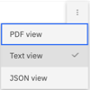

---

copyright:
  years: 2019, 2022
lastupdated: "2022-08-01"

keywords: JSON, JSON representation, result JSON

subcollection: discovery-data

---

{{site.data.keyword.attribute-definition-list}}

# Testing your project
{: #test}

As you improve your project, periodically test how enrichments and search setting changes impact the query results.
{: shortdesc}

For all project types except Conversational Search, you can see the fields that are associated with an indexed document by looking at the JSON view of a document that is returned by a query. Checking the JSON structure of a document can be useful if you want to check whether certain types of information are being captured.

After you enrich your collection, you can use the JSON view of a query result to check whether your enrichments are being applied and retrieved properly. For example, you can check the JSON to confirm that a synonym that you defined in a dictionary is being tagged as an occurrence of the corresponding dictionary term.

To test your project, complete the following steps:

1.  From the navigation pane, open the **Improve and customize** page.
1.  Retrieve query results by doing one of the following things:

    -   *Content Mining* project: Choose or add a facet to apply to the documents, and then click **View filtered documents**.
    -   Other project types: Enter a test query to submit or leave the field empty and press Enter to submit an empty query.
1.  From the query result list, click the link to view the document.

    A representation of the original document is displayed. 
    
1.   **{{site.data.keyword.cloud_notm}} only**: Click **Open advanced view** to see useful summary information, such as the number of occurrences of any enrichments that are detected in the document.

    **Optional**: Select an enrichment to highlight every occurrence of the element within the document text.

    For a *Document Retrieval for Contracts* project, the *Contract Data* page is displayed. For more information about Contract filter options, see [Understanding contracts](/docs/discovery-data?topic=discovery-data-contracts-schema#contracts-elements).

1.  If you want to view the query result in JSON format, you can do one of the following things depending on your deployment type:

     **{{site.data.keyword.cloud_notm}} only**:

      1.  Click the *Display options* menu from the advanced view header, and then select **JSON view**.

          

     **{{site.data.keyword.icp4dfull_notm}} only**:

      1.  Click **JSON**.

          For a *Document Retrieval for Contracts* project, click the **Contract Data** tab. For more information about Contract filter options, see [Understanding contracts](/docs/discovery-data?topic=discovery-data-contracts-schema#contracts-elements).

## Interpreting the results
{: #test-json}

Learn about information that is identified by the enrichments that are applied to your documents by reviewing the JSON representation of a document that is returned in a search result.

### Common fields
{: #test-json-auto}

The following list describes some of the indexed fields that are generated by processes that are applied to collections:

-   `enriched_html.contract`: Generated by the pretrained Contract SDU model that is applied automatically to any collection that you add to a Document Retrieval for Contract project type.
-   `enriched_html.tables`: Generated when the Table Understanding enrichment is applied to a collection.
-   `html`: The HTML field is generated under the following conditions:

    -   If you crawl a website or upload an HTML file, this field is generated along with the `text` field.
    -   If you use the Smart Document Understanding tool to apply a pretrained model to a collection, the document representation is indexed both in the `html` field and `text` field.
    -   If you use the Smart Document Understanding tool to annotate a collection, the document representation is indexed in the `html` field.
-   `segment_metadata`: Generated when you split a document. The metadata field includes the parent document ID, the segment number, and the total number of segments that were created from the parent document. Each resulting segment of the original document can contain different information. For example, if you split the document based on the subtitle field, the first segment might contain only a title field. The next segment might contain a subtitle and a text field. The third might contain a subtitle field, a text field, and a footer field.

Fields with names that contain a period (.) represent nested fields. For example, the `enriched_{field_name}.entities` nested field is stored in the JSON structure as follows. For more information about fields that are added by the NLU enrichments, see [NLU enrichment fields](#test-json-nlu).

```json
{
  "enriched_text": [
    {
      "entities": [
        {}
      ]
    }
  ]
}
```
{: codeblock}

If you use the Smart Document Understanding tool to add custom fields, the custom fields are represented in the index as root-level fields. For example, if you add a field named `procedure`, it is represented in the JSON file as follows:

```json
{
  "procedure": [
    {}
  ]
}
```
{: codeblock}

### Natural Language Understanding (NLU) enrichment fields
{: #test-json-nlu}

The NLU enrichments are displayed in a JSON object named `enriched_{field_name}`, where `{field_name}` is the field to which the enrichment was applied.

-   Entities enrichment output: The following snippet shows a mention of the recognized entity `IBM`

    ```json
    {
      "enriched_text": [
        {
          "entities": [
            {
              "model_name": "natural_language_understanding",
              "mentions": [
                {
                  "confidence": 0.8317045,
                  "location": {
                    "end": 183,
                    "begin": 180
                  },
                  "text": "IBM"
                }
              ],
              "text": "IBM",
              "type": "Organization"
            }
          ]
        }
      ]
    }
    ```
    {: codeblock}

-   Keywords enrichment output: The following snippet shows two mentions of the keyword `brands` that were recognized in the `text` field.

    ```json
    {
      "enriched_text": [
        {
          "keywords": [
            {
              "mentions": [
                {
                  "location": {
                    "end": 984,
                    "begin": 978
                  },
                  "text": "brands"
                },
                {
                  "location": {
                    "end": 1582,
                    "begin": 1576
                  },
                  "text": "brands"
                }
              ],
              "text": "brands",
              "relevance": 0.728722
            }
          ]
        }
      ]
    }
    ```
    {: codeblock}

-   Sentiment of Document enrichment output: The following snippet shows the sentiment analysis result for the sentence in the `column_1` field.

    ```json
    {
      "enriched_column_1": [
        {
          "sentiment": {
            "score": -0.770756,
            "mixed": false,
            "label": "negative"
          }
        }
      ],
      "column_1": [
        "In a dozen-pack of chocolate, I could only find 9 pieces."
      ]
    }
    ```
    {: codeblock}

-   Part of Speech enrichment: The index fields that are generated by the Part of Speech enrichment are not displayed in the JSON representation of the document in the query result.
