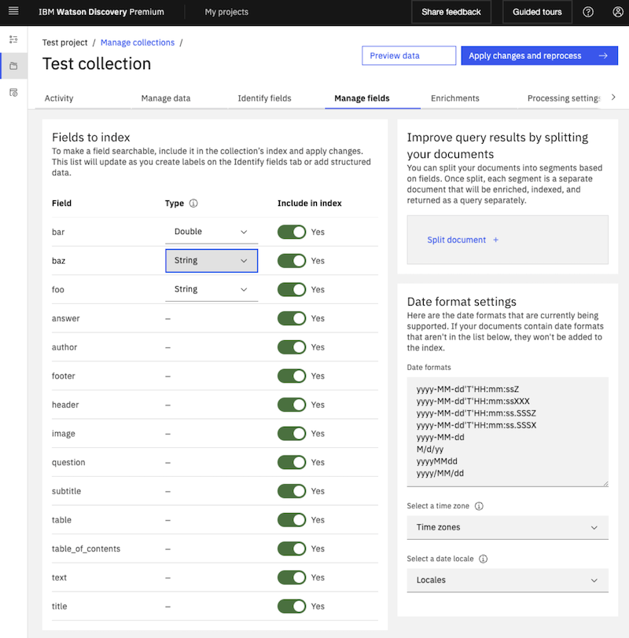

---

copyright:
  years: 2020, 2024
lastupdated: "2024-02-02"

subcollection: discovery-data

---

{{site.data.keyword.attribute-definition-list}}

# Troubleshooting ingestion
{: #troubleshoot-ingestion}

Learn about solutions and workarounds to warnings or errors that you might encounter when you add data to a collection.
{: shortdesc}

This information applies both to managed and installed instances of {{site.data.keyword.discoveryshort}}. For more troubleshooting tips for installed deployments only, see [Troubleshooting {{site.data.keyword.discoveryfull}} Cartridge for {{site.data.keyword.icp4dfull}} deployments](/docs/discovery-data?topic=discovery-data-troubleshoot).
{: note}

Documents fail to index with a mapper parsing exception error
:    {{site.data.keyword.discoveryshort}} provides a rich set of query and aggregation functions for all supported field types such as `nested`, `string`, `date`, `long`, `integer`, `short`, `byte`, `double`, `float`, `boolean`, and `binary`. To support the functions and remain schema-less, collections in {{site.data.keyword.discoveryshort}} automatically detect a field data type when the field's data is first parsed during an add or update document process.

    Consider that the following document is first ingested to a collection.
    
   ```json
    {
    "foo": "lorem ipsum",
    "bar": 12345,
    "baz": "2024-01-01"
    }
    ```
    {: codeblock}

    The automatically detected field data types for the first document are shown in the following response of the `List fields` method. For more information, see [List fields](https://{DomainName}/apidocs/discovery-data#listfields){: external} in the API reference. 

    ```json
    {
        "fields": [
            {
              "field": "foo",
              "collection_id": "6537819f-8a3d-de55-0000-018d199c9c1e",
              "type": "string"
            },
            {
              "field": "bar",
              "collection_id": "6537819f-8a3d-de55-0000-018d199c9c1e",
              "type": "double"
            },
            {
              "field": "baz",
              "collection_id": "6537819f-8a3d-de55-0000-018d199c9c1e",
              "type": "date"
            },
            ...
        ]
    }
    ```
    {: codeblock}

    Now, when subsequent documents are added to the collection, they must have field data that is supported by each automatically detected field type from the first document, or must not have that field at all. If a subsequent document contains field data that is not supported by the respective field type, then {{site.data.keyword.discoveryshort}} fails to index the entire document and a `mapper_parsing_exception` error occurs.

    For example, consider that the following second document is next ingested to the same collection:

    ```json
    {
    "foo": "dolor sit amet",
    "bar": 67890,
    "baz": "consectetur adipiscing elit"
    }
    ```
    {: codeblock}

    Ingesting the second document fails because the `baz` field contains field data (`consectetur adipiscing elit`) that cannot be parsed as `date`, which is the automatically detected field type for the `baz` field from the first document ingestion process. The unsupported field data for the `baz` field results in the following `mapper parsing exception` error.

    ```json
    {
      "severity": "error",
      "created": "2024-01-17T23:05:30.968Z",
      "description": "Failed to index. type=\"mapper_parsing_exception\", reason=\"failed to parse field [baz] of type [date] in document with id 'b326428e0ce9a2e829327d393b14d76f'. \"",
      "step": "indexing",
      "document_id": "b326428e0ce9a2e829327d393b14d76f",
      "customer_id": "",
      "notice_id": "index_failed_elastic_return_error"
    }
    ```
    {: codeblock}

    To resolve this error, plan to ingest documents in a sequence that sets the automatically detected field types to more permissive field types such as `string`.

    To add both the first document and second document in the examples to the same collection, you must set the `baz` field data type to the more permissive `string` field type. To do so, you can reverse the order in which the documents are ingested to the collection. So, when the collection first parses the `baz` field, the field type is automatically detected as `string`. In general, the `string` field type accepts any data format.

    Alternatively, navigate to the **Manage fields** page. To access the **Manage fields** page, click the **Manage collections** icon in the navigation panel, open the collection, and then click the **Manage fields** tab. You can change the field type of top-level fields to more permissive types such as `string` in the **Manage fields** page and then reprocess the collection. If the field type is already selected as `string`, choose a different field type and select `string` again, then click **Apply changes and reprocess**.

    For example, the following image shows the field type for the `baz` field.

    {: caption="Figure 1. Manage fields page" caption-side="bottom"}

    After applying changes and allowing the collection time to reprocess, you can ingest the second document in the example successfully to the same collection. For example, the following response from the `Get document details` method shows that the second document is ingested successfully. For more information, see [Get document details](https://{DomainName}/apidocs/discovery-data#getdocument){: external} in the API reference. 

    ```json
    {
      "document_id": "b326428e0ce9a2e829327d393b14d76f",
      "created": "2024-01-17T23:04:00.411Z",
      "updated": "2024-01-18T00:00:36.158Z",
      "status": "available",
      "notices": [],
      "children": {
        "count": 0,
        "have_notices": false
      },
      "filename": "second.json",
      "file_type": "json",
      "sha256": "ba280879c7c30885478563ee14e0fbb23186eaeecdf5d554c7f50efd9bab4a35"
    }
    ```
    {: codeblock}

Unable to process one or more documents
:    This notification is displayed in the page header when a processing delay of any kind occurs in any project across the entire service instance. If the message is displayed while you are adding data to a collection, you can ignore it. If any problems occur that are related to the creation of your collection, a message is displayed in the *Activity* page for the collection. Check there for any pertinent messages.

This document exceeds the 1MB limit for non-HTML fields
:    The `html` field in the document index stores structural information about the document. If you add a single document with complex tables, images, or other objects that need to be represented in HTML, you might hit the size limit for this field. To work around this issue, consider breaking the source file up into 2 or more smaller files, and then add the files to the same collection separately so that you can apply enrichments and search them together.

## Microsoft document troubleshooting tips
{: #upload-data-ts-ms}

Failed to prepare document for SDU processing
:    Some DOC, PPT, and XLS files that use older features which are no longer supported by Microsoft Office can cause ingestion issues. If you encounter this issue, open the file in a more recent version of Microsoft Office and convert the file to the DOCX, PPTX, or XLSX format respectively, and then upload the DOCX, PPTX, or XLSX file.

Line breaks are inserted randomly
:   When some files in Microsoft Office format are added to a collection, line breaks are inserted seemingly at random to the text that is stored in the `html` field in the collection's index. The unexpected line breaks can impact the efficiency of enrichments, such as custom rule recognition.

    Cause: As part of their ingestion into Discovery, such files are converted from Office format to PDF format. When the conversion happens, textual content is sometimes lost due to the nature of a PDF file. While the new lines appear to be added at random, they typically get inserted in areas where text wraps in the original document, such as in narrow text boxes or to accommodate other inline elements, such as images or diagrams.

    Solution: To avoid new line insertions, increase the width of text boxes in the original document. If the original document has a section where text wraps to accommodate an inline element, such as an image, move the image so that it is situated in its own section and the nearby text doesn't need to wrap around it. To test whether your fixes address the issue, you can convert the original file to a PDF file to check for unexpected carriage returns in the text.

After applying a pretrained Smart Document Understanding model to a PPT file, table boundaries are not recognized properly
:    During the conversion process, text that is extracted from the table is confused with text that is outside the table in some PPT pages. This issue is more likely to occur in tables with a lot of text and that have footnotes displayed just outside the table border. If you encounter this issue, export the PPT file as a PDF file, and then upload the PDF file instead. Apply a user-trained Smart Document Understanding (SDU) model to the document, and then use the SDU tool to identify the tables in the document. The resulting model handles table boundaries properly and can extract text from the tables cleanly.

## PDF file troubleshooting tips
{: #upload-data-ts-pdf}

Unexpected characters are displayed in the advanced document view after ingesting PDFs exported from Word
:    If you export PDFs from Microsoft Word, and then ingest these PDFs, certain characters such as `tt` and `ti` in the PDFs are replaced with unexpected characters when you view using the **Text** option in the advanced document view.
To resolve this issue, ingest the original Word documents instead of the exported PDFs.

Failed to parse document due to invalid encoding
:    Enable OCR for the file.

## Enrichment troubleshooting tips
{: #upload-data-ts-enrichments}

Table Understanding: *n* input tables excluded by enrichment
:    If tables in a document have inconsistent column and row spans or are too large for the system to process completely, the table understanding enrichment is not applied to them. Information from such tables cannot be returned in search results. If you want the table understanding enrichment to be applied to a table that was skipped, consider editing the table. Change a table with inconsistent column and row spans to have a simpler table format. Split a large table into many smaller tables.

    To find the table where the enrichment was not applied, check the warning message. It lists the character offsets where the table begins and ends in the HTML representation of the document. To see the full warning message and get the document ID, click **View all**, and then make a note of the document ID. From the *Improve and customize* page, submit an empty search query to return all of the indexed documents. Look for the document ID. (You can change the search result settings to show the document ID as the result title.) Click the **View passage in document** link for your document, and then click **Open advanced view**. Choose to view the document as JSON and then look for the `html` field. Copy and paste the HTML representation of the document into a text editor. Look for the character offsets that were listed in the original warning message to find the table.
