---

copyright:
  years: 2021, 2023
lastupdated: "2023-03-17"

subcollection: discovery-data
content-type: tutorial
services: discovery-data
account-plan: plus
completion-time: 2h

---

{{site.data.keyword.attribute-definition-list}}

# Power your assistant with answers from web resources
{: #tutorial-assistant-fred}
{: toc-content-type="tutorial"}
{: toc-services="discovery-data"}
{: toc-completion-time="2h"}

In this tutorial, you will use the Watson {{site.data.keyword.discoveryshort}} and {{site.data.keyword.conversationshort}} services to create a virtual assistant that can answer questions about the latest research from the US Federal Reserve. The assistant will answer questions by using up-to-date, existing research publications from the Federal Reserve Economic Data (FRED) website.
{: shortdesc}

[IBM Cloud]{: tag-ibm-cloud} 

Follow this tutorial only if you are using a managed deployment.
{: note}

## Learning objectives
{: #tutorial-convo-objectives}

By the time you finish the tutorial, you will understand how to:

- Create an action in {{site.data.keyword.conversationshort}} that can recognize questions about a particular subject.
- Create a Conversational Search project in {{site.data.keyword.discoveryshort}}.
- Add a web crawl data source to your project.
- Connect your {{site.data.keyword.conversationshort}} action to a search extension that gets answers from your {{site.data.keyword.discoveryshort}} project.
- Use your assistant to return answers that it retrieves from the website.

### Duration
{: #tutorial-convo-duration}

This tutorial will take approximately 2 to 3 hours to complete.

### Prerequisite
{: #tutorial-convo-prereqs}

1.  Before you begin, you must set up a paid account with IBM Cloud.

    You can complete this tutorial at no cost by using a Plus plan, which offers a 30-day trial at no cost. However, to create a Plus plan instance of the service, you must have a paid account (where you provide credit card details). For more information about creating a paid account, see [Upgrading your account](/docs/account?topic=account-upgrading-account){: external}.

1.  Create a Plus plan {{site.data.keyword.discoveryshort}} service instance.

    Go to the [{{site.data.keyword.discoveryshort}} resource](https://cloud.ibm.com/catalog/services/watson-discovery){: external} page in the {{site.data.keyword.cloud_notm}} catalog and create a Plus plan service instance.

If you decide to stop using the Plus plan and don't want to pay for it, delete the Plus plan service instance before the 30-day trial period ends.
{: important}

## Create an assistant
{: #tutorial-convo-assistant}
{: step}

For this tutorial, you will create an assistant with a single action. First, you must create a {{site.data.keyword.conversationshort}} service instance.

Both Lite and Trial plan {{site.data.keyword.conversationshort}} service instances are available at no cost. You will create a Trial plan because a Plus or higher plan is required to add a search skill to an assistant and the Trial plan includes all Plus plan features. The Lite plan does not.

1.  Create a Trial plan {{site.data.keyword.conversationshort}} service instance in the same data location where the {{site.data.keyword.discoveryshort}} service instance is hosted, such as Dallas.
1.  From the {{site.data.keyword.conversationshort}} plan service page in {{site.data.keyword.cloud_notm}}, click **Launch {{site.data.keyword.conversationshort}}**.

    The {{site.data.keyword.conversationshort}} product user interface is displayed where you can create your first assistant.
1.  Add `FRED research` as the assistant name, and then click **Next**.

    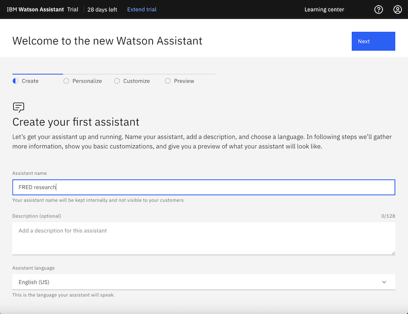

1.  Fill out the fields to share information about you and your assistant, and then click **Next**.

    In the *Which statement describes your needs best* field, choose **I'm using Watson Assistant to complete a course or certification.**.

    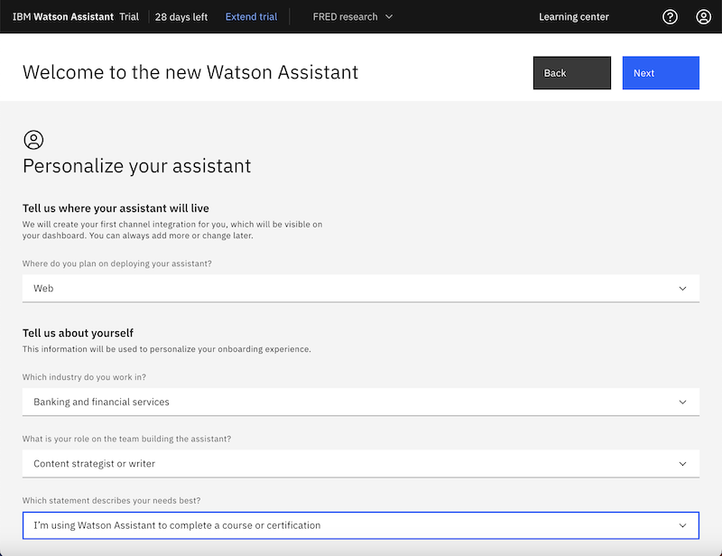
    
1.  When you create an assistant, a web chat application is created for you automatically.

    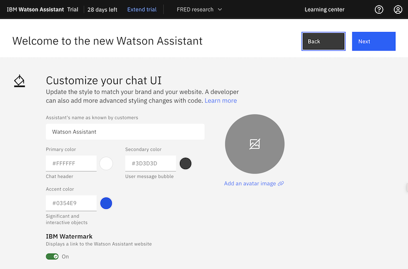

1.  Click **Next** to accept the default style for the web chat.

    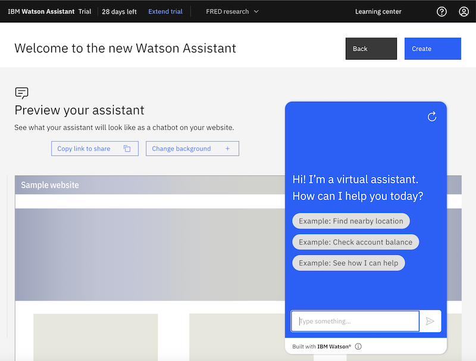

    A preview of the web chat as it would be displayed in a web page is shown.

1.  Click **Create** to create the assistant and the corresponding web chat app.

After a congratulatory message, the home page for your new assistant is displayed.

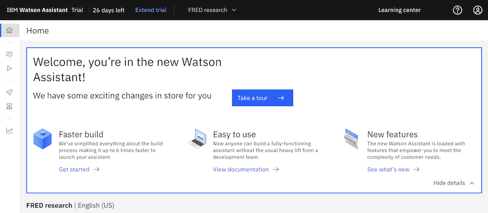

## Create an action
{: #tutorial-convo-action}
{: step}

Create a single action that can recognize questions about the entity extractor feature in {{site.data.keyword.discoveryshort}}. 

In a real world scenario, you might want your assistant to answer questions about the products in your catalog or about insurance plan options or anything else. You can complete similar steps to teach the assistant to recognize when a customer is asking about a particular subject.

1.  From the navigation panel, click **Actions**.

    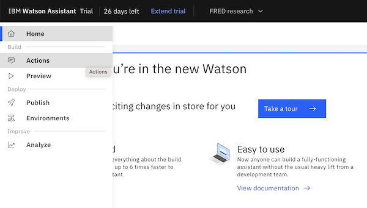

    The Actions page is displayed.

    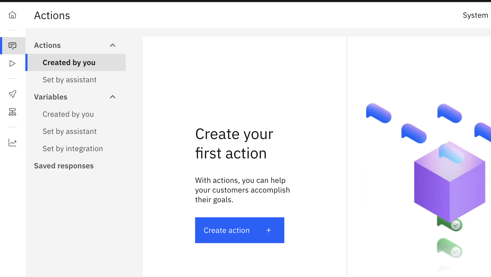

1.  Click **Create action**, and then choose to start from scratch.

    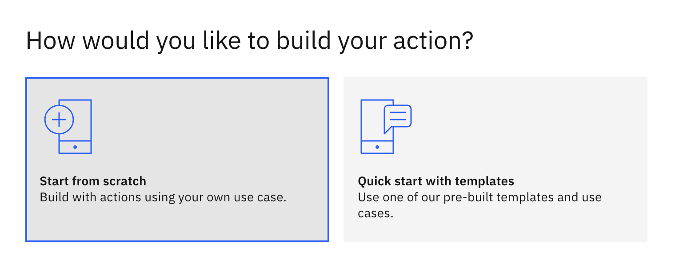

1.  Because you want the assistant to recognize when customers ask about economic research, add the following sample user question, and then click **Save**:

    ```
    What are the latest working papers about?
    ```
    {: codeblock}

    

    The editor closes. We want to add a few more examples.

1.  Click the *Customer starts with* tile to continue adding examples.

    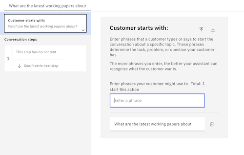

1.  Add the following questions:

    ```
    Are there any working papers on the shipping industry?
    ```
    {: codeblock}

    ```
    Are there any papers that focus on inflation?
    ```
    {: codeblock}

    ```
    Are there papers about how trade policy affects pricing?
    ```
    {: codeblock}

    ```
    What's the latest research on municipal bond markets?
    ```
    {: codeblock}

    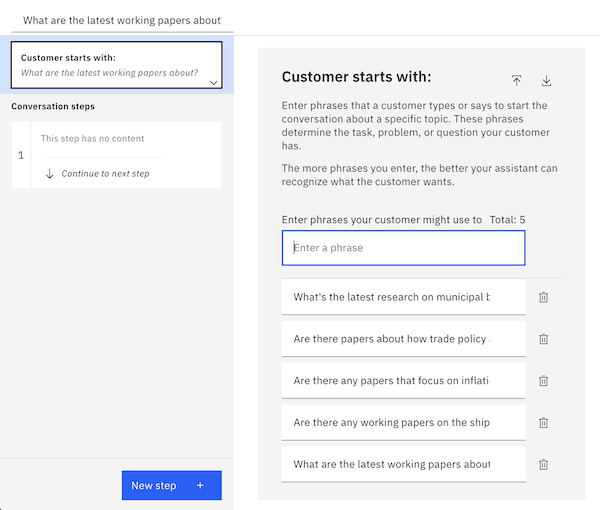

1.  Click the first step in the *Conversation steps* section.

    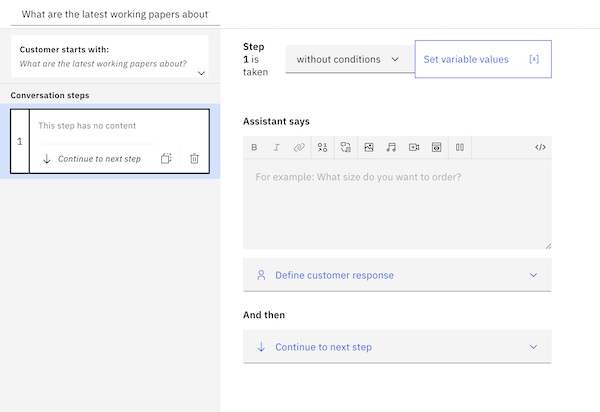

1.  Add the following text to the *Assistant says* field:

    ```
    I'll check the Federal Reserve Economic Data website.
    ```
    {: codeblock}

1.  Do not add a customer response. Instead, in the *And then* section, click **Continue to next step**, and then choose **Search for the answer**.

    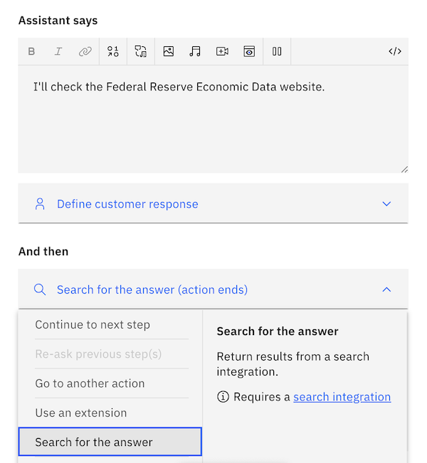

1.  Click **Edit settings**.

    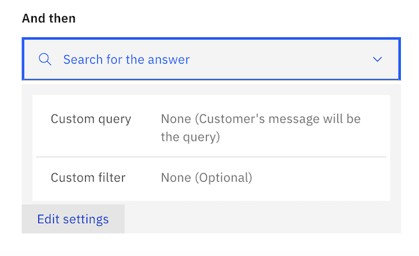

1.  Select **End the action after returning results**, and then click **Apply**.

    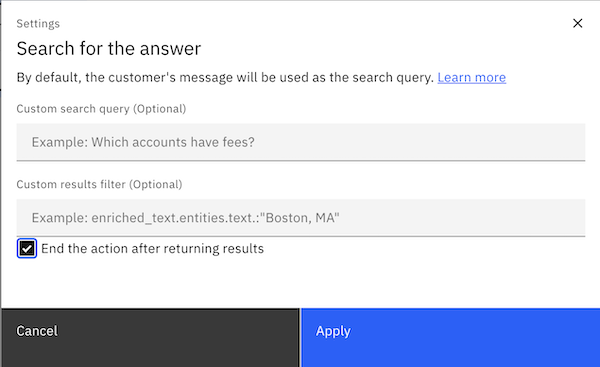

1.  Save your changes, and then click the X to close the step.

    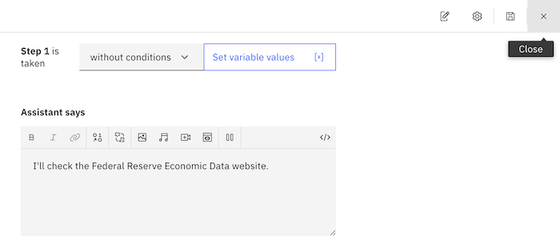

Congratulations! You successfully created an action that recognizes questions about the {{site.data.keyword.discoveryshort}} entity extractor and returns a search response.


In a later step, we will connect the search response in this action to a search extension that is configured for the assistant.

## Create a Conversational Search project
{: #tutorial-convo-project}
{: step}

Now that the assistant can recognize questions about a subject, let's give it access to data from which it can retrieve accurate answers.

In {{site.data.keyword.discoveryshort}}, create a Conversational Search project type. This project type is optimized for retrieving answers during dialog-driven interactions. For example, unlike other project types, it does not apply prebuilt enrichments that aren't needed.

1.  Open a new web browser page.

    Keep the {{site.data.keyword.conversationshort}} page open in a separate tab so you can switch between the two applications.
    {: tip}

1.  From the {{site.data.keyword.discoveryshort}} Plus plan service page in {{site.data.keyword.cloud_notm}}, click **Launch {{site.data.keyword.discoveryshort}}**.
1.  From the *My Projects* page, click **New Project**.
1.  Name your project `Federal Reserve research`, and then click the **Conversational Search** tile.

    
1.  Click **Next**.

You'll configure the data source for the project in the next step.

## Connect to a website
{: #tutorial-convo-add-data}
{: step}

We want the virtual assistant to be able to answer questions about the entity extractor feature in {{site.data.keyword.discoveryshort}}, so we will connect our project to the {{site.data.keyword.cloud_notm}} website that hosts the {{site.data.keyword.discoveryshort}} product documentation.

1.  From the *Select data source* page, click **Web crawl**, and then click **Next**.

    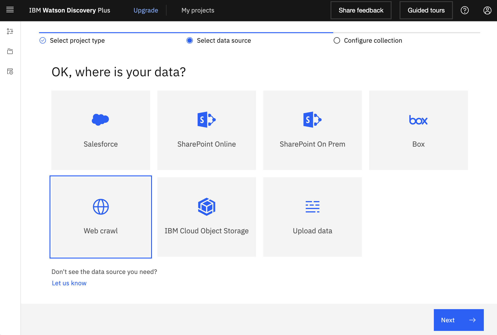
1.  In the **Collection name** field, add `FRED papers`.

    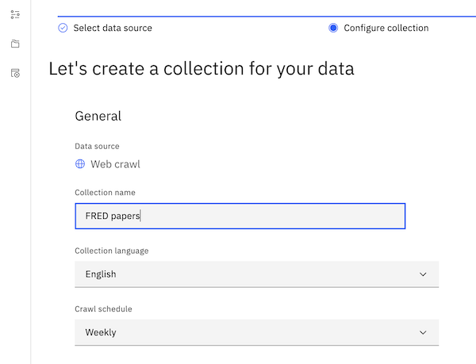
1.  In the **Starting URLs** field, add the following URL:

    ```
    https://research.stlouisfed.org/wp
    ```
    {: codeblock}

    

    You will add only one starting URL. In a real scenario, you might add multiple URLs that go to other pages with information about the same topic. By adding more URLs, you can expand the breadth of the expertise of your assistant.
1.  Click **Add**.

1.  Click the Edit icon for the URL that you just added.

    
1.  In the **Maximum number of links to follow** field, change the value to 5.

    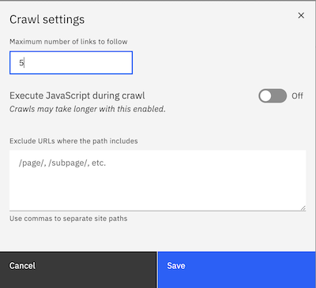

    By changing the value to 5, you indicate that you want the service to process the page that you specified plus you want it to follow up to 5 links from the starting page.

1.  Click **Save**, and then click **Finish**.

The {{site.data.keyword.discoveryshort}} service crawls the web page that you specified starting with the page that you specified as the starting URL.

While the website is being crawled and the data indexed, let's go back to our {{site.data.keyword.conversationshort}} service instance. It's time to connect the action that we created to this {{site.data.keyword.discoveryshort}} project.

## Add a search extension
{: #tutorial-convo-search}
{: step}

Now, let's connect your assistant to your {{site.data.keyword.discoveryshort}} data.

1.  From the navigation panel in {{site.data.keyword.conversationshort}}, click **Environments**.

    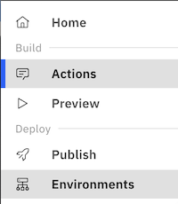

    The draft environment is displayed. It shows that a web chat is connected to your assistant. 

    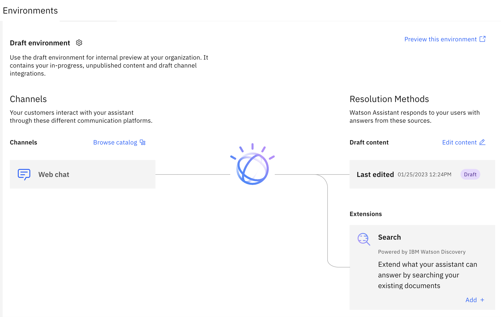

1.  Click the Web chat tile to edit the web chat. 

    We don't want to add multiple starter questions, so we are going to turn off the home screen for the web chat. Click the **Home screen** tab.

    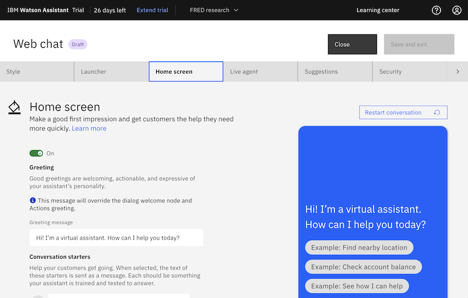

1.  Set the switcher to **Off**, and then click **Save and exit**.

    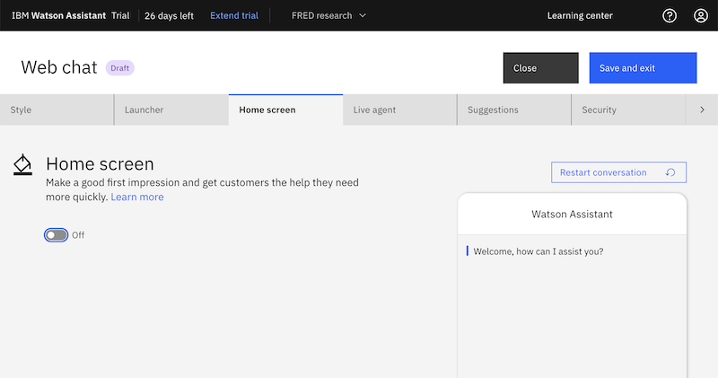

1.  We want to connect the web chat to a search extension. Click the **Add** button in the Search extension tile.

    

    The Search Integration page is displayed.

1.  Select the {{site.data.keyword.discoveryshort}} instance where your project is stored, and then select the **Federal Reserve research** project that you created earlier. Click **Next**.

    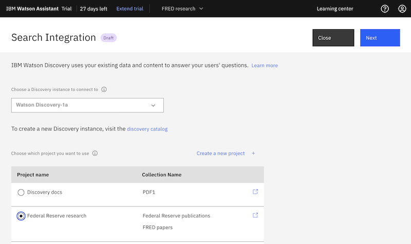

1.  The default result content configuration uses the best fields; you don't need to change them.

1.  In the *Define the text your search will display to the end user* section, edit the content to show the following message:

    ```
    The Federal Reserve Economic Data website has this information:
    ```
    {: codeblock}

    Verify that the *Emphasize the answer* switch is set to **On**. This setting adds the `find_answers:true` parameter to the query request. As a result, a succinct answer to the query is shown in bold in the response that is returned by the assistant.

    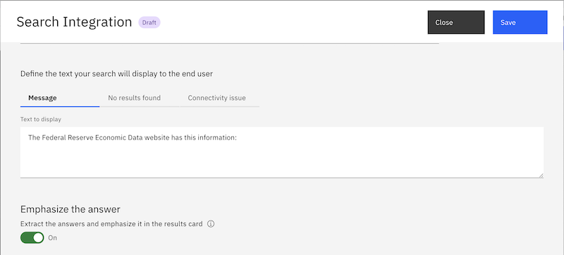

1.  Click **Create**.

## Preview the assistant
{: #tutorial-convo-test-chat}
{: step}

To preview an assistant that connects to data that is stored in {{site.data.keyword.discoveryshort}}, you must preview the assistant from the Environments page. When you test it separately, the assistant is not able to retrieve data from {{site.data.keyword.discoveryshort}}.

1.  From the Environments page, click **Preview this environment**.

    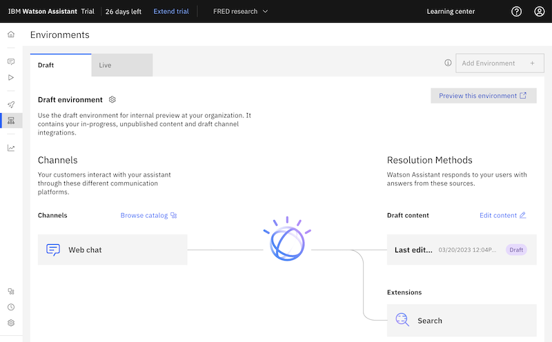

    A sample web page is displayed that includes a chat icon.

    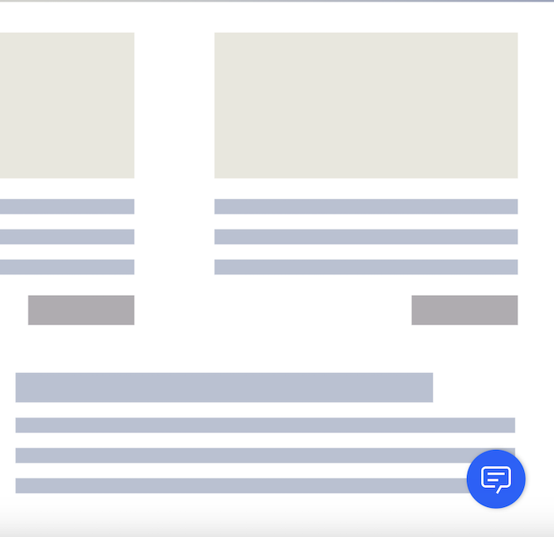

1.  Click the chat icon to open the web chat window.

    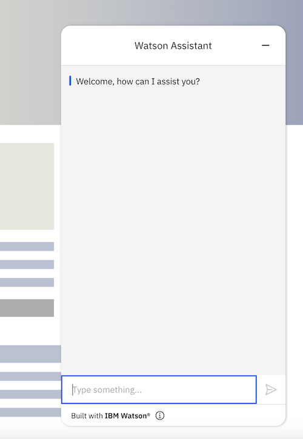

1.  Enter the following text question:

    ```
    What impact is inflation having on the real estate market?
    ```
    {: codeblock}

    This test question is not one of the questions that we used to train the assistant.
    {: note}

    The correct answer is returned and it includes a link to the source documentation page.

    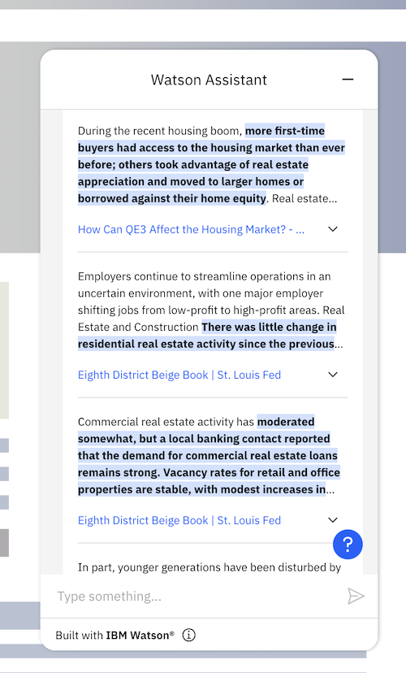

Congratulations! You successfully created an assistant that can answer questions about economic topics by retrieving information from working papers that are available from the US Federal Research Economic Data website.

### Next steps
{: #tutorial-convo-next}

The assistant that you created and connected to a search extension is available from the Draft environment. Next, you can publish your assistant to a production environment and deploy it. There are a variety of methods you can use to deploy the assistant. For more information, see [Overview: Previewing and publishing](/docs/watson-assistant?topic=watson-assistant-publish-overview){: external}.
