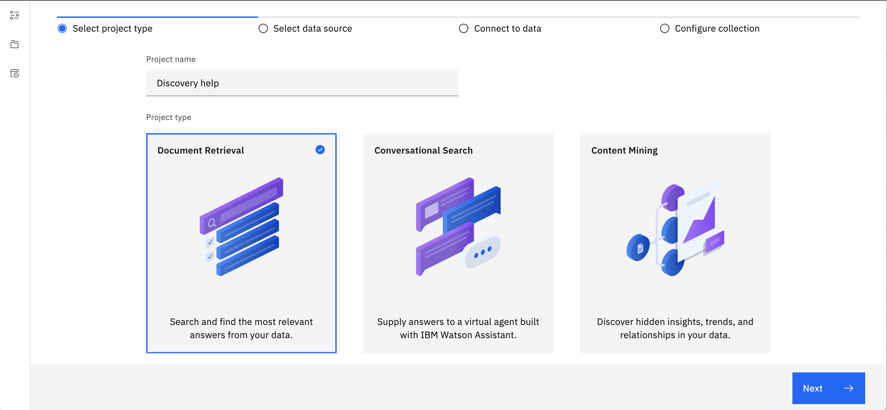
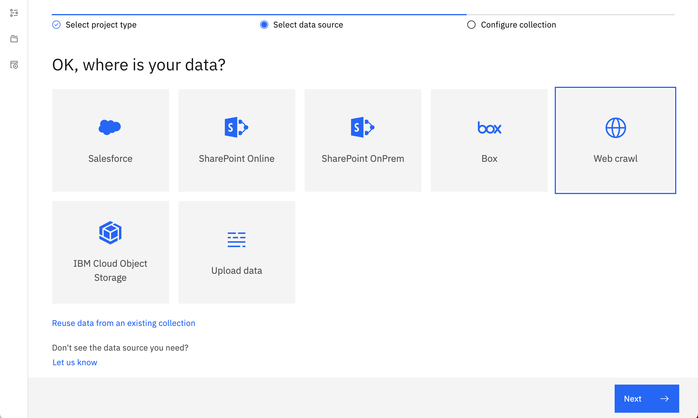
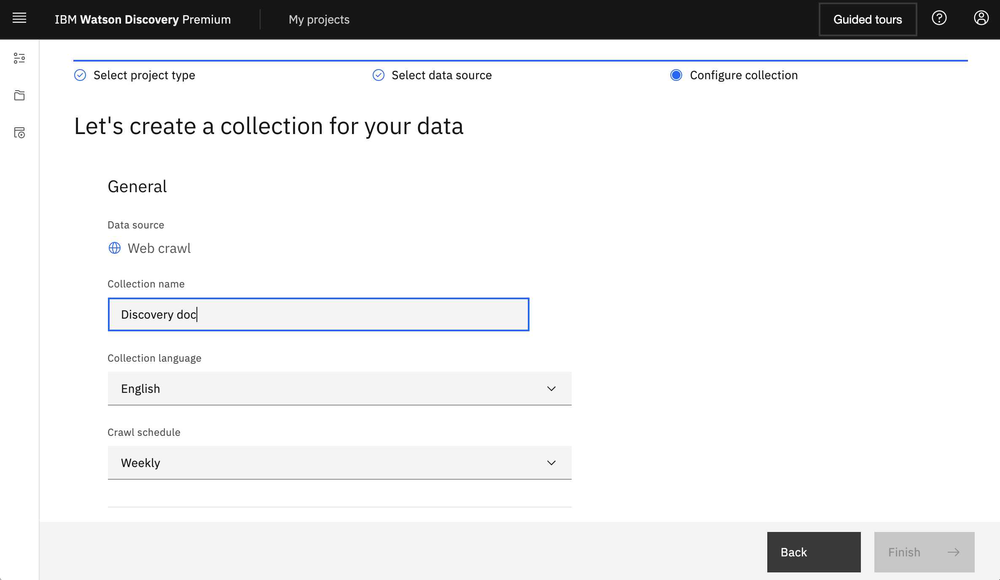
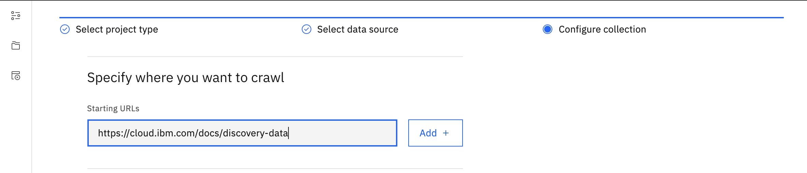
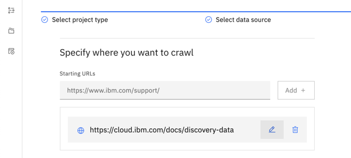
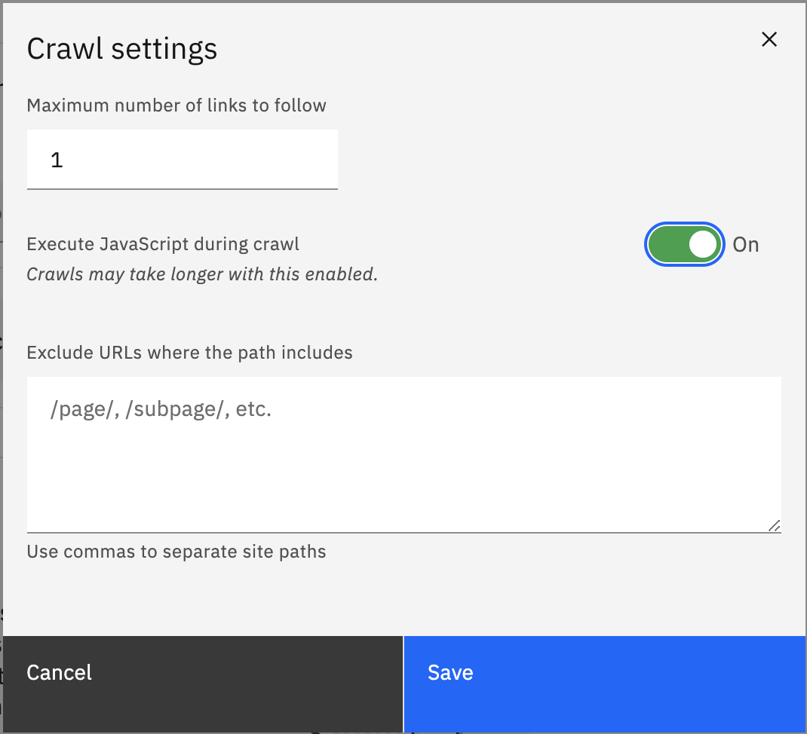
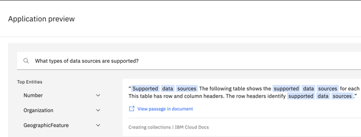

---

copyright:
  years: 2022
lastupdated: "2022-03-07"

subcollection: discovery-data
content-type: tutorial
account-plan: plus
completion-time: 1h

---

{{site.data.keyword.attribute-definition-list}}

# Get quick answers from existing help content
{: #tutorial-crawl-short}
{: toc-content-type="tutorial"}
{: toc-completion-time="1h"}

In this tutorial, you will use the {{site.data.keyword.discoveryshort}} service to create a simple search application that can answer questions about Watson Discovery with information from the IBM Cloud Docs site.
{: shortdesc}

 **{{site.data.keyword.cloud_notm}} only**

Follow this tutorial only if you are using a managed deployment. The tutorial relies on a feature (JavaScript support) that is currently available in managed deployments only. If you want to complete the tutorial and are using an installed deployment, you can do so. However, you must connect to a different website, one without dynamic content. The steps to follow are similar otherwise.
{: note}

## Learning objectives
{: #tutorial-crawl-short-objectives}

By the time you finish the tutorial, you will understand how to:

- Create a Document Retrieval project in {{site.data.keyword.discoveryshort}}.
- Add a web crawl data source to your {{site.data.keyword.discoveryshort}} project.
- Access an application preview where you can retrieve answers to natural language questions from a website.

### Duration
{: #tutorial-crawl-short-duration}

This tutorial will take approximately one hour to complete.

### Prerequisite
{: #tutorial-crawl-short-prereqs}

1.  Before you begin, you must set up a paid account with IBM Cloud.

    You can complete this tutorial at no cost by using a Plus plan, which offers a free 30-day trial. However, to create a Plus plan instance of the service, you must have a paid account (where you provide credit card details). For more information about creating a paid account, see [Upgrading your account](/docs/account?topic=account-upgrading-account){: external}.

1.  Create a Plus plan {{site.data.keyword.discoveryshort}} service instance.

    Go to the [{{site.data.keyword.discoveryshort}} resource](https://cloud.ibm.com/catalog/services/watson-discovery){: external} page in the {{site.data.keyword.cloud_notm}} catalog and create a Plus plan service instance.

If you decide to stop using the Plus plan and don't want to pay for it, delete the Plus plan service instance before the 30-day trial period ends.
{: important}

## Create the Document Retrieval project
{: #tutorial-crawl-short-project}
{: step}

Create a project. You'll create a *Document Retrieval* project type. This project type offers you lots of options for configuring and testing the project after you add data to it.

For more information about project types, see [Creating projects](/docs/discovery-data?topic=discovery-data-projects).

1.  From the {{site.data.keyword.discoveryshort}} Plus plan service page in {{site.data.keyword.cloud_notm}}, click **Launch {{site.data.keyword.discoveryshort}}**.
1.  From the *My Projects* page, click **New Project**.
1.  Name your project `Discovery help`, and then click the **Document Retrieval** tile.

    
1.  Click **Next**.

You'll configure the data source for the project in the next step.

## Connect to a website
{: #tutorial-crawl-short-add-data}
{: step}

We want to build a search app that can answer questions about Watson Discovery, so we will connect our project to IBM Cloud site where the {{site.data.keyword.discoveryfull}} product documentation is hosted.

The IBM Cloud Docs site uses JavaScript to display the content dynamically on its website. We will enable JavaScript execution for the site. As a result, the initial crawl will take longer than usual because the service must wait for the JavaScript to render content for the pages before it can crawl them.
{: note}

1.  From the *Select data source* page, click **Web crawl**, and then click **Next**.

    
1.  In the **Collection name** field, add `Discovery doc`.

    

    Keep the *Crawl schedule* set to `Weekly`. The product documentation is updated regularly, but you can keep up with the most critical changes by using a weekly synchronization schedule.
1.  Scroll down to the **Starting URLs** field, and then add the URL `https://cloud.ibm.com/docs/discovery-data`.

    

1.  Click **Add**.

1.  Click the *Edit* icon for the URL that you just added.

    
1.  In the **Maximum number of links to follow** field, change the value to 1.

    By changing the value to 1, you limit the number of links that are followed. As a result, Discovery crawls mostly topics within the official product documentation set and adds them to the collection. It doesn't follow as many links that go to external websites.

1.  Set the *Execute JavaScript during crawl* switcher to **On**, and then click **Save**.

    

1.  Click **Finish**.

The service crawls the web page that you specified as the starting URL. Because you enabled JavaScript execution, the crawl will take time to complete, about 10 to 20 minutes. This is a good time to grab a cup of coffee or check your messages.

## Test your project
{: #tutorial-crawl-short-test}
{: step}

Let's find out whether the web crawl has finished.

1.  After the website has been crawled and the data processed, the *Improve and customize* page is displayed.

    If the crawl is not completed and you want to check the progress, go to the Activity page. From the navigation pane, click **Manage collections**, and then click to open the *Discovery doc* collection. The collection should contain over 90 documents. After the crawl is completed, go to the *Improve and customize* page.

1.  In the *Search* field, enter `What data sources are supported` as the question.

    The response that is returned is a valid and complete answer to the question.

    

    Congratulations! Your project is answering questions successfully.

## Deploy the application preview
{: #tutorial-crawl-short-app-preview}
{: step}

If you want to share the simple search app with your team members, you can send them a URL to an application preview.

1.  From the navigation pane, click **Integrate and deploy**.

1.  On the *Preview Link* page, click the copy icon to copy the link to a test app that uses the search project that you created.

1.  Paste the copied URL into a web browser to open the application preview.

1.  In the *Search* field, enter `What types of data sources are supported?` as the question.

    The same set of valid responses is returned.

    

1.  You can share the URL with team members. Follow the steps that are shown on the page to give other people access to your project first.

### Next steps
{: #tutorial-crawl-short-next}

Learn more about ways to enrich the documents that you crawl from external data sources to acheive even better search results. For more information, see [Adding domain-specific resources](/docs/discovery-data?topic=discovery-data-domain).
