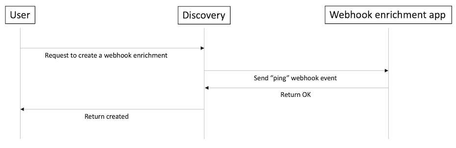
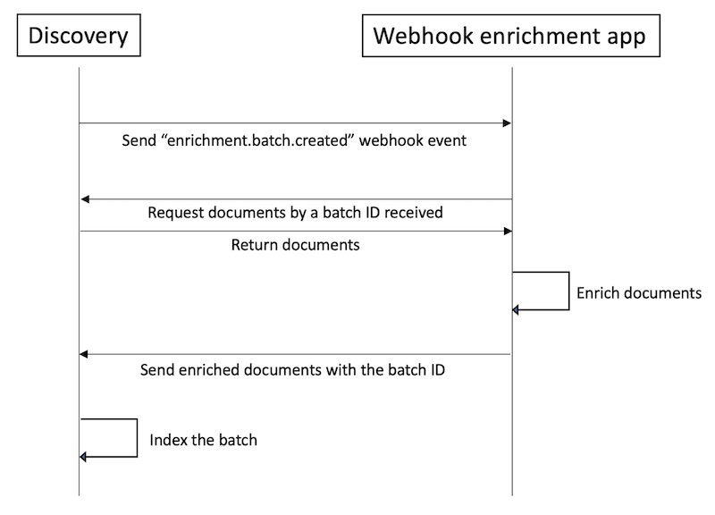

---

copyright:
  years: 2021, 2024
lastupdated: "2023-12-01"

subcollection: discovery-data
content-type: tutorial
services: discovery-data
account-plan: plus
completion-time: 2h

---

{{site.data.keyword.attribute-definition-list}}

# Build an external webhook enrichment solution in Watson {{site.data.keyword.discoveryshort}}
{: #tutorial-external-enrichment}
{: toc-content-type="tutorial"}
{: toc-services="discovery-data"}
{: toc-completion-time="2h"}

In this tutorial, you can use sample applications to build an external webhook enrichment solution by using Watson {{site.data.keyword.discoveryshort}}.
{: shortdesc}

[IBM Cloud]{: tag-ibm-cloud} 

Follow this tutorial only if you are using a managed deployment.
{: note}

The following image shows the external enrichment configuration flow.

{: caption="External enrichment configuration flow" caption-side="bottom"}

The following image shows the external enrichment process flow.

{: caption="External enrichment process flow" caption-side="bottom"}

For more information about the external enrichment APIs, see [External enrichment API](/docs/discovery-data?topic=discovery-data-external-enrichment).

## Learning objectives
{: #tutorial-convo-objectives}

By the time you finish the tutorial, you will learn how to use the following sample applications:

- `Regex`: For entity extraction, document classification, and sentence classification by using regular expressions
- `Granite`: For entity extraction from email by using watsonx.ai Granite model
- `Slate`: For entity extraction with watsonx.ai Slate model that is fine-tuned with labeled data exported from entity extractor workspace of Watson {{site.data.keyword.discoveryshort}}.

### Duration
{: #tutorial-convo-duration}

This tutorial takes approximately 2 hours to complete.

### Prerequisite
{: #tutorial-convo-prereqs}

1.  Before you begin, you must set up a paid account with IBM Cloud to get an instance of Watson {{site.data.keyword.discoveryshort}} Plus or Enterprise plan.

    You can complete this tutorial at no cost by using a Plus plan, which offers a 30-day trial at no cost. However, to create a Plus plan instance of the service, you must have a paid account (where you provide credit card details). For more information about creating a paid account, see [Upgrading your account](/docs/account?topic=account-upgrading-account){: external}. To create a Plus plan {{site.data.keyword.discoveryshort}} service instance, go to the [{{site.data.keyword.discoveryshort}} resource](https://cloud.ibm.com/catalog/services/watson-discovery){: external} page in the {{site.data.keyword.cloud_notm}} catalog and create a Plus plan service instance.

    If you decide to stop using the Plus plan and don't want to pay for it, delete the Plus plan service instance before the 30-day trial period ends.
    {: important}

1.  You should have access to the [{{site.data.keyword.discoveryshort}} doc-tutorial-downloads](https://github.com/watson-developer-cloud/doc-tutorial-downloads/tree/master/discovery-data/webhook-enrichment-sample){: external} repository to download the sample applications and data.

#### Additional prerequisites for the Granite application
{: #tutorial-regex-prerequsities}

1.  Set up an instance of Watson {{site.data.keyword.pm_short}}. For more information about the pricing plans, see [Watson {{site.data.keyword.pm_short}}](https://cloud.ibm.com/catalog/services/watson-machine-learning){: external}.

1.  Create an API key for IBM Cloud. For more information, see [Understanding API keys](https://cloud.ibm.com/docs/account?topic=account-manapikey){: external}.

#### Additional prerequisites for the Slate application
{: #tutorial-slate-prerequsities}

1.  Set up an instance of Watson {{site.data.keyword.pm_short}}. For more information about the pricing plans, see [Watson {{site.data.keyword.pm_short}}](https://cloud.ibm.com/catalog/services/watson-machine-learning){: external}.

1.  Set up an instance of Cloud Pak for Data 4.7.x or later, and install {{site.data.keyword.DSX_short}} and Watson {{site.data.keyword.pm_short}}.

1.  Create an API key for IBM Cloud. For more information, see [Understanding API keys](https://cloud.ibm.com/docs/account?topic=account-manapikey){: external}.

1.  Create an API key for IBM Cloud Pak for Data. For more information, see [Getting Started with IBM Cloud Paks](https://www.ibm.com/docs/en/cloud-paks/1.0){: external}.

## Regex - Entity Extraction, document classification, and sentence classification by using regular expressions
{: #tutorial-regex}

In this sample, we are using {{site.data.keyword.codeenginefull_notm}} as the infrastructure environment for the application of webhook enrichment. However, you can deploy the application in any other environment.

1.  Deploy the webhook enrichment application to {{site.data.keyword.codeenginefull_notm}}.

    1.  Create a project in {{site.data.keyword.codeenginefull_notm}}. For more information, see [Create a project](https://cloud.ibm.com/docs/codeengine?topic=codeengine-manage-project#create-a-project){: external}.
    
    1.  Create a secret in the project. For more information, see [Creating secrets](https://cloud.ibm.com/docs/codeengine?topic=codeengine-secret#secret-create){: external}.

        This secret must contain the following key-value pairs:

        -  `WD_API_URL`: The API endpoint URL of your {{site.data.keyword.discoveryshort}} instance.
        -  `WD_API_KEY`: The API key of your {{site.data.keyword.discoveryshort}} instance.
        -  `WEBHOOK_SECRET`: A key to pass with the request that can be used to authenticate with the application. For example,`purple_unicorn`.

    1.  Deploy the application from the sample repository source code. For more information, see [Deploying your app from repository source code](https://cloud.ibm.com/docs/codeengine?topic=codeengine-app-source-code){: external}.

        In *Create application*, click **Specify build details** and enter these details.

        -  For source, specify:
            
            -  Code repo URL: URL of the sample code repository [{{site.data.keyword.discoveryshort}} doc-tutorial-downloads](https://github.com/watson-developer-cloud/doc-tutorial-downloads){: external} page
            -  Code repo access: `None`
            -  Branch name: `master`
            -  Context directory: `discovery-data/webhook-enrichment-sample/regex`

        -  Strategy: `Dockerfile`
        -  Output: Enter your container image registry information
        -  Open **Environment variables (optional)**, and add the following environment variables:
            -  Define as: `Reference to full secret`
            -  Secret: The name of the secret that you created in the project in the previous step

        You can set the **Min number of instances** to 1.

    1.  Ensure that the application status changes to **Ready**.

1.  Configure the {{site.data.keyword.discoveryshort}} webhook enrichment. For more information, see [Configuring the webhook enrichment](#configure-webhook-enrichment).

1.  Ingest documents to {{site.data.keyword.discoveryshort}} and see the results.

    1.  Upload nhtsa.csv from [{{site.data.keyword.discoveryshort}} doc-tutorial-downloads](https://github.com/watson-developer-cloud/doc-tutorial-downloads/tree/master/discovery-data/webhook-enrichment-sample/regex/data){: external} to the collection.
    1.  Find the webhook enrichment results by previewing your query results after the document processing is complete.

## Granite - Entity Extraction by using a foundation model of watsonx.ai
{: #tutorial-granite}

In this sample, we extract entities from an email by using watsonx.ai Granite model. We are using {{site.data.keyword.codeenginefull_notm}} as the infrastructure environment for the application of webhook enrichment. However, you can deploy the application in any other environment.

1.  Deploy the webhook enrichment application to {{site.data.keyword.codeenginefull_notm}}.

    1.  Create a project in {{site.data.keyword.codeenginefull_notm}}. For more information, see [Create a project](https://cloud.ibm.com/docs/codeengine?topic=codeengine-manage-project#create-a-project){: external}.
    
    1.  Create a secret in the project. For more information, see [Creating secrets](https://cloud.ibm.com/docs/codeengine?topic=codeengine-secret#secret-create){: external}.

        This secret must contain the following key-value pairs:

           -  `WD_API_URL`: The API endpoint URL of your {{site.data.keyword.discoveryshort}} instance.
           -  `WD_API_KEY`: The API key of your {{site.data.keyword.discoveryshort}} instance.
           -  `WEBHOOK_SECRET`: A key to pass with the request that can be used to authenticate with the application. For example,`purple_unicorn`.
           -  `IBM_CLOUD_API_KEY`: The API key of IBM Cloud. It is used to access Watson {{site.data.keyword.pm_short}} API.
           -  `WML_ENDPOINT_URL`: The API endpoint URL of your Watson {{site.data.keyword.pm_short}}. For more information, see [the {{site.data.keyword.pm_short}} documentation](https://cloud.ibm.com/apidocs/machine-learning){: external}.
           -  `WML_INSTANCE_CRN`: The CRN of your Watson {{site.data.keyword.pm_short}} instance. You can find your instance and CRN using `ibmcloud` command: `ibmcloud resources`.
    
    1.  Deploy the application from the sample repository source code. For more information, see [Deploying your app from repository source code](https://cloud.ibm.com/docs/codeengine?topic=codeengine-app-source-code){: external}.

        In *Create application*, click **Specify build details** and enter these details.

        -  For source, specify:
            
            -  Code repo URL: URL of the sample code repository [{{site.data.keyword.discoveryshort}} doc-tutorial-downloads](https://github.com/watson-developer-cloud/doc-tutorial-downloads){: external} page
            -  Code repo access: `None`
            -  Branch name: `master`
            -  Context directory: `discovery-data/webhook-enrichment-sample/granite`

        -  Strategy: `Dockerfile`
        -  Output: Enter your container image registry information
        -  Open **Environment variables (optional)**, and add the following environment variables:
            -  Define as: `Reference to full secret`
            -  Secret: The name of the secret that you created in the project in the previous step

        You can set the **Min number of instances** to 1.

    1.  Ensure that the application status changes to **Ready**.

1.  Configure the {{site.data.keyword.discoveryshort}} webhook enrichment. For more information, see [Configuring the webhook enrichment](#configure-webhook-enrichment).

1.  Ingest documents to {{site.data.keyword.discoveryshort}} and see the results.

    1.  Upload email.txt from [{{site.data.keyword.discoveryshort}} doc-tutorial-downloads](https://github.com/watson-developer-cloud/doc-tutorial-downloads/tree/master/discovery-data/webhook-enrichment-sample/granite/data){: external} to the collection.
    1.  Find the webhook enrichment results by previewing your query results after the document processing is complete.

## Slate - Entity extraction with Watsonx.ai Slate model that is fine-tuned with labeled data exported from entity extractor workspace of Watson {{site.data.keyword.discoveryshort}}.
{: #tutorial-slate}

Slate models have the best cost performance trade-off for non-generative use cases. For fine tuning, it requires task-specific labeled data. You can prepare labeled data in Watson {{site.data.keyword.discoveryshort}}, fine-tune the Slate model in {{site.data.keyword.DSX_short}}, and deploy the model in Watson {{site.data.keyword.pm_short}}. Once you deploy a fine-tuned model, you can create a webhook enrichment that enriches documents using that model in Watson {{site.data.keyword.discoveryshort}}.

1.  Prepare labeled data in Watson {{site.data.keyword.discoveryshort}}.

    1.  Create an entity extractor workspace and label data. For more information, see [Define custom entities](/docs/discovery-data?topic=discovery-data-entity-extractor).
    
    1.  Download labeled data from the entity extractor workspace. For more information, see [Exporting labeled data for an entity extractor](/docs/discovery-data?topic=discovery-data-entity-extractor#entity-extractor-export-label).

        In this tutorial, you can use the sample labled data from [{{site.data.keyword.discoveryshort}} doc-tutorial-downloads](https://github.com/watson-developer-cloud/doc-tutorial-downloads/tree/master/discovery-data/webhook-enrichment-sample/slate/data){: external} in subsequent steps.

1.  Fine tune the slate model in {{site.data.keyword.DSX_short}} and deploy the model to Watson {{site.data.keyword.pm_short}}.

    1.  Create a project in {{site.data.keyword.DSX_short}}. For more information, see [Creating a project](https://www.ibm.com/docs/en/cloud-paks/cp-data/4.7.x?topic=projects-creating-project){: external}.
    1.  Create a deployment space in Watson {{site.data.keyword.pm_short}}. For more information, see [Creating deployment spaces](https://www.ibm.com/docs/en/cloud-paks/cp-data/4.7.x?topic=spaces-creating-deployment){: external}
    1.  Create an environment template in the project. For more information, see [Creating environment templates](https://www.ibm.com/docs/en/cloud-paks/cp-data/4.7.x?topic=environments-creating){: external}. You can create with the following options:

        -  Type: `Default`
        -  Hardware configuration
            -  Reserve vCPU: 2
            -  Reserve RAM (GB): 8
        -  Software version: Runtime 23.1 on Python 3.10

    1. Create notebook in the project using the environment template as runtime from the notebook file. For more information about cxreating a notebook, see [Creating notebooks](https://www.ibm.com/docs/en/cloud-paks/cp-data/4.7.x?topic=editor-creating-notebooks){: external}. The notebook file is at [{{site.data.keyword.discoveryshort}} doc-tutorial-downloads](https://github.com/watson-developer-cloud/doc-tutorial-downloads/tree/master/discovery-data/webhook-enrichment-sample/slate/app/notebook){: external}. 
    1.  Upload labeled data in the notebook. For more information, see [Load data from local files](https://www.ibm.com/docs/en/cloud-paks/cp-data/4.7.x?topic=scripts-loading-accessing-data-in-notebook#load-data-from-local-files){: external}.
    1.  Fine tune and deploy the Slate model by running the notebook step-by-step and replacing certain variables.

1.  Deploy the webhook enrichment application to {{site.data.keyword.codeenginefull_notm}}.

    1.  Create a project in {{site.data.keyword.codeenginefull_notm}}. For more information, see [Create a project](https://cloud.ibm.com/docs/codeengine?topic=codeengine-manage-project#create-a-project){: external}.
    
    1.  Create a secret in the project. For more information, see [Creating secrets](https://cloud.ibm.com/docs/codeengine?topic=codeengine-secret#secret-create){: external}.

        This secret must contain the following key-value pairs:

        -  `WD_API_URL`: The API endpoint URL of your {{site.data.keyword.discoveryshort}} instance.
        -  `WD_API_KEY`: The API key of your {{site.data.keyword.discoveryshort}} instance.
        -  `WEBHOOK_SECRET`: A key to pass with the request that can be used to authenticate with the application. For example,`purple_unicorn`.
        -  `SCORING_API_HOSTNAME`: The API hostname of your Watson {{site.data.keyword.pm_short}} scoring deployment that serves your fine-tuned slate model.
        -  `SCORING_DEPLOYMENT_ID`: The ID of your Watson {{site.data.keyword.pm_short}} scoring deployment that serves your fine-tuned slate model.
        -  `SCORING_API_TOKEN`: The API token used in bearer authorization to use your Watson {{site.data.keyword.pm_short}} scoring deployment that serves your fine-tuned Slate model. You can get a token by using the following command:

        ```sh
        curl -X POST {auth} \
        SCORING_API_TOKEN=$(
        curl -k -X POST 'https://{hostname of your cp4d instance}/icp4d-api/v1/authorize' \
                        --header "Content-Type: application/json" 
                        -d "{\"username\":\"admin\",\"api_key\":\"{api key of your cp4d instance}\"}" \
        | jq .token
        )
        ```
        {: codeblock}

1.  Deploy the application from the sample repository source code. For more information, see [Deploying your app from repository source code](https://cloud.ibm.com/docs/codeengine?topic=codeengine-app-source-code){: external}.

    1.  In *Create application*, click **Specify build details** and enter these details.

        -  For source, specify:

            -  Code repo URL: URL of the sample code repository [{{site.data.keyword.discoveryshort}} doc-tutorial-downloads](https://github.com/watson-developer-cloud/doc-tutorial-downloads){: external} page
            -  Code repo access: `None`
            -  Branch name: `master`
            -  Context directory: `discovery-data/webhook-enrichment-sample/slate`

        -  Strategy: `Dockerfile`
        -  Output: Enter your container image registry information
        -  Open **Environment variables (optional)**, and add the following environment variables:
            -  Define as: `Reference to full secret`
            -  Secret: The name of the secret that you created in the project in the previous step

        You can set the **Min number of instances** to 1.

    1.  Ensure that the application status changes to **Ready**.

1.  Configure the {{site.data.keyword.discoveryshort}} webhook enrichment. For more information, see [Configuring the webhook enrichment](#configure-webhook-enrichment).
1.  Ingest documents to {{site.data.keyword.discoveryshort}} and see the results.

    1.  Upload a page of Annual report from [{{site.data.keyword.discoveryshort}} doc-tutorial-downloads](https://github.com/watson-developer-cloud/doc-tutorial-downloads/tree/master/discovery-data/webhook-enrichment-sample/slate/data){: external} to the collection.
    1.  Find the webhook enrichment results by previewing your query results after the document processing is complete.

### Configuring the webhook enrichment
{: #configure-webhook-enrichment}

1.  Create a project.
1.  Create a webhook enrichment by using the {{site.data.keyword.discoveryshort}} API.

    ```sh
    curl -X POST {auth} \
    --header 'Content-Type: multipart/form-data' \
    --form 'enrichment={"name":"my-first-webhook-enrichment", \
    "type":"webhook", \
    "options":{"url":"{your_code_engine_app_domain}/webhook", \
        "secret":"{your_webhook_secret}", \
        "location_encoding":"utf-32"}}' \
    '{url}/v2/projects/{project_id}/enrichments?version=2023-03-31'
    ```
    {: codeblock}

1.  Create a collection in the project and apply the webhook enrichment to the collection.

     ```sh
    curl -X POST {auth} \
    --header 'Content-Type: application/json' \
    --data '{"name":"my-collection", \
    "enrichments":[{"enrichment_id":"{enrichment_id}", \
         "fields":["text"]}]}' \
    '{url}/v2/projects/{project_id}/collections?version=2023-03-31'
    ```
    {: codeblock}
