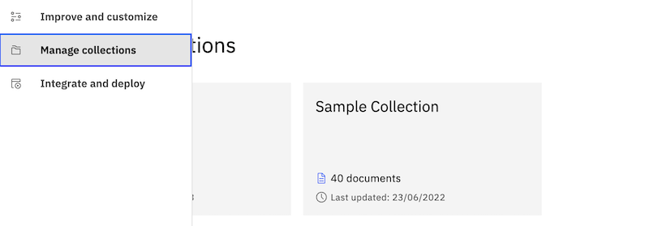
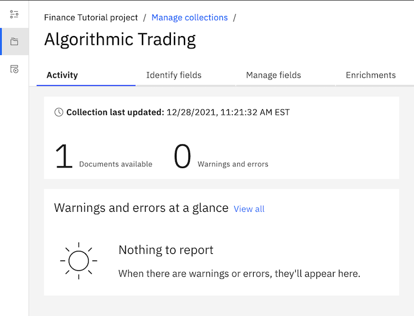
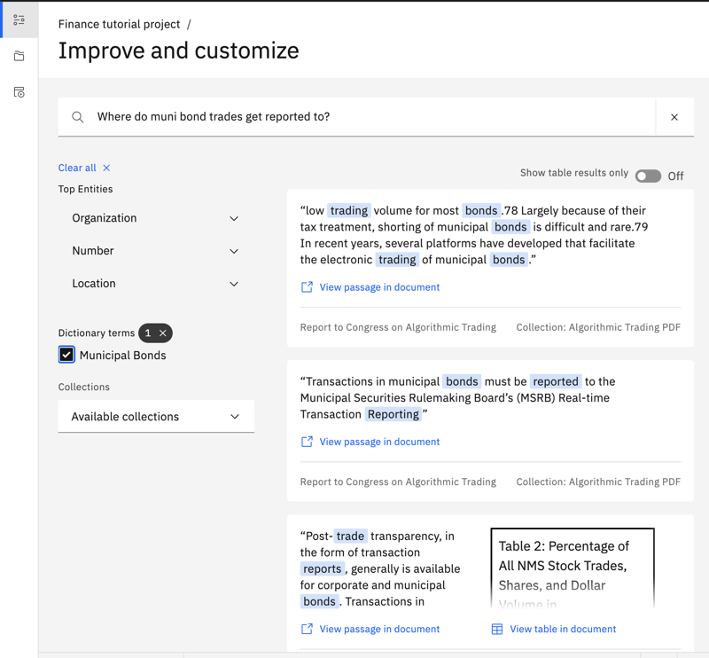

---

copyright:
  years: 2021, 2022
lastupdated: "2021-12-30"

subcollection: discovery-data
content-type: tutorial
account-plan: plus
completion-time: 3h

---

{{site.data.keyword.attribute-definition-list}}

# Use Smart Document Understanding (SDU) to improve search results
{: #tutorial-sdu}
{: toc-content-type="tutorial"}
{: toc-completion-time="2h"}

In this tutorial, you use the Smart Document Understanding feature of the {{site.data.keyword.discoveryshort}} service to create a user-trained Smart Document Understanding (SDU) model. You then split a single document into many smaller documents so that some types of answers are easier to find.
{: shortdesc}

This tutorial works with both managed and installed deployments.
{: note}

## Learning objectives
{: #tutorial-sdu-objectives}

By the time you finish the tutorial, you will understand how to:

- Create a Document Retrieval project in {{site.data.keyword.discoveryshort}}.
- Upload a PDF document to your {{site.data.keyword.discoveryshort}} project.
- Use the Smart Document Understanding (SDU) tool to create a user-trained SDU model.
- Split a document into smaller, more consumable chunks.

### Duration
{: #tutorial-sdu-duration}

This tutorial takes approximately 3 hours to complete.

### Prerequisite
{: #tutorial-sdu-prereqs}

1.  Before you begin, you must set up a paid account with IBM Cloud.

    You can complete this tutorial at no cost by using a Plus plan, which offers a 30-day trial at no cost. However, to create a Plus plan instance of the service, you must have a paid account (where you provide credit card details). For more information about creating a paid account, see [Upgrading your account](/docs/account?topic=account-upgrading-account){: external}.

1.  Create a Plus plan {{site.data.keyword.discoveryshort}} service instance.

    Go to the [{{site.data.keyword.discoveryshort}} resource](https://cloud.ibm.com/catalog/services/watson-discovery){: external} page in the {{site.data.keyword.cloud_notm}} catalog and create a Plus plan service instance.

If you decide to stop using the Plus plan and don't want to pay for it, delete the Plus plan service instance before the 30-day trial period ends.
{: important}

## Create the Document Retrieval project
{: #tutorial-sdu-project}
{: step}

Create a project. Choose to create a Document Retrieval project type. This type is optimized for finding answers that are returned as passages from large documents.

For more information about project types, see [Creating projects](/docs/discovery-data?topic=discovery-data-projects).

1.  From the {{site.data.keyword.discoveryshort}} Plus plan service page in {{site.data.keyword.cloud_notm}}, click **Launch {{site.data.keyword.discoveryshort}}**.
1.  From the *My Projects* page, click **New Project**.
1.  Name your project `Finance tutorial project`, and then click the **Document Retrieval** tile.

    
1.  Click **Next**.

You'll configure the data source for the project in the next step.

## Upload a PDF file
{: #tutorial-sdu-add-data}
{: step}

We want the search application to be able to answer questions about algorithmic trading. Therefore, we are adding the “Staff Report on Algorithmic Trading in US Capital Markets” PDF that was created on 5 August 2020 as a data source for the project.

1.  Get a copy of the PDF so that you can upload it to your project. You can download the file from the [US Securities and Exchange Commission](https://www.sec.gov/tm/reports-and-publications/special-studies/algo_trading_report_2020){: external} website.

1.  From the *Select data source* page, click **Upload data**, and then click **Next**.

    
1.  In the **Collection name** field, add `Algorithmic Trading PDF`, and then click **Next**.

    
1.  Drag the file that you downloaded to the page and drop it into the tile with the *Drag and drop files here or upload* link.

    
1.  Click **Finish**.

    You add only one file. In a real scenario, you might upload multiple files with information about the same topic. By adding more files, you can expand the breadth of the information that your search application can leverage.

The service uploads the document. As it uploads the document, {{site.data.keyword.discoveryshort}} crawls the data and indexes key information. Because you created a Document Retrieval project type, {{site.data.keyword.discoveryshort}} makes a note of the *Parts of speech* and *Entities* information that it finds and recognizes as it crawls the document.

## Review the document
{: #tutorial-sdu-pdf}
{: step}

Analyzing and indexing the document can take a few minutes. While the processing is under way, review the source document to get a feel for its content. It is a good idea to understand the structure of your own documents before you use the Smart Document Understanding tool to annotate them. 

Smart Document Understanding (SDU) uses visual imaging technologies to understand the structure of a document by analyzing the format and positioning of the text. You label sections of the document, such as subtitles or tables, to teach {{site.data.keyword.discoveryshort}} to recognize the sections. You can also label sections that you want the search function to ignore. For example, you might not want to search page footers or the table of contents information. After you teach the SDU tool to recognize footers, for example, you can exclude the footer field from the index.

1.  Monitor the progress of collection processing by opening the *Activity* tab.

    Click **Manage collections** from the navigation panel.

    

    Click the *Algorithmic Trading PDF* collection tile. The collection opens to the Activity tab.

1.  While you wait for the collection to be ready, open the `Algo_Trading_Report_2020.pdf` file that you downloaded previously.

1.  Review the structure of the document. 

    Notice that the document consists primarily of the following structures:

    -   Title
    -   Table of contents
    -   Subtitles
    -   Text
    -   Footnotes
    -   Bibliography

1.  The SDU tool has predefined labels for all but the `footnotes` and `bibliography`. You will create new field labels for these two document structures in a later procedure.

Processing is finished when the page shows that one document is available.



## Test your project
{: #tutorial-sdu-test}
{: step}

1.  After the crawl is completed, go to the *Improve and customize* page. From the navigation panel, click **Improve and customize**.

1.  In the *Search* field, enter `When did the Flash Crash occur and why?`

    The following passage is returned as the response:

    `These could in turn generate systemic destabilizing market events, such as the May 2010 “Flash Crash.” The “Flash Crash” occurred on May 6, 2010, when an algorithm rapidly sold 75,000 S&P500 e-mini futures contracts.`

    The returned passage contains an accurate answer to the question.

    

1.  Ask another question, `What is the purpose of Rule 15c3-5?`

    The following passage is returned as the response:

    `mechanism.306 b. 15c3-5 In November 2011, the SEC implemented the final provision of Rule 15c3-5 curbing unfiltered market access. The provision mandated that brokers verify their clients’ order flow for compliance with credit and capital thresholds before routing to market centers`

    Again, the answer is accurate (despite there being some extraneous text at the beginning of the passage).

    In both examples, a somewhat complex question is asked and the passage that is returned provides a valid answer. 
    
    However, not every question returns as clear an answer. Next, we try some queries that generate answers we might want to improve.

1.  Enter `Where do muni bond trades get reported to?`

    In this case, the response does not answer the question completely.

    `Post-trade transparency, in the form of transaction reports, generally is available for corporate and municipal bonds. 1. Transaction Reports in Corporate Bonds: TRACE Transactions in corporate bonds must be reported to the Trade Reporting`

1.  Similarly, the search query, `What are PTFs?`, does not return a direct answer.

    `Despite the surge in trading volume during the event window, there was no noticeable change in net positions of PTFs or bank-dealers. However, the report also finds evidence that some PTFs and bank-dealers may have contributed to the volatility`

Your project is answering some of the questions successfully. Only one passage is being returned for each query. Let's see whether we can improve the responses that are given to these simpler search queries.

## Create a user-trained Smart Document Understanding (SDU) model
{: #tutorial-sdu-create-model}
{: step}

To improve the quality of the search results, build a Smart Document Understanding model for this document. The model helps {{site.data.keyword.discoveryshort}} understand the document structure. You can then instruct {{site.data.keyword.discoveryshort}} about which sections of the document to search and which sections to ignore.

1.  From the *Improvement tools* panel of the *Improve and customize* page, expand *Define structure*, and then click **New fields**.

    
1.  The *Identify fields* tab is displayed, where you can choose the type of Smart Document Understanding model that you want to use.

    

    -   The *pretrained model* applies a noncustomizable model that extracts text and identifies tables, lists, and sections. The pretrained model is a great choice to save time. 
    -   For the purposes of this tutorial, where we want to explore how the Smart Document Understanding tool works, we'll choose to use the *user-trained model*.

    If you don't choose a model, the *text extraction* model is applied automatically. With the text extraction model, most of the document content is treated as standard text and is indexed in the `text` field.
1.  Click **User-trained models**, and then click **Submit**.

    
1.  Click **Apply changes and reprocess**.

    

    After the evaluation process is complete, a representation of the document is displayed in the Smart Document Understanding tool.

    
    
    The tool shows you a view of the original document along with a representation of the document, where the text is replaced by blocks. The blocks represent field types.

    Initially, the blocks are all the color of the `text` field label because all of the document content is considered to be standard text and will be indexed in the `text` field.

    A *Field labels* list shows the predefined field labels that are available.

    We are going to label blocks that represent specific types of information, such as titles and subtitles, with corresponding field labels. (The process of using labels to identify different parts of the document's structure is called *annotating* the document.)

1.  To annotate the document, click the label first. Then, click the block of text that you want to label. 

    Click `title` from the *Field labels* list, and then, in the document representation, click the yellow block that is situated in the location of the document title.

    

    You labeled the title of the document successfully!

1.  The rest of the text on the page can be indexed as part of the `text` field. Therefore, click **Submit page**.

1.  The next page is the *Table of contents* for the document. Click the `table_of_contents` label, and then select all of the text on the page to label it. (You can click and drag the mouse to select all.) Click **Submit page** to move to the next page.

    

1.  The two headings on the page are subtitles. Click the `subtitle` label, and then select the headings.

    This page has a footnote. As we noted earlier, the document has many footnotes where some important information is provided. Let's label the footnotes so we can include or exclude this type of information later. There is no footnote label, so we must add one.

1.  From the *Field labels* list, click **Create new**. Add the name `footnote` as the label name. Click the color block repeatedly until you find a unique color to use for the label, and then click **Create**.

    

1.  Click the new footnote label that you added, and then label the footnote on the page with the label. Click **Submit page** to move to the next page.

    

1.  Repeat this process to label and submit multiple pages.

    For most pages, the content includes a `subtitle`, a `footnote`, and the bulk of the content on the page remains labeled as `text`.

    

    As you label and submit pages, the model learns from the annotations that you make. Gradually, the labels that are applied automatically become accurate and don't require any adjustments. 

    If the tool becomes overzealous in the application of labels, apply the `text` label to sections of standard text to correct it.

1.  For tables, select the table caption and the entire table and label them with the `table` label.

    

1.  When a page contains an image, the image is not displayed in the representation of the page. 

    Images are never replicated. However, you can capture the text from an image so that the image text can be searched. To do so, enable the Optical Character Recognition (OCR) feature when you create a collection. After you enable OCR, if you want to remove annotated image text from the collection index, you can label the image so that you can exclude the associated text. You will learn about how to configure the index in the next procedure.

    
    
1.  When you reach the *Bibliography*, create a new label named `bibliography`.

    

    Apply the new label to each page.

    

1.  After you annotate and submit all the pages, click **Apply changes and reprocess**.

    A notification is displayed to indicate that the collection was updated. You remain on the SDU tool page, but the *Apply changes and reprocess* button is disabled.

An SDU model is generated based on the structures that you labeled in this document. 

For more information about the Smart Document Understanding feature, see [Using Smart Document Understanding](/docs/discovery-data?topic=discovery-data-configuring-fields).

## Streamline the searchable data
{: #tutorial-sdu-manage-index}
{: step}

Now that you have an SDU model that can recognize the different types of sections in the document, you can instruct it to include some sections in searches and to exclude others. To control what data gets searched, you include or exclude fields from the search index.

1.  Click **Manage fields**.

    

1.  From the list of fields to index, set the switcher to **No** for all fields except these ones:

    -  `footnote`
    -  `html`
    -  `subtitle`
    -  `table`
    -  `text`

    

1.  Click **Apply changes and reprocess**.

    A notification is displayed to indicate that the collection was updated. You remain on the *Manage fields* page, but the *Apply changes and reprocess* button is disabled.

You successfully configured the index to control the content that is available to searches! You excluded fields that might contain popular search terms, but do not also include meaningful content.

For more information about managing fields, see [Excluding content from query results](/docs/discovery-data?topic=discovery-data-hide-data).

## Split the document
{: #tutorial-sdu-split}
{: step}

Now that {{site.data.keyword.discoveryshort}} knows more about the structure of the document, we can split the single 99-page document into more documents. Remember, only one passage was returned for each query that you submitted before. If we split the document into multiple segments, {{site.data.keyword.discoveryshort}} can return the best passages from across all of the document segments.

When you split a document, you turn one document into many documents. Be aware of the document limits for your plan type. Each document segment that is generated by splitting a document counts toward the plan's document limit.
{: note}

When you annotated the document, you identified the `subtitle` field. These subtitles are a good marker from which each new document segment can begin.

1.  From the *Improve query results by splitting your documents* section of the *Manage fields* page, click **Split document**.

1.  Select **`subtitle`** from the *Split document on each occurrence of* field.

    

1.  Click **Apply changes and reprocess**.

    A notification is displayed to indicate that the collection was updated. You remain on the *Manage fields* page, but the *Apply changes and reprocess* button is disabled.

1.  Click **Activity** from the page header to return to the *Activity* page where you can monitor the progress of the change you made.

When no documents are processing, document splitting is finished.

For more information about splitting documents, see [Split documents to make query results more succinct](/docs/discovery-data?topic=discovery-data-split-documents).

## Test the project again
{: #tutorial-sdu-test-again}
{: step}

Let's find out whether we improved the search function by adding a user-trained SDU model for the document. To do so, let's retest the project.

1.  From the navigation panel, click **Improve and customize** to open the *Improve and customize* page.

1.  First, to make sure that we didn't degrade the quality of the search, let's ask one of the questions that returned a good response when we tested earlier. 

    In the *Search* field, enter `What is the purpose of Rule 15c3-5?`

    

    Multiple responses are returned this time. The following response contains the exact answer to the question without any extraneous text:

    `In November 2011, the SEC implemented the final provision of Rule 15c3-5 curbing unfiltered market access. The provision mandated that brokers verify their clients’ order flow for compliance with credit and capital thresholds before routing to market centers.`

    

    Our updates only improved the quality of the accurate responses that were returned before.

1.  Now, let's ask a question that returned poor results previously. Enter `What are PTFs?` as the search query.

    The same response that was returned as the only response last time is returned again. However, this time we get more than one response. And we can see that the second response that is returned defines the acronym for us.

    `(“principal trading firms” or “PTFs”)`

    

1.  Let's try the other problematic search query. Enter `Where do muni bond trades get reported to?` as the search query.

    This time it's the third response that provides an answer to the question. You must view the full passage to see the entire definition.

    

    Click the *View passage in document* link to see the full definition highlighted in the document.

    `Transactions in municipal bonds must be reported to the Municipal Securities Rulemaking Board’s (MSRB) Real-time Transaction Reporting System (RTRS).`

Congratulations! You successfully added a user-trained Smart Document Understanding (SDU) model that improves the quality of your search project.

## Filter results with a dictionary-based facet
{: #tutorial-sdu-dictionary}
{: step}

Now that we are getting more passages returned per query, it might be useful to filter the results. To filter the results based on the types of financial instruments that are mentioned, we can add a search facet. One available source for a facet is a dictionary.

1.  To create a dictionary, from the *Improvement tools* panel of the *Improve and customize* page, expand *Teach domain concepts*, and then click **Dictionaries**.

    

1.  Click **New**.

    

1.  Enter `Financial instruments` as the dictionary name, add the term `municipal bond`, and then click the *Add term* button.

    

1.  Add synonyms for the term by clicking the edit icon for the term.

    ```text
    Municipal Bonds, muni, munis, muni bonds
    ```
    {: codeblock}

    Add synonyms in a comma-separated list, and then click **Save term**.

    

1.  Click **Save dictionary**. 

    You can choose a field in the document where you want the enrichment to be applied. Let's choose the `subtitle` field that was generated when we created the user-trained SDU model. From the *Fields to enrich* field, select **`subtitle`**. Click **Apply**.

    

    The dictionary is created and each subtitle in the document is analyzed for mentions of terms or synonyms that are defined in the dictionary. Any mentions that are found are noted in the index.

1.  Click **Improve and customize** from the navigation panel.

1.  From the *Improvement tools* panel of the *Improve and customize* page, expand *Customize display*, and then click **Facets**.

1.  Click **New facet**, and then select **From existing fields in a collection**.

    

1.  Choose the index field that is associated with the dictionary enrichment that you applied to the `subtitle` field. From the *Field* field, select `enriched_subsection.entities.mentions.text`

    

    You might need to hover over the entries to see the full field names.

1.  Add a label, such as `Dictionary terms` to the *Label* field, and then click **Apply**.

    

1.  Enter `Where do muni bond trades get reported to?` as the search query.

    The *Dictionary terms* facet that you created is displayed along with the search results. A `Municipal Bonds` checkbox is shown, which indicates that at least one of the returned passages is extracted from a document segment with the term `Municipal Bonds` in its `subtitle` field.

    

1.  To filter the results to show only passages from sections with `Municipal Bonds` in the subtitle, select the `Municipal Bonds` checkbox.

    The best answer is now listed as the second response instead of the third.

    

### Summary
{: #tutorial-sdu-summary}

In this tutorial, you created a Document Retrieval project, a Smart Document Understanding (SDU) model, a dictionary enrichment, and a search facet. You applied the facet that is based on your dictionary to the custom field that is generated by your SDU model to filter your query results for better answers.
