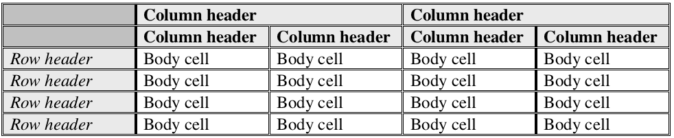

---

copyright:
years: 2018, 2021
lastupdated: "2021-06-10"

keywords: table,tables,table understanding,row,column,cell,header,key,value,key value pair,context

subcollection: discovery-data

---

{:shortdesc: .shortdesc}
{:external: target="_blank" .external}
{:tip: .tip}
{:pre: .pre}
{:codeblock: .codeblock}
{:screen: .screen}
{:note: .note}
{:important: .important}
{:javascript: .ph data-hd-programlang='javascript'}
{:java: .ph data-hd-programlang='java'}
{:python: .ph data-hd-programlang='python'}
{:swift: .ph data-hd-programlang='swift'}

# Understanding tables
{: #understanding_tables}

Apply the *Table Understanding* enrichment to get detailed information about tables and table-related data within documents.
{: shortdesc}

You can apply the enrichment only to a field that contains an HTML representation of the table. That's the only way that the enrichment can read the parts of the table, such as header rows and columns, and interpret the information in the table properly. 

You can complete one of these tasks to generate an HTML field with table information and apply the Table Understanding enrichment to your collection automatically:

- If you are using a *Document Retrieval for Contracts* project type, the `Table Understanding` enrichment is automatically applied to the `html` field that is generated for the collection.
- If you use the Smart Document Understanding tool to apply the `table` field label to one or more tables in the documents from a collection, then the `Table Understanding` enrichment is applied to the `html` field of the collection automatically.

   **IBM Cloud only**: If you use the Smart Document Understanding tool and choose the **Pre-trained-models** option, tables are annotated for you automatically.
  {: note}

  For more information, see [Smart Document Understanding](/docs/discovery-data?topic=discovery-data-configuring-fields#identify-fields).

To apply the enrichment, complete the following steps:

1.  From the navigation pane, open the **Manage collections** page, and then click a collection to open it. 
1.  Click the **Enrichments** tab.
1.  Find the **Table Understanding** enrichment.
1.  Select the `html` field from the field list.

    The HTML field must contain HTML representations of your tables. If your collection has a field other than the `html` field that contains table information in HTML format, which can exist in CSV or JSON files, for example, select it from the list.

After the enrichment is applied, you can get valid results when you submit queries that require {{site.data.keyword.discoveryshort}} to find information that is stored in tables.

A developer can query tables by using the API. For more information, see [Query parameters](/docs/discovery-data?topic=discovery-data-query-parameters#table_retrieval).

## Output schema
{: #table-output-schema}

The output schema from the `Table Understanding` enrichment is as follows. 

```json
{
  "tables": [
    {
      "location" : {
        "begin" : int,
        "end" : int
      },
      "text": string,
      "section_title": {
        "text": string,
        "location": {
          "begin" : int,
          "end" : int
        }
      },
      "title": {
        "location": {
          "begin": int,
          "end": int,
        },
        "text": string
      },
      "table_headers" : [
        {
          "cell_id" : string,
          "location" : {
            "begin" : int,
            "end" : int
          },
          "text" : string,
          "row_index_begin" : int,
          "row_index_end" : int,
          "column_index_begin" : int,
          "column_index_end" : int
        },
        ...
      ],
      "column_headers" : [
        {
          "cell_id" : string,
          "location" : {
            "begin" : int,
            "end" : int
          },
          "text" : string,
          "text_normalized" : string,
          "row_index_begin" : int,
          "row_index_end" : int,
          "column_index_begin" : int,
          "column_index_end" : int
        },
        ...
      ],
      "row_headers" : [
        {
          "cell_id" : string,
          "location" : {
            "begin" : int,
            "end" : int
          },
          "text" : string,
          "text_normalized" : string,
          "row_index_begin" : int,
          "row_index_end" : int,
          "column_index_begin" : int,
          "column_index_end" : int
        },
        ...
      ],
      "body_cells" : [
        {
          "cell_id" : string,
          "location" : {
            "begin" : int,
            "end" : int
          },
          "text" : string,
          "row_index_begin" : int,
          "row_index_end" : int,
          "column_index_begin" : int,
          "column_index_end" : int,
          "row_header_ids": [ string ],
          "row_header_texts": [ string ],
          "row_header_texts_normalized": [ string ],
          "column_header_ids": [ string ],
          "column_header_texts": [ string ],
          "column_header_texts_normalized": [ string ],
          "attributes" : [
             {
               "type" : string,
               "text" : string,
               "location" : {
                 "begin" : int,
                 "end" : int
               }
             },
             ...
           ]
        },
        ...
      ],
      "key_value_pairs": [
        {
          "key": {
            "cell_id": string,
            "location": {
              "begin": int,
              "end": int
            },
            "text": string
          },
          "value": [{
            "cell_id": string,
            "location": {
              "begin": int,
              "end": int
            },
            "text": string
          },
          ...
          ]
        },
        ...
      ],
      "contexts": [
        {
          "text": string,
          "location": {
            "begin": int,
            "end": int
          }
        },
        ...
      ]
    }
  ]
}
```
{: codeblock}

## Schema arrangement
{: #table-schema-arrangement}

The schema is arranged as follows.

  - `tables`: An array that defines the tables that are identified in the input document.
    - `location`: The location of the current table as defined by its `begin` and `end` indexes in the input document.
    - `text`: The textual contents of the current table from the input document without associated markup content.
    - `section_title`: If identified, the location of a section title contained in the current table. Empty if no section title is identified.
      - `text`: The text of the identified section title.
      - `location`: The location of the section title in the input document as defined by its `begin` and `end` indexes.
    - `title`: If identified, the title or caption of the current table of the form `Table x.: ...`. Empty when no title is identified. When present, the `title` is excluded from the `contexts` array of the same table.
      - `location`: The location of the title in the input document as defined by its `begin` and `end` indexes.
      - `text`: The text of the identified table title or caption.
    - `table_headers`: An array of table-level cells applicable as headers to all the other cells of the current table. Each table header is defined as a collection of the following elements:
      - `cell_id`: The unique ID of the cell in the current table.
      - `location`: The location of the cell in the input document as defined by its `begin` and `end` indexes.
      - `text`: The textual contents of the cell from the input document without associated markup content.
      - `row_index_begin`: The `begin` index of the cell's `row` location in the current table.
      - `row_index_end`: The `end` index of the cell's `row` location in the current table.
      - `column_index_begin`: The `begin` index of the cell's `column` location in the current table.
      - `column_index_end`: The `end` index of the cell's `column` location in the current table.
    - `column_headers`: An array of column-level cells, each applicable as a header to other cells in the same column as itself, of the current table. Each column header is defined as a collection of the following items:
      - `cell_id`: The unique ID of the cell in the current table.
      - `location`: The location of the cell in the input document as defined by its `begin` and `end` indexes.
      - `text`: The textual contents of the cell from the input document without associated markup content.
      - `text_normalized`: If you provide customization input, the normalized version of the cell text according to the customization; otherwise, the same value as `text`. 
      - `row_index_begin`: The `begin` index of the cell's `row` location in the current table.
      - `row_index_end`: The `end` index of the cell's `row` location in the current table.
      - `column_index_begin`: The `begin` index of the cell's `column` location in the current table.
      - `column_index_end`: The `end` index of the cell's `column` location in the current table.
    - `row_headers`: An array of row-level cells, each applicable as a header to other cells in the same row as itself, of the current table. Each row header is defined as a collection of the following items:
      - `cell_id`: The unique ID of the cell in the current table.
      - `location`: The location of the cell in the input document as defined by its `begin` and `end` indexes.
      - `text`: The textual contents of the cell from the input document without associated markup content.
      - `text_normalized`: If you provide customization input, the normalized version of the cell text according to the customization; otherwise, the same value as `text`. 
      - `row_index_begin`: The `begin` index of the cell's `row` location in the current table.
      - `row_index_end`: The `end` index of the cell's `row` location in the current table.
      - `column_index_begin`: The `begin` index of the cell's `column` location in the current table.
      - `column_index_end`: The `end` index of the cell's `column` location in the current table.
    - `body_cells`: An array of cells that are not table header or column header or row header cells, of the current table with corresponding row and column header associations. Each body cell is defined as a collection of the following items:
      - `cell_id`: The unique ID of the cell in the current table.
      - `location`: The location of the cell in the input document as defined by its `begin` and `end` indexes.
      - `text`: The textual contents of the cell from the input document without associated markup content.
      - `row_index_begin`: The `begin` index of this cell's `row` location in the current table.
      - `row_index_end`: The `end` index of this cell's `row` location in the current table.
      - `column_index_begin`: The `begin` index of this cell's `column` location in the current table.
      - `column_index_end`: The `end` index of this cell's `column` location in the current table.
      - `row_header_ids`: An array of values, each being the `cell_id` value of a row header that is applicable to this body cell.
      - `row_header_texts`: An array of values, each being the `text` value of a row header that is applicable to this body cell.
      - `row_header_texts_normalized`: If you provide customization input, the normalized version of the row header texts according to the customization; otherwise, the same value as `row_header_texts`. 
      - `column_header_ids`: An array of values, each being the `cell_id` value of a column header that is applicable to this body cell.
      - `column_header_texts`: An array of values, each being the `text` value of a column header that is applicable to this body cell.
      - `column_header_texts_normalized`: If you provide customization input, the normalized version of the column header texts according to the customization; otherwise, the same value as `column_header_texts`.
      - `attributes`: An array that identifies document attributes. Each object in the array consists of three elements:
        - `type`: The type of attribute. Possible values are `Address`, `Currency`, `DateTime`, `Duration`, `Location`, `Number`, `Organization`, `Percentage`, and `Person`.
        - `text`: The text that is associated with the attribute.
        - `location`: The location of the attribute as defined by its `begin` and `end` indexes.
    - `key_value_pairs`: An array that specifies any key-value pairs in tables in the input document. For more information, see [Understanding key-value pairs](#key-value-pairs).
      - `key`: An object that specifies a key for a key-value pair.
        - `cell_id`: The unique ID of the key in the table.
        - `location`: The location of the key cell in the input document as defined by its `begin` and `end` indexes.
        - `text`: The text content of the table cell without HTML markup.
      - `value`: An array that specifies the value or values for a key-value pair.
        - `cell_id`: The unique ID of the value in the table.
        - `location`: The location of the value cell in the input document as defined by its `begin` and `end` indexes.  
        - `text`: The text content of the table cell without HTML markup.
    - `contexts`: A list of related material that precedes and follows åthe table, excluding its section title, which is provided in the `section_title` field. Related material includes related sentences; footnotes; and sentences from other parts of the document that refer to the table. The list is represented as an array. Each object in the array consists of the following elements:
      - `text`: The text contents of a related material from the input document, without HTML markup.
      - `location`: The location of the related material in the input document as defined by its `begin` and `end` indexes.
      
### Notes on the table output schema
{: #notes-on-table-schema}

  - Row and column index values per cell are zero-based and so begin with `0`.
  - Multiple values in arrays of `row_header_ids` and `row_header_texts` elements indicate a possible hierarchy of row headers.
  - Multiple values in arrays of `column_header_ids` and `column_header_texts` elements indicate a possible hierarchy of column headers.

## Examples
{: #table-examples}

The following table is an example table from an input document.


The table is composed as follows:


 
The following syntax is used in the table:

- **Bold text** indicates a column header
- _Italic text_ indicates a row header
- Unstyled text indicates a body cell

The output from service represents the example's first body cell (that is, the first cell in row 3 with a value of `35.0%`) as follows:

```json
{
  "tables": [ {
    "location": {
      "begin": 872,
      "end": 5879
    },
    "text": "...",
    "section_title": { 
      "text": "",
      "location": {
        "begin": 0,
        "end": 0
      }
    },
    "table_headers" : [ ],
    "column_headers" : [ {
      "cell_id" : "colHeader-1050-1082",
      "location" : {
        "begin" : 1050,
        "end" : 1083
      },
      "text" : "Three months ended September 30,",
      "text_normalized" : "Three months ended September 30,",
      "row_index_begin" : 0,
      "row_index_end" : 0,
      "column_index_begin" : 1,
      "column_index_end" : 2
    }, {
      "cell_id" : "colHeader-1270-1301",
      "location" : {
        "begin" : 1270,
        "end" : 1302
      },
      "text" : "Nine months ended September 30,",
      "text_normalized" : "Nine months ended September 30,",
      "row_index_begin" : 0,
      "row_index_end" : 0,
      "column_index_begin" : 3,
      "column_index_end" : 4
    }, {
      "cell_id" : "colHeader-1544-1548",
      "location" : {
        "begin" : 1544,
        "end" : 1549
      },
      "text" : "2005",
      "text_normalized" : "Year 1",
      "row_index_begin" : 1,
      "row_index_end" : 1,
      "column_index_begin" : 1,
      "column_index_end" : 1
    }, {
      "cell_id" : "colHeader-1712-1716",
      "location" : {
        "begin" : 1712,
        "end" : 1717
      },
      "text" : "2004",
      "text_normalized" : "Year 2",
      "row_index_begin" : 1,
      "row_index_end" : 1,
      "column_index_begin" : 2,
      "column_index_end" : 2
    }, {
      "cell_id" : "colHeader-1889-1893",
      "location" : {
        "begin" : 1889,
        "end" : 1894
      },
      "text" : "2005",
      "text_normalized" : "Year 1",
      "row_index_begin" : 1,
      "row_index_end" : 1,
      "column_index_begin" : 3,
      "column_index_end" : 3
    }, {
      "cell_id" : "colHeader-2057-2061",
      "location" : {
        "begin" : 2057,
        "end" : 2062
      },
      "text" : "2004",
      "text_normalized" : "Year 2",
      "row_index_begin" : 1,
      "row_index_end" : 1,
      "column_index_begin" : 4,
      "column_index_end" : 4
    } ],
    "row_headers" : [ {
      "cell_id" : "rowHeader-2244-2262",
      "location" : {
        "begin" : 2244,
        "end" : 2263
      },
      "text" : "Statutory tax rate",
      "text_normalized" : "Statutory tax rate",
      "row_index_begin" : 2,
      "row_index_end" : 2,
      "column_index_begin" : 0,
      "column_index_end" : 0
    }, {
      "cell_id" : "rowHeader-3197-3217",
      "location" : {
        "begin" : 3197,
        "end" : 3218
      },
      "text" : "IRS audit settlement",
      "text_normalized" : "IRS audit settlement",
      "row_index_begin" : 3,
      "row_index_end" : 3,
      "column_index_begin" : 0,
      "column_index_end" : 0
    }, {
      "cell_id" : "rowHeader-4148-4176",
      "location" : {
        "begin" : 4148,
        "end" : 4177
      },
      "text" : "Dividends received deduction",
      "text_normalized" : "Dividends received deduction",
      "row_index_begin" : 4,
      "row_index_end" : 4,
      "column_index_begin" : 0,
      "column_index_end" : 0
    }, {
      "cell_id" : "rowHeader-5106-5130",
      "location" : {
        "begin" : 5106,
        "end" : 5131
      },
      "text" : "Total effective tax rate",
      "text_normalized" : "Total effective tax rate",
      "row_index_begin" : 5,
      "row_index_end" : 5,
      "column_index_begin" : 0,
      "column_index_end" : 0
    } ],
    "key_value_pairs" : [ ],    
    "body_cells" : [ {
      "cell_id" : "bodyCell-2450-2455",
      "location" : {
        "begin" : 2450,
        "end" : 2456
      },
      "text" : "35.0%",
      "row_index_begin" : 2,
      "row_index_end" : 2,
      "column_index_begin" : 1,
      "column_index_end" : 1,
      "row_header_ids" : [ "rowHeader-2244-2262" ],
      "row_header_texts" : [ "Statutory tax rate" ],
      "row_header_texts_normalized" : [ "Statutory tax rate" ],
      "column_header_ids" : [ "colHeader-1050-1082", "colHeader-1544-1548" ],
      "column_header_texts" : [ "Three months ended September 30,", "2005" ],
      "column_header_texts_normalized" : [ "Three months ended September 30,", "Year 1" ],
      "attributes": [ ]
    }, {
      "cell_id" : "bodyCell-2633-2638",
      "location" : {
        "begin" : 2633,
        "end" : 2639
      },
      "text" : "35.0%",
      "row_index_begin" : 2,
      "row_index_end" : 2,
      "column_index_begin" : 2,
      "column_index_end" : 2,
      "row_header_ids" : [ "rowHeader-2244-2262" ],
      "row_header_texts" : [ "Statutory tax rate" ],
      "row_header_texts_normalized" : [ "Statutory tax rate" ],
      "column_header_ids" : [ "colHeader-1050-1082", "colHeader-1712-1716" ],
      "column_header_texts" : [ "Three months ended September 30,", "2004" ],
      "column_header_texts_normalized" : [ "Three months ended September 30,", "Year 2" ],
      "attributes": [ ]
    }, {
      "cell_id" : "bodyCell-2825-2830",
      "location" : {
        "begin" : 2825,
        "end" : 2831
      },
      "text" : "35.0%",
      "row_index_begin" : 2,
      "row_index_end" : 2,
      "column_index_begin" : 3,
      "column_index_end" : 3,
      "row_header_ids" : [ "rowHeader-2244-2262" ],
      "row_header_texts" : [ "Statutory tax rate" ],
      "row_header_texts_normalized" : [ "Statutory tax rate" ],
      "column_header_ids" : [ "colHeader-1270-1301", "colHeader-1889-1893" ],
      "column_header_texts" : [ "Nine months ended September 30,", "2005" ],
      "column_header_texts_normalized" : [ "Nine months ended September 30,", "Year 1" ],
      "attributes": [ ]
    }, {
      "cell_id" : "bodyCell-3008-3013",
      "location" : {
        "begin" : 3008,
        "end" : 3014
      },
      "text" : "35.0%",
      "row_index_begin" : 2,
      "row_index_end" : 2,
      "column_index_begin" : 4,
      "column_index_end" : 4,
      "row_header_ids" : [ "rowHeader-2244-2262" ],
      "row_header_texts" : [ "Statutory tax rate" ],
      "row_header_texts_normalized" : [ "Statutory tax rate" ],
      "column_header_ids" : [ "colHeader-1270-1301", "colHeader-2057-2061" ],
      "column_header_texts" : [ "Nine months ended September 30,", "2004" ],
      "column_header_texts_normalized" : [ "Nine months ended September 30,", "Year 2" ],
      "attributes": [ ]
    }, 
    ...
  ],
  "contexts": [ ]
}
```
{: codeblock}

## Understanding key-and-value pairs
{: #key-value-pairs}

Tables sometimes contain key-and-value pairs that span multiple table cells. **Table Understanding** can detect the following types of tabular pairs.

  - Simple key-and-value pairs in adjacent cells, as in the following example table:

    <table>
    <caption>Basic table</caption>
      <tr>
        <th>Key</th>
        <th>Value</th>
      </tr>
      <tr>
        <td>Item number</td>
        <td>`123456789`</td>
      </tr>
      <tr>
        <td>Date</td>
        <td>`1/1/2019`</td>
      </tr>
      <tr>
        <td>Amount</td>
        <td>`$1,000`</td>
      </tr>
    </table>

  - Key-and-value pairs in the same cell, as in the following example table:

    <table>
    <caption>Complex table</caption>
      <tr>
        <td>Item number: `123456789`</td>
        <td>Address: `123 Anywhere Dr`</td>
      </tr>
      <tr>
        <td>Date: `1/1/2019`</td>
        <td></td>
      </tr>
      <tr>
        <td>Amount: $1000</td>
        <td></td>
      </tr>
    </table>
